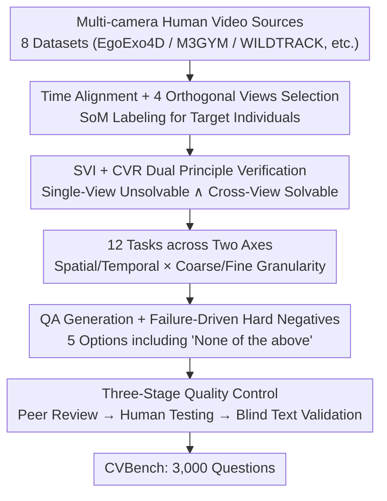

# Beyond Single-View Sufficiency: CVBench for Cross-View Human Understanding

**Conference**: CVPR 2026  
**Paper**: [CVF Open Access](https://openaccess.thecvf.com/content/CVPR2026/html/Guo_Beyond_Single-View_Sufficiency_CVBench_for_Cross-View_Human_Understanding_CVPR_2026_paper.html)  
**Code**: To be confirmed  
**Area**: Human Understanding / Multimodal VLM  
**Keywords**: Cross-view understanding, MLLM evaluation benchmark, Multi-view fusion, Single-view bias, Spatio-temporal reasoning  

## TL;DR
Addressing the loophole in existing MLLM benchmarks that default to "single-view sufficiency" and only reward single-image recognition, this work constructs CVBench—3,000 human understanding questions where each item is verifiably "unsolvable via single-view, solvable via cross-view" (12 spatio-temporal tasks, 4-way synchronized cameras). Evaluation reveals that even the strongest models lag nearly 50 points behind humans, identifying a systematic failure mechanism across all models: "single-view bias."

## Background & Motivation
**Background**: Human perception of social scenes is inherently a multi-view integration problem—the same scene is observed by multiple cameras from different angles over time, and humans easily fuse complementary or occluded visual cues into a consistent understanding of "who is who, what they are doing, and how they interact." However, modern MLLM evaluations are almost entirely built on single-view scenarios, where even recent video benchmarks assume "the given single image/video contains all information necessary to answer the question."

**Limitations of Prior Work**: This "sufficient-view" paradigm only rewards recognition or temporal reasoning within a single continuous visual stream, failing to assess cross-view fusion capabilities. Although many MLLMs accept multi-image inputs, they are never systematically tested on "whether they can synthesize complementary or even conflicting information." Consequently, models frequently fail in real-world multi-camera environments: confusing similar-looking people, double-counting the same person across cameras, misjudging contact during depth ambiguity, or failing to predict actions from partial limb views—pathological failure modes in security, sports analysis, and human-robot collaboration.

**Key Challenge**: Existing multi-image/video VQA benchmarks suffer from "cherry-picking"—models score by "finding the easiest view containing the answer" without being penalized for ignoring contradictory evidence or failing to synthesize a 3D consistent explanation. It remains unclear whether models are performing true cross-view fusion or just selecting an optimal single view.

**Goal**: Formalize "cross-view human understanding" as a core but severely undervalued MLLM capability and construct a benchmark that verifiably mandates multi-view synthesis and diagnoses failure causes.

**Key Insight**: The authors leverage an operational construction principle: to test cross-view fusion, every question must be unsolvable in any single view and requires merging two or more views to disambiguate. This turns "cherry-picking" into a failed strategy.

**Core Idea**: Use "verifiable single-view insufficiency" as a hard constraint to rebuild human understanding benchmarks. Combined with hard negatives tailored to failure modes, this upgrades the benchmark from "permitting multi-view input" to "mandating multi-view synthesis."

## Method

### Overall Architecture
CVBench is an evaluation benchmark rather than a specific model. Its "method" centers on data construction that is both challenging and fair. The benchmark is organized along two complementary axes: the **Spatial Axis** (same time, different cameras; testing identity association, de-duplication counting, fine-grained contact/occlusion reasoning) and the **Temporal Axis** (multiple timestamps, multiple cameras; testing identity continuity, action recognition, motion prediction). Each axis is further divided by **granularity** into coarse-grained (scene-level interpretation) and fine-grained (limb/action precision), totaling 12 tasks. All clips are unified to 4 synchronized views for 6–30 seconds. Each question requires maintaining identity and fusing complementary cues, localized by truth "evidence spans."

The construction pipeline is a four-stage serial process:

### Key Designs

**1. SVI + CVR Principles: Making "Cherry-Picking" a Failed Strategy**
This is the fundamental difference between CVBench and prior multi-image benchmarks. While previous benchmarks allowed multi-view input, they did not prevent models from cheating via a single easy view. This work requires each candidate item to pass two hurdles: **Single-View Insufficiency (SVI)**—annotators must confirm no single view can unambiguously answer the question; and **Cross-View Resolvability (CVR)**—annotators must confirm merging views makes the answer uniquely solvable. This constraint targets the "single-view bias" by eliminating questions solvable through a single perspective.

**2. 12-Task Taxonomy: Decomposing Cross-View Understanding into Diagnosable Sub-abilities**
The benchmark expands across "Spatial × Temporal" and "Coarse × Fine Granularity" axes. Spatial-coarse tasks include cross-view de-duplication counting and identity association. Spatial-fine tasks include limb occlusion and contact recognition (requiring sub-centimeter geometric disambiguation). Temporal tasks involve trajectory summarization and motion recognition across discontinuous fields of view. The dataset contains 3,000 items: 1,508 spatial and 1,492 temporal.

**3. Failure-Driven Hard Negative Construction**
Distractors are semi-automatically constructed based on common failure modes. For counting tasks, distractors include counts derived from partial views (e.g., if View 1 sees 2 and View 2 sees 2 for a global truth of 3, both "2" and the naive sum "4" are included as distractors). For temporal tasks, distractors include reversed action sequences or over-generalized verbs. Each question follows a 5-option format including "None of the above" to prevent guessing based on plausibility.

**4. Three-Stage Quality Control**
To ensure visual grounding over world knowledge, the benchmark uses: **Stage 1: Peer Review** for SVI/CVR validation; **Stage 2: Human Testing** to establish a performance upper bound (~94%); and **Stage 3: Blind Text Validation** where text-only LLMs attempt the questions. If a model can answer correctly via linguistic priors, the question is rewritten.

## Key Experimental Results

### Main Results
Spatial Tasks (Table 2, All represents overall accuracy, %):

| Model | Category | Coarse-grained | Fine-grained | All |
|------|------|------|------|------|
| Qwen2.5-VL-7B | Open-source | 29.9 | 24.4 | 27.2 |
| InternVL3-78B | Best Open-source | 38.5 | 31.1 | **34.8** |
| Gemini-2.5-Flash | Closed-source | 40.5 | 33.6 | 37.1 |
| GPT-5 | Closed-source | 41.2 | 35.5 | 38.4 |
| Gemini-2.5-Pro | Best Closed-source | 40.9 | 36.3 | **38.6** |
| Human | Baseline | 96.7 | 92.1 | 94.4 |
| Random / Blind | Baseline | — | — | 20.0 / 18.5 |

Temporal Tasks (Table 3, %):

| Model | Category | Coarse-grained | Fine-grained | All |
|------|------|------|------|------|
| Qwen2.5-VL-7B | Open-source | 28.6 | 23.5 | 26.0 |
| InternVL3-78B | Best Open-source | 35.3 | 30.3 | **32.8** |
| GPT-5 | Closed-source | 35.6 | 31.8 | 33.7 |
| Gemini-2.5-Pro | Best Closed-source | 35.8 | 33.9 | **34.9** |
| Human | Baseline | 95.7 | 91.4 | 93.5 |
| Random / Blind | Baseline | — | — | 20.0 / 21.3 |

### Ablation Study
A manual review of 500 failure cases (250 spatial + 250 temporal) categorized primary error causes (Table 4, %):

| Failure Category | Domain | InternVL3-78B | GPT-5 |
|------|------|------|------|
| Single-View Bias | Spatial | 42.0 | 38.8 |
| Geometric Failure | Spatial | 38.4 | 35.2 |
| Identity Confusion | Spatial | 14.8 | 22.0 |
| Temporal Incoherence | Temporal | 44.8 | 40.4 |
| Identity Confusion | Temporal | 35.2 | 37.6 |
| Single-View Bias | Temporal | 15.6 | 16.8 |

### Key Findings
- **"Single-View Bias" is a systematic defect**: Over 40% of spatial failures stem from models "cherry-picking" a single view instead of fusing them. Models often rely on a confident but incorrect single-view prediction rather than using other views as corrective signals.
- **Weak Geometric/Physical Reasoning**: Over 35% of fine-grained failures occur because models cannot distinguish true contact from proximity, relying on view-dependent 2D pixel adjacency.
- **Temporal Double-Counting**: Models often recount the same action when a person moves between viewpoints.
- **Robustness to Language Priors**: The "Blind" baseline (~18-21%) is near the random 20%, confirming that the questions require strict visual grounding.

## Highlights & Insights
- **Formalizing "Evaluation Loopholes" into Hard Constraints**: The SVI $\land$ CVR principles verifiably block the "cherry-picking" escape route.
- **Isomorphism between Distractors and Failure Modes**: Distractors explicitly target "naive summation" or "action reversal," mapping scores directly to specific capability deficits.
- **Evidence-Span Supervision**: Providing metadata on which frames resolve the ambiguity allows the benchmark to help diagnose "why" a model failed, not just if it was wrong.

## Limitations & Future Work
- The authors emphasize diagnosis over solutions; CVBench identifies shortfalls but does not propose a specific cross-view architecture.
- The 4-view setup with 6–30 second clips is fixed; whether conclusions generalize to more cameras or longer durations remains to be verified.
- The multiple-choice format, while reproducible, may not capture subtle reasoning nuances.

## Related Work & Insights
- **vs. Video VQA**: While standard video benchmarks reward single-stream recognition, CVBench mandates that the single stream is insufficient.
- **vs. Classic Multi-view Datasets**: CVBench bridges the gap between structured multi-view data (like MOT or 3D pose) and modern MLLM language-grounded evaluation.

## Rating
- Novelty: ⭐⭐⭐⭐⭐ Formalizes SVI as a verifiable constraint for cross-view assessment.
- Experimental Thoroughness: ⭐⭐⭐⭐⭐ Comprehensive testing of 11 models across 12 tasks with human baselines.
- Writing Quality: ⭐⭐⭐⭐ Clear logic from motivation to diagnostic results.
- Value: ⭐⭐⭐⭐⭐ Provides a crucial diagnostic tool for the next generation of spatio-temporal MLLMs.

<!-- RELATED:START -->

## Related Papers

- [\[CVPR 2026\] Mocap-2-to-3: Multi-view Lifting for Monocular Motion Recovery with 2D Pretraining](mocap-2-to-3_multi-view_lifting_for_monocular_motion_recovery_with_2d_pretrainin.md)
- [\[CVPR 2026\] View-Aware Semantic Alignment for Aerial-Ground Person Re-Identification](view-aware_semantic_alignment_for_aerial-ground_person_re-identification.md)
- [\[CVPR 2026\] MV-Fashion: Towards Enabling Virtual Try-On and Size Estimation with Multi-View Paired Data](mv-fashion_towards_enabling_virtual_try-on_and_size_estimation_with_multi-view_p.md)
- [\[ECCV 2024\] UPose3D: Uncertainty-Aware 3D Human Pose Estimation with Cross-View and Temporal Cues](../../ECCV2024/human_understanding/upose3d_uncertainty-aware_3d_human_pose_estimation_with_cross-view_and_temporal_.md)
- [\[CVPR 2026\] Bridging Facial Understanding and Animation via Language Models](bridging_facial_understanding_and_animation_via_language_models.md)

<!-- RELATED:END -->
