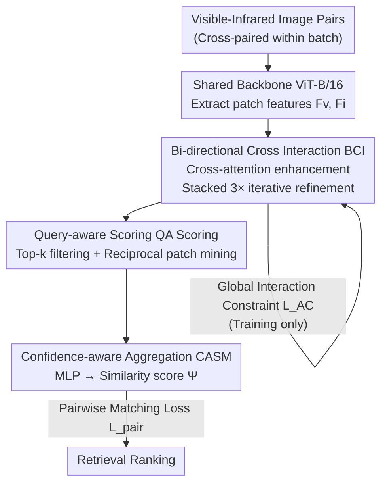

# BIT: Matching-based Bi-directional Interaction Transformation Network for Visible-Infrared Person Re-Identification

**Conference**: CVPR 2026  
**Paper**: [CVF Open Access](https://openaccess.thecvf.com/content/CVPR2026/html/Xu_BIT_Matching-based_Bi-directional_Interaction_Transformation_Network_for_Visible-Infrared_Person_Re-Identification_CVPR_2026_paper.html)  
**Code**: https://github.com/Xuan266/BIT  
**Area**: Person Re-Identification / Cross-modal Retrieval  
**Keywords**: Visible-Infrared Re-ID, Cross-modal Matching, Bi-directional Interaction, Reciprocal Patch Mining, Query-aware Scoring

## TL;DR
Addressing the large modality gap and infrared sample scarcity in Visible-Infrared Person Re-Identification (VI-ReID), BIT discards the conventional approach of aligning features into a shared space. Instead, it adopts a **matching-based** paradigm: a bi-directional cross-interaction module allows visible-infrared image pairs to mutually absorb complementary information, followed by a query-aware scoring module that mines reliable reciprocal correspondences at the patch level to compute final similarity. BIT achieves SOTA results on SYSU-MM01, LLCM, and RegDB benchmarks.

## Background & Motivation
**Background**: VI-ReID involves retrieving the same person across visible and infrared spectrums. Mainstream methods are categorized into image-level (using generative models for style transfer) and feature-level (learning modality-invariant representations in a shared embedding space).

**Limitations of Prior Work**: Both categories rely on **fixed mapping + static alignment**. Infrared intensity reflects electromagnetic radiation outside the visible spectrum, affected by materials and temperature distribution. Appearance features like clothing can be similar in visible light but vastly different in infrared, or vice versa (Fig.1a). Such complex and implicit cross-modal correlations make a "global fixed mapping" prone to overfitting. When different identities appear visually similar in infrared, fixed mappings project them near the same visible feature, leading to false positives.

**Key Challenge**: VI-ReID datasets are severely imbalanced, with infrared samples being far fewer than visible ones (Fig.1c). Feature-level methods require dense and balanced data to learn robust modality-invariant embeddings; performance degrades significantly when data is imbalanced.

**Goal**: To design a paradigm that is **independent of global alignment and naturally robust to data imbalance** by directly capturing fine-grained correspondences for every image pair.

**Key Insight**: The pairwise matching paradigm focuses on **relationship modeling** rather than global representation learning. It learns "adaptive transformation patterns specific to each visible-infrared pair" rather than a one-size-fits-all fixed mapping. Relationship modeling is naturally more robust to training data sparsity or imbalance.

**Core Idea**: Replace **rigid feature alignment** with **adaptive pairwise matching** for VI-ReID. BIT is reportedly the first work to introduce this pairwise matching-driven interaction into the VI-ReID task.

## Method

### Overall Architecture
BIT adopts an encoder-decoder architecture. The **encoder** is a shared backbone (ViT-B/16) for initial feature extraction. The **decoder** consists of two core modules: BCI (Bi-directional Cross Interaction), which exchanges complementary information between visible-infrared features across multiple stages, and QA Scoring (Query Aware Scoring), which mines reliable correspondences at the patch level to calculate the final similarity scalar $\Psi \in [0,1]$.

The pipeline operates as follows: images within a batch are paired (constructing all $B^2$ pairs); patch features are extracted via the backbone; BCI uses cross-attention for bi-directional enhancement across $T=3$ stacked blocks; refined features $F'_v, F'_i$ are fed into QA Scoring to compute bi-directional patch similarity, apply Top-k filtering, and perform reciprocal patch mining to aggregate patch-level similarities into a final score via a lightweight MLP (CASM). Training is conducted in two stages: first training the backbone, then freezing the backbone to train BIT.

### Key Designs

**1. Bi-directional Cross Interaction (BCI): Mutual feature refinement instead of unilateral alignment**

This module addresses the issue where fixed mappings pull different identities with similar appearances together. Instead of forced alignment in shared space, BCI allows **bi-directional** exchange of complementary information. In a batch, visible patch features $F_v \in \mathbb{R}^{B\times N\times C}$ and infrared $F_i$ are cross-paired to form $F_v^{(0)}, F_i^{(0)} \in \mathbb{R}^{B^2\times N\times C}$.

Interaction is driven by bi-directional cross-attention, where one modality acts as the query and the other as the key-value:

$$\tilde{F}_v^{(0)} = \mathrm{CrossAtt}(F_v^{(0)}, F_i^{(0)}), \quad \tilde{F}_i^{(0)} = \mathrm{CrossAtt}(F_i^{(0)}, F_v^{(0)})$$

The Transformer-style BCI blocks refine features through $T=3$ stages. The visible stream updates at stage $t$ as $\hat{F}_v^{(t)} = F_v^{(t)} + \mathrm{CrossAtt}(\mathrm{LN}(F_v^{(t)}), \mathrm{LN}(F_i^{(t)}))$, followed by $F_v^{(t+1)} = \hat{F}_v^{(t)} + \mathrm{MLP}(\mathrm{LN}(\hat{F}_v^{(t)}))$, with a symmetric process for the infrared stream. This bi-directional design is crucial: ablations show that standard uni-directional cross-attention performs worse than the baseline, while the bi-directional approach yields significant gains.

**2. Global Interaction Constraint $L_{AC}$: Ensuring identity-consistency in interactions**

To ensure aggregated representations after interaction are identity-consistent, a global interaction constraint (Aggregation Contrastive Loss) is introduced as a regularizer on the pooled representation $f_i$ from the final BCI block:

$$L_{AC} = -\frac{1}{|P_i|}\sum_{p\in P_i}\log\frac{e^{f_i\cdot f_p/\tau}}{e^{f_i\cdot f_p/\tau} + \sum_{j\in N_i}e^{f_i\cdot f_j/\tau}}$$

where $P_i$ and $N_i$ are sets of positive and negative samples for $i$. This pulls cross-modal positive pairs together and pushes hard negatives away, guiding BCI to focus on identity discrimination rather than background noise.

**3. Query-aware Scoring (QA Scoring): Reciprocal correspondence mining at the patch level**

Traditional similarity treats all patches equally, but different queries depend on different visual cues due to pose or occlusion. QA Scoring makes similarity estimation query-specific.

First, bi-directional similarity matrices are computed with row normalization: $S_{vi} = s\!\left(\frac{F'_v F_i'^{\top}}{\sqrt{C}}\right)$ and $S_{iv} = s\!\left(\frac{F'_i F_v'^{\top}}{\sqrt{C}}\right)$. **Top-k filtering** ($k=3$) is applied: $R_{v-i}=\mathrm{TopK}(S_{vi}, k)$ retains the top-k infrared neighbors for each visible patch.

**Reciprocal Patch Mining (RPM)** follows as the core mechanism: it retains only **mutually selected** patch pairs to form a reciprocal set $M = \{(p,q)\mid q\in R_{v-i}[p] \text{ and } p\in R_{i-v}[q]\}$. To handle patches with no reciprocal matches, a smooth completion strategy is used: for any $p$ where $M_p=\emptyset$, the single highest similarity match $q^*$ is added to form $M'$. The patch-level similarity is then $\hat{S}[p] = \frac{1}{|M'_p|}\sum_{q\in M'_p} w_{p,q}\cdot S_{vi}[p,q]$, where $w_{p,q}=1$ for reciprocal pairs and $\alpha=0.2$ for completed pairs to suppress individual non-reciprocal noise.

**4. Confidence-aware Aggregation (CASM): Learning scalar scores from patch vectors**

The patch-level similarity vector $\hat{S}\in\mathbb{R}^N$ is compressed into an image-level scalar using the Confidence-Aware Scoring Module (CASM), a lightweight MLP: $\Psi = \sigma(\mathrm{CASM}(\hat{S}))$. This allows the model to prioritize informative matches (e.g., distinct body parts) and suppress misleading noise dynamically.

### Loss & Training
Ours uses a two-stage training strategy. **Stage 1**: Train the backbone alone using standard modality-invariant loss $L_{base}$ (identity loss + triplet loss) to learn discriminative embeddings without overfitting to interactions early on. **Stage 2**: Freeze the backbone and optimize BIT using the pairwise matching loss $L_{pair} = -(y\log\Psi + (1-y)\log(1-\Psi))$ with $y \in \{0, 1\}$. The total objective is $L_{total} = L_{pair} + \lambda L_{AC}$, with $\lambda=0.6$.

## Key Experimental Results

### Main Results
BIT outperforms SOTA on SYSU-MM01, LLCM, and RegDB. Main results for All-Search Single-Shot (without re-ranking):

| Dataset/Setting | Metric | BIT | Prev. SOTA | Gain |
|------|------|------|----------|------|
| SYSU All-Search Single | Rank-1 | 80.53 | 79.07 (DiVE) | +1.46 |
| SYSU All-Search Single | mAP | 79.76 | 75.40 (WRIM-Net) | +4.36 |
| SYSU Indoor Single | Rank-1 | 87.42 | 86.20 (WRIM-Net) | +1.22 |
| LLCM Visible→Infrared | Rank-1 | 73.1 | 64.9 (HOS-Net) | +8.2 |
| LLCM Infrared→Visible | Rank-1 | 66.7 | 56.4 (HOS-Net) | +10.3 |
| RegDB V2I | Rank-1 | 96.12 | 95.19 (MUN) | +0.93 |

The improvement on LLCM is particularly significant (+10.3 Rank-1 for I2V), indicating the advantage of the matching paradigm in challenging scenarios.

### Ablation Study
On SYSU-MM01 All-Search Single-Shot, with PMT as the baseline:

| Configuration | Rank-1 | mAP | Description |
|------|--------|-----|------|
| Base | 69.23 | 66.02 | Backbone only |
| + BCI | 75.24 | 73.35 | Cross-modal interaction |
| + BCI + $L_{AC}$ | 76.42 | 74.54 | Contrastive regularizer |
| + BCI + QA Scoring | 79.53 | 79.02 | Query-aware scoring |
| Full | 80.53 | 79.76 | Proposed BIT |

Ablations on the bi-directional design show that standard cross-attention actually degrades performance (Rank-1 69.23 → 68.68), while BCI's bi-directional architecture provides the critical gain.

### Key Findings
- **BCI and QA Scoring are the primary contributors**: BCI alone adds +6.01 Rank-1; QA Scoring adds another +4.11 Rank-1 and +5.22 mAP.
- **Bi-directionality is the key component**: Standard attention fails, proving that the mutual information exchange in BCI is the effective mechanism.
- **Hyperparameter robustness**: Performance is stable across variations in $k$, $\alpha$, and $\lambda$, with optimal values found via grid search.

## Highlights & Insights
- **Paradigm Shift**: Reformulating VI-ReID from global invariant mapping to adaptive pairwise matching avoids the overfitting pitfalls of fixed mappings in imbalanced data. Relationship modeling outperforms global representation learning in this context.
- **Reciprocal Mining + Smooth Completion**: This combination ensures reliability via mutual selection while maintaining coverage through penalized non-reciprocal matches ($\alpha$).
- **Learnable Aggregation**: CASM parameterizes the intuition that "not all patches are equally important" by letting an MLP learn soft weights for patch similarities.

## Limitations & Future Work
- **Two-stage Training**: The backbone is frozen in the second stage, preventing it from benefiting from matching signals. End-to-end joint training remains unexplored.
- **Computational Overhead**: Constructing $B^2$ pairs for cross-attention within a batch may become a bottleneck as the number of patches or batch size increases.
- **Fixed Patch Splitting**: Using semantic or deformable patch partitioning might further reduce noise compared to rigid grid splitting.

## Related Work & Insights
- **vs. Feature-level Methods (MID, CAJ, PMT)**: These methods align features using fixed mappings. BIT uses adaptive pairwise matching, showing better robustness to imbalanced data and negative pair visual similarity.
- **vs. Image-level Generative Methods**: Generative models introduce noise and high computational costs. BIT performs interaction directly in the feature space, avoiding generation noise.
- **vs. Single-modality Matching**: Typical matching methods assume homogeneous features. BIT adds the BCI stage to fundamentally bridge the modality gap before matching.

## Rating
- Novelty: ⭐⭐⭐⭐⭐ First to introduce pairwise matching paradigm to VI-ReID with a consistent bi-directional design.
- Experimental Thoroughness: ⭐⭐⭐⭐ SOTA across major benchmarks with detailed ablations, though efficiency analysis is relegated to supplementary.
- Writing Quality: ⭐⭐⭐⭐ Clear motivation and complete mathematical formulation.
- Value: ⭐⭐⭐⭐ The shift to relationship modeling provides general insights for any imbalanced cross-modal retrieval task.

<!-- RELATED:START -->

## Related Papers

- [\[CVPR 2026\] MFEN: Multi-Frequency Expert Network for Visible-Infrared Person Re-ID](mfen_multi-frequency_expert_network_for_visible-infrared_person_re-id.md)
- [\[CVPR 2026\] Spatial-Frequency Collaborative Learning for Occluded Visible-Infrared Person Re-Identification](spatial-frequency_collaborative_learning_for_occluded_visible-infrared_person_re.md)
- [\[CVPR 2026\] Towards Cross-Modal Preservation, Consistency and Alignment for Privacy-Preserving Visible-Infrared Person Re-Identification](towards_cross-modal_preservation_consistency_and_alignment_for_privacy-preservin.md)
- [\[CVPR 2026\] COPE: Consistent Occlusion and Prompt Enhancement Network for Occluded Person Re-identification](cope_consistent_occlusion_and_prompt_enhancement_network_for_occluded_person_re-.md)
- [\[ECCV 2024\] Multi-Memory Matching for Unsupervised Visible-Infrared Person Re-Identification](../../ECCV2024/human_understanding/multi-memory_matching_for_unsupervised_visible-infrared_person_re-identification.md)

<!-- RELATED:END -->
