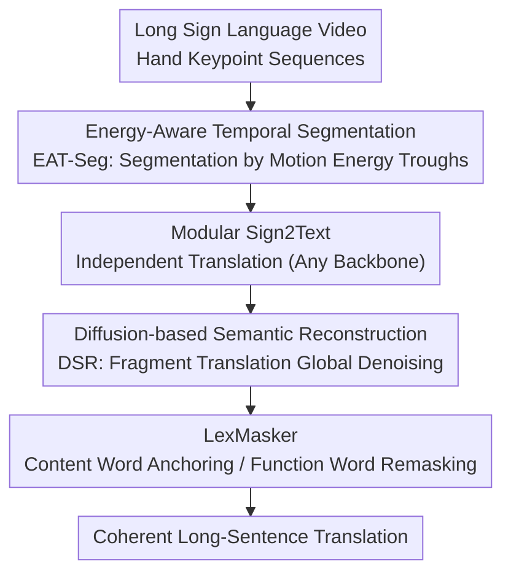

# BoostSLT: Boosting Sign Language Translation via a Plug-and-Play Diffusion-Based Semantic Enhancer

**Conference**: CVPR 2026  
**Paper**: [CVF Open Access](https://openaccess.thecvf.com/content/CVPR2026/html/Han_BoostSLT_Boosting_Sign_Language_Translation_via_a_Plug-and-Play_Diffusion-Based_Semantic_CVPR_2026_paper.html)  
**Code**: https://github.com/K1sna/BoostSLT  
**Area**: Human Understanding / Sign Language Translation  
**Keywords**: Sign Language Translation, Diffusion Language Models, Unsupervised Temporal Segmentation, Plug-and-Play, Long Sentence Translation  

## TL;DR
BoostSLT introduces a plug-and-play module that wraps any sign language translation model. It segments long videos into semantic segments based on motion energy, translates segments independently, and reconstructs fragmented translations into coherent long sentences using a Diffusion Language Model. Without relying on gloss annotations, it significantly improves BLEU and ROUGE for long-sentence and document-level translation.

## Background & Motivation
**Background**: Sign Language Translation (SLT) converts continuous sign language videos into spoken language text. Two main paradigms exist: gloss-based (video → gloss → text) and gloss-free (end-to-end video → text). Recently, architectures like TwoStreamNetwork and CV-SLT have achieved near-saturated accuracy on **short sentences**.

**Limitations of Prior Work**: Performance collapses significantly when inputs are long sentences or multi-sentence paragraphs from news, interviews, or daily conversations. Figure 1 illustrates that degradation worsens as translation length increases (grouped by 1–10 / 10–15 / 15–20 / 20+ tokens). Two primary issues exist: (1) Gloss-based methods require precise alignment of video frames and gloss boundaries, which is costly to annotate and lacks generalizability across different models; (2) Almost all SLT decoders are **autoregressive**, where tokens are generated sequentially with strong dependency on preceding ones. Early recognition or alignment errors propagate and amplify, leading to severe semantic drift and fragmented outputs for long inputs.

**Key Challenge**: There resides a trade-off between "local segment accuracy" and "global coherence." Segmented translation ensures local fidelity but often results in inconsistent cross-segment references, tense errors, and poor discourse flow. Achieving global coherence via autoregressive models is inherently hindered by error accumulation.

**Goal**: To simultaneously achieve local accuracy and global coherence, especially for long-sentence/document-level translation, without introducing gloss supervision or modifying existing translation models.

**Key Insight**: The authors leverage two observations. First, based on Bernstein's coordination structures in motor control theory, continuous sign language consists of "energy-bounded motion primitives." Motion energy fluctuations naturally mark semantic switching points, allowing boundaries to be detected via energy curves in an **unsupervised** manner. Second, Diffusion Language Models (D3PM, LLaDA) can perform parallel denoising and global semantic optimization, effectively counteracting the sequential error accumulation of autoregressive models.

**Core Idea**: Replace "gloss supervision + autoregressive post-processing" with "energy-driven unsupervised segmentation + diffusion-based global semantic reconstruction" as a model-agnostic, plug-and-play enhancement wrapper.

## Method

### Overall Architecture
BoostSLT is a three-stage pipeline wrapped around any SLT backbone. The input is a long sign language video (RGB/keypoint sequences), and the output is a coherent long-sentence translation. The pipeline involves: **Energy-Aware Temporal Segmentation (EAT-Seg)** to segment long videos into semantically coherent short segments; a **Modular Sign2Text backbone** (any gloss-free translation model) to translate segments independently; and **Diffusion-based Semantic Reconstruction (DSR)** to stitch the fragmented translations into a fluent long text via parallel denoising. DSR also incorporates a **LexMasker** to guide the denoising direction.

### Key Designs

**1. Energy-Aware Temporal Segmentation (EAT-Seg): Unsupervised Semantic Segmentation via Energy Troughs**

Addressing the high cost and lack of generalizability of gloss boundary annotations, EAT-Seg identifies boundaries from the motion energy of hand keypoints. Since the semantics of sign language are primarily carried by the hands, per-frame kinetic energy is calculated for the hand joint set $\mathcal{H}$. Given a pose sequence $P=\{p_t\}_{t=1}^T$ (2D coordinates and confidence for $J$ keypoints), the per-frame energy is defined as:

$$E_t = \sum_{j\in\mathcal{H}} \big(\mathbf{1}[c_{t,j}\!\ge\!\theta]\,\mathbf{1}[c_{t-1,j}\!\ge\!\theta]\,c_{t,j}c_{t-1,j}\big)\cdot \|\mathbf{x}_{t,j}-\mathbf{x}_{t-1,j}\|_2,$$

which represents confidence-weighted displacement between adjacent frames. Joints are included only if they are reliable (confidence above $\theta$) in both frames, automatically downweighting occluded or jittery joints. The curve is smoothed into $\tilde{E}_t$ using a sliding window of size $k$ to suppress instantaneous noise.

The segmentation strategy uses **length-aware local adaptation** rather than fixed thresholds. Given a preferred length range $[L_{\min},L_{\max}]$ and a target length $L^\star$, the video is divided into $n$ segments such that $F/n$ falls within the range. For each segment, an expected center $c_k$ is provided, and the cutting point is found within a local window of width $\omega_k$:

$$b_k=\arg\min_{t\in[c_k-\omega_k,\,c_k+\omega_k]}\big(\tilde{E}_t+\lambda_{\text{cent}}|t-c_k|\big),$$

where $\lambda_{\text{cent}}$ balances local energy minimality and temporal regularity. This unsupervised approach is lightweight and robust to different signers and speeds.

**2. Diffusion-based Semantic Reconstruction (DSR): Parallel Denoising for Coherent Long-Sentence Stitching**

To solve fragmented translation and autoregressive error accumulation, DSR replaces simple concatenation with **parallel denoising**. Unlike traditional text diffusion starting from random noise, DSR is fine-tuned to denoise from **meaningful initial phrases**. Fragmented translations $\{\hat{T}_m\}_{m=1}^M$ are treated as "partial observations" for the underlying long sentence in a conditional diffusion process:

$$x_0=\mathrm{Encode}(\{\hat{T}_m\}),\quad x_t\sim q(x_t|x_{t-1}),\quad \tilde{Y}=\mathrm{Decode}(x_T).$$

Here $x_0$ serves as a structured linguistic prior. The model functions as a **semantic diffuser**, progressively reconstructing coherent sentences along the denoising trajectory. During training, it learns to map "sets of phrases → long sentences" by injecting noise into phrase sets. During inference, it runs $T=25$ iterations. By joint refining the entire sequence, it enforces **global** coherence.

**3. LexMasker: Directing Masking Uncertainty to Function Words**

DSR carries the risk of damaging correctly translated content words through unconstrained remasking. LexMasker is a **constraint-guiding** mechanism for selective remasking. After each denoising step, a lightweight lexical classifier separates high-info **content words** (nouns, verbs, numbers, entities) from low-info **function words**. Content words are anchored as semantic pivots, while function words and new gaps are selectively remasked. This directs uncertainty towards grammatical connectors rather than the core meaning, ensuring the model fixes structure without altering facts.

### Loss & Training
The reconstruction module is fine-tuned on **LLaDA-8B**. It uses "phrase → long sentence" pairs generated by EAT-Seg from PHOENIX-2014T, CSL-Daily, and Auslan-Daily. Training utilizes AdamW with a learning rate of $2\times10^{-5}$, batch size 32, and weight decay 0.01 for 30 epochs, employing early stopping based on validation BLEU-4. Inference uses $T=25$ steps. Video features are encoded via I3D, and poses via HRNet.

## Key Experimental Results

### Main Results
On PHOENIX-2014T (DGS), CSL-Daily (CSL), and Auslan-Daily (Auslan), BoostSLT was applied as a plugin to six gloss-free backbones (MMTLB, GASLT, TSN, CV-SLT, Sign2GPT, LiTFiC). Test results (R=ROUGE-L, B4=BLEU-4):

| Dataset | Backbone | R (Original → BoostSLT) | B4 (Original → BoostSLT) |
|--------|------|--------------------|---------------------|
| PHOENIX-2014T Test | CV-SLT | 54.33 → **59.15** | 29.27 → **33.32** (+14%↑) |
| PHOENIX-2014T Test | TSN | 53.48 → **57.94** | 28.95 → **30.12** |
| PHOENIX-2014T Test | MMTLB | 49.59 → **54.38** | 24.60 → **29.41** |
| CSL-Daily Test | CV-SLT | 57.06 → **61.79** | 28.94 → **32.49** |

Average gains are approximately +3.8 BLEU-4 / +3.2 ROUGE for PHOENIX and +4.1 BLEU-4 for CSL-Daily. The greatest improvements occur in long, syntactically complex PHOENIX sentences.

### Ablation Study
Breakdown on PHOENIX-2014T (comparing EAT-Seg vs. Random Seg; DSR vs. GPT/LLaMA):

| Seg | Post-proc | R | B4 | Description |
|------|--------|------|------|------|
| R-Seg | None | 35.25 | 8.03 | Worst performance |
| None | None | 39.63 | 15.62 | Baseline (no segmentation) |
| None | GPT | 41.72 | 14.71 | GPT polish; B4 actually drops |
| **EAT-Seg** | **DSR** | **46.72** | **21.95** | Full model; best results |

### Key Findings
- **Segmentation and diffusion are complementary**: EAT-Seg + DSR significantly outperforms EAT-Seg + GPT. Proper segmentation structures the input, while diffusion fixes cross-segment gaps.
- **Autoregressive post-processing is insufficient**: GPT and LLaMA improve local fluency but often degrade content, whereas DSR restores long-range structure without losing information.
- **Gains are complementary to LLM-based backbones**: Even models like Sign2GPT see gains of up to +4.8 BLEU-4, proving parallel denoising provides global consistency that sequential LLM inference lacks.

## Highlights & Insights
- **Unsupervised boundary detection via motion energy**: Using physical coordination priors instead of gloss annotations makes the system robust across signers and languages.
- **Conditional diffusion from fragments**: Starting denoising from partial translation signals reduces hallucinations and preserves content, serving as a powerful post-editor.
- **LexMasker priority**: By anchoring content tokens, the model focuses on structural cohesion, ensuring the output is fluent without fabricating "facts."
- **True Plug-and-Play**: DSR is modular and text-in/text-out, requiring no retraining of the translation backbone, making it highly suitable for engineering deployment.

## Limitations & Future Work
- **Limitations**: The 8B LLaDA model introduces inference overhead; DSR relies on the quality of EAT-Seg's phrase-sentence pairs.
- **Future Work**: Exploring tighter end-to-end coupling of segmentation and translation; investigating smaller, lower-latency reconstruction models; and adapting learnable masking strategies.

## Related Work & Insights
- **vs. Gloss-based methods**: BoostSLT removes the dependency on expensive gloss labels while achieving comparable or superior performance by restructuring the pipeline for gloss-free models.
- **vs. Autoregressive post-editors**: DSR avoids the sequential error accumulation seen in GPT-based editors through parallel global refinement.
- **vs. Temporal Action Segmentation**: Unlike supervised segmentation models (e.g., MS-TCN), EAT-Seg is completely unsupervised and generalizes better to new signers.

## Rating
- Novelty: ⭐⭐⭐⭐⭐ 
- Experimental Thoroughness: ⭐⭐⭐⭐ 
- Writing Quality: ⭐⭐⭐⭐ 
- Value: ⭐⭐⭐⭐⭐ 

<!-- RELATED:START -->

## Related Papers

- [\[CVPR 2026\] Learning Effective Sign Features without Text for Gloss-free Sign Language Translation](learning_effective_sign_features_without_text_for_gloss-free_sign_language_trans.md)
- [\[CVPR 2026\] Focal–General Diffusion Model with Semantic Consistent Guidance for Sign Language Production](focal-general_diffusion_model_with_semantic_consistent_guidance_for_sign_languag.md)
- [\[CVPR 2026\] SignPR: A Progressive Vector-Quantized Diffusion Framework for Sign Language Production](signpr_a_progressive_vector-quantized_diffusion_framework_for_sign_language_prod.md)
- [\[CVPR 2025\] Lost in Translation, Found in Context: Sign Language Translation with Contextual Cues](../../CVPR2025/human_understanding/lost_in_translation_found_in_context_sign_language_translation_with_contextual_c.md)
- [\[ECCV 2024\] A Simple Baseline for Spoken Language to Sign Language Translation with 3D Avatars](../../ECCV2024/human_understanding/a_simple_baseline_for_spoken_language_to_sign_language_trans.md)

<!-- RELATED:END -->
