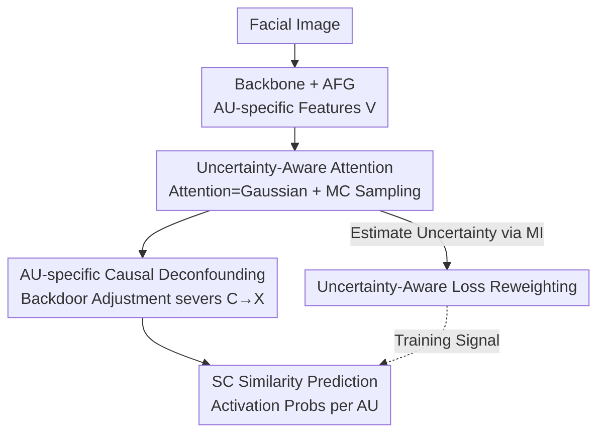

# Breaking Spurious Correlations: Uncertainty-Driven Causal Transformers for AU Detection

**Conference**: CVPR 2026  
**Paper**: [CVF Open Access](https://openaccess.thecvf.com/content/CVPR2026/html/Wang_Breaking_Spurious_Correlations_Uncertainty-Driven_Causal_Transformers_for_AU_Detection_CVPR_2026_paper.html)  
**Code**: Not disclosed  
**Area**: Human Understanding / Facial Action Unit Detection  
**Keywords**: AU Detection, Uncertainty Modeling, Causal Intervention, Probabilistic Attention, Backdoor Adjustment  

## TL;DR
Addressing the issues of data scarcity, class imbalance, label noise, and confounding bias in Facial Action Unit (AU) detection, this paper proposes the UDCT framework: it models Transformer attention weights as Gaussian distributions to explicitly represent uncertainty, uses this uncertainty to reweight sample losses against noise/imbalance, and employs per-AU causal backdoor adjustment to sever spurious AU correlations caused by confounders. Ours achieves competitive and more robust results on BP4D / DISFA (average F1 of 67.36% on DISFA).

## Background & Motivation
**Background**: AU detection identifies subtle facial muscle movements defined by FACS and serves as the foundation for affective computing, psychological analysis, and human-computer interaction. Recent mainstream approaches use Transformers to model long-range dependencies and co-occurrence relationships between AUs (e.g., FAUDT, Jacob et al.), which capture structural relationships better than early CNNs focused only on local textures.

**Limitations of Prior Work**: AU dataset annotation is extremely expensive and scarce, with severe class imbalance (some AUs rarely appear) and noise from illumination, occlusions, or mislabeling. Existing Transformers use **deterministic attention**—for a given input, the attention weight is unique and fixed, failing to express "how ambiguous/credible this sample is." Consequently, they easily overfit to small data and learn biases from the training set as general rules.

**Key Challenge**: The AU co-occurrence relationships learned by models bundle two things: true relationships stable across subjects (e.g., AU6+AU12 linkage during a smile) and spurious correlations caused by **confounders** such as individual habits, lighting, or social contexts. Deterministic models cannot distinguish between these two, leading to performance collapse when the distribution shifts. In other words, there is a lack of both "uncertainty characterization" and "differentiation between causation vs. correlation."

**Goal**: To enable the model to explicitly express uncertainty under noisy/imbalanced supervision while actively peeling away spurious correlations caused by confounders. This is decomposed into three sub-problems: (1) How attention expresses uncertainty; (2) How to use uncertainty to mitigate the impact of noisy samples; (3) How to eliminate confounding bias without impractical full-subject interventions.

**Key Insight**: The authors observe that facial expressions are inherently stochastic, suggesting attention should be a distribution rather than a point estimate. Furthermore, model decisions based solely on surface correlations without causal reasoning are brittle. Thus, **probabilistic attention** and **causal intervention** are integrated into a single Transformer.

**Core Idea**: A trio consisting of "Gaussian-distributed attention + uncertainty-weighted loss + per-AU backdoor adjustment" integrates uncertainty modeling and causal deconfounding into one framework to break spurious AU correlations.

## Method

### Overall Architecture
The input to UDCT is a single facial image, and the output is the binary activation probability for each AU. The pipeline consists of four serial steps: first, a backbone (Swin Transformer) extracts a global feature map $F\in\mathbb{R}^{H\times W\times C}$; then, the **AFG (AU-specific Feature Generation)** module generates dedicated feature vectors for each AU, resulting in an AU feature matrix $V\in\mathbb{R}^{N\times C}$; these are fed into the **UAT (Uncertainty-Aware Transformer)**, which models AU dependencies and uncertainty by treating attention weights as random variables; finally, each AU passes through its own **Causal Deconfounding** module, using backdoor adjustment to suppress confounders, followed by a Similarity Calculation (SC) for prediction. On the training side, an **uncertainty-aware loss reweighting** branch is attached, using the estimated uncertainty of each sample to adjust its contribution to the total loss.

AFG is a relatively general scaffolding (N independent branches, each = one FC + GAP, projecting the shared feature map to the i-th AU's specific feature $v_i=\mathrm{GAP}(\mathrm{FC}_i(F))$); the core innovations lie in UAT, Causal Deconfounding, and Loss Reweighting.

### Key Designs

**1. Uncertainty-Aware Transformer (UAT): Replacing Point Estimates with Gaussian Distributions**

To address the limitation that deterministic attention cannot characterize ambiguous/noisy samples and easily overfits, UAT no longer treats the attention score between query and key as a fixed value. Instead, it assumes the unnormalized attention score follows a Gaussian distribution $a_{ij}\sim\mathcal{N}(\mu_{ij},\sigma_{ij}^2)$, where $\mu_{ij}$ represents the expected interaction strength between query $q_i$ and key $k_j$, and $\sigma_{ij}^2$ directly encodes the unreliability of this dependency—larger variance means lower confidence. A lightweight predictor outputs both $\mu_{ij}$ and $\log\sigma_{ij}$ (using the exponential $\sigma_{ij}=\exp(\log\sigma_{ij})$ to ensure positive values).

Since direct sampling from the distribution would break gradients, the reparameterization trick is used to move the randomness to external noise:

$$a_{ij}=\mu_{ij}+\sigma_{ij}\odot\epsilon,\quad \epsilon\sim\mathcal{N}(0,1)$$

This allows the entire pipeline to remain end-to-end differentiable. At inference, $S$ Monte Carlo samples are taken, and the expectation of the attention distribution is used to obtain the AU label probability: $P(Y_i\mid X,\theta)\approx\frac{1}{S}\sum_{s=1}^{S}f(X,\theta,\alpha_s)$. Unlike UGN-B which places uncertainty in graph structures, UDCT builds uncertainty **directly into the Transformer attention**, thereby learning more expressive AU features and inter-AU dependencies.

**2. AU-specific Causal Deconfounding: Changing Prediction from $P(Y|X)$ to $P(Y|do(X))$ using Backdoor Adjustment**

To address the issue where models misinterpret individual subject habits, lighting, or scenes as AU co-occurrence rules, the authors establish a Structural Causal Model (SCM) with variables: facial image $X$, sample confounder $C$, and AU activation $Y$. The problem is the existence of the $C\to X$ backdoor path. The solution applies the $do$-operator to $X$, shifting the target from the conditional probability $P(Y|X)$ to the intervention probability $P(Y|do(X))$, thereby blocking $C\to X$.

Since explicit intervention on all subjects is impractical, this paper uses **backdoor adjustment** to implicitly calculate the average causal effect of confounders:

$$P(Y_j\mid do(X))=\sum_c P(Y_j\mid X,c)\,P(c)$$

The NWGM (Normalized Weighted Geometric Mean) approximation is used to move the summation inside the expectation: $P(Y_j\mid do(X))\approx P\big(Y_j\mid X,\sum_c c\,P(c)\big)$, implemented via a linear model $P(Y_j\mid do(X))=W_X^j f_i^j + W_c^j C$. The confounding factor $C$ is aggregated from a set of **sample prototypes** $\{c_1,\dots,c_S\}$ via $C=\sum_s \alpha_s c_s P(c_s)$, where weights $\alpha_s$ are calculated using scaled dot-product attention. These prototypes are the AU-specific features output by UAT, updated every epoch to capture confounding patterns **without additional labels**. After deconfounding, a Similarity Calculation (SC) strategy is used instead of a linear classifier: each AU has a learnable prototype $s_i$, and the prediction is the cosine similarity between $f_i$ and $s_i$.

**3. Uncertainty-Aware Loss Reweighting: Trusting "Uncertain" Samples Less**

To prevent label noise and imbalance from polluting learning and inducing spurious correlations, the authors quantify **epistemic uncertainty** using Mutual Information (MI)—this uncertainty arises from model limitations due to finite data and can be mitigated with more data, which fits the context of sparse AU annotations:

$$I(\alpha,Y\mid X,\theta)=H\Big[\tfrac{1}{S}\sum_{s=1}^{S}P(Y\mid X,\theta,\alpha_s)\Big]-\tfrac{1}{S}\sum_{s=1}^{S}H\big[P(Y\mid X,\theta,\alpha_s)\big]$$

The first term is the entropy of the mean predictive distribution (total uncertainty); the second is the expected entropy of multiple random predictions (aleatoric uncertainty). The difference is the epistemic uncertainty. Larger MI indicates the model is less certain about the sample, often corresponding to noisy labels or unreliable AU dependencies. Thus, an adaptive weight is assigned to the $j$-th AU of the $s$-th sample, reducing the weight of high-uncertainty samples:

$$w_s^j=1-\frac{\exp\big(I[Y_j,\alpha\mid X_s,\theta]\big)}{\sum_{s'}\exp\big(I[Y_j,\alpha\mid X_{s'},\theta]\big)}$$

The total loss is $L=\sum_s\sum_j w_s^j\cdot L_s^j$. The base loss is a weighted asymmetric loss (WA-Loss), incorporating class weights $w'_j$ to suppress imbalance. The two are complementary: $w_s^j$ handles "sample-level uncertainty" while $w'_j$ handles "class imbalance."

## Key Experimental Results

Datasets: BP4D (41 subjects, 12 AUs), DISFA (27 subjects, 8 AUs), using 3-fold cross-validation with no subject overlap. Backbone: ImageNet-pretrained Swin Transformer. UAT: 6 layers, 8 heads, 512 dimensions. Trained with AdamW + Cosine Annealing for 20 epochs on an RTX 4090. Metrics: per-AU/Mean F1 and accuracy.

### Main Results

UDCT achieves the best mean F1 on DISFA, outperforming previous AC2D / SACL by approximately 2.0% / 1.9%. On BP4D, the mean is slightly lower but shows stable gains on representative AUs (e.g., AU6 +1.47% over AC2D). Notably, competitors like BG-AU and FG-Net use extra training data, while UDCT does not.

| Dataset | Metric | UDCT | Previous Best | Note |
|--------|------|------|----------|------|
| DISFA (8 AU) | Avg F1 | **67.36** | AC2D 65.4 / SACL 65.5 | Best on DISFA |
| BP4D (12 AU) | Avg F1 | 62.59 | SACL 65.6 / AC2D 64.6 | Competitive without external data |
| DISFA AU1 | F1 | 71.14 | AAR 62.4 | Significant lead on single AU |
| DISFA AU9 | F1 | 61.51 | AC2D 54.4 | Significant gain on single AU |

Cross-domain (BP4D → DISFA) generalization: UDCT achieves an average F1 of 44.5, ranking second only to FG-Net (54.4)—where FG-Net relies on StyleGAN2 pre-trained on the large-scale FFHQ faces for extra generalization.

| Method | AU6 | AU12 | Avg F1 (BP4D→DISFA) |
|------|------|------|----------------------|
| FG-Net (External Data) | 42.2 | 61.5 | **54.4** |
| AUFormer | 31.5 | 43.5 | 43.6 |
| UDCT (Ours) | **53.61** | **67.79** | 44.5 |

### Ablation Study

Incremental additions on DISFA (DT = Deterministic Transformer, UAT = Uncertainty version, CD = Causal Deconfounding):

| Configuration | Avg F1 | Description |
|------|---------|------|
| Backbone + AFG | 55.90 | AU-specific features only |
| + DT (Deterministic Transformer) | 62.97 | Big gain from long-range dependency (+7.07) |
| + UAT (Replacing DT) | 64.41 | Probabilistic attention outperforms (+1.44) |
| + UAT + CD (Full UDCT) | **67.36** | Causal deconfounding adds more gain (+2.95) |

### Key Findings
- **Causal deconfounding contributes the most** (+2.95 on top of UAT), suggesting that peeling away sample-specific confounders provides more gain than purely modeling uncertainty. UAT alone increases F1 by +1.44 over DT, with a total gain of +4.39 over standard Transformer, validating the complementarity of "uncertainty + causality."
- **Greater value in cross-domain settings**: UDCT approaches FG-Net (which uses StyleGAN2) under distribution shift (BP4D → DISFA) without external data, confirming that deconfounding enhances true generalization rather than just overfitting in-distribution patterns.
- **Interpretability evidence**: Grad-CAM shows that standard Transformer attention is scattered and looks at AU-irrelevant regions, whereas UDCT activations are more concentrated on corresponding muscle regions (e.g., AU26 jaw, AU9 nose bridge), demonstrating that deconfounding and uncertainty modules indeed reduce interference from irrelevant areas.

## Highlights & Insights
- **Embedding Uncertainty in the Attention Core**: Instead of adding a variance head at the output, UDCT makes attention scores Gaussian + reparameterization + MC expectation. This treats "how credible an AU dependency is" as a learnable quantity—a "probabilistic attention" concept transferable to other multi-label tasks with sparse labels.
- **Sample Prototypes as a Confounder Dictionary**: Using AU features from UAT as sample prototypes, updated every epoch, allows for an unsupervised approximation of the confounder distribution $\sum_c cP(c)$ in backdoor adjustment. This is a practical trick for implementing causal deconfounding.
- **Synergy of Dual Weights**: $w_s^j$ (sample uncertainty) suppresses noise while $w'_j$ (class weight) handles imbalance. This design of "decoupling by source and weighting accordingly" is a worthy loss design strategy.

## Limitations & Future Work
- Authors mention that extension to dynamic (video temporal) and cross-domain settings is for the future; current modeling is **frame-by-frame static** and does not leverage AU temporal continuity.
- **Average F1 on BP4D lags behind** SACL/AC2D (62.59 vs 65.6/64.6), indicating that the framework's advantages are more pronounced in DISFA and cross-domain robustness. It might not be optimal in scenarios with sufficient labels and in-distribution settings—there is a tradeoff between "robustness gain" and "in-distribution precision." ⚠️ The paper does not deeply investigate the reason for the BP4D drop.
- The causal module relies on the assumption that "sample prototypes can approximate the true confounding distribution." If confounders are highly non-linear or the number of prototypes $S$ is insufficient, the backdoor adjustment might be distorted. There is also a lack of sensitivity analysis for key hyperparameters like $S$ or MC sampling count.
- Code is not public, requiring custom implementation of probabilistic attention and backdoor adjustment details for reproduction.

## Related Work & Insights
- **vs. Jacob et al. / FAUDT (Deterministic Transformers)**: They use fixed attention for AU dependencies; ours replaces attention with Gaussian distributions to explicitly model uncertainty. The difference lies in distinguishing "credible vs. ambiguous dependencies," making ours more stable under noise/imbalance.
- **vs. UGN-B**: Both model uncertainty, but UGN-B does so in a graph structure, whereas ours builds it into Transformer attention, leading to potentially more expressive AU features and dependencies.
- **vs. CISNet / AC2D (Causal Deconfounding)**: CISNet targets subject identity and AC2D targets AU-specific confounders. Ours **integrates causal deconfounding with an uncertainty-aware Transformer** and uses sample prototypes for unsupervised confounding estimation, resulting in more robust AU relationships.

## Rating
- Novelty: ⭐⭐⭐⭐ Combines probabilistic attention + backdoor adjustment for AU detection for the first time; original combination but components have identified ancestors.
- Experimental Thoroughness: ⭐⭐⭐⭐ Two datasets + cross-domain + ablation + Grad-CAM, but missing hyperparameter sensitivity and explanation for the BP4D dip.
- Writing Quality: ⭐⭐⭐⭐ Clear motivation-method-experiment chain with complete formulas; causal diagram is slightly simplified.
- Value: ⭐⭐⭐⭐ Provides a transferable "uncertainty + causal" robust paradigm for sparse label and distribution shift scenarios; highly practical for low-resource affective computing.

<!-- RELATED:START -->

## Related Papers

- [\[CVPR 2026\] Causal Motion Diffusion Models for Autoregressive Motion Generation](causal_motion_diffusion_models_for_autoregressive_motion_generation.md)
- [\[CVPR 2026\] FisherPoser: Human Motion Estimation from Sparse Observations with Hierarchical Region-Wise Fisher-Matrix Uncertainty Modeling](fisherposer_human_motion_estimation_from_sparse_observations_with_hierarchical_r.md)
- [\[CVPR 2026\] Multi-level Causal LLM-based Text-to-Motion Generation with Human Alignment (MoTiGA)](multi-level_causal_llm-based_text-to-motion_generation_with_human_alignment.md)
- [\[CVPR 2026\] Unleashing Vision-Language Semantics for Deepfake Video Detection](unleashing_vision-language_semantics_for_deepfake_video_detection.md)
- [\[CVPR 2026\] MotionMaster: Generalizable Text-Driven Motion Generation and Editing](motionmaster_generalizable_text-driven_motion_generation_and_editing.md)

<!-- RELATED:END -->
