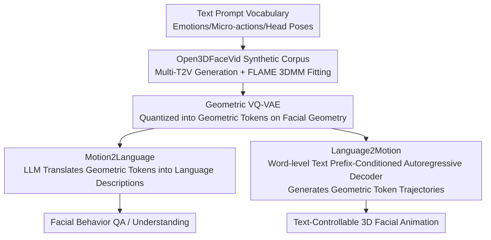

# Bridging Facial Understanding and Animation via Language Models

**Conference**: CVPR 2026  
**Paper**: [CVF Open Access](https://openaccess.thecvf.com/content/CVPR2026/html/Song_Bridging_Facial_Understanding_and_Animation_via_Language_Models_CVPR_2026_paper.html)  
**Code**: [Project Page TDMM-LM](https://songluchuan.github.io/TDMM-LM/) (including dataset and visualizations)  
**Area**: Human Understanding / 3D Facial Animation / Multimodal  
**Keywords**: 3D Facial Parameters, Geometric Tokens, Motion2Language, Language2Motion, Synthetic Dataset

## TL;DR
This paper leverages text-to-video (T2V) large models to synthesize an approximately 80-hour, emotion-balanced 3D facial corpus named Open3DFaceVid. By discretizing the facial geometry of each frame into "geometric tokens" via a VQ-VAE and feeding them to an LLM, this work, for the first time, models 3D facial parameters as a "language problem." A single, unified LLM can both translate facial motion tokens into natural language descriptions (Motion2Language) and generate controllable 3D facial motion trajectories from textual prompts (Language2Motion).

## Background & Motivation
**Background**: Text-driven full-body animation (text-to-motion) has progressed rapidly in recent years, heavily relying on large-scale, text-aligned body motion datasets and the paradigm of "tokenizing motion and performing autoregressive decoding like language" (e.g., MotionCLIP, T2M-GPT). However, transferring this paradigm to facial modeling is bottlenecked.

**Limitations of Prior Work**: The lag in facial understanding and animation mainly stems from two pain points. First is the **token efficiency disaster**: existing video LLMs treat each frame as hundreds of image tokens, necessitating downsampling or sparse keyframe extraction to save computational costs. However, facial expressions are highly sensitive to temporal continuity and often unfold within mere frames. Micro-expressions like eyebrow raises, lip twitches, or fleeting micro-smiles are lost with frame-sampling, while the remaining frames still consume hundreds of image tokens per second, forcing the model to ignore subtle dynamics. Second is the **imbalance of emotional distribution**: training for mainstream MLLMs relies on wild-captured videos from YouTube, TikTok, or VoxCeleb, which predominantly feature neutral, front-facing "talking heads" with very few high-intensity expressions like pouting, frowning, or laughing. Consequently, models learn a low-variance, static, and neutral facial prior, struggling to either comprehend or generate expressive motions.

**Key Challenge**: Can low-dimensional geometric signals (3D facial parameters) represent fine-grained emotions and motions to preserve temporal dynamics while avoiding redundant visual tokens? The fundamental barrier is the lack of a category-balanced and richly annotated facial motion dataset. Existing datasets either are recorded in studio settings with crude one-hot emotion labels, or utilize in-the-wild videos with noisy and mostly neutral annotations.

**Goal**: (1) Construct an emotion-balanced, text-aligned, large-scale 3D facial motion corpus; (2) Devise a compact representation that bypasses image tokens; (3) Enable a single LLM to simultaneously handle both "understanding facial motion" (Motion2Language) and "generating facial motion" (Language2Motion).

**Key Insight**: The authors observe that if facial geometry is discretized into compact "geometric tokens", these tokens will reside in the same symbolic space as text tokens. Consequently, facial motion modeling essentially becomes a language problem, allowing direct utilization of the reasoning and generation capabilities of LLMs.

**Core Idea**: Replace image tokens with "geometric tokens" to project 3D facial motion into the LLM's input space, enabling a single LLM to perform bidirectional facial motion understanding and synthesis.

## Method

### Overall Architecture
The method consists of two major phases: **automated data generation via T2V large models (Open3DFaceVid)**, and **learning a shared "language $\leftrightarrow$ motion" space** on this dataset.
On the data side: Prompts covering emotions, micro-expressions, and head poses are procedurally generated to synthesize ~60k facial videos using multiple T2V models (Wan2.1/2.2, HuMo, Open-Sora, Veo), supplemented by ~10k in-the-wild videos. FLAME 3DMM is then fitted frame-by-frame to obtain (text, 3D facial parameter sequence) pairs.
On the modeling side: A VQ-VAE operating on the **geometric space** (instead of 3DMM coefficients) is trained to discretize facial sequences into geometric tokens, which serve as "symbolic observations" for the LLM. Based on this alignment interface, a unified LLM supports two opposite directions: Motion2Language decodes geometric tokens into natural language descriptions, and Language2Motion utilizes word-level textual prefix conditioning on an autoregressive geometric decoder to predict future geometric tokens for downstream animation.

### Key Designs

**1. Open3DFaceVid: Building an Emotion-Balanced 3D Facial Corpus via T2V Synthesis**

Existing datasets suffering from "coarse studio labels or neutral wild videos" lack the diversity and open-ended descriptions needed for language-driven modeling. The proposed solution proceduralizes data generation: first, a vocabulary of ~200 words covering emotions and facial actions (e.g., grin, pout, smirk, squint) is curated, with **uniform sampling across all categories** to ensure balance. Prompt design decomposes into "facial appearance" and "video dynamics" axes. On the facial side, rich emotion types and intensities are sampled, embedded with high-frequency micro-actions like blinking and pouting. On the video side, a small set of template prompts (e.g., "keep camera stable, head/shoulders centered") constraints camera motion to minimize camera shake. The procedurally generated templates are then polished into colloquial natural descriptions via ChatGPT-4o. To avoid overfitting to a single generator's bias, the pipeline simultaneously deploys multiple T2V backbones (Wan-2.1/2.2, Open-Sora, HuMo, Veo), keeping facial attributes standardized while slightly tuning video-related wording. This results in ~60k synthetic clips (4–6s) supplemented by ~10k wild clips (with Gemini-labeled pseudo-prompts). This step directly determines the downstream "expressiveness" and is highlighted in ablation studies as the major source of performance gains.

**2. Geometric VQ-VAE: Quantization on Facial Geometry instead of 3DMM Coefficients to Eliminate Many-to-One Ambiguities**

This is key to bypassing image tokens. A straightforward but suboptimal approach is discretizing 3DMM parameters directly. However, **3DMM coefficients and expressions exhibit a many-to-one relationship**—visually identical expressions might map to different coefficient patterns, creating distinct tokens after quantization and polluting the codebook. Instead, the authors perform quantization **directly on the reconstructed facial geometry**. This ensures visually similar expressions are encoded into consistent tokens, mitigating the ambiguity of mapping physically similar geometries to disparate expression codes. After quantization, only **one geometric token** is used per frame. Compared to the 300–500 image tokens per frame, this represents orders of magnitude of compression, preserving subtle temporal dynamics while discarding visual redundancies, thereby allowing long facial motion sequences to fit entirely into the LLM context.

**3. Motion2Language: Direct Comprehension of Facial Motion via LLM Instruction Tuning over Geometric Tokens**

By utilizing geometric tokens that share the same symbolic space as text, comprehension becomes straightforward. The sequence of geometric tokens, coupled with the user prompt's text tokens, is fed into the LLM. **The LLM reads only these geometric tokens without looking at images** to generate open-ended descriptions of emotions, intensities, micro-expressions (blinking, pouting), and head dynamics. Each training sample consists of a "geometric token sequence + text description". An auxiliary LLM is also employed to rephrase each ground truth description into multiple paraphrases, enhancing language coverage without shifting semantics. The model is then instruction-tuned using task templates to learn "answering based on tokens." The main benefit is efficiency and temporal sensitivity: the single-token-per-frame input accommodates longer temporal contexts, thus capturing micro-dynamics that are typically discarded by image-token VLM downsampling.

**4. Language2Motion: Injecting Word-Level Language Prefixes into Autoregressive Facial Motion Transformer**

Generation is inherently more difficult than full-body motion, as facial datasets are smaller and movements are more nuanced. Traditional text-to-motion models compress the entire prompt into a global embedding, losing token-level cues like "which word controls which muscle dynamic." The authors introduce a **word-level language prefix**: a text encoder (T5) maps user prompts into token-level embeddings, serving as a prefix to condition an autoregressive facial motion Transformer. This Transformer predicts subsequent geometric tokens after the textual prefix; the decoder then maps these tokens back to 3DMM trajectories. Critically, this prefix **does not modify the vocabulary of the language model** but preserves the prompt's structure via prefix-style fusion. This allows individual words to precisely manipulate local facial motions (e.g., modifying a single word in the prompt adjusts style intensity in demonstrations), achieving semantically aligned, controllable 3D facial motion generation.

## Key Experimental Results

The dataset Open3DFaceVid totals 80 hours (50.2K clips of 4–6 seconds, unified at 25 FPS, 618×360), synthesized using 32 H200 GPUs in ~400 GPU hours. Evaluation is conducted using GPT-4 as an automatic referee on 2K test clips, alongside human evaluations on 300 samples. Metrics include correctness of emotion/motion/intensity CorE/CorM/CorI and human preference USERE/USERM (all on a scale of 1–5).

### Main Results

Motion2Language (geometric token input, Table 1, higher is better):

| Method | CorE$\uparrow$ | CorM$\uparrow$ | CorI$\uparrow$ | USERE$\uparrow$ | USERM$\uparrow$ |
|------|-------|-------|-------|--------|--------|
| HumanOmni | 1.84 | 1.17 | 1.09 | 2.04 | 1.00 |
| Gemini-2.5 VLM | 2.45 | 2.91 | 3.51 | 2.88 | 3.41 |
| **Ours** | **4.02** | **3.35** | **3.63** | **4.29** | **3.79** |

The proposed model reading 3DMM geometric tokens comprehensively outperforms VLMs operating on pixel frames in emotion/motion correctness and human preference. Due to frame downsampling, pixel-based VLMs barely capture temporal dynamics, causing their CorE to hover around 1 (the authors emphasize this is a domain gap rather than an intractable task). Notably, if natural facial image inputs are used (Table 2), commercial Gemini surpasses the proposed model on CorE (4.21); however, the proposed method uses only a single token per frame, requiring vastly fewer inputs than Gemini, putting them in entirely different leagues of efficiency.

Language2Motion (Table 3):

| Method | L2$\downarrow$ | FD$\downarrow$ | Tok$\uparrow$ | CorE$\uparrow$ | USER$\uparrow$ |
|------|-----|-----|------|-------|-------|
| T2M-X | 0.471 | 47.59 | 0.671 | 2.21 | 3.40 |
| T2M-GPT | 0.226 | 37.04 | 0.895 | 3.57 | 3.91 |
| **Ours** | **0.219** | **31.75** | **0.920** | **4.13** | **3.95** |

L2/FD measures expression and pose fidelity, Tok is token-level accuracy, and CorE uses the trained Motion2Language model as an external semantic evaluator. Ours leads in both geometric fidelity and semantic alignment. While T2M-GPT performs decently on low-level metrics due to its autoregressive architecture, it significantly lags in semantic metrics, highlighting the value of conditioning on a stronger LLM backbone.

### Ablation Study

Dataset Ablation (same architecture, trained on MEAD / YouTube [Gemini labels] / Open3DFaceVid respectively):

| Task | Corpus | Key Metrics | Note |
|------|------|---------|------|
| Motion2Language | MEAD | CorE 3.03 / USERE 2.92 | Studio-recorded, 8 coarse categories, lacking expressiveness |
| Motion2Language | YouTube | CorE 2.74 / USERE 3.14 | Mostly neutral in the wild; CorM (3.92) is slightly higher due to wider head motion range |
| Motion2Language | **Open3DFaceVid** | **CorE 3.97 / USERE 4.05** | Most rich semantic comprehension |
| Language2Motion | MEAD | USER 2.88 | Simple label space, occasionally lower L2 but poor perceptual quality |
| Language2Motion | YouTube | USER 3.59 | — |
| Language2Motion | **Open3DFaceVid** | **USER 3.92** | Most distinct expression articulation (e.g., "pout" actions) |

### Key Findings
- **Data is the primary driver of performance**: Regardless of understanding or generation tasks, swapping in the proposed synthetic corpus yields the highest USER scores. t-SNE visualization shows Open3DFaceVid has 187 clearly distinct emotion clusters, whereas MEAD has only 8 classes and YouTube has 37 heavily overlapping classes, intuitively explaining "why" it performs better.
- **Geometric token representation is effective**: On Motion2Language, the proposed model consistently recovers correct emotions/motions from 3DMM tokens, proving that structured geometric representations retain critical information for facial behavior reasoning. Furthermore, using 1 token per frame vs. VLM's 300–500 tokens offers a massive efficiency advantage.
- **Diverging scaling behaviors**: Motion2Language performance saturates at 4B–8B parameters, showing limited gains from larger backbones. In contrast, Language2Motion benefits more clearly from scale, with larger models yielding higher token generation accuracy—implying understanding tasks require less model capacity while generation tasks benefit significantly from model scaling.
- **YouTube's wider range of head movements** occasionally leads to higher CorM in understanding tasks, but overall emotional coverage and alignment quality are still dominated by the synthetic corpus. This suggests that the diversity in wild data is "noisy diversity" rather than "balanced diversity."

## Highlights & Insights
- **Reframing facial parameter modeling as a language problem**: The key "aha" moment is that geometric tokens and text tokens share the same symbolic space. Thus, a single LLM naturally excels at both understanding and generation, eliminating the need to build separate systems for each direction. This "unified interface" concept can be transferred to gesture, body, or any parameterizable motion modeling.
- **Quantizing on geometry rather than coefficients**: A subtle yet critical decision that avoids the many-to-one ambiguity of 3DMM coefficients and expressions, maintaining perceptual consistency in the codebook. This is a highly referenceable trick for VQ-VAE-based methods dealing with "equivalent representations."
- **Constructing balanced data via T2V large models**: When real-world data is naturally skewed (facially neutral), procedurally "manufacturing balance" via controllable generation + uniform category sampling—coupled with multiple generators to eliminate individual model bias—is a highly pragmatic solution in data-scarce domains.
- **Word-level prefixes instead of global embeddings**: Preserving the token-level structure of the prompt enables fine-grained control (e.g., "modifying one word $\to$ modifying a local motion"), representing an elegant and direct design for fine-grained controllable generation.

## Limitations & Future Work
- **Complete reliance on synthetic data**: Since the bulk of the corpus is generated by T2V models, despite the addition of wild clips, the domain gap between synthetic and real human behavior as well as T2V model biases/artifacts will inevitably propagate downstream. The paper places additional dataset bias analysis in the appendix.
- **Information loss from geometric tokens**: Compressing each frame to a single token maximizes efficiency, but whether this limits the representation of ultra-subtle micro-expressions or complex moments with co-occurring muscle movements remains unexamined. Low-level metrics like FD/L2 can only reflect this indirectly.
- **Evaluation heavily relies on LLM/human subjective metrics**: CorE/CorM utilizes GPT-4 as a judge, and Language2Motion employs the paper's own Motion2Language model as a semantic evaluator. This introduces evaluation loops and subjectivity, lacking cross-validation with objective kinematic or objective perceptual metrics.
- **Motion2Language underperforms commercial VLMs in the natural image setting** (Table 2 Gemini CorE 4.21 vs. Ours 4.02). The proposed model's advantage is primarily built on the specific setup of "geometric token inputs + efficiency," meaning its generalizability across setups should be interpreted with caution.

## Related Work & Insights
- **vs T2M-GPT / T2M-X (text-to-motion)**: These methods tokenize (body) motions and perform autoregressive decoding, but compress prompts into global embeddings. The proposed method replaces the target with facial geometric tokens and retains token-level prompts via word-level language prefixes, leading to significantly better semantic alignment (CorE 4.13 vs 3.57).
- **vs HumanOmni / Gemini VLM (video MLLMs)**: These models perform frame-sampled understanding in pixel space, losing facial micro-dynamics and incurring massive token overheads. The proposed method utilizes a 1-token-per-frame geometric representation, which is both highly efficient and temporally sensitive, dramatically leading in the 3DMM input setup.
- **vs MEAD and other studio datasets**: The latter only provides coarse, 8-class, one-hot labels. Open3DFaceVid uses a synthetic pipeline to obtain 187 balanced classes with open-ended text descriptions, providing the coverage previously lacking for language-driven facial modeling.

## Rating
- Novelty: ⭐⭐⭐⭐⭐ Formulating 3D facial parameter modeling as a language problem with a unified bi-directional LLM framework based on geometric tokens is a clean and solid paradigm contribution.
- Experimental Thoroughness: ⭐⭐⭐⭐ Both tasks feature main results, corpus ablation, scaling analysis, and t-SNE, though evaluation is subjective and lacks objective metric cross-validation.
- Writing Quality: ⭐⭐⭐⭐ The motivation chain is clear with abundant illustrations. Sparing of some equations/implementation details to the appendix leaves the main text somewhat narrative-heavy.
- Value: ⭐⭐⭐⭐⭐ Simultaneously contributes a large-scale balanced corpus and a reusable "parametric motion $\leftrightarrow$ language" interface, which is highly valuable for the facial animation/comprehension community.

<!-- RELATED:START -->

## Related Papers

- [\[CVPR 2026\] LLaMo: Scaling Pretrained Language Models for Unified Motion Understanding and Generation with Continuous Autoregressive Tokens](llamo_scaling_pretrained_language_models_for_unified_motion_understanding_and_ge.md)
- [\[CVPR 2026\] PC-Talk: Precise Facial Animation Control for Audio-Driven Talking Face Generation](pc-talk_precise_facial_animation_control_for_audio-driven_talking_face_generatio.md)
- [\[CVPR 2025\] Pose Priors from Language Models](../../CVPR2025/human_understanding/pose_priors_from_language_models.md)
- [\[CVPR 2026\] Beyond Single-View Sufficiency: CVBench for Cross-View Human Understanding](beyond_single-view_sufficiency_cvbench_for_cross-view_human_understanding.md)
- [\[CVPR 2026\] Sketch2Colab: Sketch-Conditioned Multi-Human Animation via Controllable Flow Distillation](sketch2colab_sketch-conditioned_multi-human_animation_via_controllable_flow_dist.md)

<!-- RELATED:END -->
