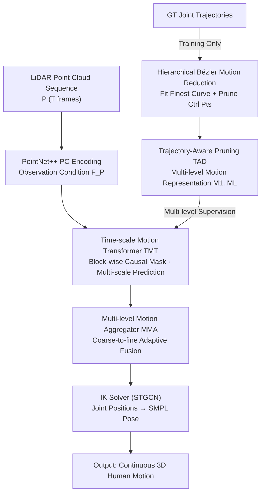

# Bézier Degradation Modeling for LiDAR-based Human Motion Capture

**Conference**: CVPR 2026  
**arXiv**: [2605.19620](https://arxiv.org/abs/2605.19620)  
**Code**: None  
**Area**: 3D Vision / Human Motion Capture  
**Keywords**: LiDAR Motion Capture, Bézier curve, Motion representation, Coarse-to-fine reconstruction, Occlusion compensation

## TL;DR
To address jittering or capture failure in LiDAR human motion capture under sparse point clouds and severe occlusion, this paper explicitly models joint trajectories using **Bézier curves with hierarchical order reduction**. Combined with a "Time-scale Motion Transformer (TMT) + Multi-level Motion Aggregator (MMA)" for progressive coarse-to-fine reconstruction, it achieves state-of-the-art (SOTA) performance in both accuracy (MPJPE) and temporal continuity (Accel Err) across four mainstream benchmarks.

## Background & Motivation
**Background**: 3D human motion capture aims to reconstruct time-varying standardized human representations from sensor data. Traditional methods rely on wearable devices like markers/IMUs, followed by low-cost RGB/RGB-D based solutions; however, RGB methods are affected by lighting and lack absolute depth, largely limiting them to indoor use. Autonomous driving and robotics have strong demands for human perception in large-scale, unconstrained environments. **LiDAR motion capture** has become a promising direction due to its robustness to lighting and reliable global depth.

**Limitations of Prior Work**: LiDAR provides single-view, sparse depth sampling, which is naturally prone to occlusion and noise contamination. Representative works like LiveHPS use SMPL vertex features as teacher signals to handle incomplete point clouds, and LiveHPS++ introduces velocity prediction to suppress noisy measurements. However, they essentially **learn directly from incomplete point cloud features**, still resulting in jittery, biased, or failed predictions when key joints are occluded for long periods.

**Key Challenge**: These methods rely on **action priors of specific point cloud patterns**, which fail when input frames are missing. The root cause is that "reconstruction targets are tied to unreliable per-frame observations," lacking constraints on the inherent patterns of motion itself.

**Goal**: (1) Find a motion representation that is robust to occlusion and easy for networks to learn; (2) Design a reconstruction mechanism capable of continuing motion across "observation break points" caused by occlusion.

**Key Insight**: The authors adopt a **kinematics-driven** approach. Instead of learning directly from incomplete point cloud features, they parameterize human motion using **Bézier curves**. This parameterization explicitly exposes position, velocity, and acceleration, allowing for smooth and stable interpolation even during long occlusions. Key observation (Fig.2): Aggressively pruning Bézier control points (e.g., keeping only 12%) still preserves the global motion trend. This aligns with the hierarchical nature of human motion: a sequence of actions like lifting a leg, stepping, landing, and pushing off can be coarsely summarized as "walking from A to B," where the coarse trend expresses intent and extra control points add details.

**Core Idea**: Represent motion as Bézier curves and design a **hierarchical order reduction strategy** that removes control points to generate multi-level representations. Reconstruction is the inverse process—coarse-to-fine, first recovering point-to-point motion trends, then refining to detailed poses at each timestep, using coarse-layer trends to bridge observation break points caused by occlusion.

## Method

### Overall Architecture
BMLiCap is a coarse-to-fine framework. The input is a LiDAR point cloud sequence of $T$ frames $P=\{P_t\in\mathbb{R}^{N\times3}\}$, and the output is the corresponding 3D human motion $M=\{\theta_t, J_t\}$ (SMPL pose parameters $\theta_t$ and joint positions $J_t$). The pipeline consists of two main parts:

1. **Hierarchical Bézier Motion Reduction (Training only)**: First, the original joint trajectories are fitted to the finest Bézier curve chain. Then, through "Trajectory-Aware Pruning (TAD)," control points are removed level by level to generate a set of coarse-to-fine multi-level motion representations $\{M_l\}_{l=1}^{L}$ as multi-level supervision targets.

2. **Progressive Motion Reconstruction**: PointNet++ extracts per-frame LiDAR features as observation conditions $F_\mathcal{P}$. The **Time-scale Motion Transformer (TMT)** treats each level of motion representation as a set of tokens, simultaneously predicting motion curves at various time scales in a single forward pass under the LiDAR feature conditions. The **Multi-level Motion Aggregator (MMA)** then adaptively fuses these multi-scale curves from coarse to fine to obtain the final detailed motion. Finally, an Inverse Kinematics (IK) solver based on STGCN converts joint positions into SMPL pose parameters.

Note that the reduction module only generates supervision targets during training; during inference, TMT/MMA produces multi-level motion in a single forward pass, avoiding the slow iterative inference required by previous progressive regression methods.

### Key Designs

**1. Hierarchical Bézier Motion Reduction + Trajectory-Aware Pruning (TAD): Compressing motion into multi-level representations that are "coarser yet trend-preserving"**

To address the issue that per-frame learning is unreliable, motion is first given a hierarchical parameterization robust to occlusion. **Initial Bézier Fitting**: For each joint $k$ trajectory $J^{(k)}\in\mathbb{R}^{T\times3}$, each $J^{(k)}_t$ is treated as an anchor point to construct $T-1$ cubic Bézier segments (Eq. 1), with $C^1$ continuity enforced at each control point to ensure velocity smoothness. By setting the initial acceleration $\ddot{B}^{(k)}_0(0)=0$, all control points are solved using the Thomas algorithm, resulting in the finest curve chain $\{J^{(k)}_i, C^{(k)}_{i,1}, C^{(k)}_{i,2}\}$.

**TAD Reduction**: Given a downsampling stride $s$, the new trajectory length is reduced to $M_s=\lceil T/s\rceil$. $M_s$ time indices are uniformly sampled, and the corresponding joint positions are taken as new anchor points. Since simple downsampling loses dynamics, TAD extracts unit tangent vectors $\widehat{\mathbf{d}}^{(k)}_i$ (Eq. 2) at each anchor from the finest curve. New control points are defined as anchor points shifted by a length $\ell$ along the tangent: $\widetilde{C}^{(k)}_{i,1}=\widetilde{J}^{(k)}_i-\ell_{i,1}\widehat{\mathbf{d}}^{(k)}_i$ and $\widetilde{C}^{(k)}_{i,2}=\widetilde{J}^{(k)}_i+\ell_{i,2}\widehat{\mathbf{d}}^{(k)}_i$ (Eq. 3). Least squares are then used to solve for the optimal length $\ell$ such that the reduced curve segment best fits the original sampling points (Eq. 4, closed-form solution). Using a set of different strides $S=\{s_1,...,s_L\}$ ($s_l>s_{l+1}$, $s_L=1$) yields multi-level motion representations $\{M_l\in\mathbb{R}^{M_{s_l}\times K\times9}\}$. Compared to linear interpolation ($G^0$ continuity only), B-Splines/VAE (over-smoothing), and DCT (phase lag/ringing), $C^1$ Bézier + TAD archives a better balance between denoising and fidelity (Table 2).

**2. Time-scale Motion Transformer (TMT) + Block-wise Causal Mask: Guiding refinement with coarse trends and completing motion across levels during occlusion**

TMT addresses how to establish information flow between multi-level representations while utilizing LiDAR cues. It uses an encoder-only architecture that treats each level of motion representation as an independent token sequence. Given initial multi-level motion embeddings $\{E_l\}$ and LiDAR features $F_\mathcal{P}$, TMT models their interaction to output reconstructed curves at various scales $\{\widehat{M}_l\}=\text{MLP}(\text{TMT}(F_\mathcal{P},\{E_l\}))$ (Eq. 5).

The core is the **block-wise causal mask**: in the self-attention layer, each motion token can only attend to tokens of all coarser levels and all point cloud feature tokens. Thus, coarse-level trends effectively guide the refinement of finer layers, while all levels absorb visible LiDAR cues. Attention visualization (Fig. 9) shows that in normal sequences, attention is near-diagonal (predicting from simultaneous/neighboring positions). In severely occluded sequences, attention disperses, and motion tokens at multiple levels and timesteps act as "key frames" for completion—this is the mechanism of using coarse trends to bridge observation break points.

**3. Multi-level Motion Aggregator (MMA): Fusing multi-scale curves into final fine motion from coarse to fine**

TMT provides motion curves at various scales, and MMA integrates them into a coherent fine motion. It uses a reduction mechanism for level-by-level fusion: $\widehat{M}'_{l+1}=\text{MLP}(\text{Resample}(\widehat{M}'_l),\widehat{M}_{l+1})$ ($l=2,...,L-1$; for $l=1$, $\widehat{M}'_1=\widehat{M}_1$, Eq. 6). The $\text{Resample}(\cdot)$ function uses predicted Bézier parameters to analytically upsample coarser representations to the length of the next finer level before fusion via MLP. The final position components of the finest fusion representation $\widehat{M}'_L$ are taken as joint position predictions $\{\widehat{J}_t\}$. Since upsampling occurs analytically via Bézier parameters, the fusion remains temporally smooth without per-frame stitching jitter. An IK solver (STGCN) then converts joint positions to SMPL poses $\widehat{\theta}_t$, followed by forward kinematics for $\widehat{J}_{t;\text{FK}}$ (Eq. 7).

### Loss & Training
Three loss terms are jointly trained:
- **Multi-level motion loss**: $\mathcal{L}_M=\sum_{l=1}^{L}\frac{1}{M_{s_l}}\|\widehat{M}_l-M_l\|_F^2$, supervising predicted Bézier motion at each level (Eq. 8);
- **Pose parameter loss**: $\mathcal{L}_\theta=\frac{1}{KT}\sum_t\|\theta_t-\widehat{\theta}_t\|_F^2$ and **Forward kinematics loss**: $\mathcal{L}_\text{FK}=\frac{1}{KT}\sum_t\|J_t-\widehat{J}_{t;\text{FK}}\|_F^2$ to supervise the IK solver (Eq. 9).

Total loss: $\mathcal{L}=\lambda_M\mathcal{L}_M+\lambda_\theta\mathcal{L}_\theta+\lambda_\text{FK}\mathcal{L}_\text{FK}$ (Eq. 10), with $\lambda_M=0.5$ and $\lambda_\theta=\lambda_\text{FK}=1.0$. Implementation: PyTorch 2.3.1 + CUDA 11.8; PointNet++ encoder pre-trained on synthetic human instances; TMT is a standard Transformer encoder (12 layers, 512-dim, 16 heads); AdamW, learning rate $2.5\times10^{-4}$, 50 epochs on 4× RTX 4090.

## Key Experimental Results

Datasets: LiDARHuman26M, FreeMotion, NoiseMotion, SLOPER4D.
Metrics: **MPJPE/JPE** (mm, ↓), **MPVPE/PVE** (mm, ↓), **Accel Err/AE** (cm/s², ↓, measures continuity). `†` denotes a 32-frame time window variant.

### Main Results
| Dataset | Metric | BMLiCap | BMLiCap† | Prev. SOTA | Note |
|--------|------|---------|----------|----------|------|
| LiDARHuman26M | JPE / VPE / AE | 70.1 / 89.5 / 31.2 | **66.8 / 85.4 / 28.8** | LiveHPS 71.9 / 92.1 / 34.1 | Leading in all three metrics |
| FreeMotion | JPE / VPE / AE | 49.6 / 60.3 / 27.1 | **47.2 / 59.0 / 22.5** | LiveHPS++ 61.9 / 75.3 / 54.2 | † Gain over LiveHPS++: 14.7/16.3/31.7 |
| NoiseMotion | JPE / VPE / AE | **34.0 / 42.8 / 24.1** | 36.9 / 47.0 / 23.8 | LiveHPS++ 34.0 / 42.8 / 34.8 | Parity in accuracy, significant AE reduction |
| SLOPER4D | JPE / VPE / AE | 39.7 / 47.8 / 22.3 | **36.5 / 44.2 / 13.6** | LiveHPS++ 42.7 / 50.6 / 43.4 | AE dropped from 43.4 to 13.6 |

Key Phenomenon: On NoiseMotion, **shorter time windows perform better**. The authors attribute this to the dataset's frequent viewpoint jumps, where long windows aggregate more corrupted/misaligned labels.

**Motion Representation Comparison (LiDARHuman26M)**:
| Representation | MPJPE | MPVPE | Accel Err |
|----------|-------|-------|-----------|
| Frequency-DCT | 76.4 | 97.8 | 35.4 |
| VAE-smooth | 78.2 | 100.1 | 36.8 |
| Linear | 75.7 | 96.3 | 35.5 |
| B-Spline | 70.5 | 90.4 | 30.0 |
| **Bézier+TAD (Ours)** | **66.8** | **85.4** | **28.8** |

### Ablation Study
| Configuration | MPJPE | MPVPE | Accel Err | Note |
|------|-------|-------|-----------|------|
| Base ([34]+Transformer) | 79.0 | 101.0 | 42.6 | GRU to Transformer only |
| + Bézier & TAD | 72.3 | 91.4 | 30.7 | Representation swap alone reduces 6.7 MPJPE |
| + Tokens & Mask | 72.2 | 92.4 | 30.7 | Multi-level token and mask swap |
| + m.s.+m.l.+b.m.+mma | **66.8** | **85.4** | **28.8** | Full model reduces 12.2 MPJPE vs. Base |

Hierarchy and TAD Ablation (Table 3): $L=3$ with schedule $\{32,16,8\}$ is optimal; TAD brings consistent gains across all $L$. Balanced temporal resolutions facilitate capturing motion dynamics.

### Key Findings
- **Highest Contributions**: Bézier+TAD representation (-6.7 MPJPE) and full progressive reconstruction (-12.2 MPJPE total). Combining multi-level tokens, motion loss, and block masks marks the qualitative performance jump point.
- **Robustness to Frame Loss**: During inference, even when **50% of frames are lost** (filled with placeholders), performance remains stable (Fig. 7), confirming that coarse trends bridge observation gaps.
- **Significant Continuity Improvement**: On SLOPER4D, AE dropped from 43.4 to 13.6. Visualizations (Fig. 5/6) show that while LiDARCap/LiveHPS jitter or fail under occlusion, BMLiCap remains coherent and accurate.

## Highlights & Insights
- **Unified Motion Representation and Supervision via Curve Reduction**: Pruning Bézier control points naturally provides multi-level targets, where reconstruction is the inverse process—highly self-consistent design.
- **TAD as more than Downsampling**: By solving for optimal control point lengths along tangents to fit the original curve, TAD preserves dynamics better than simple subsampling or linear interpolation.
- **Block-wise Causal Mask as Explicit Inductive Bias**: Forcing each token to attend only to coarser levels and point cloud features makes the "coarse-to-fine guidance" explicit and explainable.
- **Single Forward Pass replacing Iterative Inference**: Unlike previous progressive methods, BMLiCap outputs all levels in one forward pass, balancing progressive accuracy gains with efficiency.

## Limitations & Future Work
- Training depends on **relatively clean GT trajectories** for Bézier fitting; noisy/misaligned GT labels (e.g., NoiseMotion) hinder performance.
- Optimal time window size depends on dataset characteristics; there is currently no adaptive window mechanism.
- Qualitative data on real-time performance is missing; the latency of a 12-layer Transformer + IK solver is not quantified.
- Only validated in the LiDAR single-modality setting; benefits of multi-modal cues (IMU/RGB) are not explored.

## Related Work & Insights
- **vs LiveHPS / LiveHPS++**: While prior works learn spatio-temporal consistency priors (vertex teacher signals, velocity prediction), this work utilizes **kinematic patterns of motion itself** via Bézier parameterization. This leads to superior performance during long occlusions and much lower AE.
- **vs LiDARCap / LiDAR-HMR**: Follows LiDARCap's dataset and IK baseline but replaces per-frame/iterative reconstruction with multi-level Bézier representations + single-forward progressive reconstruction.
- **vs DCT/VAE/B-Spline**: DCT's orthogonal components make early error correction difficult and introduce ringing; VAE/B-Splines over-smooth. $C^1$ Bézier + TAD provides an optimal balance (Table 2).

## Rating
- Novelty: ⭐⭐⭐⭐⭐ Using curve reduction to unify motion representation and multi-level supervision is highly novel and consistent.
- Experimental Thoroughness: ⭐⭐⭐⭐⭐ SOTA across 4 benchmarks and 3 metrics; comprehensive ablations on representations, components, and frame loss.
- Writing Quality: ⭐⭐⭐⭐ Clear logic and diagrams, though some formulas and notations are dense.
- Value: ⭐⭐⭐⭐ Significantly improves accuracy and continuity in occluded scenarios, with high practical utility for autonomous driving and robotics.

<!-- RELATED:START -->

## Related Papers

- [\[CVPR 2026\] HUM4D: A Dataset and Evaluation for Complex 4D Markerless Human Motion Capture](hum4d_markerless_motion_capture.md)
- [\[CVPR 2026\] Decoupled Generative Modeling for Human-Object Interaction Synthesis](decoupled_generative_modeling_for_human-object_interaction_synthesis.md)
- [\[CVPR 2026\] FisherPoser: Human Motion Estimation from Sparse Observations with Hierarchical Region-Wise Fisher-Matrix Uncertainty Modeling](fisherposer_human_motion_estimation_from_sparse_observations_with_hierarchical_r.md)
- [\[CVPR 2026\] Occluded Human Body Capture with Frequency Domain Denoising Prior](occluded_human_body_capture_with_frequency_domain_denoising_prior.md)
- [\[CVPR 2026\] IMU-HOI: A Symbiotic Framework for Coherent Human-Object Interaction and Motion Capture via Contact-Conscious Inertial Fusion](imu-hoi_a_symbiotic_framework_for_coherent_human-object_interaction_and_motion_c.md)

<!-- RELATED:END -->
