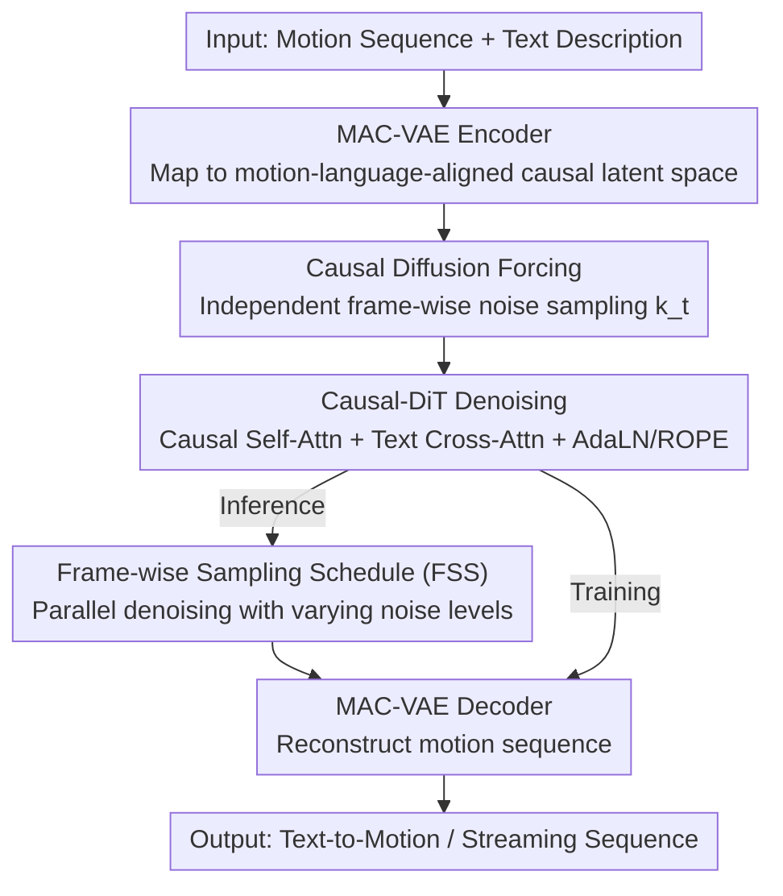

# Causal Motion Diffusion Models for Autoregressive Motion Generation

**Conference**: CVPR 2026  
**arXiv**: [2602.22594](https://arxiv.org/abs/2602.22594)  
**Code**: None  
**Area**: Human Motion Generation / Diffusion Models  
**Keywords**: Causal Diffusion, Autoregressive Motion Generation, Text-to-Motion, Streaming Generation, Frame-wise Sampling Schedule

## TL;DR

The CMDM framework is proposed, which unifies diffusion denoising and autoregressive generation within a motion-language-aligned causal latent space. By employing frame-level independent noise levels and a causal uncertainty sampling schedule, it achieves high-quality, low-latency text-to-motion generation and long-sequence streaming synthesis.

## Background & Motivation

Text-driven human motion generation must simultaneously ensure spatial accuracy and temporal coherence. Existing methods fall into two primary paradigms, each with limitations:

- **Full-sequence Diffusion Models** (e.g., MDM, MLD, MotionLCM): Perform bidirectional denoising across the entire sequence. While quality is high, they break temporal causality, making online/streaming generation impossible.
- **Autoregressive Models** (e.g., T2M-GPT, MotionStreamer): Maintain causality but suffer from error accumulation and instability over long sequences; they rely on teacher forcing during training, leading to significant exposure bias during inference.

**Key Challenge**: How to simultaneously obtain the generative fidelity of diffusion models and the causal structure of autoregressive models? CMDM addresses this by performing frame-level diffusion denoising in a semantically aligned causal latent space.

## Method

### Overall Architecture

The mechanism of CMDM involves: first compressing motion sequences into a latent space that preserves both causal structure and semantics; then performing diffusion denoising with "frame-independent noise levels" within this latent space; and finally decoding back to motion. The pipeline consists of three core modules: (1) **MAC-VAE** (Encoder-Decoder), which maps motion sequences to a motion-language-aligned causal latent space; (2) **Causal-DiT**, which performs denoising using causal attention and "**Causal Diffusion Forcing**"—sampling independent noise levels for each frame to enforce temporal causality; (3) **FSS** (Frame-wise Sampling Scheduler), which during inference allows parallel denoising with lower noise for past frames and higher noise for future frames to accelerate generation. The model is trained via teacher forcing and performs streaming generation via FSS during inference.

### Key Designs

1. **MAC-VAE (Motion-Language-Aligned Causal VAE)**: Constructs the encoder/decoder using 1D causal convolutions and causal ResNet blocks to ensure each frame depends only on predecessors. The temporal dimension is downsampled by $4\times$. A key novelty is the motion-language alignment loss: frame-level semantic features are extracted using a pre-trained Part-TMR model, aligned via marginal cosine similarity loss $\mathcal{L}_{\text{mcos}}$ and marginal distance matrix similarity loss $\mathcal{L}_{\text{mdms}}$:

    $$\mathcal{L}_{\text{MAC-VAE}} = \mathcal{L}_{\text{rec}} + \beta D_{\text{KL}} + \lambda \mathcal{L}_{\text{align}}$$

   Where $\mathcal{L}_{\text{align}} = \mathcal{L}_{\text{mcos}} + \mathcal{L}_{\text{mdms}}$. The former minimizes feature-level cosine gaps, while the latter maintains relative structural consistency in the feature space.

2. **Causal Diffusion Forcing**: Unlike traditional diffusion models that apply identical noise to all frames, CMDM independently samples noise levels $k_t$ for each frame $t$, performing denoising with causal self-attention (down-triangular mask):

    $$\mathcal{L}_{\text{DF}} = \mathbb{E}_{k_t, \epsilon_t^{k_t}} \left[ \| \epsilon_t^{k_t} - \epsilon_\theta(\tilde{\mathbf{z}}_{\leq t}, k_t, \mathbf{c}) \|_2^2 \right]$$

   Each frame only observes information from past frames, enforcing temporal causality within the diffusion framework. Frame-level random noise also acts as a regularizer, encouraging smooth temporal transitions.

3. **Causal-DiT (Causal Diffusion Transformer)**: Comprising 8 Transformer layers with 4 attention heads (512-dim). It integrates three mechanisms: causal self-attention (masking future frames), cross-attention (interacting with DistilBERT text embeddings), and AdaLN + ROPE (frame-level diffusion timestep embeddings and Rotary Positional Embeddings to stabilize long-sequence denoising).

4. **Frame-wise Sampling Schedule (FSS)**: At inference, low noise is assigned to past frames and high noise to future frames. Each new frame is predicted from partially denoised preceding frames rather than waiting for complete denoising. The uncertainty scale $L$ controls the "cascade," where the next frame starts denoising once the current frame reaches step $K-L$. This significantly reduces inference steps and mitigates exposure bias.

### Loss & Training

- MAC-VAE: Reconstruction loss + KL divergence + motion-language alignment loss (weight $\lambda$ adjusted automatically via gradient norms).
- Causal-DiT: Causal diffusion forcing loss using Flow Matching as an ODE sampler.
- Textual conditions are randomly dropped with $p=0.1$ during training; classifier-free guidance (scale=3.0) is used during inference.

## Key Experimental Results

### Main Results

| Dataset | Metric | Ours (FSS) | Prev. SOTA (SALAD) | Gain |
|--------|------|-----------|------------------|------|
| HumanML3D | R-Top1 | **0.588** | 0.581 | +0.007 |
| HumanML3D | FID | **0.068** | 0.076 | -0.008 |
| HumanML3D | CLIP-Score | **0.685** | 0.671 | +0.014 |
| SnapMoGen | R-Top1 | **0.831** | 0.802 (MoMask++) | +0.029 |
| SnapMoGen | FID | **14.451** | 15.061 (MoMask++) | -0.610 |

**Long Sequence Generation** (Comparison with FlowMDM, MARDM):

| Dataset | Subsequence FID↓ | Transition AUJ↓ | Description |
|--------|-----------------|-----------------|------|
| HumanML3D CMDM | **0.12** | **0.42** | Significantly outperforms FlowMDM (0.29/0.51) |
| SnapMoGen CMDM | **32.49** | 70.35 | Subsequence quality far exceeds MARDM (40.80) |

### Ablation Study

| Configuration | R-Top1 | FID | Transition AUJ |
|------|--------|-----|----------------|
| Full CMDM | 0.588 | 0.068 | 0.42 |
| Standard VAE (w/o Alignment) | 0.561 | 0.107 | 0.52 |
| C-VAE (w/o Alignment) | 0.575 | 0.070 | 0.44 |
| Full-seq Diffusion (Non-causal) | 0.591 | 0.071 | **0.72** |
| w/o AdaLN | 0.583 | 0.076 | 0.47 |
| w/o ROPE | 0.581 | 0.087 | 0.51 |
| FSS $K=50, L=5$ | 0.583 | 0.077 | **0.38** |

### Key Findings

- **High Efficiency**: CMDM has only 114M parameters and reaches 125 fps in FSS mode (compared to MARDM’s 310M/20fps and MotionStreamer’s 318M/11fps), making it an order of magnitude faster.
- While full-sequence diffusion has slightly higher R-Top1 for single-step text-to-motion, its transition AUJ is nearly double (0.72 vs 0.42), proving that causal diffusion is vital for long-sequence coherence.
- MAC-VAE alignment primarily improves semantic consistency rather than motion quality itself.
- $L=5$ in FSS yields the smoothest transitions (AUJ=0.38) at a slight cost to semantics.

## Highlights & Insights

- The migration of Diffusion Forcing from next-token prediction to the motion domain successfully unifies diffusion and autoregressive paradigms via frame-independent noise.
- FSS provides a practical inference acceleration strategy: by controlling the "uncertainty cascade" propagation in the causal chain, it balances speed and quality flexibly.
- The semantic alignment supervision in MAC-VAE creates a latent space that is both causally structured and semantically meaningful; such dual-constraint design is a valuable reference.
- Parameter count is $2-3\times$ smaller than competing methods while delivering better performance, suggesting that architectural design is more critical than model scale.

## Limitations & Future Work

- For highly abstract or ambiguous text descriptions, performance is limited by the quality of the pre-trained motion-language model (Part-TMR).
- Extremely long sequences (minutes long) may still accumulate minor temporal artifacts, requiring motion-aware feedback or adaptive anchoring mechanisms.
- Currently supports only single-person motion; extension to multi-person interaction scenarios is pending.
- Optimal combinations of $K$ and $L$ in FSS require scene-specific hyperparameter tuning.

## Related Work & Insights

- **Diffusion Forcing** [Chen et al., 2024] inspired the frame-independent noise, but CMDM extends the original next-token prediction focus to continuous motion spaces.
- **MLD/MotionLCM** demonstrate the effectiveness of full-sequence latent diffusion, but CMDM proves that causal constraints provide streaming capabilities without sacrificing quality.
- **MARDM/MotionStreamer** utilize masked autoregressive or diffusion heads but suffer from large parameter sizes and slow inference.

## Rating

- **Novelty**: ⭐⭐⭐⭐ First framework to unify diffusion and autoregression in a motion-language-aligned causal latent space.
- **Experimental Thoroughness**: ⭐⭐⭐⭐⭐ Two benchmarks + long-sequence evaluation + detailed ablations (VAE/diffusion/sampling) + efficiency analysis.
- **Writing Quality**: ⭐⭐⭐⭐ Clear structure, complete mathematical derivations, and sufficient experimental detail.
- **Value**: ⭐⭐⭐⭐⭐ High utility for real-time motion generation; the 125 fps inference speed offers immediate application potential.

<!-- RELATED:START -->

## Related Papers

- [\[CVPR 2026\] MoCoDiff: A Controllable Autoregressive Diffusion Model for Expressive Motion Generation](mocodiff_a_controllable_autoregressive_diffusion_model_for_expressive_motion_gen.md)
- [\[ICCV 2025\] MotionStreamer: Streaming Motion Generation via Diffusion-based Autoregressive Model in Causal Latent Space](../../ICCV2025/image_generation/motionstreamer_streaming_motion_generation_via_diffusion-based_autoregressive_mo.md)
- [\[CVPR 2026\] Pixel Motion Diffusion Is What We Need for Robot Control](pixel_motion_diffusion_is_what_we_need_for_robot_control.md)
- [\[CVPR 2026\] Cross-Axis Feature Fusion with Joint-Wise Motion Difference Prediction for Text-Based 3D Human Motion Editing](cross-axis_feature_fusion_with_joint-wise_motion_difference_prediction_for_text-.md)
- [\[CVPR 2026\] EgoFlow: Gradient-Guided Flow Matching for Egocentric 6DoF Object Motion Generation](egoflow_gradient-guided_flow_matching_for_egocentric_6dof_object_motion_generati.md)

<!-- RELATED:END -->
