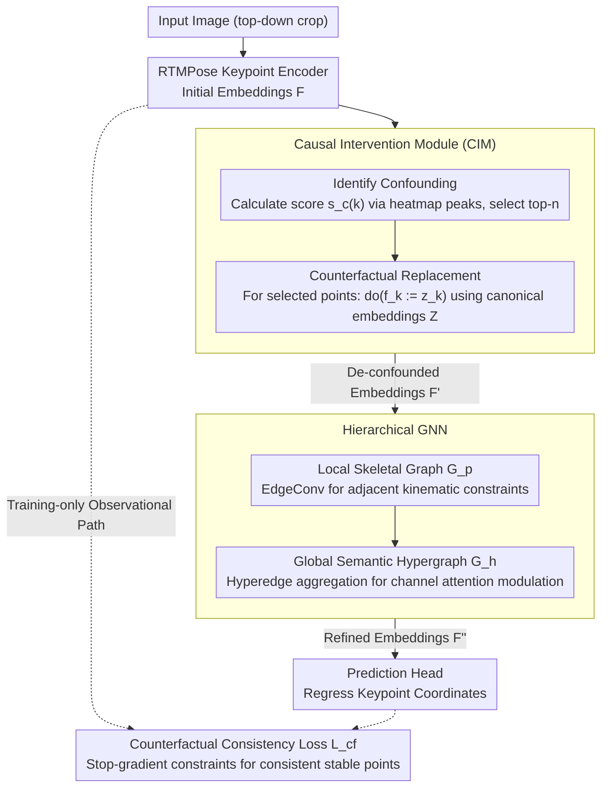

# CIGPose: Causal Intervention Graph Neural Network for Whole-Body Pose Estimation

**Conference**: CVPR2026  
**arXiv**: [2603.09418](https://arxiv.org/abs/2603.09418)  
**Code**: [53mins/CIGPose](https://github.com/53mins/CIGPose)  
**Area**: Human Understanding  
**Keywords**: Whole-Body Pose Estimation, Causal Inference, Graph Neural Networks, Structural Causal Models, Counterfactual Intervention

## TL;DR

Ours proposes CIGPose, a causal intervention graph pose estimation framework. It identifies visual context confounders through structural causal models, utilizes prediction uncertainty to locate keypoints affected by confounding, and replaces them with learned context-free canonical embeddings. A hierarchical GNN then models skeletal anatomical constraints, achieving a new SOTA of 67.0% AP on COCO-WholeBody.

## Background & Motivation

**Vulnerability of Whole-Body Pose Estimation**: Existing SOTA methods (RTMPose, DWPose, etc.) often produce anatomically implausible predictions in real-world scenarios with severe occlusion, cluttered backgrounds, or extreme lighting, demonstrating insufficient robustness.

**Spurious Correlation**: High-capacity models rely on surface statistical features rather than anatomical understanding—for example, associating a "chair back" with a "torso"—leading to frequent failures in out-of-distribution scenarios.

**Key Challenge (Lack of Causal Perspective)**: Traditional methods learn the observational distribution $P(Y|F)$, which is contaminated by the visual context confounder $C$ through the backdoor path $F \leftarrow X \leftarrow C \to Y$, failing to resolve the issue at a causal level.

**Limitations of Prior Work**: Knowledge distillation (DWPose) or ultra-large datasets (Sapiens) only mitigate the issue indirectly without directly severing the influence path of confounders.

**GNN Vulnerability to Contaminated Inputs**: Although existing skeletal GNNs can model anatomical constraints, they propagate rather than correct errors if the input embeddings are already contaminated by confounders.

**Key Challenge (Infeasible Backdoor Adjustment)**: The theoretical formula $P(Y|do(F)) = \sum_c P(Y|F,c)P(c)$ cannot be directly calculated due to the high-dimensional and unobservable nature of the confounder $C$, necessitating a practical approximation.

## Method

### Overall Architecture

CIGPose follows a top-down approach, using RTMPose as the keypoint encoder to extract initial embeddings $F$. These are first processed by the Causal Intervention Module (CIM) to "wash away" parts contaminated by visual context, yielding $F'$. A Hierarchical GNN then injects skeletal anatomical constraints to obtain $F''$, after which a prediction head regresses coordinates. During training, both observational and counterfactual paths are executed to ensure intervention only affects necessary areas, while only the counterfactual path is retained during inference.

### Key Designs

**1. Causal Intervention Module (CIM): Identifying Confounders with Uncertainty and Severing Backdoors with Canonical Embeddings**

The root of vulnerability in whole-body pose estimation is that models sneakily correlate context $C$ (like a "chair back") into predictions via the backdoor path $F \leftarrow X \leftarrow C \to Y$. Since $P(Y|do(F)) = \sum_c P(Y|F,c)P(c)$ is uncomputable for high-dimensional $C$, CIM provides an approximation in two steps. First, is identification: generating 1D coordinate heatmaps for each keypoint embedding and normalizing them into posterior distributions $(P_{k,x}, P_{k,y})$. The confounding score is defined as:

$$s_c(k) = 1 - \frac{1}{2}(\max(P_{k,x}) + \max(P_{k,y}))$$

Lower peaks indicate higher uncertainty and a greater likelihood of being misled by context. The top $n$ keypoints are selected for intervention (experiments confirm $s_c(k)$ is significantly higher for occluded points). Second is counterfactual replacement: maintaining a learnable canonical embedding table $Z \in \mathbb{R}^{K \times d_{emb}}$, and performing $do(f_k := z_k)$ for selected keypoints:

$$f'_k = \begin{cases} z_k, & k \text{ selected for intervention} \\ f_k, & \text{otherwise} \end{cases}$$

Since $Z$ is a model parameter and inherently independent of input confounding ($Z \perp C$), this replacement directly severs the backdoor path. UMAP visualizations show that canonical embeddings learn highly concentrated, context-unaware representations.

**2. Hierarchical GNN: Structural Inference on Clean Embeddings**

Even with de-confounded embeddings, single-point predictions lack anatomical constraints. CIGPose places the GNN after CIM and splits it into two layers. The local layer uses EdgeConv on a standard anatomical skeletal graph $\mathcal{G}_p$ to build kinematic relationships between adjacent joints. The global layer defines a semantic hypergraph $\mathcal{G}_h$ that groups functionally related keypoints (e.g., "left hand") into hyperedges. After aggregate message passing within hyperedges, channel attention is generated to modulate each keypoint:

$$f''_k = f'_k \odot \left(\frac{1}{|\mathcal{E}_k|} \sum_{e \in \mathcal{E}_k} \sigma(\psi_a(g'_e))\right)$$

The sequence "de-confounding then structural inference" is critical—ablation shows the synergistic gain of CIM and GNN exceeds their individual sums, proving that structural inference is more effective on clean embeddings.

### Loss & Training

- Keypoint Prediction Loss $\mathcal{L}_{kpt}$: KL divergence between counterfactual path output and ground truth distribution, weighted by visibility.
- Counterfactual Consistency Loss $\mathcal{L}_{cf}$: Applied only to stable (unintervened) keypoints, using stop-gradient to ensure consistency between observational and counterfactual paths.
- Total Loss: $\mathcal{L} = \mathcal{L}_{kpt} + \lambda \mathcal{L}_{cf}$, where $\lambda = 0.1$.

## Key Experimental Results

### Main Results

**COCO-WholeBody (133 keypoints)**:

| Method | Input Size | GFLOPs | whole-body AP | whole-body AR |
|------|---------|--------|--------------|--------------|
| RTMPose-x | 384×288 | 18.1 | 65.3 | 73.3 |
| DWPose-l* (Distill+UBody) | 384×288 | 10.1 | 66.5 | 74.3 |
| **CIGPose-x** | 384×288 | 18.7 | **67.0** | **75.4** |
| **CIGPose-x + UBody** | 384×288 | 18.7 | **67.5** | **75.5** |

CIGPose-x trained only on COCO-WholeBody outperforms DWPose-l, which relies on two-stage distillation and additional UBody data (67.0 vs 66.5), demonstrating superior data efficiency.

**COCO val (17 keypoints)**:

| Method | GFLOPs | AP | AR |
|------|--------|-----|-----|
| RTMPose-l (384×288) | 9.3 | 77.3 | 81.9 |
| **CIGPose-l (384×288)** | 9.4 | **78.5** | 81.1 |

**CrowdPose (Crowded/Occluded Scenarios)**:

| Method | AP | AP_E | AP_M | AP_H |
|------|-----|------|------|------|
| HRFormer-B | 72.4 | 80.0 | 73.5 | 62.4 |
| **CIGPose-x (384×288)** | **75.8** | **84.2** | **77.3** | **63.6** |

### Ablation Study

| CIM | Hypergraph $\mathcal{G}_h$ | Skeletal Graph $\mathcal{G}_p$ | AP (CIGPose-x) | Gain |
|-----|------|------|--------|------|
| ✗ | ✗ | ✗ | 65.3 | baseline |
| ✗ | ✗ | ✓ | 66.3 | +1.0 |
| ✗ | ✓ | ✓ | 66.8 | +1.5 |
| ✓ | ✗ | ✗ | 66.1 | +0.8 |
| ✓ | ✓ | ✓ | **67.0** | **+1.7** |

### Key Findings

- CIM alone provides +0.8 AP, indicating de-confounding is effective.
- Hierarchical GNN ($\mathcal{G}_p + \mathcal{G}_h$) contributes +1.5 AP, showing significant structural inference value.
- The synergistic effect of CIM + GNN (+1.7) exceeds the sum of their independent contributions, validating the core hypothesis of "structural inference on de-confounded embeddings."
- CIGPose-l (66.3 AP) outperforms the larger RTMPose-x (65.3 AP) with fewer GFLOPs.
- Consistent improvement on the CrowdPose "hard" subset proves robustness to occlusion/clutter.

## Highlights & Insights

- Systematically introduces Structural Causal Models (SCM) and the do-operator from causal inference into 2D whole-body pose estimation.
- Novel confounder identification: Uses prediction uncertainty (heatmap peak dispersion) as a proxy, which is theoretically intuitive and experimentally validated.
- Efficient canonical embedding replacement: Parameter-level context-free guarantee ($Z \perp C$) without needing to explicitly enumerate confounders.
- High data efficiency: Surpasses DWPose without relying on extra data or distillation.

## Limitations & Future Work

- Confounder proxy validation is primarily limited to occlusion; direct quantitative analysis of non-occlusion confounders like lighting or motion blur is lacking.
- The number of intervened keypoints $n$ is a hyperparameter; over-intervention might discard valid visual evidence.
- Canonical embeddings $Z$ share a single "ideal" representation across all samples, which may not capture the multi-modal pose distribution of keypoints.
- Validated only in 2D single-frame settings; not yet extended to 3D pose estimation or video sequences.
- Slight increase in computational overhead compared to baseline (18.1→18.7 GFLOPs).

## Related Work & Insights

- **RTMPose / DWPose**: Current SOTA efficient pose estimators; direct baselines for CIGPose.
- **Causal Inference in CV**: Counterfactual attention in segmentation, backdoor adjustment in VQA. CleanPose uses front-door adjustment for object pose bias, differing from the intervention strategy here.
- **Skeletal GNNs**: The hierarchical decomposition in HD-GCN directly inspired the hypergraph design.
- **ProbPose**: Handles uncertainty for keypoints outside the image boundary, sharing similar logic with the confounding score.

## Rating

- Novelty: ⭐⭐⭐⭐ — First to apply causal inference perspectives to whole-body pose; elegant counterfactual embedding replacement.
- Experimental Thoroughness: ⭐⭐⭐⭐ — Comprehensive comparison across three datasets + ablation + visualization, though lacking quantitative analysis of non-occlusion confounders.
- Writing Quality: ⭐⭐⭐⭐ — Clear SCM modeling and theoretical derivation with helpful diagrams.
- Value: ⭐⭐⭐⭐ — Meaningful robustness improvements for real-world deployment; causal intervention ideas are transferable to other dense prediction tasks.

<!-- RELATED:START -->

## Related Papers

- [\[CVPR 2026\] AudioAvatar: Personalized Audio-driven Whole-body Talking Avatars](audioavatar_personalized_audio-driven_whole-body_talking_avatars.md)
- [\[ECCV 2024\] Upper-Body Hierarchical Graph for Skeleton Based Emotion Recognition in Assistive Driving](../../ECCV2024/human_understanding/upper-body_hierarchical_graph_for_skeleton_based_emotion_recognition_in_assistiv.md)
- [\[NeurIPS 2025\] KungfuBot: Physics-Based Humanoid Whole-Body Control for Learning Highly-Dynamic Skills](../../NeurIPS2025/human_understanding/kungfubot_physics-based_humanoid_whole-body_control_for_learning_highly-dynamic_.md)
- [\[CVPR 2026\] Beyond Scanpaths: Graph-Based Gaze Simulation in Dynamic Scenes](beyond_scanpaths_graph-based_gaze_simulation_in_dynamic_scenes.md)
- [\[CVPR 2026\] SAM 3D Body: Robust Full-Body Human Mesh Recovery](sam_3d_body_robust_full-body_human_mesh_recovery.md)

<!-- RELATED:END -->
