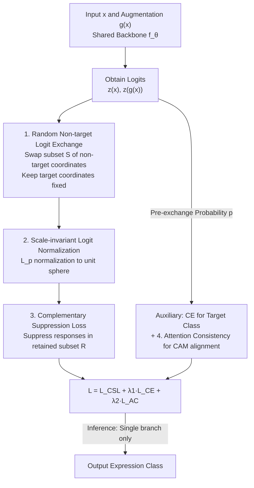

# CLEX: Complementary Label Exchange Learning for Noisy Facial Expression Recognition

**Conference**: CVPR 2026  
**Paper**: [CVF Open Access](https://openaccess.thecvf.com/content/CVPR2026/html/Wang_CLEX_Complementary_Label_Exchange_Learning_for_Noisy_Facial_Expression_Recognition_CVPR_2026_paper.html)  
**Code**: Not disclosed  
**Area**: Human Understanding / Facial Expression Recognition / Noisy Label Learning  
**Keywords**: Noisy facial expression recognition, complementary labels, non-target logit exchange, consistency regularization, robust learning  

## TL;DR
CLEX suppresses spurious activations by **randomly exchanging a subset of non-target logits** between a primary and an augmented branch, followed by scale-invariant normalization. It then employs a "complementary suppression loss" to specifically suppress responses of randomly retained non-target classes. Without requiring clean data or noise priors, CLEX achieves SOTA performance across various noise rates on three in-the-wild FER datasets: RAF-DB, AffectNet, and FERPlus.

## Background & Motivation
**Background**: In-the-wild Facial Expression Recognition (FER) is inherently noisy. Factors like blurred expressions and compound emotions lead to inter-observer inconsistency. Additionally, visual similarities between categories (e.g., "Anger vs. Disgust") make label noise prevalent. Existing noise-robust FER methods generally fall into three categories: sample selection (picking reliable samples via confidence/uncertainty, e.g., SCN, RUL, NLA), label refinement (reconstructing supervision targets via latent distributions, e.g., DMUE, LA-Net, ReSup), and consistency regularization (aligning predictions or attention of augmented views, e.g., EAC).

**Limitations of Prior Work**: Supervision signals in these categories almost exclusively **revolve around the target class**. Sample selection depends on accurate reliability assessment and noise priors, making it sensitive to thresholds; label refinement is burdened by early-stage label quality and heavy overhead; consistency regularization often only aligns target class outputs or enforces global consistency, **imposing little constraint on the non-target class distribution**.

**Key Challenge**: The true harm of label noise manifests as **spurious activations on non-target classes**. Occlusion, lighting, and geometric transforms cause the model to produce high responses on incorrect non-target categories, which are then reinforced during training. Existing supervision designs rarely model the complementary information carried by non-target labels explicitly, leading to a lack of constraints on these spurious activations. Even methods introducing complementary labels (e.g., NL) typically assign only a **single** random non-target class per sample, failing to model structural relationships between multiple non-target responses or cross-view interactions.

**Key Insight**: Rather than focusing on the target class, it is more effective to **directly exchange non-target logit information between two augmented views**. By coupling and cross-correcting the "error-prone" non-target coordinates and specifically suppressing retained non-target responses, spurious activations can be mitigated without disturbing the target class anchor. This is the first work to apply "complementary label exchange" for noise-robust FER.

## Method

### Overall Architecture
CLEX utilizes a **Siamese dual-branch + shared backbone** framework (reducing to a single branch during inference with zero extra overhead). Given an input $x$ and its augmented version $g(x)$, a shared feature extractor $f_\theta$ produces pre-softmax logits $z(x)\in\mathbb{R}^C$ and $z(g(x))\in\mathbb{R}^C$ ($C$ is the number of emotion categories). The core process involves: **exchanging logits at randomly selected non-target coordinates** between the two branches (target coordinates remain fixed) to obtain $z^E(x)$ and $z^E(g(x))$; applying $L_p$ normalization and softmax to get probabilities $\hat p(x)$ and $\hat p(g(x))$; and finally applying a complementary suppression loss on a **randomly retained non-target subset**. To stabilize training, two auxiliary terms are added: cross-view attention consistency regularization (aligning class activation maps) and standard cross-entropy on the **pre-exchange** probabilities to preserve target class semantics.

The data flow of the pipeline is as follows:

### Key Designs

**1. Random Non-target Logit Exchange (NTX): Mutual Correction on Error-prone Coordinates**

To address the lack of constraints on spurious non-target activations, CLEX performs exchanges at the logit level. Let $\bar Y=\{1,\dots,C\}\setminus\{y\}$ be the set of non-target classes. With an exchange rate $\gamma\in[0,1]$, a subset $S\subseteq\bar Y$ is sampled with size $|S|=\lfloor\gamma(C-1)\rfloor$. For the original image branch, the exchanged logit is defined as:

$$z^E_k(x)=\begin{cases}z_k(g(x)), & k\in S\\ z_k(x), & k\notin S\end{cases},\quad k\in\bar Y$$

The augmented branch symmetrically adopts values from the original image for coordinates in $S$; **target coordinates for both branches remain unchanged**: $z^E_y(x)=z_y(x)$, $z^E_y(g(x))=z_y(g(x))$. Essentially, this forces the two views to share responses at selected non-target coordinates, coupling "potentially erroneous" predictions and enforcing cross-view consistency. Random re-sampling of $S$ ensures coverage over the entire $\bar Y$ during training. Exchanged responses are clipped by a small constant $\epsilon$ before normalization to ensure stability. Intuition suggests that exchange directs correction gradients toward **cross-branch inconsistent** coordinates, mitigating error accumulation under noisy labels while maintaining the target anchor.

**2. Scale-invariant Logit Normalization (Norm): Acting on Direction, Not Magnitude**

Applying loss directly after exchange poses a risk: samples overfitting the noisy labels often have very large logit magnitudes, which can dominate the consistency loss. CLEX uses $L_p$ norms ($p\ge1$) to normalize exchanged logits to a unit sphere:

$$\tilde z(x)=\frac{z^E(x)}{\|z^E(x)\|_p},\qquad \|z^E(x)\|_p=\Big(\sum_{c=1}^{C}|z^E_c(x)|^p\Big)^{1/p}$$

Normalization eliminates common scale factors, ensuring the complementary penalty acts on the **direction** in logit space rather than being dominated by arbitrary magnitudes. Geometrically, it projects logits onto a unit $L_p$ sphere, preventing extreme magnitude samples from monopolizing the loss and focusing regularization on "directional divergence." Experimentally, $p=3$ is the most stable ($p=1$ is insensitive to directional differences and performs poorly).

**3. Complementary Suppression Loss (CSL): Suppressing Randomly Retained Non-target Classes**

Normalized logits pass through softmax to yield branch probabilities $\hat p_j(x)$ and $\hat p_j(g(x))$. Another randomization is applied: let $d\in\{0,\dots,C-2\}$ be the number of discarded non-target coordinates. A retained subset $R\subset\bar Y$ is sampled where $|R|=(C-1)-d$. The complementary suppression loss is defined as:

$$L_{CSL}=\sum_{j\in R}\log\hat p_j(x)+\sum_{j\in R}\log\hat p_j(g(x))$$

Since $\log\hat p_j(\cdot)\le0$, minimizing $L_{CSL}$ pushes the retained non-target probabilities down. Its advantage is that **it does not uniformly shrink the entire non-target space**—gradients apply stronger suppression to larger non-target responses. Consequently, the model prioritizes penalizing "prominent" spurious activations rather than flattening all non-target classes equally (which would harm discriminative power). Randomly discarding $d$ coordinates acts as a regularizer, with $d=1$ being optimal.

**4. Attention Consistency Regularization (AC) + Auxiliary CE: Stabilizing Training**

Two auxiliary terms stabilize the training process. Attention consistency follows the EAC approach: GAP is applied to late-layer convolution features of both branches, passed through a shared classifier to get class activation maps $M_{ij}(\cdot)$. An alignment operator $\Pi_g$ (e.g., inverse horizontal flip) maps the augmented view's attention back to the original coordinate system for L2 alignment:

$$L_{AC}=\frac{1}{NCH'W'}\sum_{i=1}^{N}\sum_{j=1}^{C}\big\|M_{ij}(x)-\Pi_g(M_{ij}(g(x)))\big\|_2^2$$

Simultaneously, standard cross-entropy $L_{CE}=-\log p_y(x)-\log p_y(g(x))$ is applied to the **pre-exchange** probabilities $p(x)$ and $p(g(x))$ to safeguard the discriminative semantics of the target class. The total objective is $L=L_{CSL}+\lambda_1 L_{CE}+\lambda_2 L_{AC}$, with $\lambda_1=0.4$ and $\lambda_2=2$ fixed across all datasets.

### Loss & Training
- Total Loss: $L=L_{CSL}+\lambda_1 L_{CE}+\lambda_2 L_{AC}$, with $\lambda_1=0.4, \lambda_2=2$.
- Key hyperparameters fixed across datasets: exchange rate $\gamma=0.5$, normalization order $p=3$, discard count $d=1$.
- Backbone: ResNet-18 pre-trained on MS-Celeb-1M, images cropped to $224\times224$, augmentations include random horizontal flip and random erasing.
- Optimizer: Adam, initial lr $1\times10^{-4}$, weight decay $1\times10^{-4}$, ExponentialLR (decay 0.9 per epoch), trained for 60 epochs, batch size 32.
- **Inference with zero extra cost**: Only a single forward pass on the original image $x$ is performed during testing, taking the softmax of $z(x)$ without logit exchange.

## Key Experimental Results

### Main Results: Comparison under Synthetic Uniform Noise
CLEX consistently leads across RAF-DB, AffectNet, and FERPlus at 10%, 20%, and 30% uniform flip noise. The table below shows results for 10% and 30% noise (testing accuracy %, reporting mean±std over 5 runs):

| Dataset | Noise Rate | Baseline | EAC | NLA (Prev. SOTA) | CLEX (Ours) |
| :--- | :--- | :--- | :--- | :--- | :--- |
| RAF-DB | 10% | 81.01 | 88.02 | 88.83 | **88.91±0.09** |
| AffectNet | 10% | 57.24 | 61.11 | 63.52 | **64.30±0.19** |
| FERPlus | 10% | 83.29 | 87.03 | 88.20 | **88.24±0.02** |
| RAF-DB | 30% | 75.50 | 84.42 | 86.71 | **87.11±0.08** |
| AffectNet | 30% | 52.16 | 58.91 | 62.48 | **63.87±0.31** |
| FERPlus | 30% | 79.77 | 85.44 | 86.97 | **87.12±0.09** |

At the most severe 30% noise level, CLEX achieves gains of **11.61% / 11.71% / 7.35%** over the Baseline and 0.40% / 1.21% / 0.15% over the previous SOTA, NLA. On the real-noise dataset **AffectNet Auto**, CLEX scores 58.76%, surpassing SCN/DMUE/MTAC/EAC/NLA by 3.33% / 1.78% / 1.38% / 1.08% / 1.82%, verifying effectiveness beyond synthetic noise.

### Ablation Study (RAF-DB, 30% Noise)
Verifying incremental contributions of each module:

| Config | Components | RAF-DB (30%) | Explanation |
| :--- | :--- | :--- | :--- |
| (a) | CE | 81.36 | Pure cross-entropy baseline |
| (b) | CE + AC | 84.94 | Adding attention consistency, +3.58% |
| (c) | CE + Norm + CSL | 84.73 | Norm + CSL (without AC), +3.37% over baseline |
| (d) | CE + AC + Norm + CSL | 85.47 | Adding normalization to (b), confirms harm of scale artifacts |
| (e) | Full Model (+NTX) | **87.35** | Adding random non-target exchange; achieves best results |

### Key Findings
- **Components are Complementary**: Moving from (d) 85.47% to (e) 87.35% shows NTX adds nearly +1.9%, proving that cross-view non-target logit exchange is the primary gain source.
- **Clear Hyperparameter Sweet Spots**: $|S|$ from 1→2/3 shows gains, then slight drops; $p=3$ for normalization is optimal; $d=1$ for discarding is best; $\lambda_1\in[0.2, 0.4]$ and $\lambda_2=2$ are ideal.
- **Visualization Evidence**: t-SNE shows tighter intra-class and clearer inter-class boundaries. Confidence distributions show CLEX separates clean/noisy samples most clearly, validating "spurious activation suppression."

## Highlights & Insights
- **Non-targets as First-class Citizens**: While most methods fixate on the target class, CLEX utilizes non-target logs for complementary supervision and cross-view exchange—a clean, transferable perspective.
- **Purposeful Triple Randomness**: Randomized exchange subset $S$ (enables full non-target space coverage), randomized retention subset $R$ with $d$ discards (suppression + regularization), and randomized augmentation. This creates consistency constraints while preventing overfitting.
- **Gradient Intuition for Non-uniform Suppression**: $L_{CSL}=\sum_{j\in R}\log\hat p_j$ applies stronger gradients to larger responses, automatically "hitting the tallest nail" rather than crushing the non-target distribution uniformly, preserving discriminability.
- **Zero Inference Overhead**: All mechanisms are training-time only. Deployment is straightforward and cost-free.

## Limitations & Future Work
- Primarily validated on **uniform (symmetric) synthetic noise** and AffectNet Auto. It does not extensively cover class-dependent asymmetric noise (e.g., "Anger vs. Disgust"), which is more realistic in FER.
- Triple randomness introduces several hyperparameters ($\gamma, p, d, \lambda_1, \lambda_2$). While fixed across datasets, they were tuned on 30% RAF-DB noise; their stability across vastly different noise distributions remains to be seen.
- NTX assumes the target label, though noisy, remains a useful anchor (guarded by CE). In extreme noise (>30%) where the anchor itself might be invalid, the method might struggle.
- Primarily designed for FER's small category sizes ($C=6\sim8$). Scaling to large-scale classification (e.g., ImageNet) requires re-evaluating the efficiency of random subsets.

## Related Work & Insights
- **vs. EAC (Attention Consistency)**: EAC aligns cross-view attention maps (spatial consistency). CLEX retains EAC as $L_{AC}$ but provides a significant +1.9% boost via NTX logit-level exchange.
- **vs. NLA / SCN / RUL (Sample Selection)**: These depend on reliability estimation and noise priors. CLEX is noise-prior-free and doesn't discard samples, utilizing logit coupling for implicit robust learning.
- **vs. NL (Complementary Label Learning)**: NL assigns a **single** random non-target class as supervision. CLEX couples **multiple** non-target coordinates and views, capturing richer structural relationships and view interactions.
- **vs. Label Refinement (DMUE / LA-Net / ReSup)**: These reconstruct soft targets and are heavy. CLEX acts directly in the output space without modifying labels or building transition matrices.

## Rating
- Novelty: ⭐⭐⭐⭐⭐ First to use cross-view non-target logit exchange for noise-robust FER; clean mechanism.
- Experimental Thoroughness: ⭐⭐⭐⭐ Three datasets + real noise + full ablation, but lacks deep study on asymmetric noise.
- Writing Quality: ⭐⭐⭐⭐⭐ Clear progression from motivation to mechanism; solid alignment between text and figures.
- Value: ⭐⭐⭐⭐ Plug-and-play with zero inference overhead; highly practical for real-world FER.

<!-- RELATED:START -->

## Related Papers

- [\[CVPR 2026\] Dynamic Label Noise Suppression with Optimal Teacher Pool for Facial Expression Recognition](dynamic_label_noise_suppression_with_optimal_teacher_pool_for_facial_expression_.md)
- [\[CVPR 2026\] A Two-Stage Dual-Modality Model for Facial Expression Recognition](a_two_stage_dual_modality_model_for_facial_expression_recognition.md)
- [\[CVPR 2026\] Region-Aware Instance Consistency Learning for Micro-Expression Recognition](region-aware_instance_consistency_learning_for_micro-expression_recognition.md)
- [\[CVPR 2026\] D³FER: Dual Channel and Dual Branch Network for Robust Facial Expression Recognition under Dual Challenges](d3fer_dual_channel_and_dual_branch_network_for_robust_facial_expression_recognit.md)
- [\[ECCV 2024\] Generalizable Facial Expression Recognition](../../ECCV2024/human_understanding/generalizable_facial_expression_recognition.md)

<!-- RELATED:END -->
