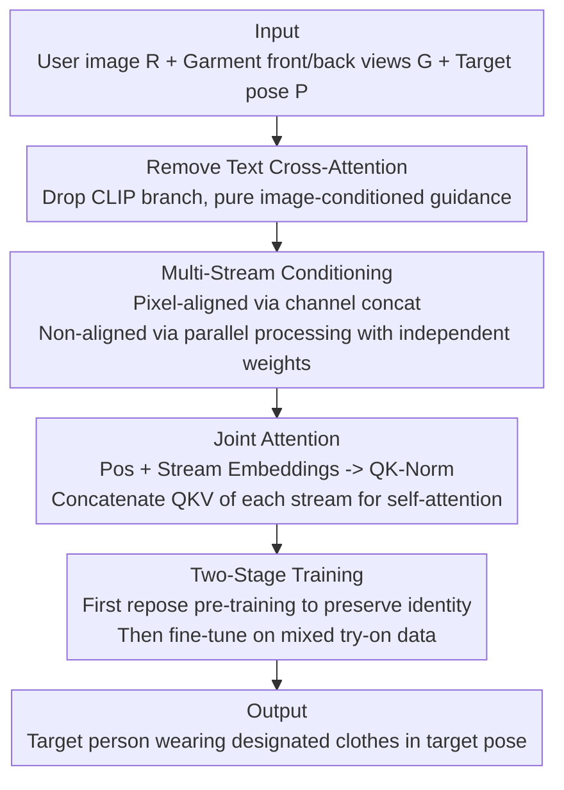

# Clothe and Pose

**Conference**: CVPR 2026  
**Paper**: [CVF Open Access](https://openaccess.thecvf.com/content/CVPR2026/html/Sharma_Clothe_and_Pose_CVPR_2026_paper.html)  
**Code**: To be confirmed  
**Area**: Human Understanding / Virtual Try-On / Image Generation  
**Keywords**: Virtual Try-On, Pose Transfer, Multi-Stream Attention, Latent Diffusion, Joint Modeling

## TL;DR
This paper integrates "virtual try-on" and "pose transfer" (originally decoupled into two sequential pipeline stages) into a single unified task (Clothe and Pose). Implementing an SDXL-based multi-stream diffusion model, the approach simultaneously processes the user image, front/back garment views, and target pose skeletons to generate the "designated person wearing designated clothes in a designated pose" in a single step. Furthermore, an evaluation protocol utilizing ground-truth triplets is introduced. The method comprehensively outperforms the "try-on + reposing" sequential baselines and the 20B Qwen-Image-Edit across four pose transformation configurations.

## Background & Motivation

**Background**: Digital fashion features two mature but independent technical trajectories. One is Virtual Try-On (VTON), which drapes a specified garment onto a reference person image. The other is Reposing/Pose Transfer, which repositions a reference person to a target skeleton. Both lines of research have evolved from the GAN era to employing large-scale pre-trained Latent Diffusion Models (LDMs/SDXL).

**Limitations of Prior Work**: The actual user demand is a combination of both: "I want to try on this new garment and turn around or change poses to see how it drapes, just like in a physical store." To achieve this, the intuitive solution is cascading two off-the-shelf modules: first performing try-on via models like CatVTON, followed by reposing using models like Leffa. The paper illustrates the fundamental flaw of this approach in Figure 2: **cascading error accumulation**. In Stage-1 (try-on), the model hallucinates lower garments absent in the reference image; during Stage-2 (reposing), the person's identity is compromised, leading to outputs that deviate severely from the ground truth. More fundamentally, the reposing module only processes a single image without garment-specific information, causing it to hallucinate occluded or unseen clothing regions, particularly when mapping a frontal image to a back view pose.

**Key Challenge**: The authors highlight a neglected fact: **garment try-on and posing are mutually dependent**—how a person poses and how the clothing drapes are intrinsically coupled. Decoupling and executing these tasks sequentially assumes independence, preventing error correction between the two stages and leading to unidirectional error propagation. Another overlooked issue lies in evaluation: existing VTON benchmarks utilize paired data like $(G_A, P_AG_A)$ (where $G_A$ is the garment and $P_AG_A$ is the person wearing $G_A$). Training and evaluation rely on masking out the $G_A$ region in $P_AG_A$ and reconstructing it. This configuration forces the model to learn an **input-dependency bias**—the outputs are heavily influenced by the user's original clothing (e.g., Figure 3a: Alice attempts to try on a new T-shirt, but the output is biased by her current garment). Moreover, the lack of ground truth prevents quantitative evaluation of practical scenarios like trying on completely different clothing.

**Goal**: Redefine the task as simultaneous "clothing and posing" (Clothe and Pose) and address two associated problems: (1) a unified model featuring joint modeling without sequential pipelines, and (2) an evaluation protocol equipped with ground truth that can quantify practical usage scenarios.

**Key Insight**: Instead of treating try-on and reposing as isolated modules, they should be jointly modeled. The network is simultaneously conditioned on three input streams: the reference user image, the garments (both front and back views), and the target pose, learning their interactions internally. To prevent hallucination of occluded garment parts, both the frontal and back views of the garments are explicitly provided to "maximize information input."

**Core Idea**: Utilize a **multi-stream latent diffusion architecture + joint attention** to parallelly process the user, garment, and pose conditions. The representations are then fused within self-attention, generating the try-on result in a single step and replacing the sequential "VTON $\rightarrow$ Repose" pipeline.

## Method

### Overall Architecture
Given a reference user image $R$, garment images for upper/lower clothing (including frontal views $U_f, B_f$ and back views $U_b, B_b$), and a target pose $P$, the model generates the target image $T$ of the same person wearing the target clothing in the target pose in a single step. The pose $P$ is first processed using ViTPose to extract keypoints and render a skeleton image. All frontal and back views of the upper and lower garments are spatially concatenated and denoted as $G$. The entire modeling process is conducted in the latent space of SDXL: each conditioning stream is encoded into latents using the SDXL autoencoder and then fed into a modified SDXL UNet.

The key lies in **how to feed multiple conditions into the UNet**. The paper first analyzes the drawbacks of two prevailing condition injection paradigms in the VTON community: (i) Spatially concatenating the garment latents with the noise latents along the width dimension (e.g., CatVTON) — which is computationally cheap but forces the network to perform two unrelated tasks simultaneously: generating the try-on output while also copying the condition image to the output, wasting significant network capacity on "copying" rather than "generation quality"; (ii) Running an independent branch to extract garment features and then performing cross-attention (e.g., IDM-VTON, Leffa) — where each branch performs self/cross-attention independently, leading to exponentially increased training and inference costs under multi-conditional settings. To strike a balance, the authors propose a **multi-stream architecture** inspired by text-to-image paradigms (such as SD3/FLUX): each condition is parallelly processed using its own set of learnable weights, followed by mutual interaction within a **joint self-attention** module.

### Key Designs

**1. Removing Text Cross-Attention: Forcing the Model to Attend Solely to Image Conditions**

SDXL natively features text cross-attention blocks spanning the entire network to interface with CLIP text embeddings, accounting for nearly 0.5B parameters alone. Existing VTON systems mostly retain this text branch, either injecting a generic template/empty prompt, utilizing LLMs to synthesize textual descriptions of clothes (which introduces additional computational or cost overheads at inference for unseen garments), or describing each image with a bag of pose+appearance tokens. The authors argue that the control signals for this task should inherently be visual conditions like **target pose images and target garment images**, making text redundant and cumbersome. Consequently, they completely excise the text cross-attention branch. This saves 0.5B parameters and prompt-synthesis overhead at inference and focuses condition guidance entirely on pixel-level garment/pose information, avoiding text-based dilution of visual control.

**2. Multi-Stream Conditioning: Differentiating Conditions by Pixel Alignment**

This is the core of the architecture. The authors categorize conditions into two classes: for conditions **pixel-aligned with the target output**—which only includes the pose skeleton $P$ in this task (as the skeleton coordinates map directly to the body position in the output)—they apply **channel-wise concatenation** to the noise latent; for conditions **not pixel-aligned with the output**—such as the garment images and reference user images (where the flat layout of the garment differs from its draped shape)—they process them **parallelly to the noise latent in each network block**, assign each an independent set of learnable weights. Consequently, each condition stream and noise latent has its own neural weights, preventing the mutual interference seen in pure spatial concatenation. This directly addresses the aforementioned pain points: spatial concatenation forces the network to 'copy while generating', and independent branches are too expensive. Branching based on alignment provides non-aligned conditions with sufficient independent expressive power while employing cheap channel concatenation only for truly aligned pose inputs.

**3. Joint Attention: Unleashing Mutual Interaction via Joint Self-Attention**

After processing the streams in parallel, the key is how to fuse them. The authors augment each representation with **positional embeddings** (encoding spatial information) and a learnable **"stream embedding" vector** (encoding the source condition stream)—early experiments indicated these embeddings facilitate faster learning. Post embedding addition, each stream projects to QKV matrices and receives **QK-normalization** following [10,14] to stabilize training. After normalization, the $Q$, $K$, and $V$ matrices from each stream are **concatenated along the sequence length dimension**, and a single self-attention operation is performed on the combined large matrices. This step enables representations from each stream to interact freely with others (and the noise latent), enabling the model to implicitly learn the "garment draping and pose mutual dependency" internally rather than through sequential constraints. The representations are then split post-attention and proceed independently to the next network block. This mechanism translates "clothe and pose mutual dependency" into the architectural layer: rather than two separate stages, they negotiate simultaneously within the attention layers of every block.

**4. Two-Stage Training + Conditional Dropout: Leveraging Complementary Data Sources to Address Paired Data Scarcity**

The ideal training sample is a triplet $(R, G, T)$ comprising the reference image, the garment condition, and the target image showing the same person with the updated clothes and pose. However, such paired data is highly scarce. The authors construct a two-stage strategy leveraging the complementary strengths of different data sources. **Stage-1 Identity-Preserving Pre-training**: The model is trained on large-scale pose transfer datasets (same identity, different poses, static garments) while providing only **partial** garment information (constrained by dataset availability, providing either upper or lower garments), which forces the model to maintain identity across poses; simultaneously, **garment patches in the reference image are randomly dropped out**, compelling the model to rely on explicit garment conditions $G$ rather than copying appearance from the reference image. **Stage-2 Multi-Pose Try-On Finetuning**: Finetuning is performed on a mixture of "multi-pose try-on data + pose transfer data", sampling try-on instances with a probability of 0.6. Here, **complete** upper/lower garment conditions are provided to master holistic clothing transfer. This mixed formulation achieves multiple objectives: try-on instances teach full clothing replacement, pose transfer samples prevent catastrophic forgetting of identity-preservation capabilities, and condition diversity (partial/complete garments) boosts robustness and allows the model to perform pure reposing out-of-the-box. During training, individual conditioning images are replaced with gray-pixel null conditions with a probability of 0.15 to support classifier-free guidance during inference. This dropout, coupled with Stage-1 training, allows the model to function even when **particular garment inputs are missing**.

## Key Experimental Results

The evaluation dataset contains ethnically diverse users, featuring 360 unique garments, each captured across multiple poses. The evaluation encompasses four target pose configurations: Front$\rightarrow$Front, Front$\rightarrow$Left, Front$\rightarrow$Right, Front$\rightarrow$Back, with 600 pairs per configuration, totaling 2400 pairs for the Clothe and Pose task. The evaluation metrics used are LPIPS (lower is better), PSNR, and SSIM (higher is better), facilitated by the availability of ground truth.

### Main Results

The table below compares the Front$\rightarrow$Back and Front$\rightarrow$Front configurations (excerpted from Table 1 of the original paper). Sequential baselines are composed of "try-on model + reposing model"; Qwen-Image-Edit is the only baseline natively supporting this task (trained on internet-scale data, 20B parameters vs Ours 5B).

| Method | F→B LPIPS↓ | F→B PSNR↑ | F→B SSIM↑ | F→F LPIPS↓ | F→F PSNR↑ | F→F SSIM↑ |
|------|------|------|------|------|------|------|
| CatVTON+Leffa | 0.277 | 16.995 | 80.118 | 0.272 | 16.903 | 80.607 |
| Leffa+Kontext | 0.317 | 16.092 | 79.075 | 0.290 | 16.575 | 80.012 |
| Qwen-Image-Edit (20B) | 0.340 | 15.247 | 74.631 | 0.187 | 17.523 | 83.771 |
| **Ours (5B)** | **0.166** | **18.599** | **84.380** | **0.155** | **18.785** | **85.296** |

The proposed method achieves all-around state-of-the-art across all four configurations. Gains are particularly pronounced in lateral (Front$\rightarrow$Left/Right) and extreme poses (Front$\rightarrow$Back), owing to the model's ability to utilize both frontal and back views of the garments. Notably, Qwen-Image-Edit performs reasonably well in front-to-front (F$\rightarrow$F) scenarios (LPIPS 0.187) but degrades heavily to 0.340 under Front$\rightarrow$Back scenarios, whereas the proposed method remains robust at 0.166, validating the utility of explicit back-view garment information for extreme poses. Sequential baselines universally perform poorly, directly exposing the error accumulation inherent in sequential processing.

### Reposing Experiments & Ablation Study

The evaluation dataset also serves as benchmarking material for pure target reposing. The table below (excerpted from original Table 2) compares the full model against an ablated variant "without garments" (using the same checkpoint) to verify the impact of garment conditioning on pose transfer.

| Method | F→B LPIPS↓ | F→B PSNR↑ | F→B SSIM↑ | F→R LPIPS↓ | F→R PSNR↑ | F→R SSIM↑ |
|------|------|------|------|------|------|------|
| CFLD | 0.258 | 15.472 | 81.304 | 0.236 | 15.694 | 83.044 |
| Leffa | 0.251 | 17.769 | 80.679 | 0.239 | 17.960 | 82.346 |
| Qwen-Image | 0.279 | 17.856 | 77.656 | 0.119 | 21.450 | 87.597 |
| Ours (w/o garment) | 0.138 | 19.972 | 85.054 | 0.112 | 21.348 | 87.324 |
| **Ours (full)** | **0.125** | **20.801** | **86.159** | **0.110** | **22.198** | **87.849** |

### Key Findings
- **Garment Conditions Significantly Benefit Reposing**: The full model achieves an LPIPS of 0.125 on Front$\rightarrow$Back, which degrades to 0.138 when the garment condition is removed; consistent drops are observed across other configurations. This directly validates the core hypothesis: clothing and posing are mutually dependent, and providing back-view garment information leads to more faithful back-pose generation.
- **Error Accumulation is the Achilles' Heel of Sequential Methods**: Sequential baselines lag behind significantly in Table 1. Visualizations (Figure 5) indicate they fail to preserve identity and garment details, which is a direct consequence of VTON stage errors being amplified during the subsequent reposing stage.
- **DeepFashion Benchmark Tends to Overestimate Reposing Performance**: While models like Leffa and CFLD perform exceptionally on DeepFashion, the training and testing identity overlaps in this dataset lead to overfitting on identity. When evaluated on the proposed realistic benchmark, they fail to preserve identity, indicating that the DeepFashion benchmark is unsuitable for measuring real-world progress.
- **Garment Region Fidelity**: The authors additionally utilize the SCHP parser to segment the garment region and evaluate LPIPS separately (Figures 9/10). The proposed method achieves higher fidelity in the garment regions across both tasks relative to the baselines.
- **Smaller Models Outperform Larger Ones**: The 5B proposed model outperforms the 20B Qwen-Image-Edit across most configurations, demonstrating that task-specific conditioning designs are more effective than simply scaling up parameters.

## Highlights & Insights
- **The observation of the mutual dependency between "clothing" and "posing" is highly valuable**: It establishes a conceptual link between two previously disconnected tasks and provides solid empirical evidence of the failures of sequential pipelines through the error accumulation analysis in Figure 2, serving as the cornerstone of the entire paper.
- **A clever condition injection strategy based on "pixel alignment"**: Pose skeletons, being naturally pixel-aligned, are processed via the computationally cheap channel concatenation, while non-aligned garment/user images are handled via independent weights in parallel. This distinct treatment avoids the extremes of either merging all conditions blindly or using extremely expensive independent branches for every condition stream, providing a design principle that can be transferred to other multi-conditional generation tasks.
- **Explicitly providing both front and back views of garments serves as a straightforward yet effective anti-hallucination mechanism**: Instead of forcing the model to guess the hidden back views, feeding the back-view images directly ensures outstanding performance on extreme poses.
- **Stream embedding + joint attention**: By adapting the multi-stream concepts of text-to-image models to VTON, assigning an identity tag to each condition stream, and executing joint attention, the model is able to learn "conditional interaction" as an internal behavior rather than a hardcoded sequential pipeline.

## Limitations & Future Work
- **Dependency on Controlled Evaluation Data**: The evaluation users are captured in controlled settings (minimal accessories, tied-up hair, clean backgrounds). While this allows precise focus on human/garment detail retention, a gap remains compared to open-world scenarios.
- **Limited Background Preservation**: The paper acknowledges that background preservation relies on retaining background information in the latents at the beginning of generation, but the robustness in complex scenes remains questionable due to the limited volume of such training data (as shown in Figure 11 editing applications). ⚠️ Refer to the original text for precise details.
- **Paired Data Scarcity is a Fundamental Constraint**: Ideal $(R, G, T)$ triplets are difficult to procure. While the method bypasses this via a two-stage training and data-mixture strategy, this is inherently a data-level compromise; scalable training schemes still warrant exploration.
- **Positioned as an Early-Stage Work**: The authors position this work as an early-stage contribution to unified garment-pose synthesis, leaving additional limitations in Appendix E and opening avenues for more optimal and efficient training pipelines.

## Related Work & Insights
- **vs. Sequential Pipelines (CatVTON+Leffa / IDM-VTON+Leffa, etc.)**: These approaches chain a try-on model and a reposing model sequentially, whereas the proposed method employs a unified multi-stream model. The difference lies in the joint attention mechanism allowing both sub-tasks to mutually correct each other at every network layer, whereas sequential pipelines let errors propagate unidirectionally and force the reposing module to guess occluded regions without garment-specific inputs.
- **vs. Qwen-Image-Edit**: Qwen-Image-Edit leverages 20B parameters and internet-scale data to natively support this task, while the proposed 5B model outperforms it under most configurations. This is because the proposed method customizes conditioning designs for "front/back garment views + pose alignment" rather than relying solely on brute-force parameter scaling, showcasing a clear advantage in extreme back-view poses.
- **vs. Reposing Methods Trained on DeepFashion (Leffa, CFLD, etc.)**: These models overfit to identity due to the identity overlap between the training and testing sets in DeepFashion, failing to preserve identity in practical evaluations. The proposed method incorporates joint garment conditioning, leading to more faithful reposing, and simultaneously highlights evaluation flaws of the existing benchmark.
- **vs. SMPL-Based Multi-Pose Try-On (e.g., Liu et al.)**: SMPL-based methods struggle with arbitrary poses and primarily excel in front poses, whereas the proposed method supports arbitrary pose synthesis.

## Rating
- Novelty: ⭐⭐⭐⭐ Integrating try-on and reposing into a unified task, proposing a unified multi-stream model, and providing a matching evaluation protocol. The motivation is clear and supported by rigorous empirical proof.
- Experimental Thoroughness: ⭐⭐⭐⭐ Evaluation across four pose configurations, 2400 pairs, multi-task comparisons (try-on/reposing/editing), and dedicated garment-region fidelity analysis. The reliance on controlled datasets is a minor drawback.
- Writing Quality: ⭐⭐⭐⭐ Very clear motivation (Figures 2/3 directly address the pain points), with well-articulated methodology and evaluation designs.
- Value: ⭐⭐⭐⭐ Provides a more practical unified framework and a more reasonable evaluation benchmark for digital fashion, holding foundational value for future work.

<!-- RELATED:START -->

## Related Papers

- [\[CVPR 2026\] Differentially Private 2D Human Pose Estimation](differentially_private_2d_human_pose_estimation.md)
- [\[CVPR 2026\] FMPose3D: monocular 3D pose estimation via flow matching](fmpose3d_monocular_3d_pose_estimation_via_flow_matching.md)
- [\[CVPR 2026\] Composite-Attribute Person Re-Identification via Pose-Guided Disentanglement](composite-attribute_person_re-identification_via_pose-guided_disentanglement.md)
- [\[CVPR 2026\] HamiPose: Hamiltonian Optimization for Unsupervised Domain Adaptive Pose Estimation](hamipose_hamiltonian_optimization_for_unsupervised_domain_adaptive_pose_estimati.md)
- [\[ICLR 2026\] Pose Prior Learner: Unsupervised Categorical Prior Learning for Pose Estimation](../../ICLR2026/human_understanding/pose_prior_learner_unsupervised_categorical_prior_learning_for_pose_estimation.md)

<!-- RELATED:END -->
