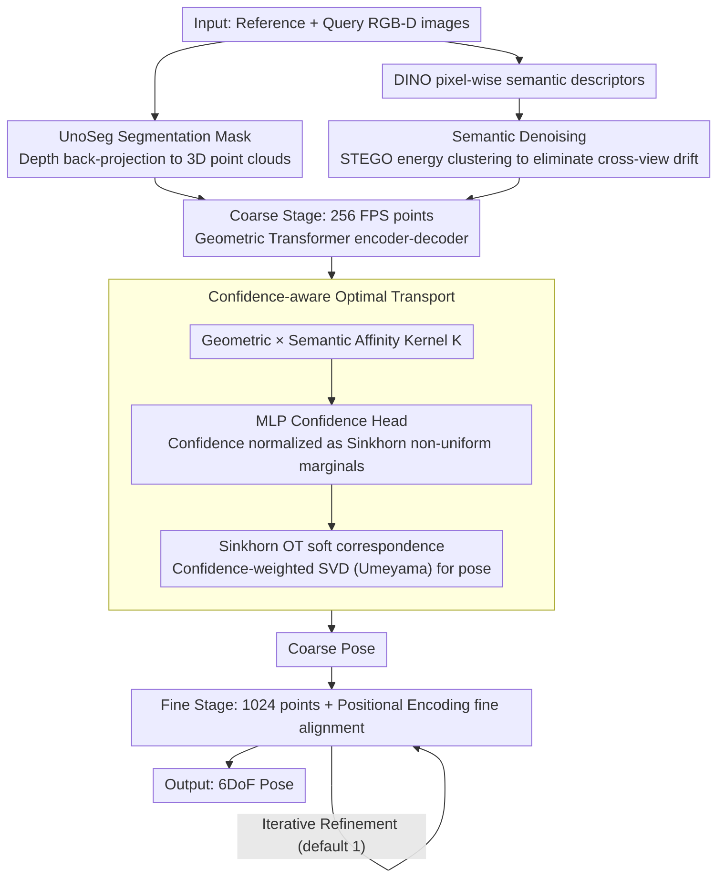

# COG: Confidence-aware Optimal Geometric Correspondence for Unsupervised Single-reference Novel Object Pose Estimation

**Conference**: CVPR2026  
**arXiv**: [2603.00493](https://arxiv.org/abs/2603.00493)  
**Code**: [YC-Che/COG](https://github.com/YC-Che/COG)  
**Area**: Human understanding / 6DoF object pose estimation  
**Keywords**: Novel object pose estimation, Optimal Transport, Confidence learning, Unsupervised learning, Point cloud registration, Visual Foundation Models

## TL;DR

The COG framework is proposed to model cross-view correspondences as a confidence-aware Optimal Transport (OT) problem. By predicting point-wise confidence as transport marginal constraints, it suppresses non-overlapping regions and outliers, achieving single-reference 6DoF pose estimation for novel objects under unsupervised conditions that is comparable to supervised methods.

## Background & Motivation

**Task Definition**: Estimating the 6DoF pose (rotation + translation) of arbitrary novel objects from a single reference RGB-D image is a fundamental task for robotics, AR, and 3D scene understanding.

**Limitations of Prior Work**: Traditional methods rely on CAD models or multi-view reference images, leading to poor scalability in real-world deployment. Under the single-reference setting, large viewpoint changes and partial observations make the problem highly ill-posed.

**Defects of Discrete Matching**: Existing methods (e.g., UnoPose) construct discrete one-to-one matches via argmax, which easily collapse to a few dominant keypoints, leaving a large number of points underutilized.

**Non-differentiability**: Discrete matching breaks the gradient flow, preventing the model from being trained in an unsupervised manner.

**OT Post-processing Issues**: Existing OT methods (RPM-Net, Robust OT) use uniform marginals, treating confidence only as a post-hoc calibration rather than jointly optimizing it with correspondences in an end-to-end fashion.

**Key Challenge**: Pure geometric matching suffers from semantic ambiguity and requires semantic priors to distinguish different parts of an object.

## Method

### Overall Architecture

COG treats single-reference novel object 6DoF pose estimation as a coarse-to-fine two-stage process. In the pre-processing stage, UnoSeg is used to segment object masks, depth maps are back-projected into 3D point clouds, and DINO extracts pixel-wise RGB semantic descriptors. A STEGO self-labeling strategy is employed to denoise semantic features and eliminate cross-view drift. In the coarse stage, 256 sparse points are sampled via Farthest Point Sampling (FPS), and point-wise confidence and features are predicted through a Geometric Transformer encoder-decoder. Soft correspondences are computed via Sinkhorn Optimal Transport, followed by weighted SVD for coarse pose estimation. In the fine stage, the query point cloud is aligned using the coarse pose, and 1024 points with positional encoding are used for fine-grained alignment to output the final pose. During inference, the estimated pose can be refined through iteration (default is 1 iteration).

### Key Designs

**1. Confidence-aware Optimal Transport: Treating Confidence as Transport Marginals**

Previous single-reference pose estimation relied on argmax for discrete matching, which collapses to dominant points and is non-differentiable. COG integrates confidence directly into the marginal constraints of OT. First, an affinity kernel combining geometry and semantics is constructed: $\mathbf{K}_{[i,j]} = \exp(\frac{1}{\tau}\langle \mathbf{G}_{p[i]}, \mathbf{G}_{q[j]}\rangle_{\cos}) \cdot (1 + \langle \mathbf{S}_{p[i]}, \mathbf{S}_{q[j]}\rangle_{\cos})^{\lambda/\tau}$. Then, an MLP confidence head outputs $\mathbf{c}_p, \mathbf{c}_q \in [0,1]^n$, normalized as $\mathbf{w}_p = \mathbf{c}_p / \overline{\mathbf{c}_p}$ for Sinkhorn target marginals. Row normalization of the transport plan $\Pi$ yields soft correspondence matrices $\mathbf{M}_{pq}$ and $\mathbf{M}_{qp}$. Finally, bidirectional correspondences are concatenated with original points for confidence-weighted SVD (Umeyama) to solve for the rigid transformation. This automatically suppresses non-overlapping regions and outliers with low confidence while enabling end-to-end learning of both correspondences and confidence.

**2. Semantic Denoising: Resolving Geometric Ambiguity**

Pure geometric matching is often ambiguous across different object parts. COG utilizes the self-labeling refinement strategy from STEGO to denoise DINO features via energy clustering. This eliminates cross-view feature drift, allowing correspondences to focus on semantically consistent regions. In ablation studies, injecting semantic priors improved mAP from 73.2 to 75.9 and reduced correspondence entropy (ENT) from 23.0 to 10.5, resulting in more compact correspondences.

### Loss & Training

| Loss | Function | Formula Core |
|------|----------|--------------|
| $\mathcal{L}_{\text{pose}}$ | Confidence-weighted Chamfer distance to optimize alignment | Gaussian RBF kernel measuring geometric distance between transformed and target points |
| $\mathcal{L}_{\text{cycl}}$ | Cycle-consistency constraint to reinforce overlap correspondences | Points should reconstruct their original position after bidirectional projection |
| $\mathcal{L}_{\text{sem}}$ | Semantic consistency constraint to prevent mismatched semantics | Penalizes correspondences assigned to semantically dissimilar points |
| $\mathcal{L}_{\text{conf}}$ | Pseudo-label supervision for confidence learning | BCE loss; pseudo-labels = product of geometric, pose, and semantic RBF kernels (stop-gradient) |

Total Loss: $\mathcal{L} = \gamma_{\text{pose}}\mathcal{L}_{\text{pose}} + \gamma_{\text{cycl}}\mathcal{L}_{\text{cycl}} + \gamma_{\text{sem}}\mathcal{L}_{\text{sem}} + \gamma_{\text{conf}}\mathcal{L}_{\text{conf}}$. The Key Insight for the unsupervised version is generating continuous (non-binary) pseudo-labels using geometric reconstruction, pose alignment, and semantic consistency kernels to supervise the confidence branch via BCE. The supervised variant replaces the Chamfer distance in $\mathcal{L}_{\text{pose}}$ with point-to-point distance to GT transformed points.

## Main Results

### Main Results: Novel Object Pose Estimation from Single Reference (BOP Benchmark)

| Method | Supervision | LM-O | TUD-L | YCB-V | Mean |
|------|------|------|-------|-------|------|
| FreeZe | None | 45.5 | 68.3 | 65.5 | 59.8 |
| Robust OT | None | 45.5 | 66.3 | 66.0 | 59.3 |
| Dustbin OT | None | 50.2 | 67.6 | 65.4 | 61.1 |
| **COG (Ours)** | **None** | **56.7** | **73.8** | **75.9** | **68.8** |
| UnoPose | GT Pose | 58.7 | 71.0 | 83.1 | 70.9 |
| **COG (Ours)** | **GT Pose** | **60.8** | **80.0** | **80.5** | **73.8** |

### Overlap Region Prediction (TUD-L IoU)

| Method | Dragon | Frog | Watering Can | Mean |
|------|--------|------|--------------|------|
| UnoPose (Supervised) | 70.0 | 72.2 | 59.1 | 67.1 |
| COG (Unsupervised) | 71.2 | 64.4 | 81.2 | 72.3 |
| COG (Supervised) | 72.9 | 68.3 | 83.9 | 75.0 |

### Ablation Study

**Ablation of Correspondence Mechanism** (YCB-V):

- Argmax + All Losses → Mean 73.1; Softmax → 73.0; Uniform OT → 75.2; **Confidence OT → 75.9**
- OT methods outperform discrete matching by ~2-3%, with confidence marginals providing further gains.

**Ablation of OT Parameters**:

- Semantic prior injection improved mAP from 73.2 to 75.9 and decreased ENT from 23.0 to 10.5, creating more compact correspondences.
- Exceeding 2 Sinkhorn iterations slightly degraded performance (correspondences became too diffuse); 2 iterations were adopted.

### Key Findings

1. Unsupervised COG is only 2.1% behind the SOTA supervised method UnoPose and actually outperforms it by 2.8% on TUD-L.
2. Using confidence as an OT marginal consistently improves performance over uniform marginals, validating the effectiveness of non-uniform marginals.
3. Denoised DINO features significantly reduce ENT, focusing correspondences on semantically consistent areas.
4. One iterative refinement step improves performance by >1%, with diminishing returns thereafter, balancing accuracy and speed (~4s/sample).

## Highlights & Insights

- **Elegant Mathematical Modeling**: Embedding confidence directly into OT marginal constraints, rather than using it as post-processing, allows for end-to-end joint optimization.
- **Impressive Unsupervised Performance**: Relying only on geometric, semantic, and cycle-consistency pseudo-labels yields results comparable to supervised methods, demonstrating strong generalization.
- **Interpretable Confidence**: Visualizations show the model accurately identifies non-overlapping regions and outliers, assigning them low confidence.
- **Comprehensive Design**: The coarse-to-fine architecture, semantic denoising, cycle-consistency, and pseudo-label confidence learning modules are highly complementary.

## Limitations & Future Work

- In high-occlusion/cluttered scenes (LM-O, YCB-V), a gap remains between unsupervised and supervised versions (4.1% on LM-O), suggesting room for improvement in complex environments.
- Dependency on the UnoSeg model for initial masks; segmentation failure leads directly to pose estimation failure.
- Inference speed is approximately 4s/sample (including segmentation and DINO extraction), limiting real-time application.
- There is an inherent contradiction between marginal accuracy and correspondence sharpness in Sinkhorn iterations, requiring manual balancing.
- Only rigid object pose estimation was evaluated; not yet extended to articulated or deformable objects.

## Related Work & Insights

- **Novel Object Pose Estimation**: UnoPose (SE(3)-invariant framework + discrete matching), SAM-6D (DINO + SAM segmentation), MegaPose (CAD retrieval + refinement).
- **OT for Point Cloud Registration**: RPM-Net (Uniform marginal Sinkhorn), Robust OT, Dustbin OT (Dustbin rows/columns).
- **Visual Foundation Models**: DINOv2 for semantic features, STEGO for semantic denoising strategies.
- **Unsupervised Pose**: Equi-Pose (SE(3)-equivariant backbone), OP-Align (articulated objects), Zero-shot Pose (semantic feature alignment).

## Rating

- Novelty: ⭐⭐⭐⭐ (Confidence embedding in OT marginals is a novel and natural approach)
- Experimental Thoroughness: ⭐⭐⭐⭐ (3 BOP benchmarks + detailed ablations + visualizations)
- Writing Quality: ⭐⭐⭐⭐ (Clear mathematical derivations, strong architectural diagrams)
- Value: ⭐⭐⭐⭐ (Unsupervised performance matching supervised is a highly practical direction)

<!-- RELATED:START -->

## Related Papers

- [\[ICCV 2025\] MixRI: Mixing Features of Reference Images for Novel Object Pose Estimation](../../ICCV2025/human_understanding/mixri_mixing_features_of_reference_images_for_novel_object_pose_estimation.md)
- [\[CVPR 2025\] Co-op: Correspondence-based Novel Object Pose Estimation](../../CVPR2025/human_understanding/co-op_correspondence-based_novel_object_pose_estimation.md)
- [\[ECCV 2024\] GS-Pose: Category-Level Object Pose Estimation via Geometric and Semantic Correspondence](../../ECCV2024/human_understanding/gs-pose_category-level_object_pose_estimation_via_geometric_and_semantic_corresp.md)
- [\[CVPR 2026\] HamiPose: Hamiltonian Optimization for Unsupervised Domain Adaptive Pose Estimation](hamipose_hamiltonian_optimization_for_unsupervised_domain_adaptive_pose_estimati.md)
- [\[AAAI 2026\] CoordAR: One-Reference 6D Pose Estimation of Novel Objects via Autoregressive Coordinate Map Generation](../../AAAI2026/human_understanding/coordar_one-reference_6d_pose_estimation_of_novel_objects_via_autoregressive_coo.md)

<!-- RELATED:END -->
