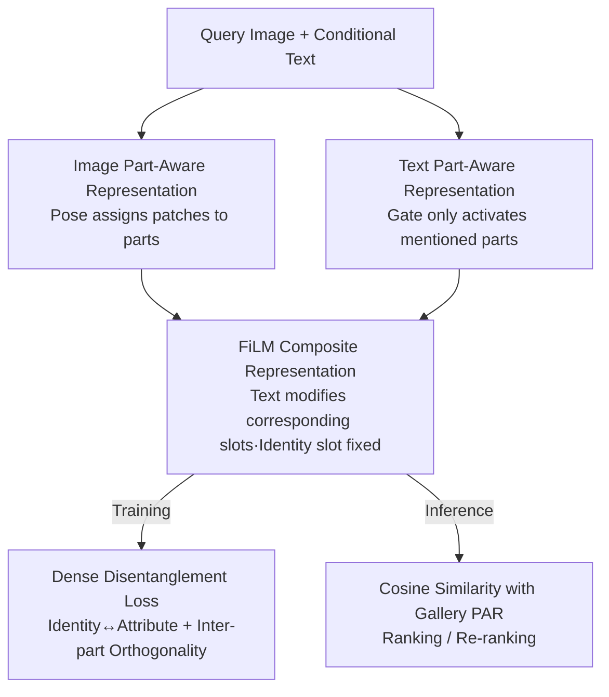

# Composite-Attribute Person Re-Identification via Pose-Guided Disentanglement

**Conference**: CVPR 2026  
**Paper**: [CVF Open Access](https://openaccess.thecvf.com/content/CVPR2026/html/Patwari_Composite-Attribute_Person_Re-Identification_via_Pose-Guided_Disentanglement_CVPR_2026_paper.html)  
**Code**: None  
**Area**: Human Understanding / Person Re-Identification  
**Keywords**: Person Re-ID, Composite Attribute Retrieval, Pose-Guided Disentanglement, Part-Aware Representation, Multi-Modal Retrieval

## TL;DR
Aiming at the natural but ambiguous query of "reference image + short keyword attributes," this paper proposes the CA-ReID task. It utilizes pose-guided "Part-Aware Representation (PAR)" to bind textual attributes to corresponding body regions and employs "Dense Disentanglement Loss (DDL)" to separate identity and attribute dimensions. This approach improves Recall@1 for Hard queries by up to +17% on the self-built composite attribute benchmark.

## Background & Motivation
**Background**: Cloth-Changing Person Re-Identification (CC-ReID) and Multi-modal Re-ID are evolving from "image-to-image" to "image + text" joint retrieval. With Vision-Language Models (VLM), users can achieve fine-grained control by using detailed descriptions (e.g., "red jacket, purple pants, black shoes"). CVPR'24's Instruct-ReID defined the LI-ReID task as "reference image + full-sentence description."

**Limitations of Prior Work**: The authors found that when users replace full-sentence descriptions with **short keywords** (e.g., "green pants"), the Recall@1 of SOTA methods (Instruct-ReID) on COCAS+Real2 is **halved**. However, short keywords provide a more natural, low-effort, and iteratively refined interaction mode where users prefer to provide a single word and gradually add conditions.

**Key Challenge**: The performance drop with short keywords stems from three specific reasons: ① **Ambiguity**: Over 30% of people in Celeb-ReID-Light match "trousers," requiring the model to rely on visual identity for disambiguation; ② **Training Bias**: Existing VLM-ReID models are mostly trained on full-sentence captions, leading to poor understanding of short, vague phrases; ③ **Rare Attributes**: Words like "straw hat" are underrepresented in training data, leading to weak generalization. A deeper contradiction is that identity and short attribute constraints must be **simultaneously satisfied**, while current feature spaces entangle identity and attributes, where one attribute word might activate multiple irrelevant dimensions.

**Goal**: ① Establish a task and dataset that evaluates the joint satisfaction of "identity + short/composite attributes"; ② Design a representation where short attribute words only affect the relevant body regions without polluting identity features.

**Key Insight**: The human body is naturally partitioned—a "hat" should only be associated with the head, and a "jacket" with the upper body. By splitting image features into slots according to body parts and allowing textual attributes to update only the corresponding slots, the ambiguity of short queries can be significantly reduced. Pose estimation provides a strong spatial prior for this "patch-to-part" mapping.

**Core Idea**: Use **pose-guided Part-Aware Representation** to align "image patches / textual attributes / identity" into part-based slots. Then, use **Dense Disentanglement Loss** to enforce orthogonality between identity/attribute dimensions and among different body parts. This addresses the entanglement issue of "one word polluting the whole body" from both the representation structure and loss constraints.

## Method

### Overall Architecture
The input for CA-ReID is a "query image $x_q$ + conditional text $t$ + gallery $\{x_g^i\}$," with the goal of retrieving gallery images that match **both the identity and the attributes**. The core data structure is the **Part-Aware Representation (PAR)**, which divides both image and text into 6 slots: `{id, head, top, bottom, feet, other}`, ensuring textual attributes only modify corresponding slots.

The workflow is as follows: on the image side, a ViT encodes global and patch tokens, then a pose estimator groups and pools patches into **Image PARs** based on body parts. On the text side, a frozen CLIP text encoder projects the conditional text into **Text PARs**, using a gate to activate only the mentioned parts. Both PAR streams are fused via FiLM to form **Composite PARs** (leaving the identity slot unchanged). During training, joint optimization is performed using Identity Loss $L_{ID}$ + Dense Disentanglement Loss ($L_{DDL1}$ for identity/attribute alignment and $L_{DDL2}$ for part orthogonality). During inference, gallery images are pre-encoded as Image PARs and ranked by cosine similarity with the Composite Query PAR.

### Key Designs

**1. Image Part-Aware Representation: Anchoring Patches to Body Parts via Pose**

This step addresses the issue of "short attribute words polluting global features." Instead of encoding head/top/bottom/feet into a single global vector, the image is physically divided into part slots. Specifically, the ViT encoder $E_I$ outputs a global token $c\in\mathbb{R}^d$ and patch tokens $\{p_i\}_{i=1}^N$. An off-the-shelf pose estimator (HRNet-W32) detects keypoints and maps each part $k$ to a set of patch indices $\mathcal{I}_k$ (this patch-to-part assignment is cached during training to avoid redundant computation). Each part feature is generated by mean-pooling the corresponding patches and passing them through a lightweight projection:

$$\mathbf{f}_k^I = \text{MLP}_k\!\left(\frac{1}{|\mathcal{I}_k|}\sum_{i\in\mathcal{I}_k}\mathbf{p}_i\right)\in\mathbb{R}^d.$$

The identity slot is handled specially by concatenating the global token with the head feature before projection: $\mathbf{f}_{id}^I = \text{MLP}_{id}([c;\,\mathbf{f}_{head}^I])$. This ensures identity features capture both global appearance and **cloth-invariant** regions like the face/head. The final Image PAR is $\mathbf{F}^I=\{\mathbf{f}_{id}^I,\mathbf{f}_{head}^I,\mathbf{f}_{top}^I,\mathbf{f}_{bottom}^I,\mathbf{f}_{feet}^I,\mathbf{f}_{other}^I\}$. Unlike previous works that add pose modules for alignment, pose here serves as a **modular spatial prior** to group patches.

**2. Text Part-Aware Representation: Projection to Part Slots + Gate Suppression**

This step targets the ambiguity where "short words activate irrelevant dimensions." Conditional text $c_t$ is passed through a frozen CLIP text encoder $E_T$ to obtain a global text embedding $\mathbf{f}^T$, which is then split into part-specific text slots via learnable projection matrices: $\mathbf{f}_k^T = W_k^T\mathbf{f}^T$. A key component is the **Parsing Gate**, which analyzes $c_t$ to identify mentioned attributes and zeros out slots for **unmentioned** parts: $\mathbf{f}_k^T=0$. For example, "red jacket" only activates $\mathbf{f}_{top}^T$, while other slots remain zero, preventing cross-part interference. During training, a frozen VLM automatically extracts part-level attributes from target images to supervise these projections.

**3. FiLM Composite Representation: Focused Textual Editing with Fixed Identity**

To "superimpose" textual attributes onto visual representations without disturbing identity, a FiLM-style modulation network $\phi_{FiLM}$ (lightweight MLPs per slot) is used. For each part $k$, a modulation vector $\boldsymbol{\beta}_k$ is predicted from the concatenated image and text slots, then added back to the image slot and normalized:

$$\hat{\mathbf{f}}_k=\mathcal{N}\!\left(\mathbf{f}_k^I+\boldsymbol{\beta}_k\right),\qquad \boldsymbol{\beta}_k=\phi_{FiLM}\!\left([\mathbf{f}_k^I;\mathbf{f}_k^T]\right),$$

where $\mathcal{N}$ denotes L2 normalization. This allows text to **selectively modify the appearance of corresponding visual regions** while the spatial layout from the ViT encoder remains intact. Crucially, the identity slot **does not participate in modulation**: $\hat{\mathbf{f}}_{id}=\mathbf{f}_{id}^I$, ensuring the attribute query does not cause identity drift.

**4. Dense Disentanglement Loss: Dual Constraints for Identity-Attribute and Part Independence**

Structural design alone is insufficient; losses must enforce disentanglement. DDL consists of two complementary terms.

The first term, $L_{DDL1}$, performs **Identity-Attribute Disentanglement** by constructing triplets based on four sample relationships within a batch: for an anchor (composite feature $\hat{\mathbf{F}}$), it identifies ① **Full Match** $F^+$ (same ID, same attribute), ② **Attribute-only Match** $F^{A+}$ (same attribute, different ID), ③ **Identity-only Match** $F^{I+}$ (same ID, different attribute), and ④ **Non-match** $F^-$. Multi-triplet loss is defined as:

$$L_{DDL1}=\alpha_1 L_{tri}(\hat{\mathbf{F}},F^+,F^{A+})+\alpha_2 L_{tri}(\hat{\mathbf{F}},F^+,F^{I+})+\alpha_3 L_{tri}(\hat{\mathbf{F}},F^+,F^-),$$

where $L_{tri}$ is triplet loss using cosine similarity. The "semi-matches" $F^{A+}$ and $F^{I+}$ are key to disentanglement—they force the model to pull $F^{A+}$ closer in the attribute dimension and $F^{I+}$ closer in the identity dimension.

The second term, $L_{DDL2}$, enforces **Inter-part Orthogonality** by penalizing similarity between different part slots:

$$L_{DDL2}=\sum_{k_i\neq k_j}\left\|\cos(\hat{\mathbf{f}}_{k_i},\hat{\mathbf{f}}_{k_j})\right\|^2,$$

ensuring each slot encodes only its assigned semantic region.

### Loss & Training
The total objective includes a standard identity triplet loss $L_{ID}=L_{tri}(\hat{\mathbf{f}}_{id},\mathbf{f}_{id}^+,\mathbf{f}_{id}^-)$ alongside DDL:

$$L_{Total}=\lambda_1 L_{ID}+\lambda_2 L_{DDL1}+\lambda_3 L_{DDL2}.$$

Implementation: The visual backbone is EVA02-CLIP-L/14 (input 224×224). Pose estimation uses HRNet-W32. Batch size is 32, with a backbone learning rate of $1\times10^{-6}$ and MLP head at $3\times10^{-4}$, using SGD with cosine annealing. Trained for 70 epochs on 2 A100 GPUs. Loss weights: $\lambda_{ID},\lambda_{DDL1},\lambda_{DDL2}=1.0,1.0,0.02$, margins: $\alpha_1,\alpha_2,\alpha_3=1.0,1.0,1.5$. Inference requires **no VLM annotations**.

## Key Experimental Results

### Main Results
On the self-built CA-ReID benchmark, the method is compared against the image-only baseline DIFFER and multi-modal Instruct-ReID, categorized into Easy/Medium/Hard queries:

| Dataset | Difficulty | Metric | Inst-ReID | Ours | Gain |
|--------|------|------|-----------|------|------|
| Celeb-ReID-L | Hard | R@1 | 41.6 | **58.6** | +17.0 |
| Celeb-ReID-L | Hard | mAP | 14.7 | **20.4** | +5.7 |
| Celeb-ReID-L | Medium | R@1 | 74.0 | **78.9** | +4.9 |
| Celeb-ReID-L | Easy | R@1 | 81.8 | **83.1** | +1.3 |
| COCAS+Real2 | Hard | R@1 | 44.0 | **50.4** | +6.4 |

The most significant improvements occur in the **Hard single-keyword queries**, which is the primary scenario PAR + DDL aims to solve. For Easy full-sentence queries, the gap is naturally smaller as the descriptions are already clear.

### Ablation Study
Ablation on Celeb-ReID-L (Composite) and LTCC (Standard Cloth-Changing):

| Config | Celeb R@1 | Celeb mAP | LTCC Top1 | LTCC mAP | Description |
|------|-----------|-----------|-----------|----------|------|
| $L_{ID}$ only | 54.7 | 17.2 | 60.2 | 52.3 | No PAR, global features |
| + $L_{DDL2}$ | 55.0 | 18.5 | 62.7 | 52.6 | Added part orthogonality |
| + $L_{DDL1}$ | **56.1** | **20.7** | **63.8** | **53.7** | Added ID-Attribute disentanglement |

### Key Findings
- **Gains are concentrated in Hard short queries**: Only +1.3 R@1 for Easy, but +17 for Hard, proving the method specifically addresses the "short/vague keyword" weakness.
- **$L_{DDL1}$ contributes the most to DDL**: Especially in raising mAP, confirming the importance of separating identity and attribute factors.
- **Failure mode is attribute-priority bias**: Qualitative results show the model excels with clear attributes but may return "correct attribute, wrong identity" distractors for rare or occluded fine-grained attributes.
- **Competitive but not optimal on standard CC-ReID**: On LTCC, Top1 is 63.8, outperforming early baselines but trailing DIFFER (68.5), reflecting the design trade-off prioritizing attribute compliance.

## Highlights & Insights
- **Repositioning pose from "alignment module" to "interface for textual editing"**: Unlike previous pose-guided works using pose for robustness through alignment, this work uses part slots as interfaces for local textual editing, bringing Composed Image Retrieval (CIR) concepts into Person Re-ID.
- **Gating by zeroing is simple but effective**: Directly zeroing unmentioned text slots structurally eliminates cross-part interference.
- **The four-way triplet paradigm** (Full/Attr/ID/None) is a transferable disentanglement framework applicable to any retrieval task requiring the separation of two semantic factors.
- **Zero VLM dependency at inference**: VLM is only used for automatic attribute extraction during training, making deployment costs manageable.

## Limitations & Future Work
- Rare/fine-grained/poorly localized attributes (accessories, context) remain challenging; identity ranking can be misled by attribute distractors.
- Performance implicitly depends on **pose estimation quality**. Patch-to-part mapping may fail under severe occlusion or truncation, a scenario not yet quantitatively analyzed.
- Dataset scales are relatively small (Celeb-ReID-L has 590 IDs), and attribute diversity is limited by fixed-list caption parsing.

## Related Work & Insights
- **vs Instruct-ReID (CVPR'24)**: It targets "reference image + full sentence" where text is auxiliary; this work makes text a **hard constraint** and specializes in short keywords.
- **vs DIFFER (CVPR'25)**: DIFFER uses VLM for identity/clothing disentanglement but is **image-only** at test time, making it nearly ineffective for CA-ReID tasks.
- **vs Universal Composed Image Retrieval (CIR)**: CIR focuses on "image + text modification" without enforcing identity preservation; this work instantiates CIR for Re-ID, requiring both identity matching and attribute editing.

## Rating
- Novelty: ⭐⭐⭐⭐ Combines CIR, pose-based part slots, and disentanglement loss for the CA-ReID task; well-positioned.
- Experimental Thoroughness: ⭐⭐⭐⭐ Includes attribute classification, loss ablation, and CC-ReID results, but lacks robustness analysis for pose degradation.
- Writing Quality: ⭐⭐⭐⭐ Motivations are clearly articulated, formulas are complete, and pipeline diagrams are intuitive.
- Value: ⭐⭐⭐⭐ Short keyword retrieval is a real-world interaction pain point; PAR + DDL has high transfer value for controllable attribute retrieval.

<!-- RELATED:START -->

## Related Papers

- [\[CVPR 2026\] Vision-Language Attribute Disentanglement and Reinforcement for Lifelong Person Re-Identification](vision-language_attribute_disentanglement_and_reinforcement_for_lifelong_person_.md)
- [\[CVPR 2026\] Pose-guided Enriched Feature Learning for Federated-by-camera Person Re-identification](pose-guided_enriched_feature_learning_for_federated-by-camera_person_re-identifi.md)
- [\[CVPR 2026\] Dynamic Magic: Unleashing Restricted Knowledge for Lifelong Person Re-Identification](dynamic_magic_unleashing_restricted_knowledge_for_lifelong_person_re-identificat.md)
- [\[CVPR 2026\] View-Aware Semantic Alignment for Aerial-Ground Person Re-Identification](view-aware_semantic_alignment_for_aerial-ground_person_re-identification.md)
- [\[CVPR 2026\] Prompt-Anchored Vision–Text Distillation for Lifelong Person Re-identification](prompt-anchored_vision-text_distillation_for_lifelong_person_re-identification.md)

<!-- RELATED:END -->
