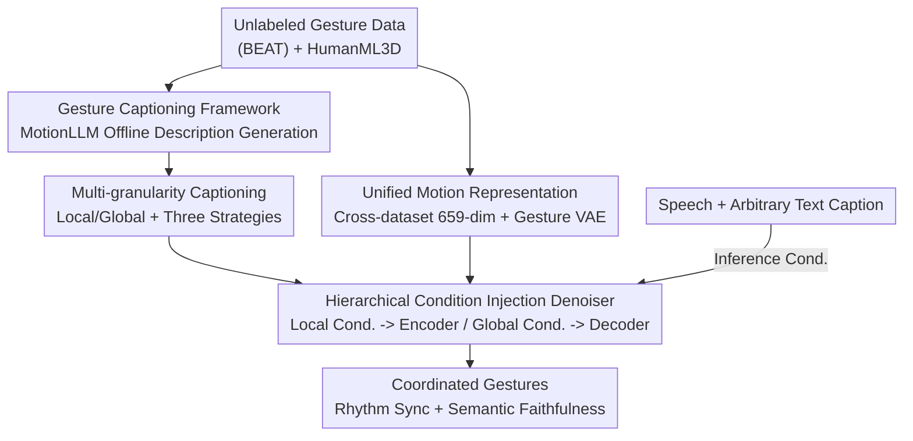

# CoordSpeaker: Exploiting Gesture Captioning for Coordinated Caption-Empowered Co-Speech Gesture Generation

**Conference**: CVPR 2026  
**Paper**: [CVF Open Access](https://openaccess.thecvf.com/content/CVPR2026/html/Fang_CoordSpeaker_Exploiting_Gesture_Captioning_for_Coordinated_Caption-Empowered_Co-Speech_Gesture_Generation_CVPR_2026_paper.html)  
**Code**: To be confirmed  
**Area**: Human Understanding / Co-speech Gesture Generation  
**Keywords**: co-speech gesture generation, gesture captioning, latent diffusion model, multimodal coordinated control, motion-language model  

## TL;DR
CoordSpeaker first employs a "gesture captioning" framework to offline generate multi-granularity descriptive text for gesture data lacking textual annotations. It then utilizes a conditional latent diffusion model with a "hierarchical condition injection denoiser" to coordinate heterogeneous audio and text conditions. This generates full-body speaker gestures that are both rhythmically aligned with speech and responsive to textual instructions (e.g., "bowing while speaking").

## Background & Motivation

**Background**: Co-speech gesture generation (generating matching full-body gestures for a given speech segment) is a core capability for digital humans, virtual anchors, and game NPCs. Prevailing approaches use speech audio as the primary condition, supplemented by modalities like transcripts, emotion, style, and identity. They focus on two objectives: **speech synchronization** and **semantic correlation**.

**Limitations of Prior Work**: Existing methods almost exclusively generate "spontaneous gestures" (e.g., hand movements following speech rhythm) but ignore "text-driven non-spontaneous gestures" (e.g., walking forward, bowing, or pointing at a screen while talking). This confines the speaker's full-body movement—a virtual teacher cannot "point to the PPT while lecturing," and a game NPC cannot "pace and move objects while speaking."

**Key Challenge**: The authors attribute this to two factors. First, the **Semantic Prior Gap**: existing gesture datasets (e.g., BEAT) contain speech but lack descriptive text annotations for motion content; relying on speech transcripts for indirect semantics provides weak information, while manual annotation is prohibitively expensive. Second, the **Coordinated Multimodal Control** problem: speech and text descriptions are "indirectly related" heterogeneous conditions with often conflicting control targets (speech might imply waving while text implies bowing). Previous methods simply concatenated these features as signals of varying intensity without modeling their interaction, leading to inharmonious control.

**Goal**: To achieve both "rhythmic synchronization for spontaneous gestures" and "semantic faithfulness for non-spontaneous movements" under low annotation and computational costs, while allowing the two condition types to coexist harmoniously.

**Key Insight**: The authors pose a reverse question: since gestures themselves carry rich semantics (gesture as "body language"), why not **generate text descriptions from gestures**? That is, treating "gesture understanding" as the key to filling the semantic gap. This represents the most critical perspective shift in the paper: introducing gesture captioning (motion-to-text) into gesture generation (text-to-motion) for the first time to form a bidirectional gesture-text mapping.

**Core Idea**: Use a motion-language model to "caption" gestures (offline, zero extra inference overhead) to complete semantic annotations. Then, use a hierarchical diffusion denoiser to inject speech (local, rhythmic) and text (global, semantic) in layers, achieving coordinated and controllable generation.

## Method

### Overall Architecture
CoordSpeaker consists of two major components. **The first is the Gesture Captioning framework**: utilizing a MotionLLM (motion-language model) to translate gesture sequences into multi-granularity descriptive text offline, providing "semantic priors" for originally unlabeled data. These captions are cached for reuse, incurring no extra overhead during inference. **The second is the Coordinated Gesture Generation model**: first training a Gesture VAE to compress cross-dataset motions into a unified low-dimensional latent space, then training a conditional latent diffusion model centered on a "Hierarchical Condition Injection Denoiser." This denoiser injects audio and local captions as "local conditions" into the encoder and global captions as "global conditions" into the decoder. This tiered division corresponds to multi-granularity captions and achieves coordination between rhythm and semantics. The input to the pipeline is "speech + arbitrary text caption," and the output is full-body speaker gestures synchronized with speech and faithful to text instructions. Training follows a two-stage process (VAE then Diffusion).

### Key Designs

**1. Gesture Captioning Framework: Using MotionLLM to "caption" unlabeled gestures offline for semantic priors.**

This step directly addresses the "Semantic Prior Gap." Since gesture datasets lack text annotations, the model generates them. The framework consists of a VQ-VAE-based motion tokenizer (encoder $E_M$ / decoder $D_M$) to discretize gesture sequences into motion tokens, and a Transformer language model (MotionGPT, frozen during inference) with a shared text-motion vocabulary $V=\{V_t, V_m\}$. Given a gesture sequence of $M$ frames $m_{1:M}=\{x_i\}_{i=1}^{M}$, the tokenizer quantizes it into discrete tokens $s_{1:L}$, which are then mixed with designed prompt text tokens $w_{1:N}$ and fed into the LLM to generate gesture descriptions $\hat w_{1:L}$. To align with the general motion-language space, gesture sequences are first converted to a unified motion representation and projected onto a 22-joint subset. **A key engineering trick is that captions are generated and cached entirely offline**, resulting in zero additional overhead during inference. This is the first instance of using "gesture understanding" for "gesture generation."

**2. Multi-granularity Captioning: Solving temporal dynamics and semantic granularity mismatch via local and global descriptions.**

Gesture segments change dynamically over time, and semantic granularity varies at different moments. A single caption cannot accurately align with time or summarize the whole content. The authors partition gestures into segments of length $K$, $m_{1:M}=\{m_{i:i+K-1}\}$, and generate a **local caption** $C_{local}$ for each segment to provide fine-grained semantic supervision. These are then concatenated with separators to form a **global caption** $C_{global}=\{C^1_{local}\langle\text{SEP}\rangle C^2_{local}\langle\text{SEP}\rangle\dots\}$ for the entire sequence. Three strategies are proposed: **Regular** (uniform segments, most precise temporal alignment), **Dynamic** (random segment sampling during training for robustness), and **Hierarchical** (combining both for fine-to-coarse semantics). This multi-granularity mechanism provides natural counterparts for the two-level injection in the denoiser. Ablation studies favor the "Hierarchical strategy + Regular local captions" for its overall balance across metrics.

**3. Unified Cross-dataset Motion Representation: Borrowing semantic priors by embedding gestures and general human motions into the same latent space.**

To leverage general human motion datasets with rich text semantics (like HumanML3D), format inconsistencies must be resolved. The authors convert data from different sources into SMPL-X axis-angle representations, adjusting scaling and initial orientation before calculating 3D joint positions via SMPL-X forward kinematics. Each frame is represented as $x_i = (\dot r_a, \dot r_x, \dot r_z, r_y, j_p, j_v, j_r, c_f)$, including root joint angular/linear velocity, height, and joint position/velocity/rotation and foot contact. To accommodate gesture data, 55 joints are used (659 dimensions per frame), denoted as $x\in\mathbb{R}^{T\times659}$. A transformer VAE with long skip connections encodes the motion into a latent vector $z\in\mathbb{R}^{n\times d}$, outputting Gaussian parameters $\mu,\sigma$ for reparameterization sampling. The decoder reconstructs motion via cross-attention. The training objective is reconstruction MSE + KL regularization:

$$\mathcal{L}_{VAE} = \|x_{1:L}-\hat x_{1:L}\|_2^2 + \beta\, \mathrm{KL}\big(q(z|x_{1:L})\,\|\,p(z)\big)$$

This unified representation allows gestures to "borrow" semantic priors from general motions; removing it (-w/o mo.) causes the most significant drop in semantic correlation.

**4. Hierarchical Condition Injection Denoiser: Resolving multimodal control conflicts via two-level injection.**

Diffusion is performed in the latent space: forward noise $q(z_t|z_{t-1})=\mathcal{N}(\sqrt{\alpha_t}\,z_{t-1}, (1-\alpha_t)I)$; the denoiser $\epsilon_\theta$ uses a Transformer encoder-decoder structure. Unlike previous "one-pot" concatenation of conditions, the authors use **two-level injection** based on multi-granularity captions. The first level injects local conditions $c_1=\{C_{local}, A\}$ (local caption + audio) along with noisy latents and time embeddings into the denoiser encoder $E_d$ via self-attention, ensuring precise synchronization with rhythm and local semantics. The second level injects global conditions $c_2=\{C_{global}\}$ into the denoiser decoder $D_d$ via cross-attention to enhance global coherence and high-level semantic correlation:

$$h = E_d(\mathrm{concat}(z_t, t, c_1)), \qquad \epsilon_\theta(z_t,t,c) = D_d(h, c_2)$$

This layout allows heterogeneous conditions to serve distinct roles without conflict. Training utilizes classifier-free guidance, randomly masking 10% of conditions. During inference, guidance scales $s_1, s_2$ for audio $A$ and caption $C$ are used to independently adjust intensities:

$$\epsilon_\theta^s = s_1\epsilon_\theta(c{=}\{\varnothing, A\}) + s_2\epsilon_\theta(c{=}\{C, \varnothing\}) + (1-s_1-s_2)\epsilon_\theta(c{=}\{\varnothing,\varnothing\})$$

### Loss & Training
Two-stage training. Phase one trains the Gesture VAE with $\mathcal{L}_{VAE}$. Phase two freezes the VAE and trains the conditional latent diffusion using the standard $\ell_2$ noise prediction objective $\mathcal{L}_{Diff}=\mathbb{E}_{\epsilon,t}[\|\epsilon-\epsilon_\theta(z_t,t,c)\|_2^2]$, where $\epsilon\sim\mathcal{N}(0,I)$. Inference uses a DDIM sampler with 50 steps. Training data includes BEAT (76 hours speech-gesture) and HumanML3D (14,616 motions). BEAT's missing text is filled by the captioning framework, and HumanML3D's missing audio is zeroed out.

## Key Experimental Results

### Main Results
On coordinated gesture generation, the model is compared against FreeTalker and SynTalker. Table 1 excerpt (BC reported as $\times10^{-1}$, → denotes closer to GT is better):

| Method | Jerk→ | FGD↓ | BC↑ | L1Div↑ | FID↓ | Div→ | Description |
|------|-------|------|-----|--------|------|------|------|
| GT | 1.165 | - | - | - | - | 5.512 | Ground Truth |
| FreeTalker | 0.611 | 2.101 | 1.147 | 11.332 | 0.761 | 5.396 | Speech-only, no semantic motion |
| **Ours** | **1.190** | 3.173 | **1.327** | 10.861 | 1.118 | **5.558** | Better rhythm (BC+0.180), Div(+0.162), closer to GT |

User Preference (Table 2, Win Rate %):

| Method | Naturalness | Sync | Text Matching |
|------|--------|--------|----------|
| FreeTalker | 18.0 | 24.0 | 15.5 |
| SynTalker | 32.0 | 26.5 | 31.5 |
| **Ours** | **36.0** | **32.0** | **33.0** |

CoordSpeaker ranks first in all subjective dimensions (p<0.05). For pure text-to-motion (Table 3 on HumanML3D), Ours achieves FID 0.405 (2nd best) and MM-Dist 3.584 (best alignment), significantly outperforming SynTalker (FID 4.385).

### Ablation Study
Table 1 Ablation Rows (deviation from GT is worse):

| Config | BC↑ | MM-Dist↓ | R-Prec↑ | Description |
|------|-----|----------|---------|------|
| Full (Ours) | 1.327 | 6.814 | 0.100 | Complete model |
| w/o hcd. | 1.910 | 6.872 | 0.102 | No Hier. Denoiser: biased toward rhythmic speech (BC 1.910), loses semantics |
| w/o mgc. | 2.256 | 7.031 | 0.082 | No Multi-gran. Caption: semantic correlation drops |
| w/o mo. | 2.627 | 7.664 | 0.043 | No Unified Representation: severe semantic degradation |

### Key Findings
- **Unified Motion Representation (mo.) is most critical**: R-Precision plummeted from 0.100 to 0.043, and MM-Dist rose by 0.850. This confirms that semantic priors borrowed from cross-dataset sources are the fundamental source of non-spontaneous motion capability.
- **Multi-granularity Captioning (mgc.) governs semantics**: Removing it results in basic co-speech gestures only, verifying that the captioning pipeline is key to filling the semantic gap.
- **Hierarchical Denoiser (hcd.) manages coordination**: Removing it caused BC to abnormally spike to 1.910 as the model focused purely on speech at the expense of text semantics. Its value lies in balancing conflicting conditions.
- **Efficiency**: Measured in AITS (Average Inference Time per Sentence), Ours achieved 0.842s, over 6x faster than FreeTalker (6.632s) and SynTalker (5.804s), thanks to latent space diffusion and offline captioning.

## Highlights & Insights
- **"Understanding for Generation" Perspective**: The first introduction of gesture captioning (motion-to-text) to co-speech gesture generation. Treating missing labels as a "caption-it-yourself" problem with offline caching is a transferable trick for any unlabeled target data with pseudo-label generation potential.
- **Duality of Captioning and Injection**: Local caption ↔ Denoiser Encoder (self-attention, rhythm/local semantics); Global caption ↔ Decoder (cross-attention, global coherence). This "layered injection of heterogeneous conditions based on granularity" is a robust strategy for multimodal controllable generation.
- **Knowledge Transfer via Unified Representation**: Using unified latent spaces to bridge HumanML3D and gesture datasets is a practical path to expanding semantic capabilities at low cost.

## Limitations & Future Work
- The captioning model struggles with **temporal order** in long sequences, affecting descriptions of complex compound motions.
- Quantitative evaluation of gesture captions is inherently difficult due to the lack of ground-truth captions; reliance on indirect metrics like MotionClipScore and GPT evaluation has limited absolute reference value.
- Dependence on pre-trained motion-language models (e.g., MotionGPT); incorrect captions contaminate downstream control. Guidance scales $s_1, s_2$ require manual tuning; automatic balancing remains an open problem.

## Related Work & Insights
- **vs FreeTalker**: FreeTalker attempts audio+text driving but lacks coordinated control under joint signals and suffers from semantic gaps. CoordSpeaker uses captioning to fill gaps and hierarchical denoising for 6x faster and better rhythmical results.
- **vs SynTalker**: SynTalker uses prompt-motion pre-training for implicit labels, incurring extra costs and "choosing one over the other" when conditions conflict. CoordSpeaker offers zero-cost offline captions and explicit hierarchical coordination.
- **vs Pure Text-to-Motion**: These ignore speech rhythm; CoordSpeaker maintains industry-leading text-to-motion performance while adding coordinated speech-rhythm capabilities.

## Rating
- Novelty: ⭐⭐⭐⭐⭐ 
- Experimental Thoroughness: ⭐⭐⭐⭐ 
- Writing Quality: ⭐⭐⭐⭐ 
- Value: ⭐⭐⭐⭐⭐ 

<!-- RELATED:START -->

## Related Papers

- [\[CVPR 2026\] LiveGesture: Streamable Co-Speech Gesture Generation Model](livegesture_streamable_co-speech_gesture_generation_model.md)
- [\[ICCV 2025\] SemGes: Semantics-aware Co-Speech Gesture Generation using Semantic Coherence and Relevance Learning](../../ICCV2025/human_understanding/semges_semantics-aware_co-speech_gesture_generation_using_semantic_coherence_and.md)
- [\[CVPR 2026\] Miburi: Towards Expressive Interactive Gesture Synthesis](miburi_towards_expressive_interactive_gesture_synthesis.md)
- [\[CVPR 2026\] DyaDiT: A Multi-Modal Diffusion Transformer for Socially Favorable Dyadic Gesture Generation](dyadit_a_multi-modal_diffusion_transformer_for_socially_favorable_dyadic_gesture.md)
- [\[CVPR 2026\] Active Inference for Micro-Gesture Recognition: EFE-Guided Temporal Sampling and Adaptive Learning](active_inference_for_micro-gesture_recognition_efe-guided_temporal_sampling_and_.md)

<!-- RELATED:END -->
