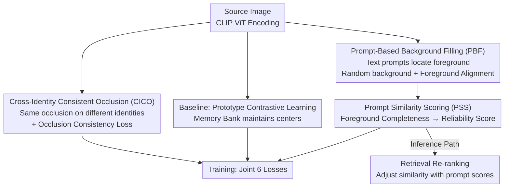

# COPE: Consistent Occlusion and Prompt Enhancement Network for Occluded Person Re-identification

**Conference**: CVPR 2026  
**Paper**: [CVF Open Access](https://openaccess.thecvf.com/content/CVPR2026/html/Sun_COPE_Consistent_Occlusion_and_Prompt_Enhancement_Network_for_Occluded_Person_CVPR_2026_paper.html)  
**Code**: https://github.com/Cecoming/COPE  
**Area**: Person Re-Identification / Occluded ReID  
**Keywords**: Occluded Person Re-identification, Consistent Occlusion, Prompt Enhancement, Vision-Language Alignment, Retrieval Re-ranking  

## TL;DR
COPE addresses the deep-seated issues of "feature interference" and "information loss" in occluded ReID using three lightweight modules: Cross-Identity Consistent Occlusion (CICO) imposes the **same occlusion** across different identities and constrains feature consistency in occluded areas; Prompt-Based Background Filling (PBF) uses CLIP text prompts to locate the foreground and randomly fill the background; and Prompt Similarity Scoring (PSS) post-processes retrieval during inference based on foreground completeness scores. It achieves approximately 82% Rank-1 and 75–76% mAP on Occluded-Duke with almost no additional inference cost.

## Background & Motivation

**Background**: Person Re-Identification (Re-ID) aims to retrieve the same individual across non-overlapping camera views. However, real-world images are frequently occluded by vehicles, pedestrians, or railings. Prevailing approaches generally fall into two categories: **occlusion data augmentation** (applying various occlusion patches to inputs to enhance generalization) and **feature reconstruction** (recovering occluded features using external cues or gallery neighbors). While recent Transformer/CLIP backbones have significantly enhanced feature extraction, performance in occluded scenarios remains bottlenecked.

**Limitations of Prior Work**: The authors identify three overlooked issues. First, most augmentation methods prioritize occlusion "diversity" but ignore that **similar occlusions induce false matches**. As shown in Figure 1(a), when CLIP-REID retrieves an occluded query, it returns incorrect results sharing similar vehicle occlusions, indicating that the occlusion itself becomes an interfering signal. Second, many samples in occluded ReID galleries are actually **holistic (non-occluded)**; simple occlusion simulation fails to address background interference across different environments. Third, feature reconstruction relies on neighbor-by-neighbor recovery, leading to **high computational overhead and inference latency**, which hinders real-time deployment.

**Key Challenge**: Occlusion introduces two fundamental difficulties: **feature interference** (occlusion tokens become entangled with foreground tokens in global self-attention, polluting the representation) and **information loss** (insufficient visible areas cause low direct similarity between the query and the correct gallery sample). Augmentation-based methods fail to suppress "similar occlusion misleading," while reconstruction-based methods are too costly.

**Goal**: (1) Enable the model to identify and suppress occlusion tokens, redirecting attention to the foreground; (2) weaken background dependence on holistic gallery samples; and (3) recover retrieval failures caused by severe occlusion without expensive feature reconstruction.

**Key Insight**: Rather than augmenting each identity with "different" occlusions, the authors do the opposite—**deliberately apply identical occlusions to different identities** to create ambiguous samples that are "visually similar but identity-distinct." They then use a consistency loss to force the model to encode these identical occlusion areas into similar (and thus identity-irrelevant) features, naturally down-weighting the occlusion through attention. Simultaneously, they leverage CLIP's text-vision alignment capability to locate the foreground and convert "foreground completeness" into a learnable reliability score for retrieval re-ranking.

**Core Idea**: Use "cross-identity consistent occlusion + occlusion consistency loss" to transform occlusions into suppressible common signals. Use "prompt-guided foreground localization" for both background augmentation and reliability scoring, downgrading the repair of information loss from "feature reconstruction" to "near-zero-cost similarity post-processing."

## Method

### Overall Architecture
COPE consists of **training** and **inference** phases. The backbone is a CLIP ViT with most parameters frozen, extracting global tokens $F^{src}_g$ and patch tokens $F^{src}_{pat}$ from the source image. During training, two augmentation paths are derived from a single source image: the CICO path (applying consistent occlusions) produces $F^{cico}$, and the PBF path (filling random backgrounds) produces $F^{pbf}/F^{rbf}$. The baseline uses Prototype-based Contrastive Learning (PCL) to maintain a memory bank for supervising global features. The three core modules attach specific losses: CICO adds an occlusion consistency loss to suppress occlusion interference, PBF uses text prompts to generate foreground heatmaps and performs foreground alignment, and PSS learns a "foreground completeness → reliability" prompt score. During inference, **no augmentation is performed**; only the PSS prompt score is used to re-rank standard retrieval similarities.

### Key Designs

**1. Cross-Identity Consistent Occlusion (CICO): Turning "similar occlusion misleading" into suppressible common signals**

To address the issue where "similar occlusions induce false matches" and "occlusion tokens pollute the foreground in self-attention," CICO pre-initializes $M$ Gaussian-shaped occlusion templates. Each batch samples $N$ occlusion types and **applies the same occlusion to $N$ different identities**, deliberately creating ambiguous scenarios. To prevent the entanglement of occlusion and foreground tokens in ViT's self-attention, an **occlusion consistency loss** is added. First, Global Weighted Average Pooling (GWAP) uses patch-level occlusion masks $O_{pat}$ to extract occlusion features for the $i$-th image under the $n$-th occlusion type:

$$F^{cico}_n(i) = \mathrm{GWAP}(O_n, F^{cico}_{pat}) = \frac{\sum_h\sum_w O_n(h,w)\,F^{cico}_{pat}(i,h,w)}{\sum_h\sum_w O_n(h,w)}$$

Then, occlusion features across different identities within the same occlusion type are pulled together:

$$L_{oc} = \sum_{n=1}^{N}\frac{1}{|I_n|^2}\sum_{i,j\in I_n}\big\|F^{cico}_n(i)-F^{cico}_n(j)\big\|^2$$

where $I_n$ is the set of images with the $n$-th occlusion. The intuition is that since the same occlusion looks identical on different people, its features **should** be consistent—rendering them useless for distinguishing identity and naturally shifting attention to the visible foreground.

**2. Prompt-Based Background Filling (PBF): Using vision-language alignment to locate foreground and reduce background dependence**

To address the issue that "many gallery samples are holistic and simple occlusion simulation fails to fix background interference," PBF utilizes CLIP's localization capability. A frozen text encoder receives the input `{v, person}`, where $v=\{v_1,...,v_4\}$ are learnable tokens. Source global features $F^{src}_g$ are injected into the prompt via an MLP (following CoCoOp: $v'=\mathrm{MLP}(F^{src}_g)+v$) to obtain text features $T$. The **foreground heatmap** is generated by $H = T\cdot F^{src}_{pat}$. This heatmap is supervised by human parsing labels $\hat H$ via a segmentation loss $L_{seg}$.

Once the foreground is located, the background is **randomly filled with colors** to simulate different environments. To ensure foreground feature consistency before and after filling, a foreground alignment loss is applied: GWAP is used with the heatmap as weights, and an MSE loss aligns the foreground features of the source and filled images:

$$L_{align} = \big\|\mathrm{GWAP}(H, f^{src}_{pat}) - \mathrm{GWAP}(H, f^{rbf}_{pat})\big\|^2$$

**3. Prompt Similarity Scoring (PSS): Converting foreground completeness into near-zero-cost retrieval re-ranking**

To address the issue where "severe occlusion results in too few visible areas and low direct similarity" and "feature reconstruction is too expensive," the core observation is: the more complete the foreground, the more reliable the match. PSS converts the PBF foreground heatmap into a **prompt score** $P\in\mathbb{R}^1$ via an MLP:

$$P = \sigma(\mathrm{MLP}(\sigma(H)))$$

This score is supervised using the cosine similarity between the feature and its class center. During training, the memory bank calculates the similarity $S[i]=\mathrm{Cos}(F_g[i], K[i])$ for each instance, and $P$ is pulled toward it via MSE ($L_{sim}=\|P-S\|^2$).

During inference, PSS adjusts the similarity $S_G=\frac{1}{1+D(F_Q,F_G)}$ using the prompt score: $S_P=S_G\cdot P$. It selects the top-$K_1$ candidates from $S_G$ and top-$K_2$ **intermediate reference samples** (reliable, holistic samples) from $S_P$. The final similarity is adjusted by an increment $\Delta_i$:

$$\Delta_i = \frac{1}{K_2}\big(S_{inter}\times S^{K_2}_P\big),\qquad S_i = S^i_G + \Delta_i$$

This allows two samples with non-overlapping visible areas (e.g., upper body vs. lower body) to be linked through a **"bridge" reference sample** that captures both parts, acting as soft neighbor propagation without explicit feature reconstruction.

### Loss & Training
Global features $F^{src}_g, F^{cico}_g, F^{rbf}_g$ are supervised by cross-entropy $L_{ce}$. The total loss is:

$$L = L_{ce} + L_{pcl} + L_{oc} + L_{seg} + L_{align} + L_{sim}$$

$L_{pcl}$ is the prototype contrastive loss. The backbone is CLIP ViT, batch size 64 (4 images per identity), with a SGD learning rate starting at 3.5e-4. For CICO, $M{=}20, N{=}2$. PBF is pre-trained for 60 epochs. In PSS, $K_1{=}200, K_2{=}5$.

## Key Experimental Results

### Main Results
Evaluated on 2 holistic datasets (Market-1501, MSMT17) and 4 occluded datasets (Occluded-Duke, P-Duke-REID, Occluded-ReID, Partial-REID).

| Dataset | Metric | Ours | Prev. SOTA (Repo) | Gain |
|--------|------|------|----------------|------|
| Occluded-Duke | Rank-1 / mAP | 82.1 / 75.4 | KPR(Swin) 79.8 / 67.1 | +2.3 / +8.3 (vs. KPR) |
| P-Duke-REID | Rank-1 / mAP | — / — | — | +0.2 / +3.2 |
| Market-1501 | Rank-1 / mAP | SOTA | Prev. Best | +0.1 / +1.9 |
| MSMT17 | mAP | SOTA | Prev. Best | Leads in mAP |

*Note: There is a minor discrepancy between abstract values (82.4/76.4) and table values (82.1/75.4) which might stem from different settings.*

### Ablation Study
Component Ablation (Occluded-Duke):

| Index | CICO | PBF | PSS | Rank-1 | mAP |
|-------|------|-----|-----|--------|-----|
| 1 (CLIP Baseline) | | | | 70.2 | 60.3 |
| 2 | ✓ | | | 74.8 | 67.9 |
| 3 | ✓ | ✓ | | 76.8 | 68.9 |
| 4 (Full) | ✓ | ✓ | ✓ | 82.1 | 75.4 |

### Key Findings
- **PSS provides the largest contribution** (Rank-1 +5.3, mAP +6.5) with near-zero cost, proving that soft neighbor propagation via reliability scores is highly effective.
- **CICO's feature loss is essential**: Removing $L_{oc}$ drops Rank-1 by 2.9%, indicating that data augmentation must be paired with feature constraints to suppress occlusion attention.
- **Sensitivity to $K_2$**: Rank-1 reaches 82.1% at $K_2{=}5$ but drops at $K_2{=}20$ due to noise, while $K_1$ remains robust between 50 and 500.
- **Prompt Heatmap Source**: Learnable token prompts (82.1/75.4) outperform fixed templates and hard human parsing labels.

## Highlights & Insights
- **"Anti-diversity" Occlusion Design**: While others seek diversity, COPE uses **consistent** occlusions + a consistency loss to transform occlusion from "interference" into a "commonality that can be explicitly down-weighted." 
- **Multi-purpose Heatmap**: The PBF prompt heatmap simultaneously serves background filling, foreground alignment, and reliability scoring, achieving high module reuse.
- **Downgrading Reconstruction to Post-processing**: PSS uses "foreground completeness bridges" as a replacement for expensive feature reconstruction, resulting in significant gains (+5% Rank-1) with negligible latency.

## Limitations & Future Work
- **Dependence on Human Parsing**: PBF requires $\hat H$ parsing labels for supervision, which may degrade in domains without such annotations.
- **Hyperparameter Sensitivity**: $K_2$ requires tuning, and the "bridge sample" assumption may fail in extremely sparse galleries.
- **Simplified Templates**: CICO uses fixed Gaussian shapes, which do not fully capture the complexity of real-world occlusion textures and shapes.

## Related Work & Insights
- **vs. Occlusion Augmentation (SPT/ADM)**: They focus on diversity but fail against "similar occlusion misleading." COPE suppresses occlusion identity-relevance via consistency.
- **vs. Feature Reconstruction (RFCnet/KPC)**: They are computationally heavy. COPE's PSS achieves similar goals via similarity post-processing with minimal delay.
- **vs. CLIP-REID/PCL-CLIP**: COPE uses text prompts specifically for foreground localization and reliability scoring rather than just for feature extraction.

## Rating
- Novelty: ⭐⭐⭐⭐ Reverse logic of consistent occlusion is clever.
- Experimental Thoroughness: ⭐⭐⭐⭐ Extensive ablations across multiple datasets.
- Writing Quality: ⭐⭐⭐⭐ Clear motivation and module correspondence.
- Value: ⭐⭐⭐⭐ High Rank-1/mAP gains with near-zero inference cost.

<!-- RELATED:START -->

<!-- RELATED:END -->

## Related Papers

- [\[CVPR 2026\] Prompt-Anchored Vision–Text Distillation for Lifelong Person Re-identification](prompt-anchored_vision-text_distillation_for_lifelong_person_re-identification.md)
- [\[CVPR 2026\] Spatial-Frequency Collaborative Learning for Occluded Visible-Infrared Person Re-Identification](spatial-frequency_collaborative_learning_for_occluded_visible-infrared_person_re.md)
- [\[CVPR 2026\] BIT: Matching-based Bi-directional Interaction Transformation Network for Visible-Infrared Person Re-Identification](bit_matching-based_bi-directional_interaction_transformation_network_for_visible.md)
- [\[CVPR 2026\] MFEN: Multi-Frequency Expert Network for Visible-Infrared Person Re-ID](mfen_multi-frequency_expert_network_for_visible-infrared_person_re-id.md)
- [\[CVPR 2026\] Composite-Attribute Person Re-Identification via Pose-Guided Disentanglement](composite-attribute_person_re-identification_via_pose-guided_disentanglement.md)

<!-- RELATED:END -->
