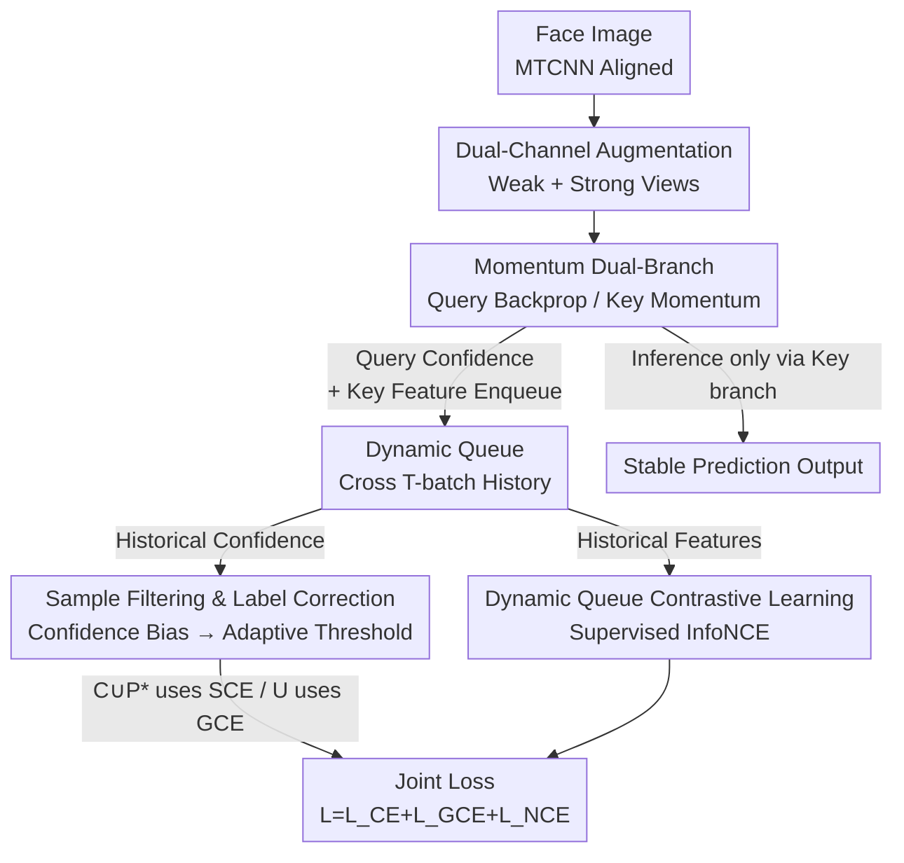

# D³FER: Dual Channel and Dual Branch Network for Robust Facial Expression Recognition under Dual Challenges

**Conference**: CVPR 2026  
**Paper**: [CVF Open Access](https://openaccess.thecvf.com/content/CVPR2026/html/Tang_D3FER_Dual_Channel_and_Dual_Branch_Network_for_Robust_Facial_CVPR_2026_paper.html)  
**Code**: https://github.com/D3FER/D3FER  
**Area**: Human Understanding / Facial Expression Recognition  
**Keywords**: Facial Expression Recognition, Label Noise, Momentum Contrastive Learning, Dynamic Queue, Robustness  

## TL;DR
Aiming at the compound challenge of "visual disturbances (occlusion/pose) + label noise" in in-the-wild facial expression recognition (FER), D³FER feeds weak/strong dual-channel augmentations into a Query-Key momentum dual-branch network. It utilizes a cross-batch dynamic queue to cache both confidence scores for adaptive threshold-based sample filtering and label correction, as well as features for supervised contrastive learning. During inference, the smoother Key branch is used, achieving new SOTA results on RAF-DB/FERPlus/AffectNet and their occlusion/pose/noise subsets.

## Background & Motivation
**Background**: In-the-wild FER has transitioned from controlled laboratory settings to real-world scenarios. Mainstream methods follow two lines: one utilizes attention, frequency domain, or multi-modal priors to counter occlusion and pose (e.g., POSTER, DAN, ORSANet); the other employs confidence re-weighting, neighborhood soft labels, or dual-network divergence modeling to resist annotation noise (e.g., LA-Net, ReSup, NLA). Contrastive learning has also been introduced to FER recently to learn more discriminative expression embeddings.

**Limitations of Prior Work**: These two types of challenges occur **simultaneously** in real-world data—the same image can be both occluded and mislabeled. However, most methods handle only one in isolation: disturbance-resistant methods assume clean labels, while noise-resistant methods ignore how visual degradation blurs inter-class boundaries and amplifies intra-class variance. When coupled, robustness drops significantly.

**Key Challenge**: Visual disturbances and label noise **amplify each other**. Disturbances make features unreliable $\to$ noise identification based on prediction confidence becomes prone to misjudgment; meanwhile, incorrect supervision causes contrastive learning to pull noisy samples into wrong clusters, further eroding the feature space. Estimating noise thresholds from a single batch is also unstable due to class imbalance and training fluctuations.

**Goal**: To simultaneously (a) reliably identify and correct noisy labels, (b) learn compact and separable expression features in the presence of noisy labels, and (c) ensure inference outputs are stable against single-batch noise fluctuations within a unified framework.

**Key Insight**: The authors leverage the momentum encoder and memory queue concepts from MoCo but extend the queue from "storing only negative features" to "storing cross-batch confidence + features"—the former for robust statistical noise thresholding and the latter for supervised contrast. Both share the same momentum-stabilized Key branch.

**Core Idea**: Unify "noise estimation" and "contrastive learning" via a **dynamic queue**. Historical confidence scores in the queue prevent noise thresholds from being hijacked by single-batch fluctuations, while historical features provide sufficient and stable negative samples for contrastive learning, both stabilized by the momentum Key branch.

## Method

### Overall Architecture
The input to D³FER is a face image, detected and aligned by MTCNN to $3\times224\times224$. It follows a pipeline of "dual-channel augmentation + dual-branch encoding + dynamic queue + triple-loss joint optimization" to output the expression category.

Overall: Each image generates weak $x_i^W$ and strong $x_i^S$ augmentation views. The model consists of two structurally identical sets of encoders and classifiers—the Query branch $(f^Q, g^Q)$ updated via backpropagation, and the Key branch $(f^K, g^K)$ updated via momentum moving average of Query parameters. A dynamic queue of length $L$ across the most recent $T$ batches caches three types of data: Query branch classification confidence under strong/weak channels $\{p_i^{S,Q}\}$, $\{p_i^{W,Q}\}$, and Key branch features for strong augmentations $\{h_i^{S,K}\}$. The confidence scores are used for "sample filtering + label correction" to calculate adaptive noise thresholds, categorizing samples into a clean set $\mathcal{C}$, uncertain set $\mathcal{U}$, and noisy set $\mathcal{P}$ (corrected into $\mathcal{P}^*$). Features are used for supervised contrastive learning. Finally, clean/corrected samples use Symmetric Cross Entropy (SCE), uncertain samples use Generalized Cross Entropy (GCE), and contrastive terms use InfoNCE, optimized jointly. Only the stable Key branch is used for inference.

### Key Designs

**1. Dynamic Queue: Linking Noise Estimation and Contrastive Learning on Shared Memory**

Mechanism: Many FER methods estimate noise thresholds only from a **single training batch**, which is sensitive to statistical fluctuations and class imbalance. D³FER maintains a dynamic queue of length $L$ storing information from the last $T$ batches. Unlike MoCo which only caches Key features, this queue stores three rows: Query confidence for strong/weak channels $\{p_i^{S,Q}\}$, $\{p_i^{W,Q}\}$, and Key features for strong views $\{h_i^{S,K}\}$, where $p_i^{W,Q}=g^Q(f^Q(x_i^W))$, $p_i^{S,Q}=g^Q(f^Q(x_i^S))$, and $h_i^{S,K}=f^K(x_i^S)$.

Function: The confidence row allows the noise threshold to be calculated as an intra-class average over multiple batches, smoothing out single-batch jitters and imbalance. The feature row provides a scale of negative samples far exceeding a single batch.

**2. Sample Filtering and Label Correction based on Confidence Bias: Tri-partitioning via Cross-batch Thresholds**

Mechanism: The authors define **confidence bias** as $\bar{z}=\max(p)-z_{y_i}$, representing the difference between the maximum class confidence and the target class $y_i$ confidence. Within the dynamic queue, intra-class average confidence biases for each class $c$ are calculated as adaptive thresholds:

$$\tau_c^{S,Q}=\frac{1}{|D_c|}\sum_{i\in D_c}\bar{z}_i^{S,Q},\qquad \tau_c^{W,Q}=\frac{1}{|D_c|}\sum_{i\in D_c}\bar{z}_i^{W,Q}$$

Where $D_c$ is the set of samples in the queue with ground truth label $c$. A sample is assigned to the clean set $\mathcal{C}=\{\bar{z}_i^{S,Q}<\tau_{y_i}^{S,Q}\}\cup\{\bar{z}_i^{W,Q}<\tau_{y_i}^{W,Q}\}$ if either channel is below the threshold. The noisy set $\mathcal{P}$ is determined by the average bias exceeding $\max(\bar\tau,\sigma)$ (where $\sigma$ is a safety hyperparameter), and the rest form the uncertain set $\mathcal{U}$. Noisy labels are corrected as $y_i^*=\arg\max_c(z_c^{S,Q}+z_c^{W,Q})$ to form the mixed set $\mathcal{M}=\mathcal{C}\cup\mathcal{P}^*$.

**3. Supervised Contrastive Learning via Dynamic Queue: Encoding with Labels and Asymmetric Filtering**

Mechanism: Current batch Query weak features $H^Q=\{h_i^{W,Q}\}$ are aligned with Key strong historical features $H^K=\{h_i^{S,K}\}$ in the queue. Samples with identical labels are positive pairs. The InfoNCE loss with temperature $\epsilon=0.07$ is used:

$$\mathcal{L}_{NCE}=-\frac{1}{|\hat H^Q|}\sum_{h_i^{W,Q}\in\hat H^Q}\log\frac{\sum_{y_l=y_i}\exp(\mathrm{sim}(h_i^{W,Q},h_l^{S,K})/\epsilon)}{\sum_{j}\exp(\mathrm{sim}(h_i^{W,Q},h_j^{S,K})/\epsilon)}$$

Novelty: Asymmetric filtering is used. For the queue side $\hat H^K$, only confirmed clean set $\mathcal{C}$ features are kept. For the current batch $\hat H^Q$, the full mixed set $\mathcal{M}$ (including corrected samples) is used.

**4. Momentum Query-Key Dual-Branch and Key-Branch Inference: Temporal Smoothing**

Mechanism: The Key branch is updated via momentum moving average of Query parameters: $\theta_{f^K}=m\theta_{f^K}+(1-m)\theta_{f^Q}$ and $\theta_{g^K}=m\theta_{g^K}+(1-m)\theta_{g^Q}$ ($m\in[0,1)$). This preserves long-term optimization trends and smoothes out single-batch disturbances. Inference uses the Key branch $\hat p=g^K(f^K(x_i))$ as an implicit temporal ensemble.

### Loss & Training
The total loss is $\mathcal{L}=\mathcal{L}_{CE}+\mathcal{L}_{GCE}+\mathcal{L}_{NCE}$, with no additional weighting coefficients.
- $\mathcal{M}$ (Clean + Corrected) uses Symmetric Cross Entropy $\mathcal{L}_{CE}$.
- $\mathcal{U}$ (Uncertain) uses Generalized Cross Entropy $\mathcal{L}_{GCE}$ with $\gamma$ to balance CE convergence and MAE noise robustness.
- Backbone: ResNet-18 pre-trained on MS-Celeb-1M, queue length $L=1024$, $\sigma=0.4$.

## Key Experimental Results

### Main Results

Comparison with SOTA using ResNet-18 on clean datasets (Table 4, Accuracy %):

| Method | Year | RAF-DB | FERPlus | AffectNet-7 | AffectNet-8 |
|------|------|--------|---------|-------------|-------------|
| EAC | 2022 | 89.99 | 89.64 | 65.32 | — |
| ReSup | 2025 | 89.70 | 88.85 | 65.46 | — |
| NHG | 2025 | 90.09 | 88.94 | 65.14 | — |
| **Ours** | 2025 | **90.71** | **89.86** | **66.00** | **62.38** |

Comparison under synthetic label noise (Table 3, Accuracy %, excerpts):

| Noise | Dataset | ReSup | NLA | **Ours** |
|------|--------|-------|-----|-----------|
| 10% | RAF-DB | 88.43 | 88.83 | **89.37** |
| 10% | AffectNet | 64.29 | 63.52 | **64.89** |
| 30% | RAF-DB | 86.86 | 86.71 | 86.41 |
| 30% | FERPlus | 86.74 | 86.97 | **87.57** |
| 30% | AffectNet | 62.89 | 62.48 | **63.34** |

Occlusion/Pose subsets (Table 2, Accuracy %):

| Subset | Condition | Prev. SOTA | **Ours** |
|------|------|--------|-----------|
| Occlusion-RAF-DB | Occlusion | 86.12 (CC-KD) | **87.48** (+1.36) |
| Occlusion-FERPlus | Occlusion | 86.61 (DSAN) | **87.60** |
| Occlusion-AffectNet | Occlusion | 62.98 (VTFF) | **63.10** |
| Pose-AffectNet | Pose>45° | 61.32 (DSAN) | **61.93** |

### Ablation Study
Evaluation of SL (Sample Filtering/Label Correction), CL (Contrastive Learning), and IB (Inference Branch) on RAF-DB with 0%–30% symmetric noise (Table 1, Accuracy %):

| SL | CL | IB | 0% | 10% | 20% | 30% |
|----|----|----|----|----|----|----|
| ✗ | ✗ | Query | 88.75 | 84.75 | 81.45 | 79.40 |
| ✗ | ✗ | Key | 89.51 | 84.93 | 81.76 | 79.66 |
| ✓ | ✗ | Query | 89.66 | 86.92 | 85.16 | 81.91 |
| ✗ | ✓ | Query | 89.92 | 86.73 | 84.45 | 81.37 |
| ✓ | ✓ | Query | 90.38 | 89.11 | 86.95 | 86.05 |
| ✓ | ✓ | Key (Full) | **90.71** | **89.37** | **87.29** | **86.41** |

### Key Findings
- **SL contributes most at high noise levels**: Adding Sample Filtering + Correction at 30% noise improves accuracy from 79.40 to 81.91. CL alone drops faster as noise increases.
- **Modules are complementary**: Combining SL+CL at 30% noise reaches 86.05%, significantly exceeding the linear expectation of individual contributions, confirming that clean labels and structured features reinforce each other.
- **Key-branch inference is a free lunch**: Switching from Query to Key inference yields a stable +0.2~0.4% gain.

## Highlights & Insights
- **Unified Queue Functionality**: Integrating cross-batch confidence and features into one dynamic queue ensures that "noise threshold estimation" and "contrastive negative pool" share a stabilized momentum representation.
- **Confidence Bias $\bar z$ is Robust**: Measuring how much target classes are suppressed by others naturally cancels out overall class confidence variations, providing a transferable noise detection signal.
- **Asymmetric Filtering**: Keeping the queue side strictly clean while allowing corrected samples on the batch side prevents error propagation through the memory mechanism.

## Limitations & Future Work
- The method's performance on large poses (Pose>30°/45°) in FERPlus is slightly inferior to DSAN, and it is not the top performer in 30% noise for RAF-DB, showing potential for improvement in specific extreme scenarios.
- Dependency on weak/strong augmentation choices and hyperparameters ($L, T, \sigma, m, \gamma$) may increase tuning costs during cross-dataset transfers.

## Related Work & Insights
- **vs MoCo**: D³FER extends the feature-only queue of MoCo to include confidence scores for supervised contrastive learning with expression labels.
- **vs Single-batch methods**: D³FER is significantly more robust by using cross-$T$-batch history and intra-class average adaptive thresholds rather than sensitive single-batch statistics.

## Rating
- Novelty: ⭐⭐⭐⭐
- Experimental Thoroughness: ⭐⭐⭐⭐⭐
- Writing Quality: ⭐⭐⭐⭐
- Value: ⭐⭐⭐⭐

<!-- RELATED:START -->

## Related Papers

- [\[CVPR 2026\] A Two-Stage Dual-Modality Model for Facial Expression Recognition](a_two_stage_dual_modality_model_for_facial_expression_recognition.md)
- [\[CVPR 2026\] Dynamic Label Noise Suppression with Optimal Teacher Pool for Facial Expression Recognition](dynamic_label_noise_suppression_with_optimal_teacher_pool_for_facial_expression_.md)
- [\[CVPR 2026\] HSI-GPT2: A Dual-Granularity Large Motion Reasoning Model with Diffusion Refinement for Human-Scene Interaction](hsi-gpt2_a_dual-granularity_large_motion_reasoning_model_with_diffusion_refineme.md)
- [\[CVPR 2026\] CLEX: Complementary Label Exchange Learning for Noisy Facial Expression Recognition](clex_complementary_label_exchange_learning_for_noisy_facial_expression_recogniti.md)
- [\[CVPR 2026\] EventGait: Towards Robust Gait Recognition with Event Streams](eventgait_towards_robust_gait_recognition_with_event_streams.md)

<!-- RELATED:END -->
