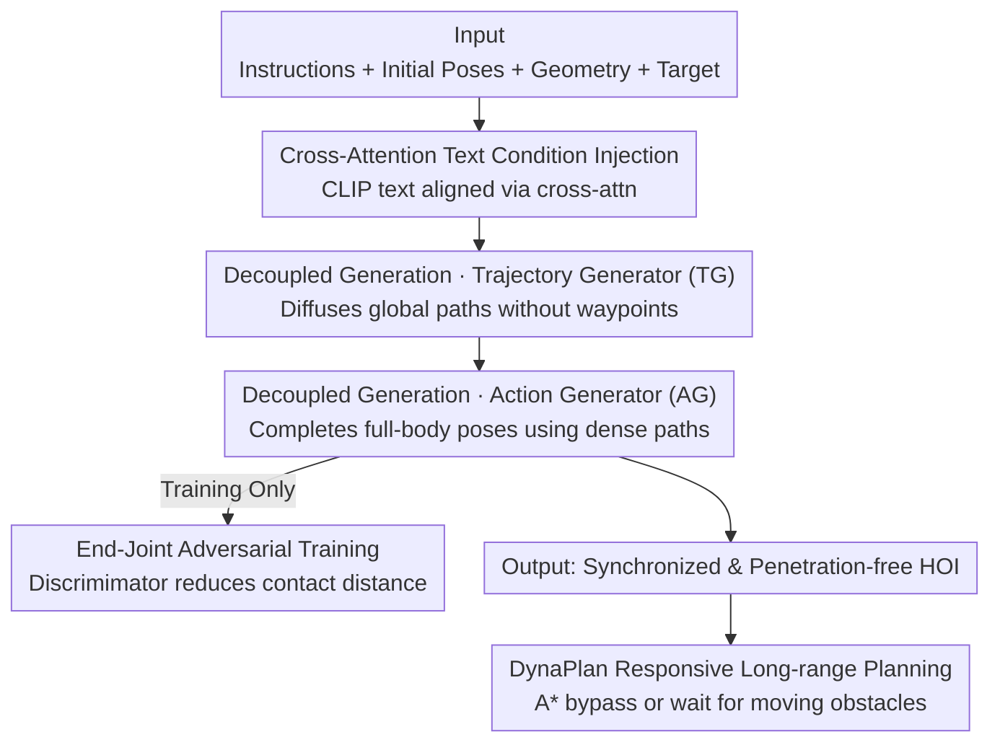

# Decoupled Generative Modeling for Human-Object Interaction Synthesis

**Conference**: CVPR 2026  
**Paper**: [CVF Open Access](https://openaccess.thecvf.com/content/CVPR2026/html/Jung_Decoupled_Generative_Modeling_for_Human-Object_Interaction_Synthesis_CVPR_2026_paper.html)  
**Code**: Not disclosed  
**Area**: Human Understanding / Motion Generation / Diffusion Models  
**Keywords**: Human-Object Interaction (HOI) Synthesis, Motion Generation, Diffusion Models, Adversarial Training, Trajectory Planning  

## TL;DR
DecHOI decomposes "Human-Object Interaction Synthesis" into two lightweight diffusion experts: a Trajectory Generator first plans global paths for the human and object without manual waypoints, followed by an Action Generator that completes fine-grained full-body actions conditioned on these paths. It utilizes an adversarial discriminator targeting end-joint contact dynamics to bridge the realism gap. DecHOI outperforms CHOIS/HOIFHLI on most metrics in FullBodyManipulation and 3D-FUTURE datasets and supports real-time replanning when encountering moving obstacles.

## Background & Motivation

**Background**: Human-Object Interaction (HOI) synthesis aims to generate a plausible 4D action sequence for a human moving an object to a target location, given a text instruction, initial poses of the human and object, and a target point. Prevalent methods (CHOIS, HOIFHLI, OMOMO) typically employ a single diffusion model to denoise the entire motion sequence at once, conditioned on "text + sparse 3D waypoints + initial states."

**Limitations of Prior Work**: This paradigm suffers from two specific issues. First, it **reliably depends on manual waypoints**—during inference, users must provide multiple intermediate points for the human to follow, which increases user burden and narrows the model's generative autonomy. Second, the **optimization complexity for a single network is explosive**. HOI requires the model to solve for both human and object poses in every frame simultaneously. Competing objectives—trajectory, pose, and contact—are pushed into one denoising network, making optimization difficult and frequently leading to local minima, resulting in lack of synchronization, object hovering, and penetration.

**Key Challenge**: Cramming a task that is naturally hierarchical (planning where to go before deciding how to move) into a single network leads to interference between global planning and fine-grained synthesis, resulting in a rugged loss landscape and unstable convergence.

**Goal**: To design a simpler, more flexible, and informative intermediate representation that removes the need for manual waypoints, reduces the optimization burden of a single network, and ensures generated actions are faithful to instructions and contact realism.

**Key Insight**: The authors observe that trajectory planning and action synthesis are two sub-problems with distinct properties. Planning involves low-dimensional global paths, while synthesis involves high-dimensional details of joint movements and surface contact. Assigning these to two specialized expert networks allows for purer optimization targets and smoother loss surfaces.

**Core Idea**: Replace joint modeling with a two-stage decoupled "trajectory generation + action generation" pipeline, supplemented by an end-joint adversarial discriminator to refine contacts, using dense trajectory conditions as a replacement for sparse manual waypoints.

## Method

### Overall Architecture
DecHOI is a two-stage decoupled diffusion framework. The input consists of text instructions, object geometry (represented via Basis Point Set), initial poses, and a target point. The output is a synchronized, realistic, penetration-free HOI sequence. The pipeline first uses a **Trajectory Generator (TG)** to diffuse global 3D paths for the human and object without intermediate waypoints. These paths serve as dense conditions for the **Action Generator (AG)**, which completes the full poses and joints, finally reconstructed via SMPL-X. During training, an **End-Joint Adversarial Discriminator** observes the contact dynamics of hands and feet relative to the object surface to force the AG toward realistic contact. For applications, **DynaPlan** adds collision detection and A* responsive replanning for long-sequence dynamic scenes.

### Key Designs

**1. Decoupled Generative Modeling: Experts for TG and AG**

This design directly addresses the "explosive complexity" of single-network joint pose estimation. Both generators are conditional diffusion networks predicting the clean sequence $\hat{x}_0$ instead of noise (found to be more stable for motion data and easier for applying guidance). The training loss is $L = \mathbb{E}_{x_0, n\sim[1,N]}\|\hat{x}_0 - x_0\|_1$. The TG receives object poses $P_o \in \mathbb{R}^{T\times 12}$ and human poses $P_h \in \mathbb{R}^{T\times D_h}$. A key trick is **keeping the initial frames clean and the final object position clean to anchor the target**, while adding noise to other frames. The TG diffuses continuous trajectories $\hat{T}_o \in \mathbb{R}^{T\times 3}$ and $\hat{T}_h \in \mathbb{R}^{T\times 3}$ without external waypoints; paths "grow" from instructions (e.g., "lift chair, move, put down"). The AG then replaces the global positions with these generated dense trajectories, simplifying its task to focus purely on fine-grained poses $\hat{P}_o$ and $\hat{P}_h$. Loss surface visualizations show that while CHOIS is filled with local minima, DecHOI's surface is smooth.

**2. Cross-Attention Text Condition Injection**

Prior works (CHOIS, HOIFHLI) concatenated CLIP text embeddings along the sequence dimension. DecHOI uses **cross-attention layers to explicitly align text embeddings $F_{text}$ with motion features**, allowing each frame to "query" the semantic intent. This maps verb sequences like "lift, then move" more accurately to temporal structures. Ablations show this improves R-precision (text-motion alignment) from 0.67 to 0.70, though it requires adversarial training to maintain contact quality.

**3. End-Joint Adversarial Training: Realizing Contacts**

Crucial HOI details lie in the hands and feet. The authors use a simple observation: **the most reliable cue for interaction realism is the distance from end-joints to the object surface**. A compact discriminator $\mathcal{D}$ evaluates hands $H$, feet $F$ (calculated via Forward Kinematics), and object surface points $B'$. Using a hinge loss, the discriminator scores frames $s_t^{(r)}$ (real) and $s_t^{(f)}$ (fake):

$$L_{\mathcal{D}} = \frac{1}{T}\sum_{t=1}^{T}\Big([1 - s_t^{(r)}]_+ + [1 + s_t^{(f)}]_+\Big), \qquad L_{G} = -\frac{1}{T}\sum_{t=1}^{T} s_t^{(f)}.$$

AG minimizes $L_G$ to fool the discriminator, acting as a **regularization term for complete contact**. Forward Kinematics loss $L_{FK} = \|\hat{H}_0 - H_0\|_1 + \|\hat{F}_0 - F_0\|_1$ is also used for supervision.

**4. DynaPlan: Responsive Long-range Planning**

DynaPlan assigns influence radii to agents and moving obstacles. When areas intersect, a collision is flagged, triggering **A* replanning**. It adaptively chooses to bypass or wait while maintaining the high-level intent. It uses a pre-trained trajectory predictor to anticipate opponent movement, transforming the system from "one-time plan" to "continuous update."

### Loss & Training
TG and AG are trained in stages. TG focuses on reconstruction: $L_{TG} = \mathbb{E}\|\hat{T}_0 - T_0\|_1$. AG reconstructs full motion $L_{AG}$ given paths, plus $L_{FK}$ and adversarial terms:

$$L = \lambda_{TG} L_{TG} + \lambda_{AG} L_{AG} + \lambda_{FK} L_{FK} + \lambda_G L_G.$$

Inference uses reconstruction guidance at each step: $\tilde{P}_0 = \hat{P}_0 - \alpha \Sigma_n \nabla_{P_n} F(\hat{P}_0)$, where $F$ penalizes joint-to-surface distance and foot floating/penetration.

## Key Experimental Results

### Main Results
On FullBodyManipulation, all baselines were evaluated in a "no waypoint" setting. DecHOI leads in most categories (↓ lower is better, ↑ higher is better, → closer to GT is better; GT DIV is 9.02):

| Method | $T_s$↓ | $T_e$↓ | FID↓ | R-prec↑ | DIV→ | $C_{F1}$↑ | $P_{hand}$↓ | MPJPE↓ |
|------|------|------|------|------|------|------|------|------|
| Pred-OMOMO | 2.34 | 9.66 | 13.01 | 0.63 | 6.68 | 0.52 | 0.59 | 23.63 |
| CHOIS | 1.92 | 8.01 | 1.58 | 0.68 | 8.31 | 0.58 | 0.66 | 18.86 |
| HOIFHLI | 1.73 | 7.65 | 2.06 | 0.62 | 8.55 | 0.64 | 0.58 | 19.31 |
| **Ours (DecHOI)** | **1.59** | **6.91** | **0.33** | **0.72** | **8.86** | **0.67** | **0.53** | **15.27** |

Notably, FID dropped from 1.58 to 0.33, and object translation error $T_{obj}$ dropped significantly, indicating the decoupled distribution is much closer to the ground truth.

### Ablation Study
On FullBodyManipulation (Baseline = Decoupling + Concatenation alignment):

| Config | $T_e$↓ | R-prec↑ | $C_{F1}$↑ | $P_{hand}$↓ | $P_{body}$↓ | Note |
|------|------|------|------|------|------|------|
| Baseline | 7.92 | 0.67 | 0.65 | 0.58 | 0.60 | High penetration, limited consistency |
| w/ Adversarial | 7.78 | 0.64 | 0.66 | 0.53 | 0.57 | Lower penetration, lower R-prec |
| w/ Cross-Attn | 7.82 | 0.70 | 0.54 | 0.56 | 0.56 | Stronger alignment, lower interaction |
| **Ours (Full)** | **6.91** | **0.72** | **0.67** | **0.53** | **0.54** | Complementary, best performance |

### Key Findings
- **Adversarial training and cross-attention are complementary**: Adversarial training reduces penetration but weakens text alignment; cross-attention improves alignment but weakens contact. Both are required for global optimality.
- **Decoupling reduces optimization complexity**: Visualizations confirm CHOIS has a rugged landscape while DecHOI remains smooth.
- **Superiority in long-range dynamic scenes**: DynaPlan achieves lower collision rates in cluttered indoor environments.
- **Human preference**: AMT studies show ~67–71% preference for DecHOI over baselines.

## Highlights & Insights
- **"Plan-then-act" decoupling is key to high-dimensional problems**: Separating low-dim paths from high-dim actions simplifies optimization—a strategy transferable to other generative tasks.
- **End-joint physical cues are brilliant**: Instead of complex labeling, using the distance between joint and surface as a fake/real discriminator effectively regularizes contact with low training cost.
- **Dense trajectories over sparse waypoints**: Using model-generated continuous paths as AG conditions removes user burden while providing stronger priors than traditional waypoints.
- **Constraint injection via clean frames**: Anchoring start/end states by excluding them from noise injection is an elegant way to enforce boundary constraints in diffusion models.

## Limitations & Future Work
- The method currently only handles **rigid bodies**; articulated objects (e.g., opening drawers) or deformable objects are not yet supported.
- Significant quantitative analysis is relegated to supplementary materials; some hyperparameters (weights $\lambda$, sample points $M$) are not explicitly detailed in the main text.
- DynaPlan depends on an **external trajectory predictor**; its robustness is limited by the accuracy of that predictor in highly unpredictable environments.
- Evaluations are focused on indoor environments with single opponents; large outdoor or multi-opponent scenes are untested.

## Related Work & Insights
- **vs CHOIS / HOIFHLI**: They use single networks and require manual 3D waypoints. DecHOI uses a two-stage expert approach (TG+AG), removing waypoints and improving FID from 1.58 to 0.33.
- **vs OMOMO**: OMOMO relies on frame-wise object motion; DecHOI is more flexible under limited inputs.
- **vs NIFTY / CG-HOI**: These methods use interaction fields or joint generation but remain largely static; DecHOI supports dynamic replanning via DynaPlan.

## Rating
- Novelty: ⭐⭐⭐⭐ The combination of decoupled planning and end-joint adversarial training is an effective new paradigm for HOI.
- Experimental Thoroughness: ⭐⭐⭐⭐ Comprehensive datasets and human studies, though some details are in the supplement.
- Writing Quality: ⭐⭐⭐⭐ Logical flow and convincing visualizations.
- Value: ⭐⭐⭐⭐ Strong practical utility for animation and embodied AI.

## Related Papers

- [\[CVPR 2026\] ReGenHOI: Unifying Reconstruction and Generation for 3D Human-Object Interaction Understanding](regenhoi_unifying_reconstruction_and_generation_for_3d_human-object_interaction_.md)
- [\[CVPR 2026\] GenHOI: Towards Object-Consistent Hand-Object Interaction with Temporally Balanced and Spatially Selective Object Injection](genhoi_towards_object-consistent_hand-object_interaction_with_temporally_balance.md)
- [\[CVPR 2026\] RegFormer: Transferable Relational Grounding for Efficient Weakly-Supervised Human-Object Interaction Detection](regformer_transferable_relational_grounding_for_efficient_weakly-supervised_huma.md)
- [\[CVPR 2026\] IMU-HOI: A Symbiotic Framework for Coherent Human-Object Interaction and Motion Capture via Contact-Conscious Inertial Fusion](imu-hoi_a_symbiotic_framework_for_coherent_human-object_interaction_and_motion_c.md)
- [\[CVPR 2026\] Bézier Degradation Modeling for LiDAR-based Human Motion Capture](bézier_degradation_modeling_for_lidar-based_human_motion_capture.md)

<!-- RELATED:END -->

<!-- RELATED:START -->

## Related Papers

- [\[CVPR 2026\] ReGenHOI: Unifying Reconstruction and Generation for 3D Human-Object Interaction Understanding](regenhoi_unifying_reconstruction_and_generation_for_3d_human-object_interaction_.md)
- [\[CVPR 2026\] SyncMos: Scalable Motion Synchronisation for Multi-Agent Scene Interaction](syncmos_scalable_motion_synchronisation_for_multi-agent_scene_interaction.md)
- [\[CVPR 2026\] RegFormer: Transferable Relational Grounding for Efficient Weakly-Supervised Human-Object Interaction Detection](regformer_transferable_relational_grounding_for_efficient_weakly-supervised_huma.md)
- [\[CVPR 2026\] PAMotion: Physics-Aware Motion Generation for Full-Body Interaction with Multiple Objects](pamotion_physics-aware_motion_generation_for_full-body_interaction_with_multiple.md)
- [\[CVPR 2026\] IMU-HOI: A Symbiotic Framework for Coherent Human-Object Interaction and Motion Capture via Contact-Conscious Inertial Fusion](imu-hoi_a_symbiotic_framework_for_coherent_human-object_interaction_and_motion_c.md)

<!-- RELATED:END -->
