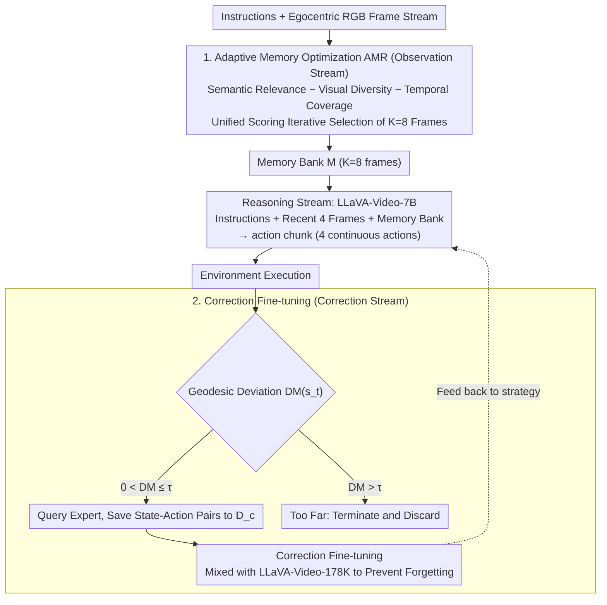

# DecoVLN: Decoupling Observation, Reasoning, and Correction for Vision-and-Language Navigation

**Conference**: CVPR2026  
**arXiv**: [2603.13133](https://arxiv.org/abs/2603.13133)  
**Code**: [Project Page](https://arxiv.org/abs/2603.13133) (Project Page and Code links provided)  
**Area**: Human Understanding / Embodied Navigation  
**Keywords**: Vision-and-Language Navigation, Adaptive Memory Optimization, Correction Fine-tuning, POMDP, Long-term Navigation

## TL;DR

The DecoVLN framework is proposed to decouple the three processes of observation, reasoning, and error correction in VLN tasks. By utilizing an adaptive memory optimization mechanism and a state-action pair-based correction fine-tuning strategy, the framework achieves state-of-the-art (SOTA) performance on R2R-CE and RxR-CE using only egocentric RGB input.

## Background & Motivation

1.  **Vision-and-Language Navigation (VLN)** requires agents to navigate unseen 3D environments according to natural language instructions, which is a core task in Embodied AI.
2.  **Perceptual Deficiencies of Existing Methods**: The "Stop-and-Think" paradigm suffers from perceptual blind spots (missing critical visual cues during movement), while the "Full-History Streaming" paradigm dilutes critical information density by retrieving context through fixed sampling or heuristic strategies.
3.  **Compound Error Problem**: As a sequential decision-making task, VLN is highly susceptible to compound errors, where early minor mistakes accumulate over time, leading the agent to deviate significantly from the target path.
4.  **Insufficient Existing Augmentation Methods**: Most methods focus on multi-modal trajectory augmentation to improve open-loop action prediction but lack effective closed-loop reflection and online error correction capabilities.
5.  **Difficulties in Long-term Memory Construction**: Uniform sampling strategies discard cues from critical navigation nodes and disrupt temporal coherence; although StreamVLN introduces a Slow-Fast memory mechanism, it relies on depth sensors.
6.  **Spatial Understanding Limitations of VLMs**: Existing Vision-Language Models show limited performance in 3D spatial understanding, failing to establish a correspondence between local egocentric observations and globally consistent spatial structures.

## Method

### Overall Architecture

DecoVLN models VLN as a POMDP tuple $M=(S,A,T,R,\Omega,O)$, where the agent learns a strategy $\pi(H_t,I)$ to maximize the expected cumulative reward. Its core idea is to decouple the previously entangled observation, reasoning, and correction processes: the observation stream continuously perceives during movement, using Adaptive Memory Optimization (AMR) to filter frames with high information density into a memory bank; the reasoning stream allows the LLM to output an action chunk containing multiple continuous actions based on instructions, the current frame, and the memory bank; the correction stream equips the model with introspection and self-correction capabilities through state-action pair-based fine-tuning. This decoupling avoids high latency from thinking while moving and allows memory and correction to be optimized independently.

### Key Designs

**1. Adaptive Memory Optimization (AMR): Formulating "What to Remember" as a Solvable Scoring Problem**

Long-term memory is a significant challenge in VLN—uniform sampling loses key navigation nodes and disrupts temporal coherence, while full-history streaming dilutes the density of critical information. AMR formalizes memory construction as an optimization problem: at each time step, $K$ frames are selected from a candidate pool $\mathcal{C}$ to form a refined memory $\mathcal{M}$ by maximizing a combined score:

$$f^* = \arg\max_{f \in \mathcal{C} \setminus \mathcal{M}} \left[ \lambda_R \cdot \text{Sim}_{\text{Sem}}(f, I) - (1-\lambda_R) \cdot \left( w_V \cdot \text{Sim}_{\text{Vis}}(f, \mathcal{M}) + w_T \cdot \text{Sim}_{\text{Temp}}(f, \mathcal{M}) \right) \right]$$

Three dimensions address distinct issues: Semantic Relevance $\text{Sim}_{\text{Sem}}$ (cosine similarity between candidate frames and instructions) favors task-relevant frames; Visual Diversity $\text{Sim}_{\text{Vis}}$ (maximum visual similarity between candidate frames and selected memory frames, used as a penalty) prevents the redundancy of nearly identical scenes; Temporal Coverage $\text{Sim}_{\text{Temp}} = \frac{1}{\min_{m \in \mathcal{M}} |t_f - t_m| + \epsilon}$ penalizes candidate frames clustered at the same moment. This ensures the memory bank retains key nodes that are relevant, non-repetitive, and temporally distributed.

**2. Correction Fine-tuning: Precisely Selecting Reliable Correction Data at the Step Level**

VLN involves sequential decision-making, where early minor errors accumulate over time and lead the agent astray, yet most methods only perform open-loop action prediction and lack closed-loop correction. DecoVLN collects correction signals at the step level rather than the episode level, using geodesic distance to quantify how far the current state deviates from the expert path:

$$DM(s_t) = \min_{s^* \in P_{exp}} d_g(s_t, s^*)$$

A deviation threshold $\tau$ is established: when $0 < DM(s_t) \leq \tau$, the agent is within a trustworthy region, and expert strategies are queried to obtain correction actions, which are stored in the correction dataset $\mathcal{D}_c$; if $DM(s_t) > \tau$, it indicates the deviation is too extreme, and the current episode is terminated to filter out low-quality data. This is mixed with LLaVA-Video-178K to prevent catastrophic forgetting. Compared to DAgger's episode-level approach, this trustworthy region filtering achieves better results with less data (180K vs 240K).

### Loss & Training

- **Base Model**: LLaVA-Video-7B (SigLIP vision encoder + Qwen2-7B language model)
- **Optimizer**: AdamW, LLM learning rate of $2 \times 10^{-5}$, vision encoder learning rate of $5 \times 10^{-6}$
- **Training Data**: Approximately 360K navigation samples + 180K correction samples
- **Inference Input**: Instructions + Memory Bank (K=8) + Recent 4 frames → Output 4-step action chunk

## Key Experimental Results

### Main Results on R2R-CE & RxR-CE Val-Unseen

| Method | Input | R2R NE↓ | R2R SR↑ | R2R SPL↑ | RxR SR↑ | RxR SPL↑ | RxR nDTW↑ |
| :--- | :--- | :--- | :--- | :--- | :--- | :--- | :--- |
| StreamVLN | RGB | 5.43 | 52.8 | 47.2 | 48.6 | 42.5 | 60.2 |
| NaVILA* | RGB | 5.22 | 54.0 | 49.0 | 49.3 | 44.0 | 58.8 |
| ETPNav | RGB+Pano+Depth | 4.71 | 57.0 | 49.0 | 54.7 | 44.8 | 61.9 |
| **DecoVLN** | **RGB** | **5.01** | **56.3** | **50.5** | **54.2** | **46.3** | **63.5** |

- Achieved SR +3.5% and SPL +3.3% improvement over StreamVLN on R2R.
- Achieved SR +5.6% and SPL +3.8% improvement on RxR.
- Surpassed most multi-sensor methods using panoramic/depth/odometry while using only RGB input.

### Ablation Study

| AMR | CF | NE↓ | SR↑ | SPL↑ |
| :--- | :--- | :--- | :--- | :--- |
| ✗ | ✗ | 5.89 | 47.3 | 43.9 |
| ✓ | ✗ | 5.50 | 50.9 | 46.1 |
| ✓ | ✓ | **5.01** | **56.3** | **50.5** |

- AMR contributed SR +3.6% and SPL +2.2%.
- Correction fine-tuning (CF) further improved SR by +5.4% on top of AMR, totaling a +9.0% SR gain.
- A memory bank size of K=8 proved the best balance between performance and efficiency.
- A trustworthy region threshold of $\tau=3$ proved optimal; better performance was achieved with less data (180K vs 240K) compared to DAgger.

## Highlights & Insights

- **Decoupled Design**: Decoupling the observation, reasoning, and correction processes avoids high-latency bottlenecks caused by VLM autoregressive generation.
- **Theoretical Basis for Memory Optimization**: Formalizing memory construction as an optimization problem jointly considers semantic relevance, visual diversity, and temporal coverage.
- **Efficient Correction Strategy**: Step-level correction combined with trustworthy region filtering demonstrates superior data efficiency over DAgger.
- **RGB-Only Superiority**: Surpasses multi-sensor methods without requiring depth, panoramic views, or odometry, resulting in a concise architecture.
- **Real-world Deployment**: Successfully deployed on a Unitree GO2 quadruped robot, demonstrating robust sim-to-real transferability.
- **Emergent Behavior**: The robot actively performs lateral fine-tuning during movement to keep critical navigation points within the field of view.

## Limitations & Future Work

- The three weights in memory optimization ($\lambda_R$, $w_V$, $w_T$) require manual tuning and lack an adaptive learning mechanism.
- Evaluations were conducted only in the Matterport3D environment, excluding larger-scale or outdoor scenes.
- Correction fine-tuning relies on the Habitat shortest path follower as an expert strategy, which is difficult to obtain in real-world environments.
- The action chunk size is fixed at 4 steps; dynamic action chunk lengths have not been explored.
- Real-world experiments were limited to office environments, lacking scene diversity.
- Comparisons with other error correction methods (e.g., RL-based methods) were not performed.

## Related Work & Insights

- **vs NaVid**: The first method to directly fine-tune VLM for end-to-end navigation, but lacks long-term memory management; DecoVLN achieves +19.3% in R2R SR.
- **vs StreamVLN**: Proposes a Slow-Fast memory mechanism but relies on depth sensors for voxel construction; DecoVLN surpasses it using only RGB.
- **vs NaVILA**: Uses additional large-scale datasets for training; DecoVLN remains competitive without such extra data.
- **vs DAgger**: Traditional DAgger collects correction data at the episode level, while DecoVLN accurately filters trustworthy region data at the step level, surpassing DAgger's performance with 180K vs 240K samples.

## Rating

- Novelty: ⭐⭐⭐⭐ — The combination of decoupled observation/reasoning/correction, formalized memory optimization, and state-action pair correction strategies is novel.
- Experimental Thoroughness: ⭐⭐⭐⭐ — Includes multi-benchmark comparisons, detailed ablations, long-term navigation validation, and real robot deployment.
- Writing Quality: ⭐⭐⭐⭐ — Clear structure, rigorous problem modeling, and standardized method descriptions.
- Value: ⭐⭐⭐⭐ — Significantly outperforms multi-sensor methods using only RGB input, offering high practical deployment value.

<!-- RELATED:START -->

## Related Papers

- [\[CVPR 2026\] AwareVLN: Reasoning with Self-awareness for Vision-Language Navigation](awarevln_reasoning_with_self-awareness_for_vision-language_navigation.md)
- [\[ICLR 2026\] JanusVLN: Decoupling Semantics and Spatiality with Dual Implicit Memory for Vision-Language Navigation](../../ICLR2026/robotics/janusvln_decoupling_semantics_and_spatiality_with_dual_implicit_memory_for_visio.md)
- [\[CVPR 2026\] Progress-Think: Semantic Progress Reasoning for Vision-Language Navigation](progress-think_semantic_progress_reasoning_for_vision-language_navigation.md)
- [\[CVPR 2026\] ProFocus: Proactive Perception and Focused Reasoning in Vision-and-Language Navigation](profocus_proactive_perception_and_focused_reasoning_in_vision-and-language_navig.md)
- [\[CVPR 2026\] FantasyVLN: Unified Multimodal Chain-of-Thought Reasoning for Vision-and-Language Navigation](fantasyvln_unified_multimodal_chain-of-thought_reasoning_for_vision-and-language.md)

<!-- RELATED:END -->
