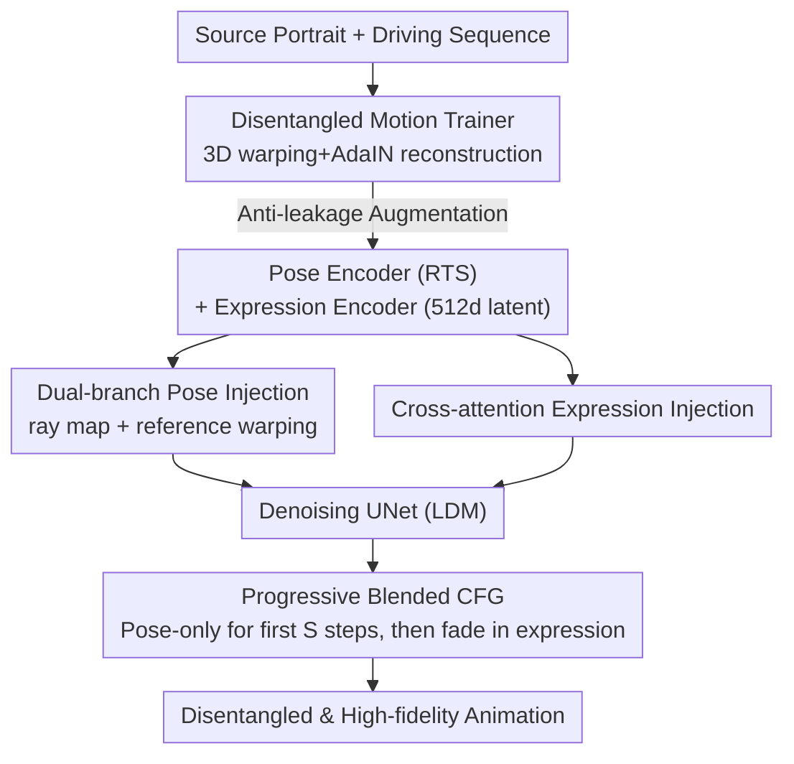

# DeX-Portrait: Disentangled and Expressive Portrait Animation via Explicit and Latent Motion Representations

**Conference**: CVPR 2026  
**Paper**: [CVF Open Access](https://openaccess.thecvf.com/content/CVPR2026/html/Shi_DeX-Portrait_Disentangled_and_Expressive_Portrait_Animation_via_Explicit_and_Latent_CVPR_2026_paper.html)  
**Code**: [Project Page](https://syx132.github.io/DeX-Portrait/) (Code status to be confirmed)  
**Area**: Human-centric Understanding / Portrait Animation  
**Keywords**: Portrait Animation, Pose-Expression Disentanglement, Diffusion Models, Explicit Motion Representation, Classifier-Free Guidance

## TL;DR
By employing a hybrid motion representation—explicit global transformation for head pose and implicit latent code for facial expressions—alongside dual-branch pose injection and progressive blended CFG, this work achieves **high-fidelity disentangled control** of pose and expression in one-shot portrait animation for the first time, supporting fine-grained editing of pose or expression independently.

## Background & Motivation

**Background**: One-shot portrait animation animates a source person based on the head movement and expressions of a driving video. Recent mainstream approaches fine-tune pre-trained diffusion models (e.g., the reference UNet paradigm in LDM or Animate Anyone), demonstrating high image quality and expressiveness.

**Limitations of Prior Work**: Although these diffusion methods produce high-quality images, they fail to achieve **disentangled control of pose and expression**. They cannot perform "expression-only" (changing expression while keeping the head still) or "pose-only" (changing head pose while keeping the source expression) edits because pose and expression signals are internally entangled. State-of-the-art (SOTA) X-NeMo encodes the entire motion into a 1D latent code; while it captures fine expressions (e.g., sticking out the tongue or frowning), pose components (especially translation and scale) are packed into the same latent, leading to imprecise control. Another approach uses 3DMM pose/expression blendshape parameters, which are naturally disentangled but limited by the inaccuracy of 3DMM trackers and the restricted expressiveness of blendshapes for complex or subtle expressions.

**Key Challenge**: The tug-of-war between **expressiveness** and **disentanglement/controllability**. Implicit latents are expressive but entangled, while explicit 3DMMs are disentangled but lack expressiveness. Pose itself is a low-degree-of-freedom rigid global transformation; forcing it into a high-dimensional latent is both wasteful and contaminates expression signals.

**Goal**: To achieve portrait animation that is both "highly expressive" and "pose-expression disentangled," supporting expression-only and pose-only editing.

**Key Insight**: Pose and expression are inherently different quantities. Head pose is a **rigid global transformation** (rotation/translation/scale with low DoF) suitable for explicit representation. Facial expression is a **high-dimensional non-rigid deformation** suitable for implicit latents. Instead of using a single representation for both, **each should use its most appropriate representation**.

**Core Idea**: Pose is represented by explicit RTS (rotation-translation-scale) global transformations, and expression is represented by a 512-dimensional latent code. Two mutually disentangled encoders are trained, and their outputs are injected into the diffusion model using matching mechanisms (dual-branch spatial injection for pose, cross-attention for expression).

## Method

### Overall Architecture
DeX-Portrait follows a two-stage process. **The first stage is a GAN-based motion trainer**, aimed at training two non-interfering encoders: an explicit pose encoder (outputting RTS transformations) and an implicit expression encoder (outputting 512D latents). Disentanglement is enforced via 3D warping + AdaIN reconstruction and a set of anti-leakage augmentations. **The second stage is the diffusion animation generator**: the two encoders are frozen, and a Latent Diffusion Model (LDM) with a reference UNet paradigm is used. The driving pose is injected via **dual branches**, and the driving expression is injected via cross-attention into the denoising UNet. Finally, **progressive blended CFG** is used during the early denoising steps to stabilize structure before introducing expressions, maintaining identity consistency.

Inputs: Source portrait $I_s$ + driving sequence $\{I_d\}$; Output: Animation sequence with identity/background from the source and pose/expression from the driving.

### Key Designs

**1. Disentangled Motion Trainer: Forcing pose and expression into two non-leaking encoding paths via GAN reconstruction**

This step solves how to obtain cleanly disentangled signals. The trainer is a StyleGAN2-like reconstruction GAN comprising three encoders (3D appearance, explicit pose, and implicit expression). The pose encoder (ConvNeXt) outputs a 6-DoF global transformation $\mathbf{P}=\begin{bmatrix} s\mathbf{R} & \mathbf{t}\end{bmatrix}\in\mathbb{R}^{3\times4}$ (3 rotation, 2 translation, 1 scale). Its low DoF prevents it from capturing expression information. The expression encoder (FAN) outputs a 512D latent. During reconstruction, 3D appearance features from the source are warped using $\mathbf{P}_d\mathbf{P}_s^{-1}$ from the source pose to the driving pose, and the expression latent modulates the generator via **AdaIN**. Pose follows "geometric warping" while expression follows "AdaIN style modulation," structurally separating the two.

**2. Pose/Expression Augmentation: Cutting off information leakage at the input to ensure encoder disentanglement**

Structural design alone is insufficient—the expression encoder might learn head pose from the full face image. This design applies targeted augmentations at the **image level**: for pose inputs, eye and mouth regions are masked using MediaPipe landmarks to remove expression information. For expression inputs, random rotation or view changes (from multi-view datasets) are applied to make the encoder insensitive to rotation, and the face is cropped via MediaPipe bounding boxes and resized to a fixed $224\times224$ to eliminate translation and scale. This ensures each encoder only "sees" its respective signal. Removing these augmentations significantly degrades pose/expression consistency (see Tab. 2).

**3. Dual-branch Pose Injection: Complementary ray maps for long-range correspondence and reference warping for boundary alignment**

Injecting low-DoF RTS pose into a diffusion model typically involves rendering 2D skeletons or spheres, which may not capture head pose accurately. This work uses **two branches**. The first is a **ray map**: inspired by camera pose control, head pose is converted into a Plücker ray map defined as:

$$\mathrm{RayMap}(u,v)=\mathbf{P}\,[u,v,0,0]^\top-[u,v,0,0]^\top,\quad (u,v)\in[-1,1]^2$$

Each pixel is a vector from a standard pose to the target pose. Concatenating source/driving ray maps with noise latents allows precise control and identity preservation even under large pose differences. However, the ray map alone can cause **boundary misalignment** during expression-only editing. Thus, a second branch, **reference warping**, is added: leveraging the 3D-aware capabilities of LDMs, 2D source features from the reference UNet are reshaped to 3D, warped to the driving pose, flattened back to 2D, and **element-wise added** to the denoising UNet features. Since warped source features are spatially aligned with denoising features, this branch provides a stable signal for expression-only scenarios, eliminating seams.

**4. Progressive Blended CFG: Stabilizing structure and identity with pose-only steps before introducing expressions**

Identity, pose, and expression conditions are often entangled during denoising. Standard CFG can lead to identity drift during large pose changes. Analysis of DDIM sampling reveals that providing all conditions early generates correct global structure, but **pose-only** conditioning best preserves identity consistency. A progressive strategy is designed: for 35 DDIM steps, the first $S=5$ steps **exclude expression conditions** to stabilize identity/structure. The next 5 steps **linearly fade in** the expression condition, with remaining steps using all conditions. Formally ($t$ is the denoising step, $\mathbf{c}|_{\text{exp}}$ denotes conditions without expression):

$$\widetilde{\epsilon}_\theta^{*}=\begin{cases}\widetilde{\epsilon}_\theta(z_t,\mathbf{c}|_{\text{exp}};t) & 30<t\le35\\[2pt]\widetilde{\epsilon}_\theta(z_t,\mathbf{c}|_{\text{exp}};t)\tfrac{t-25}{5}+\widetilde{\epsilon}_\theta(z_t,\mathbf{c};t)\tfrac{30-t}{5} & 25<t\le30\\[2pt]\widetilde{\epsilon}_\theta(z_t,\mathbf{c};t) & t\le25\end{cases}$$

Base CFG uses $\widetilde{\epsilon}_\theta(z_t,\mathbf{c};t)=\omega\,\hat{\epsilon}_\theta(z_t,\mathbf{c};t)+(1-\omega)\hat{\epsilon}_\theta(z_t,\varnothing;t)$ with $\omega=2.5$. $S=5$ is found to be the optimal balance.

### Loss & Training
Three-stage training at 512×512 resolution using multi-view datasets (NerSemble, ava-256) and in-the-wild datasets (PFHQ, VFHQ):
1. **Motion Training**: Train disentangled encoders, batch 112, lr $1\times10^{-4}$, 200k iter.
2. **Diffusion Training**: Freeze encoders, train reference and denoising UNets, batch 48, lr $1\times10^{-5}$, 120k iter.
3. **Temporal Training**: Train temporal modules using 24-frame sequences, batch 8, lr $1\times10^{-5}$, 80k iter.
The diffusion backbone uses LDM (DDPM target, MSE loss $\mathcal{L}_\theta=\mathbb{E}_{\epsilon,t}\|\epsilon_t-\hat{\epsilon}_\theta(z_t,\mathbf{c};t)\|_2^2$).

## Key Experimental Results

Evaluation spans three scenarios: self-reenactment (GT available, metrics: PSNR/SSIM/LPIPS), cross-reenactment (no GT, metrics: CSIM for identity, AED for expression, APD for pose), and disentangled-reenactment (pose and expression from different videos).

### Main Results

| Scenario | Metric | Ours | Strongest Baseline | Comparison |
|------|------|------|----------|------|
| Self-Reenactment | PSNR↑ | **28.590** | Wan-Animate 27.970 | Highest |
| Self-Reenactment | SSIM↑ | 0.862 | Wan-Animate **0.865** | Slight trail |
| Self-Reenactment | LPIPS↓ | **0.088** | Wan-Animate 0.098 | Lowest |
| Cross-Reenactment | CSIM↑ | **0.623** | Wan-Animate 0.551 | Best Identity |
| Cross-Reenactment | AED↓ | **0.0515** | X-NeMo 0.0518 | Best Expression |
| Cross-Reenactment | APD↓ | **0.145** | HelloMeme 0.173 | Best Pose |
| Disentangled-Reenact. | CSIM/AED/APD | **0.631 / 0.0546 / 0.100** | LivePortrait 0.458 / 0.0695 / 0.195 | Comprehensive Lead |

In disentangled-reenactment, X-NeMo, HunyuanPortrait, and Wan-Animate are "N/A" (no support). GAN methods (LivePortrait, EMOPortraits) are significantly outperformed.

### Ablation Study

| Configuration | Cross CSIM↑ | Cross AED/APD↓ | Disent. CSIM↑ | Disent. AED/APD↓ | Description |
|------|------|------|------|------|------|
| w/o ray map | 0.609 | 0.0506 / 0.162 | 0.609 | 0.0542 / 0.105 | APD degrades, CSIM drops |
| w/o warping | 0.619 | 0.0507 / 0.166 | 0.631 | 0.0573 / 0.121 | Expression boundary issues |
| w/o augmentation | 0.619 | 0.0583 / 0.283 | 0.629 | 0.0634 / 0.168 | APD spikes (0.283/0.168) |
| **Ours (full)** | **0.623** | **0.0515 / 0.145** | **0.631** | **0.0546 / 0.100** | Optimal performance |

### Key Findings
- **Augmentation is critical**: Removing anti-leakage augmentation nearly doubles APD (0.145 to 0.283) in cross-reenactment, proving that disentanglement relies on physical isolation at the input level rather than just network architecture.
- **Ray maps and reference warping are complementary**: Ray maps handle long-range correspondence during large pose changes; reference warping handles boundary/background alignment in expression-only edits.
- **$S=5$ is the "sweet spot" for progressive CFG**: Stabilizing structure first improves identity in side-view scenarios without sacrificing expression accuracy.

## Highlights & Insights
- **Representation based on physical properties**: Using explicit RTS for rigid global pose and latent codes for non-rigid local expression avoids entanglement at the source. This principle is transferable to other "global rigid + local non-rigid" control tasks.
- **Input-side disentanglement** is more direct than loss-based regularization. Using landmark masking and resizing to "erase" unwanted information is a practical and effective trick.
- **Dual-branch complementarity**: Single pose injection methods often trade off between global consistency and local boundary alignment. Combining global ray maps with local warping satisfies both.
- **Progressive CFG** reformulates the "structure-to-detail" denoising prior as a condition scheduling strategy, serving as a lightweight trick for identity stability.

## Limitations & Future Work
- **Heavy dependence on multi-view data**: The expression augmentation requires view changes (e.g., from NerSemble); disentanglement quality may degrade in purely monocular scenarios.
- **Pipeline complexity**: The multi-stage process involving a GAN trainer, diffusion generator, and temporal modules results in high training costs.
- **Rigid pose definition**: 6-DoF RTS cannot capture local non-rigid head deformations (e.g., hair movement or complex occlusions).
- **Global expression latent**: Control over spatially local expressions (e.g., moving only the left eye) is limited by the global cross-attention injection.

## Related Work & Insights
- **vs X-NeMo**: X-NeMo packs pose and expression into a 1D latent, leading to imprecise pose control; Ours enables precise disentangled control (0.145 vs 0.551 APD).
- **vs LivePortrait / EMOPortraits**: These GAN-based methods support disentanglement but suffer from blur and motion artifacts; Ours leverages diffusion for high-fidelity outputs while using GANs only for learning disentangled encodings.
- **vs 3DMM Blendshape methods**: 3DMMs are natural for disentanglement but lack expression detail; Ours maintains the expressive power of latent codes.

## Rating
- Novelty: ⭐⭐⭐⭐⭐ Hybrid explicit+implicit representation + dual-branch injection; first to achieve high-fidelity disentangled pose-expression control in diffusion.
- Experimental Thoroughness: ⭐⭐⭐⭐ Extensive scenarios and baselines, though disentanglement metrics are indirect.
- Writing Quality: ⭐⭐⭐⭐ Clear motivation and design-ablation alignment.
- Value: ⭐⭐⭐⭐⭐ High utility for fine-grained editing in digital content creation; disentangled representation logic is transferable.

<!-- RELATED:START -->

## Related Papers

- [\[CVPR 2025\] Sonic: Shifting Focus to Global Audio Perception in Portrait Animation](../../CVPR2025/human_understanding/sonic_shifting_focus_to_global_audio_perception_in_portrait_animation.md)
- [\[CVPR 2025\] MoEE: Mixture of Emotion Experts for Audio-Driven Portrait Animation](../../CVPR2025/human_understanding/moee_mixture_of_emotion_experts_for_audio-driven_portrait_animation.md)
- [\[CVPR 2026\] Gaussian-Mixture Latent Flow for Stochastic 3D Human Motion Prediction](gaussian-mixture_latent_flow_for_stochastic_3d_human_motion_prediction.md)
- [\[CVPR 2026\] ParTY: Part-Guidance for Expressive Text-to-Motion Synthesis](party_part-guidance_for_expressive_text-to-motion_synthesis.md)
- [\[CVPR 2026\] Hierarchical Enhancement of Semantic Priors for Disentangled Text-Driven Motion Generation](hierarchical_enhancement_of_semantic_priors_for_disentangled_text-driven_motion_.md)

<!-- RELATED:END -->
