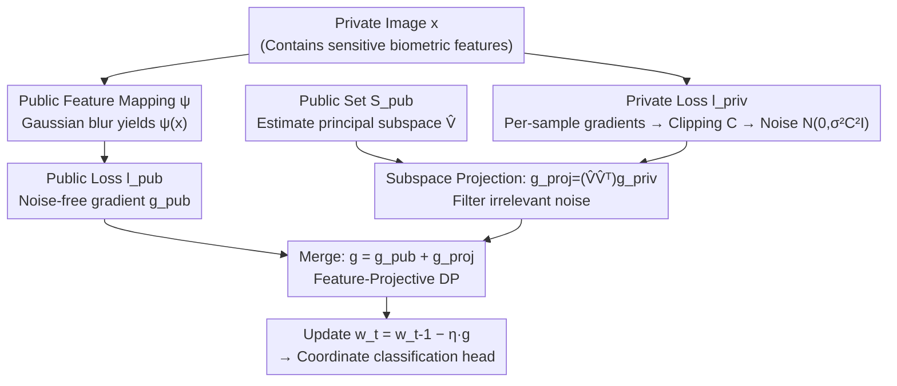

# Differentially Private 2D Human Pose Estimation

**Conference**: CVPR 2026  
**Paper**: [CVF Open Access](https://openaccess.thecvf.com/content/CVPR2026/html/Sivangi_Differentially_Private_2D_Human_Pose_Estimation_CVPR_2026_paper.html)  
**Code**: [Project Page](https://bhairava2898.github.io/DP2DHPE/)  
**Area**: Human Understanding  
**Keywords**: Differential Privacy, 2D Human Pose Estimation, DP-SGD, Subspace Projection, Feature-level Privacy

## TL;DR
The first unified differential privacy framework for 2D human pose estimation: it combines two denoising mechanisms, "Gradient Subspace Projection" and "Feature-level Differential Privacy (adding noise only to private features of the raw image)," into Feature-Projective DP. Under formal privacy guarantees, it significantly narrows the accuracy gap with non-private models (achieving 82.61% PCKh@0.5 on MPII at $\varepsilon=0.8$, recovering 73% of the privacy-induced loss).

## Background & Motivation
**Background**: 2D Human Pose Estimation (HPE) converts raw images into structured keypoints, serving as a foundational task for healthcare, action recognition, and human-computer interaction. However, it relies on high-quality images where raw data contains identifiable biometric features such as faces and body shapes. Trained networks "memorize" training data, allowing attackers to reconstruct patients' appearances or even home environments via model inversion, membership inference, or gradient reconstruction.

**Limitations of Prior Work**: Past privacy protection in HPE almost exclusively relied on data anonymization—blurring, pixelation, de-skinning, or templated body modeling. These methods have three flaws: (1) They are task-specific and destroy data utility (removing faces might keep joint positions but destroys clinical clues needed for stress assessment or abnormal gait detection); (2) They lack formal privacy guarantees, suffering from the "onion effect" where stripping one layer of protection exposes the next; (3) They do not prevent memory attacks on the neural network.

**Key Challenge**: Differential Privacy (DP) provides provable guarantees, but the standard implementation, DP-SGD, inflicts severe accuracy drops due to clipping and Gaussian noise on gradients. HPE is a fine-grained spatial prediction task extremely sensitive to precision, making standard DP-SGD nearly unusable. This creates an irreconcilable tension between privacy and utility that has never been systematically studied in the HPE context.

**Goal**: To suppress utility loss in HPE under formal DP guarantees and establish the first systematic DP-HPE benchmark.

**Key Insight**: The authors leverage two observations: (a) Effective gradient updates in deep network training concentrate in a low-dimensional subspace much smaller than the full parameter space; noise added in irrelevant directions is wasted. (b) Only fine-grained private information in an image is truly sensitive; coarse pose cues (which survive blurring) are essentially "public" and do not require noise.

**Core Idea**: Use two complementary denoising mechanisms—subspace projection and feature-level privacy. Projects noisy gradients back into a low-dimensional signal subspace to filter out ineffective noise, while only adding noise to the private components of the raw image, allowing public features to contribute noise-free gradients. The combination yields a **multiplicative** gain in the signal-to-noise ratio.

## Method

### Overall Architecture
The backbone is TinyViT (a four-stage lightweight hierarchical Transformer; fewer parameters are critical as DP-SGD error bounds grow with parameter count), followed by a **coordinate classification** keypoint head. Continuous coordinates $(x_i, y_i)$ are quantized into discrete bins $p'_i = (\lfloor x_i \cdot k \rfloor, \lfloor y_i \cdot k \rfloor)$ with a scaling factor $k \ge 1$. The convolutional head outputs 16-channel feature maps (each corresponding to a joint), which are upsampled, flattened, and used for classification over discrete bins before decoding back to continuous coordinates. Gaussian label smoothing provides soft labels for neighboring bins during training.

The privacy component runs three paths simultaneously in each iteration (see diagram below): an **independent public dataset $S_{pub}$** (COCO, same distribution as the private set) is used to estimate the principal subspace of the gradient covariance and periodically update the projection matrix; per-sample gradients are computed for the **private batch**, clipped, noised, and then denoised via projection; and noise-free gradients are computed for the **public feature batch** (derived from private images via $\psi$ Gaussian blur). Finally, the "noise-free public gradients" and "denoised private gradients" are summed to update parameters.

### Key Designs

**1. Subspace Projective DP-SGD: Keeping noise only in "signal" directions**

A pain point of DP-SGD is that noise $\mathcal{N}(0, \sigma^2 C^2 \mathbf{I})$ is spread **uniformly** across all $p$ gradient components, whereas directions carrying pose information are few. The authors use a small public auxiliary set $S_{pub}$ to estimate the second moment of gradients $M(w) = \frac{1}{m} \sum_{i=1}^m \nabla l (w, \tilde z_i) \nabla l (w, \tilde z_i)^\top$, taking the top-$k$ eigenvectors to form a projection matrix $\hat V \in \mathbb{R}^{p \times k}$ ($k \ll p$), which is updated periodically. For each private mini-batch, gradients are clipped $\tilde g_i = \text{clip}(\nabla l(w, z_i), C)$, aggregated, noised to get $g$, and then projected:

$$g_{proj} = (\hat V \hat V^\top) g$$

This restricts updates to the subspace with the highest gradient variance, discarding noise in non-informative directions. Since projection occurs **after** noise addition, it is a post-processing step; by the post-processing invariance of DP, the $(\varepsilon, \delta)$ guarantee remains intact while utility improves. Theoretically, it reduces the privacy error from $\tilde O(p \cdot G^2)$ to $\tilde O(k \cdot C^2)$.

**2. Feature-level Differential Privacy (FDP): Noising only "sensitive raw images"**

Treating the entire image as private is wasteful. FDP uses a public feature mapping $\psi$ (Gaussian blur) to split each image into a public variant $\psi(x)$ and a private raw image $x$, decomposing the total loss into:

$$l(w, x) = l_{priv}(w, x) + l_{pub}(w, \psi(x))$$

Formally, a mechanism $M$ satisfies $f$-FDP if for any adjacent datasets differing only in one image-label pair $(x_i, y_i) \neq (x'_i, y'_i)$ but where **public representations are identical** $\psi(x_i) = \psi(x'_i)$, the privacy property holds. Consequently, only the $l_{priv}$ gradient capturing sensitive fine-grained details requires clipping and noise, while the $l_{pub}$ gradient is noise-free. Given the same privacy budget, the noise budget is spent more efficiently.

**3. Feature-Projective DP: Multiplicative superposition of denoising**

FDP addresses "what to noise," while projection addresses "how to filter the noise." In each iteration $t$, a public batch computes noise-free gradients $g_{pub}^t$, and a private batch computes clipped, noised, and projected gradients $g_{proj}^t$. The final gradient is:

$$g_t = g_{pub}^t + g_{proj}^t, \quad w_t = w_{t-1} - \eta_t g_t$$

The "multiplicative" benefit comes from the convergence analysis (Eq. 13), which bounds the average gradient norm by two terms: privacy error $\tilde O(\frac{k \rho C^2}{n \varepsilon})$ and reconstruction error. Projection reduces the dimension from $p$ to $k$, while FDP reduces the gradient norm from global $G$ to private threshold $C$ ($C \le G$). Having both $k$ and $C^2$ in the privacy error term provides utility gains unreachable by either method alone.

### Loss & Training
The total loss is the $l_{priv} + l_{pub}$ decomposition. Gaussian label smoothing is used on the coordinate classification head. Three training scenarios were compared: (i) fine-tuning by freezing the first three stages and tuning the fourth stage + all LayerNorms; (ii) full fine-tuning (COCO init); (iii) training from scratch. COCO served as the public pre-training set; MPII/HumanART as private sets; swept $\varepsilon \in \{0.2, 0.4, 0.6, 0.8\}$, $C \in \{0.01, 0.1, 1.0\}$.

## Key Experimental Results

### Main Results
Comparison of privacy mechanisms on MPII (PCKh@0.5, %, fine-tuning policy):

| Configuration | C=0.01, ε=0.2 | C=0.01, ε=0.8 | C=1.0 (Strong Noise) |
|------|------|------|------|
| Non-private Upper Bound | — | — | 89.36 (Mean) |
| Vanilla DP-SGD | 63.85 | 78.17 | 12.53 |
| + Subspace Projection | 78.48 | 80.63 | — |
| + FDP | 75.46 | 80.40 | — |
| Feature-Projective DP | Higher | **82.61** | **71.66** |

Notably, under $C=1.0$ (strong noise), vanilla DP-SGD drops to 12.53%, while Feature-Projective DP recovers it to 71.66%, a roughly 6x relative gain. At $\varepsilon=0.8$, it achieves 82.61% PCKh@0.5, recovering 73% of the performance gap introduced by privacy.

### Key Findings
- **Smaller clipping threshold is better**: The effective noise magnitude grows linearly with $C$. At $C=0.01$, $\varepsilon=0.2$ yields 63.85%, whereas $C=0.1$ gives only 28.46%. At $C=1.0$, gradients are dominated by noise, leading to non-monotonic collapses.
- **Pre-trained backbones are a lifeline for DP**: Fine-tuning with COCO pre-training is far more robust to noise than training from scratch. Pose feature priors provide a stable starting point for DP-SGD.
- **"Updating fewer parameters is better" under DP**: On HumanART, non-private full fine-tuning (69.5 mAP) outperforms frozen backbone fine-tuning (63.3), but this trend reverses under DP. Freezing parameters concentrates learning and reduces the total injected noise.
- **Cross-dataset generalization**: On stylized HumanART images, the method maintains 51.6 mAP at $\varepsilon=0.8$, showing stability under domain shift.

## Highlights & Insights
- **Leveraging "Post-processing for free denoising"**: Projection occurs after noise addition, using DP's post-processing invariance to improve SNR at zero cost to the privacy budget—a trick directly transferable to other DP vision tasks.
- **Lowering privacy granularity to features**: FDP uses simple Gaussian blur $\psi$ to divide public/private components without manual labeling of sensitive features, automatically protecting the raw image and its spatial context.
- **Theoretical backing for multiplicative gains**: Equation 13 explicitly splits the error bound into $k$ (projection) and $C^2$ (FDP), explaining why "1+1>2" holds rather than being a purely empirical assembly.
- **The "Aha" moment**: In high-noise regimes ($C=1.0$) where DP is usually considered unusable, the combined method recovers performance from 12.53% to 71.66%, proving the mechanisms are truly complementary.

## Limitations & Future Work
- It relies on a **public dataset** $S_{pub}$ (COCO) that is ID (In-Distribution) with the private set to estimate the subspace; the effectiveness without matching public data is not fully discussed.
- The public feature mapping $\psi$ is fixed as Gaussian blur. The assumption that "what remains after blurring is public" might still leak sensitive info (e.g., if body silhouette is sensitive), necessitating more rigorous attack testing.
- Main results are mostly presented via figures; full tables are in the supplementary material.
- Performance on 3D HPE, temporal video pose, or larger backbones remains to be verified.

## Related Work & Insights
- **vs. Data Anonymization**: Heuristic methods are task-specific, lack formal guarantees, and have an "onion effect." This work provides provable $(\varepsilon, \delta)$-DP while preserving data authenticity.
- **vs. Standard DP-SGD**: DP-SGD adds uniform noise in all directions and protects the entire image, causing collapses in fine-grained HPE. This work uses projection and FDP for significantly higher utility.
- **vs. Selective DP / Original FDP**: Previous FDP work (e.g., in NLP) protected specific tokens; this work is the first to introduce FDP to structural vision prediction combined with subspace projection and multiplicative convergence analysis.

## Rating
- Novelty: ⭐⭐⭐⭐⭐ First DP-HPE framework, combining projection and feature-level privacy with convergence analysis.
- Experimental Thoroughness: ⭐⭐⭐⭐ Comprehensive across datasets, $\varepsilon$, $C$, and training strategies, though figures dominate the main text.
- Writing Quality: ⭐⭐⭐⭐ Clear motivation; theory aligns with experiments.
- Value: ⭐⭐⭐⭐⭐ Provides the first rigorous benchmark and deployable blueprint for privacy-preserving pose estimation in sensitive scenarios (medical/home).

<!-- RELATED:START -->

## Related Papers

- [\[CVPR 2026\] Egocentric Visibility-Aware Human Pose Estimation](egocentric_visibility-aware_human_pose_estimation.md)
- [\[CVPR 2026\] E-3DPSM: A State Machine for Event-Based Egocentric 3D Human Pose Estimation](e-3dpsm_a_state_machine_for_event-based_egocentric_3d_human_pose_estimation.md)
- [\[CVPR 2026\] Beyond Static Frames: Temporal Aggregate-and-Restore Vision Transformer for Human Pose Estimation](beyond_static_frames_temporal_aggregate-and-restore_vision_transformer_for_human.md)
- [\[CVPR 2026\] FMPose3D: monocular 3D pose estimation via flow matching](fmpose3d_monocular_3d_pose_estimation_via_flow_matching.md)
- [\[CVPR 2026\] Mocap-2-to-3: Multi-view Lifting for Monocular Motion Recovery with 2D Pretraining](mocap-2-to-3_multi-view_lifting_for_monocular_motion_recovery_with_2d_pretrainin.md)

<!-- RELATED:END -->
