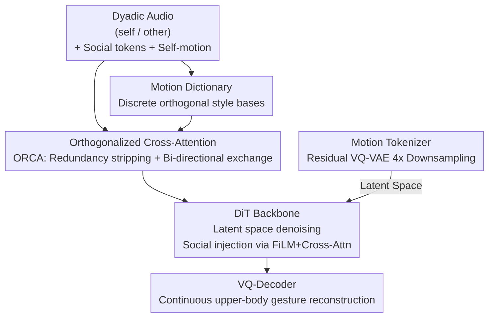

# DyaDiT: A Multi-Modal Diffusion Transformer for Socially Favorable Dyadic Gesture Generation

**Conference**: CVPR 2026  
**Paper**: [CVF Open Access](https://openaccess.thecvf.com/content/CVPR2026/html/Peng_DyaDiT_A_Multi-Modal_Diffusion_Transformer_for_Socially_Favorable_Dyadic_Gesture_CVPR_2026_paper.html)  
**Code**: https://puckikk1202.github.io/dyadit_hp/ (Project Page)  
**Area**: Human Understanding / Gesture Generation / Diffusion Models  
**Keywords**: Dyadic Gesture Generation, Diffusion Transformer, Social Context, Audio Orthogonalization, Motion Dictionary

## TL;DR
DyaDiT is a multi-modal Diffusion Transformer designed for dyadic dialogue scenarios. It employs an Orthogonalized Cross-Attention (ORCA) module to disentangle two channels of overlapping audio, integrates social conditions such as relationships/personality and a motion dictionary prior, and generates upper-body gestures that align with both dialogue dynamics and social context, surpassing existing dyadic gesture methods in objective metrics and user preference.

## Background & Motivation

**Background**: The mainstream approach for co-speech gesture generation involves mapping a single speaker's audio channel to their corresponding actions. Representative works include BEAT/CaMN, EMAGE, and TalkSHOW. Recently, the field has transitioned towards diffusion models (e.g., DiffGesture, DiffuseStyleGesture+) to model the multi-modal distribution of gestures.

**Limitations of Prior Work**: Existing methods predominantly focus on "speech content $\rightarrow$ motion" alignment, neglecting two critical types of information in dialogue: **social context** (e.g., whether the speakers are friends or strangers, and their personalities significantly influence motion) and **dyadic interaction dynamics** (e.g., simultaneous speech, interruptions, and rapid switching between speaking and listening). Omitting these results in gestures that appear generic and lack the authenticity of real conversations.

**Key Challenge**: In dyadic dialogues, the two audio channels are highly overlapping in time and entangled. Existing dyadic gesture methods (e.g., Audio2PhotoReal, ConvoFusion, TAG2G) either treat dyadic audio as a single mixed signal or fail to explicitly distinguish between "self-speech" and "partner-speech." Consequently, models struggle to differentiate between the speaker and the listener, leading to blurred roles and interaction patterns.

**Goal**: In a dyadic dialogue setting, the objective is to generate context-aware upper-body gestures for the "other" speaker while achieving: (1) clean disentanglement of the two audio channels; (2) explicit control of generation through social attributes; and (3) optionally coordinated responses by referencing the partner's actual movements.

**Core Idea**: An **Orthogonalized Cross-Attention (ORCA)** module is utilized to strip redundant components from two audio channels and bi-directionally exchange complementary information to obtain clean audio conditions. Simultaneously, relationship and personality are injected into the Diffusion Transformer as explicit social tokens, with a **discrete motion dictionary** providing style priors.

## Method

### Overall Architecture

The backbone of DyaDiT is a Diffusion Transformer (DiT) within the DDPM framework. Instead of diffusing directly in the raw gesture space, it utilizes a VQ-VAE to compress gesture sequences into discrete tokens, performing denoising within this compact latent space. The input side concatenates multiple modalities into a condition $c$: clean audio features from ORCA fusion, self-motion, relationship type $f_{relat}$, and personality scores $f_{ps}$. Relationship and personality are injected via both FiLM modulation and cross-attention, allowing the model to capture both social attributes and individual expressive styles. The workflow is: Audio/Motion/Social conditions $\rightarrow$ ORCA disentanglement + Motion Dictionary styling $\rightarrow$ DiT denoising in latent space $\rightarrow$ VQ-Decoder reconstruction into continuous gesture sequences.

### Key Designs

**1. Orthogonalized Cross-Attention (ORCA): Disentangling overlapping audio into clean conditions**

This core module addresses the "audio entanglement and role confusion" challenge. Given audio features $a_{self}$ and $a_{other}$ encoded by Wav2Vec2, ORCA first performs orthogonalization to project out components in the self-audio that are redundant with the other audio:

$$a^{\perp}_{self} = a_{self} - \mathrm{Proj}_{a_{other}}(a_{self})$$

The projection operator is implemented via a lightweight MLP $\phi(x) = W_2\,\sigma(W_1 x + b_1) + b_2$. This step forces the two audio channels to retain only complementary information. Subsequently, two symmetric cross-attention branches perform a bi-directional exchange: one uses $a_{other}$ as the query to attend to $a^{\perp}_{self}$ (capturing "the speaker's response to the partner's speech"), while the other uses $a^{\perp}_{self}$ as the query to attend to $a_{other}$ (modeling "listener reaction cues"). The outputs are fused using a learnable gating mechanism:

$$f_{audio} = \sigma(W_g)\cdot h_{self\to other} + (1-\sigma(W_g))\cdot h_{other\to self}$$

The resulting $f_{audio}$ serves as the final audio condition. Compared to direct concatenation or standard cross-attention, ORCA's "strip redundancy then exchange" approach allows the model to differentiate who should lead the movement during overlapping moments, such as interruptions.

**2. Discrete Motion Dictionary (MD): Controllable style priors via orthogonal bases**

To address limited gesture diversity, the authors introduce a set of learnable orthogonal motion bases $\{d_0, d_1, \dots, d_n\}$, where each base encodes a representative gesture prototype. During training, style features of real actions $f_{motion}=[m_0,\dots,m_n]$ guide the model to learn the "audio cue $\leftrightarrow$ motion pattern" correspondence. Specifically, the partner's audio $a_{other}$ is modulated by the dictionary:

$$a'_{other} = \mathrm{CA}\Big(a_{other}, \sum_{k=0}^{n} m_k d_k\Big) + a_{other}$$

$m_k$ represents the style weights derived from $f_{motion}$. Notably, **orthogonality is not enforced** during joint training of the motion dictionary (as gestures do not require strict phase alignment), but only used for initialization. During inference, the dictionary is optionally activated; combined with classifier-free guidance, it can either amplify style conditions to generate highly stylized gestures or be discarded to default to style-agnostic motion. Ablations show that the discrete dictionary significantly outperforms continuous variants in Diversity(Static), indicating that discrete bases better capture diverse interaction styles.

**3. Explicit Social Conditions + Optional Self-Action Branch: Aligning gestures with relationships, personality, and partners**

DyaDiT uses two high-level social annotations provided in the dataset as explicit conditions: relationship types $f_{rs}\in\{0,1\}^4$ (friend/stranger/family/lover) and five-dimensional personality scores $f_{ps}\in\mathbb{R}^5$. These social tokens are injected into the DiT via dual channels (FiLM and cross-attention), enabling the same audio segment to produce different actions under different relationship or personality settings. Furthermore, as a speaker's actions are often influenced by their partner, the model can optionally take the partner's ("self") motion sequence as an additional condition to generate more coordinated and responsive gestures.

### Loss & Training

The DiT backbone follows the standard DDPM $\epsilon$-prediction loss:

$$L_{diff} = \mathbb{E}_{x_0,t,\epsilon}\big[\,\|\epsilon - \epsilon_\theta(x_t, t, c)\|_2^2\,\big],\quad x_t=\sqrt{\bar\alpha_t}x_0+\sqrt{1-\bar\alpha_t}\,\epsilon$$

Motions are represented using 6D rotations. The Motion Tokenizer uses a Residual VQ-VAE (residual length 4, four-level cascaded codebooks for progressive quantization error refinement) with a 1D CNN encoder providing 4x temporal downsampling. Diffusion is performed directly in the latent space. Training is conducted on the natural scene subset of the Seamless Interaction dataset (~3,000 segments, 182 hours), with audio encoded by Wav2Vec2.

## Key Experimental Results

### Main Results
On the Seamless Interaction validation set, DyaDiT was compared against two dyadic gesture SOTAs (ConvoFusion, Audio2PhotoReal). Metrics include Beat Consistency (BC), Fréchet Distance (FD, Static/Kinetic, lower is better), and Diversity (Static/Kinetic, higher is better).

| Method | BC ↑ | FD-Sta ↓ | FD-Kine ↓ | Div-Sta ↑ | Div-Kine ↑ |
|------|------|----------|-----------|-----------|------------|
| GT | - | - | - | 28.42 | 1.97 |
| ConvoFusion | - | 9.22 | 1.74 | 18.33 | 1.10 |
| Audio2PhotoReal | - | 8.77 | 1.84 | 19.35 | 1.05 |
| **Ours (DyaDiT)** | **7.71** | **6.40** | **1.37** | **27.46** | 1.38 |

DyaDiT leads significantly in FD (realism) and Static Diversity, with Diversity(Static) closely approaching the GT of 28.42.

### Ablation Study
| Configuration | FD-Sta ↓ | Div-Sta ↑ | Description |
|------|----------|-----------|------|
| **DyaDiT (Full)** | **6.40** | **27.46** | Full model |
| w/o ORCA | 7.32 | 23.57 | Concatenate dyadic audio; FD degrades significantly |
| CrossAttn | 7.82 | 18.87 | ORCA replaced by standard cross-attention |
| w/o MD | 6.88 | 18.34 | Motion dictionary removed; Diversity drops |
| MD contin | 6.69 | 21.47 | Discrete dictionary replaced by continuous representation |
| Uncond | 7.40 | 21.65 | No social conditions |
| Random | 8.24 | 21.94 | Mismatched relationship/personality labels; worst FD |

### Key Findings
- **ORCA contributes most**: Removing ORCA or replacing it with standard cross-attention degrades both FD and diversity, validating that "orthogonal redundancy stripping before exchange" is crucial for disentangling overlapping audio.
- **Discrete MD outperforms continuous**: The discrete version's higher Diversity(Static) suggests that discrete orthogonal bases better cover the space of interactive styles.
- **Social conditions are functional, not decorative**: The "Random" (mismatched labels) configuration yielded the worst FD (8.24). Correct social cues help the model disambiguate and produce richer gestures, especially for listener behaviors which often have small motion amplitudes.
- **Human preference occasionally exceeds GT**: In an A/B test with 16 participants, DyaDiT was preferred over GT in two specific settings by 1.0% and 1.7%. This is attributed to smoother diffusion generation and expressive gestures driven by social conditions.

## Highlights & Insights
- **Orthogonalization as "Cheap Disentanglement"**: Using a vector projection $a_{self}-\mathrm{Proj}_{a_{other}}(a_{self})$ to strip correlated components is more direct than stacking attention layers. This trick is transferable to any multi-modal fusion scenario requiring the separation of highly correlated signals.
- **Discrete Dictionary + CFG = Style Toggle**: The motion dictionary can be optionally activated during inference. Coupled with CFG, it provides a clean "style knob" to either intensify or discard stylistic features.
- **Social Context as a Primary Condition**: Explicitly modeling social context through FiLM + Cross-Attention is a rare but effective approach in gesture generation, where mismatched social cues significantly harm metric performance.

## Limitations & Future Work
- Focuses only on **upper-body gestures**, excluding full-body, facial expressions, and fine-grained finger coordination.
- Performance depends on the relationship/personality annotations of the Seamless Interaction dataset, which limits generalization to the 4 predefined relationship categories.
- The user study scale was relatively small (16 participants).
- Future work involves "social-aware dual-agent gesture generation"—currently, the model generates for one party, while simultaneous real-time mutual generation remains an open challenge.

## Related Work & Insights
- **vs Audio2PhotoReal / ConvoFusion**: These treat dyadic audio as mixed or do not explicitly split channels. DyaDiT's ORCA provides explicit disentanglement and bi-directional exchange.
- **vs Single-speaker co-speech (EMAGE, etc.)**: DyaDiT introduces social context and partner dynamics for the more complex dyadic setting.
- **vs LIA**: DyaDiT borrows the "orthogonal initialization" concept for its dictionary but does not maintain orthogonality during joint training, as gestures do not require strict phase alignment.

## Rating
- Novelty: ⭐⭐⭐⭐ ORCA's orthogonal disentanglement combined with social conditions and MD is a novel synthesis for dyadic gestures.
- Experimental Thoroughness: ⭐⭐⭐⭐ Solid objective metrics, 7 ablation groups, and user studies, though limited by dataset variety.
- Writing Quality: ⭐⭐⭐⭐ Methods and formulas are clearly articulated.
- Value: ⭐⭐⭐⭐ Effectively introduces social context into gesture generation, significant for digital humans and embodied interaction.

<!-- RELATED:START -->

## Related Papers

- [\[CVPR 2026\] MMGait: Towards Multi-Modal Gait Recognition](mmgait_multi_modal_gait_recognition.md)
- [\[ICCV 2025\] GestureHYDRA: Semantic Co-speech Gesture Synthesis via Hybrid Modality Diffusion Transformer and Cascaded-Synchronized Retrieval-Augmented Generation](../../ICCV2025/human_understanding/gesturehydra_semantic_co-speech_gesture_synthesis_via_hybrid_modality_diffusion_.md)
- [\[CVPR 2026\] CoordSpeaker: Exploiting Gesture Captioning for Coordinated Caption-Empowered Co-Speech Gesture Generation](coordspeaker_exploiting_gesture_captioning_for_coordinated_caption-empowered_co-.md)
- [\[CVPR 2026\] MimicTalker: A Multimodal Interactive and Memory-Enhanced Framework for Real-Time Dyadic 3D Head Generation](mimictalker_a_multimodal_interactive_and_memory-enhanced_framework_for_real-time.md)
- [\[CVPR 2026\] LiveGesture: Streamable Co-Speech Gesture Generation Model](livegesture_streamable_co-speech_gesture_generation_model.md)

<!-- RELATED:END -->
