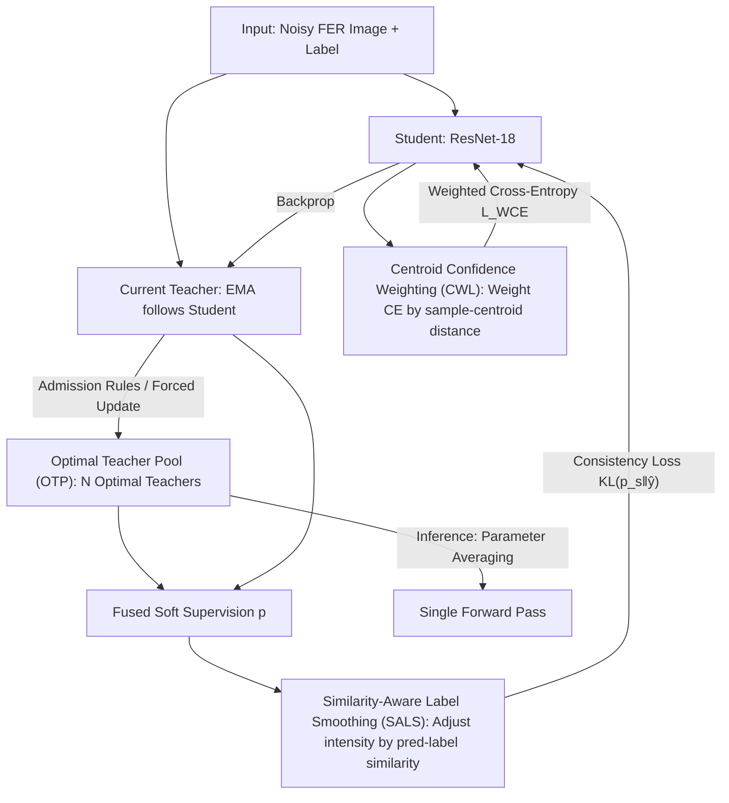

# Dynamic Label Noise Suppression with Optimal Teacher Pool for Facial Expression Recognition

**Conference**: CVPR 2026  
**Paper**: [CVF Open Access](https://openaccess.thecvf.com/content/CVPR2026/html/Yang_Dynamic_Label_Noise_Suppression_with_Optimal_Teacher_Pool_for_Facial_CVPR_2026_paper.html)  
**Code**: None (Not provided by the paper)  
**Area**: Human Understanding / Facial Expression Recognition  
**Keywords**: Facial Expression Recognition, Learning with Noisy Labels, Teacher-Student Network, Label Smoothing, Confidence Weighting

## TL;DR
To address the prevalent label noise in Facial Expression Recognition (FER) datasets, this paper proposes the OTP-NS framework. It replaces a single EMA teacher with an "Optimal Teacher Pool" to break parameter coupling and noise accumulation between the teacher and student. Additionally, two sample-level denoising components, Similarity-Aware Label Smoothing (SALS) and Centroid Confidence Weighting (CWL), are integrated. The method outperforms existing SOTA across various noise ratios on multiple benchmarks with zero additional inference overhead.

## Background & Motivation

**Background**: FER has long relied on training CNNs/ViTs on large-scale annotated data. To handle label noise, mainstream denoising paradigms follow two lines: label smoothing regularization (LSR/SLS), which softens one-hot labels to reduce model overfitting to incorrect labels; and teacher-student architectures (e.g., Mean Teacher), which use EMA to average historical parameters into a "more stable" teacher providing supervision signals to the student.

**Limitations of Prior Work**: FER data inevitably contains noisy labels due to expression ambiguity and subjective annotation. Deep networks' strong memorization capacity causes them to "memorize" incorrect labels, harming generalization. While the Mean Teacher approach provides stability, its EMA-coupled updates have two major flaws: ① Teacher parameters gradually converge to student parameters as training progresses, leading to **over-coupling** and locking the model's learning capacity. ② In noisy environments, the contaminated student network **transmits noise back to the teacher via the EMA path**, eroding the supervision signal itself. Traditional label smoothing uses a **fixed and globally uniform** smoothing intensity, which is harmful to clean samples as it dilutes their high ground-truth probability into other classes for no benefit.

**Key Challenge**: A single EMA teacher cannot achieve "stability" and "denoising/decoupling" simultaneously—maintaining stability requires long-term averaging of historical parameters, but this leads to coupling and noise accumulation. Similarly, fixed smoothing intensity creates a trade-off between "suppressing noisy samples" and "preserving clean samples" that cannot be perfectly resolved.

**Goal**: (1) Break the noise accumulation and teacher-student coupling inherent in single-teacher models; (2) Make label smoothing sample-dependent to suppress only noisy samples while sparing clean ones; (3) Further mitigate the negative impact of noisy samples on student training at the loss level.

**Key Insight**: Instead of relying on a "continuously contaminated teacher," the authors propose **maintaining a pool of historical optimal teachers and fusing their predictions**, acting as a dynamic "expert committee" for supervision. Furthermore, **sample-level signals**, such as the similarity between prediction and label (cosine similarity) and the distance from a sample to the class centroid, can effectively distinguish noisy from clean samples for fine-grained control.

**Core Idea**: Replace "single EMA teacher + global fixed smoothing" with an "Optimal Teacher Pool + sample-level dynamic smoothing + sample-level confidence weighting," moving denoising from model-level coarse granularity to sample-level fine granularity.

## Method

### Overall Architecture
OTP-NS modifies the standard teacher-student training loop. At each training step: the student network output and label compute a **weighted cross-entropy loss** (CWL component). The fused output of the current teacher and the Optimal Teacher Pool serves as soft supervision, and the **KL divergence consistency loss** (SALS component) is computed with the student output. The student updates parameters via backpropagation, the teacher follows via EMA, and finally, the **Optimal Teacher Pool is updated according to admission rules**. At inference, this mechanism is no longer needed—the parameters of $N$ teachers in the pool are **averaged** into a single model, requiring only one backbone forward pass with zero extra cost.

The system functions as a synergy between "one pool + two sample-level denoising components": the pool provides clean and stable supervision at the model level, SALS turns this supervision into sample-dependent soft labels, and CWL re-weights the loss on the student side based on sample reliability.

### Key Designs

**1. Optimal Teacher Pool (OTP): Replacing single EMA teacher with a "Historical Optimal Committee" to cut noise accumulation and coupling.**

This is the backbone of the paper, addressing the two flaws of Mean Teacher. OTP dynamically maintains a set of $N$ historical optimal teacher parameters $P=\{\theta_k^{opt}\}_{k=1}^N$, utilizing **dual screening** to ensure quality. The first is **accuracy-based admission**: at each epoch $t$, the current teacher's accuracy $\mathrm{Acc}(\theta_t^{teacher})$ is calculated on the training set. If it exceeds the worst member in the pool:

$$\mathrm{Acc}(\theta_t^{teacher}) > \min_{\theta_i\in P}\mathrm{Acc}(\theta_i)$$

It replaces the worst member. Note that training set accuracy is used instead of a clean validation set, making the method applicable to real-world noisy FER data. The second is **periodic forced update**: the authors found that relying solely on admission causes issues—during early training, accuracy might drop slightly while the network learns new features, causing the OTP to stagnate with old knowledge. Thus, every $K$ epochs, the current teacher unconditionally replaces the worst member $P\leftarrow P\setminus\{\theta_{worst}\}\cup\{\theta_t^{teacher}\}$ to inject new knowledge.

During training, OTP fuses predictions from the current teacher and pool members into supervision logits:

$$\boldsymbol{p}=\beta_t\cdot f(\theta_t^{teacher};\boldsymbol{x})+(1-\beta_t)\sum_{k=1}^N\lambda_k f(\theta_k^{opt};\boldsymbol{x})$$

Pool weights are adaptively assigned based on validation accuracy $\lambda_k=\mathrm{Acc}(\theta_k^{opt})\big/\sum_j\mathrm{Acc}(\theta_j^{opt})$—more accurate teachers have more influence. The fusion coefficient $\beta_t=\gamma\cdot\exp(-t/T_{max})$ decays over time: early on ($\beta_t\approx\gamma$), the current teacher dominates to absorb new knowledge quickly; later ($\beta_t\to0$), the stable historical pool dominates to suppress noise.

**2. Similarity-Aware Label Smoothing (SALS): Applying sample-specific smoothing intensity to suppress noise without harming clean samples.**

Addressing the flaw where "fixed smoothing hurts clean samples," SALS makes the smoothing intensity $\epsilon_i$ sample-dependent. It measures consistency between prediction and label using cosine similarity:

$$S_i=\frac{\sum_k \boldsymbol{y}_{ik}\boldsymbol{f}_{ik}}{\sqrt{\sum_k \boldsymbol{f}_{ik}^2}}=\cos(\boldsymbol{f}_i,\boldsymbol{y}_i)$$

($\boldsymbol{f}_i$ is the softmax output, $\boldsymbol{y}_i$ is the one-hot label). Smoothing intensity is then mapped linearly as $\epsilon_i=\epsilon_{min}+(\epsilon_{max}-\epsilon_{min})(1-S_i)$. High similarity (clean sample) $\to$ high $S_i$ $\to$ low $\epsilon_i$ $\to$ less smoothing; low similarity (suspected noise) $\to$ high $\epsilon_i$ $\to$ more smoothing. The final soft label $\hat{y}$ serves as the supervision target for the consistency loss $L_{Cons}=D_{KL}(\boldsymbol{p}_s\|\hat{\boldsymbol{y}})$.

**3. Centroid Confidence Weighting (CWL): Re-weighting loss using "distance to class centroid" to weaken noisy samples.**

To prevent noisy samples from dragging down student training at the loss level, CWL observes that noisy samples are typically **farther from their class centroid** in the feature space. Class centroids $\boldsymbol{\mu}_j$ are calculated per batch and smoothed across batches via EMA: $\boldsymbol{\mu}_j'\leftarrow\omega\boldsymbol{\mu}_j'+(1-\omega)\boldsymbol{\mu}_j$. Sample confidence is derived from the distance to the centroid via a sigmoid with learnable parameters:

$$\alpha_i=\mathrm{sigmoid}(\sigma\cdot\|\boldsymbol{x}_i-\boldsymbol{\mu}_i\|_2+\beta)$$

This $\alpha_i$ is injected as a temperature factor into the cross-entropy logits:

$$L_{WCE}=-\frac{1}{m}\sum_i\log\frac{e^{\alpha_i\boldsymbol{W}_{y_i}^\top(\boldsymbol{x}_i)}}{\sum_j e^{\alpha_i\boldsymbol{W}_j^\top(\boldsymbol{x}_i)}}$$

Clean samples (near centroid) get higher weight, while suspected noise (far from centroid) is suppressed.

### Loss & Training
The total loss consists of the student's weighted cross-entropy $L_{WCE}$ (CWL) and the consistency KL loss $L_{Cons}$ (SALS soft labels). The backbone is ResNet-18, pre-trained on MS-Celeb-1M. The student uses the Adam optimizer, and the teacher uses EMA with a decay of 0.999. Key hyperparameters: pool capacity $N=3$, forced update every $K=10$ epochs, initial confidence $\gamma=0.7$, $\epsilon_{min}=0.1$, $\epsilon_{max}=0.3$.

## Key Experimental Results

Evaluated on RAF-DB, AffectNet, and FERPlus datasets under synthetic symmetric noise (10%-50%) and asymmetric noise.

### Main Results (Accuracy % under Symmetric Noise)

| Dataset | Noise Ratio | Baseline | EAC | SOFT | LA-Net | MCR | **Ours** |
| :--- | :--- | :--- | :--- | :--- | :--- | :--- | :--- |
| RAF-DB | 10% | 81.01 | 88.02 | 89.05 | 88.75 | 89.28 | **90.12** |
| RAF-DB | 20% | 77.98 | 86.05 | 87.86 | 87.12 | 87.61 | **88.91** |
| RAF-DB | 30% | 75.50 | 84.42 | 86.08 | 85.33 | 86.08 | **87.56** |
| AffectNet | 30% | 52.16 | 58.91 | 59.50 | 60.82 | 59.50 | **60.99** |
| FERPlus | 30% | 79.77 | 85.44 | — | 86.01 | — | **86.18** |

OTP-NS consistently leads MCR across all datasets and noise ratios. On RAF-DB (10%/20%/30%), it achieves gains of +0.84%/+1.30%/+1.48%.

### Ablation Study

OTP internal components (RAF-DB, 30% symmetric noise):

| P (Forced Update) | W (Adaptive Fusion) | C (Coeff $\beta_t$) | Acc |
| :---: | :---: | :---: | :--- |
| × | × | × | 87.42 |
| × | √ | √ | **36.15** |
| √ | × | √ | 87.47 |
| √ | √ | × | 85.41 |
| √ | √ | √ | **87.56** |

### Key Findings
- **Forced update is the bottleneck of OTP**: Removing P (keeping W and C) causes accuracy to plummet from 87.56 to **36.15**. Strict admission prevents new teachers from entering the pool during the early feature-learning phase, causing training to stall.
- **Adaptive fusion provides significant gains**: Removing W drops accuracy to 85.41 (-2.15), proving that weighting pool teachers by accuracy successfully amplifies reliable supervision.
- **SALS outperforms SLS/LS in the 10-30% noise range**: Dynamic intensity protects clean samples from over-smoothing. At 50% noise, the advantage narrows.
- **Zero Inference Overhead**: Parameters are averaged into a single model. Inference latency is 11.9 ms/image, nearly identical to the ResNet-18 baseline (11.8 ms).

## Highlights & Insights
- **"Optimal Pool + Forced Update" is a precise fix for Mean Teacher**: The "historical optimal committee" resolves coupling/contamination issues, while the forced update prevents "elite stagnation."
- **Triple usage of sample-level signals**: Similarity (SALS), centroid distance (CWL), and validation accuracy (Pool weights) are all proxies used to distinguish noise from clean samples.
- **Heavy training, light inference**: Complexity is limited to the training phase, making it highly suitable for practical deployment.

## Limitations & Future Work
- Currently limited to static images; future work will extend to video-based expression analysis.
- Admission relies on **training set accuracy**, which itself is affected by noisy labels. The reliability boundaries of this proxy are not fully discussed.
- At 50% noise, the performance gain of SALS over SLS is marginal.

## Related Work & Insights
- **vs. Mean Teacher**: Both use teacher-student + EMA, but OTP uses a dynamic pool with admission/fusion to break noise accumulation and coupling.
- **vs. SOFT (SLS)**: SLS uses instance-aware smoothing with fixed intensity; SALS uses cosine similarity to make intensity adaptive.
- **vs. SCN / DMUE / MCR**: While others use re-weighting or uncertainty modeling, this work synergizes supervision source quality (Pool), soft label granularity (SALS), and loss weighting (CWL).

## Rating
- Novelty: ⭐⭐⭐⭐ The Optimal Teacher Pool with forced updates is a clever fix for Mean Teacher.
- Experimental Thoroughness: ⭐⭐⭐⭐ Covers various datasets and noise ratios, though hyperparameter sensitivity is missing.
- Writing Quality: ⭐⭐⭐⭐ Clear motivation-method-experiment chain.
- Value: ⭐⭐⭐⭐ Highly practical for deployment due to zero inference cost.

<!-- RELATED:START -->

## Related Papers

- [\[CVPR 2026\] CLEX: Complementary Label Exchange Learning for Noisy Facial Expression Recognition](clex_complementary_label_exchange_learning_for_noisy_facial_expression_recogniti.md)
- [\[CVPR 2026\] D³FER: Dual Channel and Dual Branch Network for Robust Facial Expression Recognition under Dual Challenges](d3fer_dual_channel_and_dual_branch_network_for_robust_facial_expression_recognit.md)
- [\[ECCV 2024\] Generalizable Facial Expression Recognition](../../ECCV2024/human_understanding/generalizable_facial_expression_recognition.md)
- [\[CVPR 2026\] Region-Aware Instance Consistency Learning for Micro-Expression Recognition](region-aware_instance_consistency_learning_for_micro-expression_recognition.md)
- [\[ICCV 2025\] SynFER: Towards Boosting Facial Expression Recognition with Synthetic Data](../../ICCV2025/human_understanding/synfer_towards_boosting_facial_expression_recognition_with_synthetic_data.md)

<!-- RELATED:END -->
