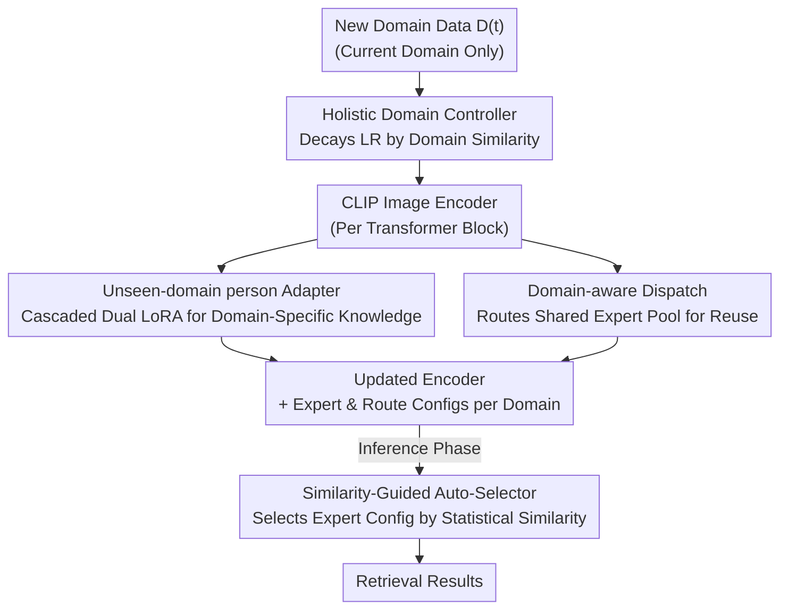

# Dynamic Magic: Unleashing Restricted Knowledge for Lifelong Person Re-Identification

**Conference**: CVPR 2026  
**Paper**: [CVF Open Access](https://openaccess.thecvf.com/content/CVPR2026/html/Peng_Dynamic_Magic_Unleashing_Restricted_Knowledge_for_Lifelong_Person_Re_Identification_CVPR_2026_paper.html)  
**Code**: Not disclosed  
**Area**: Human Understanding / Lifelong Learning / Person Re-Identification  
**Keywords**: Lifelong Person Re-Identification, Catastrophic Forgetting, Dynamic Expansion, LoRA Expert Adapters, Cross-domain Knowledge Reuse  

## TL;DR
To address the issue in Lifelong Person Re-Identification (LReID) where fixed network architectures cannot accommodate continuously accumulating knowledge, leading to catastrophic forgetting, this paper proposes the dynamic expansion framework VIA. It models each new domain independently using cascaded dual LoRA adapters, reuses cross-domain commonalities via a shared expert pool with routing, and adaptively adjusts encoder learning rates based on domain similarity. Ultimately, it improves the average mAP across 5 seen domains from 66.4% of the baseline to 77.7%.

## Background & Motivation
**Background**: Person Re-Identification (ReID) aims to retrieve the same individual across different camera views. Lifelong Person Re-Identification (LReID) takes this further—surveillance environments constantly change with illumination, viewpoints, and crowd appearances, requiring models to learn continuously across a sequence of new domains without revisiting old data (privacy constraints). Existing methods are divided into rehearsal-based (storing small samples for replay) and distillation-based (constraining new model outputs/representations to align with the old model), with the latter being more mainstream in LReID.

**Limitations of Prior Work**: Whether using distillation or replay, these methods attempt to "stuff" increasingly diverse domain knowledge into a **fixed network architecture**. As the number of domains grows, new knowledge continuously overwrites old parameters, leading to severe knowledge interference and unavoidable catastrophic forgetting. Distillation-based methods also face the issue that the old model itself may retain incorrect knowledge, necessitating prior filtering and correction for effective distillation.

**Key Challenge**: A fundamental contradiction exists between fixed-capacity architectures and the "continuously expanding volume of knowledge." Static parameter sharing forces all domains to compete for the same set of weights; adapting to a new domain inevitably comes at the expense of old ones. Conversely, completely isolating each domain fragments cross-domain commonalities (patterns like background, viewpoint, and lighting that are reusable), wasting capacity.

**Goal**: Break the dependence on fixed architectures by creating a **dynamically expandable** framework that isolates domain-specific knowledge to prevent interference, reuses cross-domain commonality, and preserves the global generalization capability of large pre-trained models.

**Key Insight**: Borrowing from the concept of modular learning, the "one module learns all" approach is decomposed into "three complementary types of knowledge × three specialized modules"—domain-specific knowledge, domain-subset shared knowledge, and global transferable knowledge are handled separately. The backbone uses CLIP-ReID (ViT-B/16), with all additions being lightweight LoRA adapters.

**Core Idea**: Instead of repeatedly overwriting a fixed network, **dynamically grow a set of lightweight expert adapters for each new domain** (isolation), while maintaining a shared expert pool for cross-domain on-demand calls (reuse), and dynamically tighten the encoder learning rate based on the similarity between the new and old domains (preserving generalization).

## Method

### Overall Architecture
VIA (Versatile Incremental Adaptation) is built on a frozen CLIP-ReID image encoder, transforming "continuous learning" into "continuously adding lightweight adapters + dynamic routing" into Transformer blocks. Four core components handle distinct tasks: **UnA** establishes independent expert adapters for each domain (intra-domain isolation), **DAD** maintains a cross-domain shared expert pool activated by routing (inter-domain reuse), **HDC** adjusts encoder learning rates based on domain similarity (global generalization preservation), and at inference, **SGAS** dispatches test samples to corresponding expert configurations via statistical similarity instead of domain labels.

Training for each new domain $D^{(t)}$ alternates in two stages: first, freeze the image side and train the text branch for 120 epochs to learn identity tokens; then, freeze the text side and train the image encoder and adapters for 60 epochs. The full process is shown below.

### Key Designs

**1. UnA — Cascaded Dual LoRA Adapter: "Liberating" Domain-Specific Knowledge from Static Sharing**

The primary flaw of fixed architectures is that all domains share one set of MLP weights, causing mutual overwriting. UnA embeds two independent LoRA experts, $E^f_t$ and $E^p_t$, inside the MLP of each Transformer layer for every domain $t$, isolating domain-specific knowledge. Instead of paralleling the adapter beside the MLP (Fig 3a) or embedding it in Multi-Head Attention (Fig 3b), it **cascades** the two adapters into the MLP forward pass:

$$h_{fc} = W_{fc}\cdot x_t + E^f_t(x_t),\quad h_{gelu} = \mathrm{GELU}(h_{fc}),\quad y^t_a = W_{proj}\cdot h_{gelu} + E^p_t(h_{gelu})$$

Crucially, the first adapter is placed **before** the activation function, acting on the raw linear response to coarsely align low-level appearance shifts (lighting, texture). After the GELU non-linear transformation, the second adapter processes compressed and reweighted features to refine high-level domain-specific semantics. By tuning features at complementary levels, this design is more sensitive and robust to subtle domain changes than single-point insertion. Ablations (Table 4) show this cascaded insertion within the MLP outperforms QKV/Proj insertions.

**2. DAD — Shared Expert Pool + Routing: "Reconnecting" Cross-Domain Commonalities Outside Isolation**

Complete isolation by UnA can lead to knowledge fragmentation—commonalities like background, body posture, and lighting that could be reused across domain subsets are severed. DAD maintains a lightweight shared LoRA expert pool $\{E_1,\dots,E_{N_E}\}$ and assigns a router $R_t$ to each domain. Using the [CLS] token $c_t$, it calculates gating and uses Top-k (k=3 in implementation) to select and weighted-sum the most relevant experts:

$$y^t_b = \sum_{i=1}^{N_E} W^t_i E_i(x_t),\quad W^t = \mathrm{Softmax}(\mathrm{Topk}(R_t(c_t)))$$

DAD includes two stabilization mechanisms. First is the **structural-level decoupling loss**, which imposes Frobenius orthogonality constraints on shared experts to force them to learn distinct subspaces and reduce redundancy: $L_{dec}=\sum_{i}\sum_{j>i}\big(\lVert A_iA_j^\top\rVert_F^2+\lVert B_i^\top B_j\rVert_F^2\big)$ ($A_i, B_i$ are the LoRA low-rank projection matrices). Second is **domain-aware routing transfer**: before training a new domain, the most similar old domain $j=\arg\max_k s_{t,k}$ is identified, and $R_t$ is initialized with $R_j$ parameters, allowing routing to start from an aligned representation space to accelerate convergence and reduce negative transfer.

**3. HDC — Similarity-Based Learning Rate Decay: Preserving Global Generalization Potential**

DAD only reuses local commonality across domain subsets and cannot preserve "globally universal" invariant features. HDC regulates encoder capacity globally: the first domain uses a standard initial learning rate $\eta_0$, and thereafter, the initial learning rate for each domain $t$ is decayed based on both the "average similarity to old domains" and the "number of learned domains":

$$\eta_t = \eta_0\cdot\Big(\tfrac{1}{t-1}\sum_{i=1}^{t-1}s_{t,i}\Big)^{t-1}$$

Lower similarity and more learned domains result in more aggressive decay—this restricts destructive updates to accumulated universal knowledge while leaving sufficient space for domain-specific adaptation. Domain similarity $s_{t,i}$ is measured using the 2-Wasserstein distance between feature distributions (using Inception-V3 to extract 768-dim features for $\mu, \Sigma$ statistics): $s_{t,i}=\exp\!\big(-\tfrac{1}{\tau}D(\mu_t,\Sigma_t;\mu_i,\Sigma_i)\big)$, where $\tau$ controls sensitivity. This similarity is reused for both DAD routing transfer and HDC.

**4. SGAS — Statistical Similarity Expert Selection: Correct Dispatching Without Domain Labels**

Both UnA and DAD introduce domain-specific adapters and routing. During inference, how is the correct configuration selected for a test image? SGAS avoids extra domain classifiers and domain labels by relying purely on statistical similarity: it compares the test sample against stored statistics (mean, covariance) of each seen domain using the same $s_{t,i}$ metric and selects the expert configuration of the most similar domain $k=\arg\max_i s_{t,i}$. This is lightweight, domain-agnostic, and saves the overhead of training additional classifiers.

> ⚠️ The paper does not provide a full table of final weighting coefficients for $L_{dec}$ with triplet/ID/cross-modal losses, only stating the image branch is optimized by $L_{i2tce}+L_{tri}+L_{id}+L_{dec}$, with the decoupling loss weight $\lambda=1.0$ being optimal. Refer to the original text for specific ratios.

### Loss & Training
Two-stage alternating training (per task): (1) Train text branch for 120 epochs using CLIP-style prompts to learn identity tokens $[X_i]$ with contrastive losses $L_{t2i}, L_{i2t}$; (2) Freeze text and train image encoder and adapters for 60 epochs using cross-modal loss $L_{i2tce}$ + triplet loss $L_{tri}$ + ID loss $L_{id}$ + decoupling loss $L_{dec}$. Optimized with Adam, batch size 64, LoRA rank $r=64$, $\alpha=512$, 5 shared experts, Top-3 gating, on a single A4000 GPU.

## Key Experimental Results

### Main Results (Training Order-1, 5 Seen Domains + 7 Unseen Domains)

| Method | Source | Seen-Avg mAP/R@1 | UnSeen-Avg mAP/R@1 |
|------|------|------|------|
| LSTKC++ | T-PAMI 2025 | 55.2 / 66.7 | 63.2 / 56.3 |
| DASK | AAAI 2025 | 55.4 / 69.3 | 65.3 / 58.4 |
| Baseline (CLIP-ReID) | Ours Baseline | 66.4 / 78.1 | 73.1 / 66.5 |
| **VIA (Ours)** | Ours | **77.7 / 86.6** | **77.1 / 70.8** |

Gains on individual domains are even more significant: DukeMTMC-reID mAP rose from DASK's 58.5% to 79.9%; MSMT17 rose from 29.1% to 57.5%. Results under Order-2 are consistent (Seen-Avg 77.4/86.2).

### Ablation Study (Stepwise Module Addition, Order-1)

| Configuration | Seen-Avg mAP/R@1 | UnSeen-Avg mAP/R@1 | Note |
|------|------|------|------|
| Baseline | 66.4 / 78.1 | 73.1 / 66.5 | CLIP-ReID |
| + UnA | 71.9 / 81.5 | 61.8 / 55.1 | Seen +5.5 mAP, but Unseen drops (over-isolation) |
| + DAD | 57.6 / 70.7 | 71.1 / 64.0 | DAD alone is weaker on seen domains |
| + UnA + DAD | 74.0 / 83.3 | 72.5 / 65.8 | Mutually complementary |
| **Full (+ HDC)** | **77.7 / 86.6** | **77.1 / 70.8** | HDC restores generalization |

### Key Findings
- **UnA excels on seen domains but is weak on unseen ones**: Adding UnA alone increases seen domain mAP by 5.5, but unseen domains drop from 73.1 to 61.8—pure isolation causes overfitting to each domain, losing cross-domain generalization. This necessitates DAD/HDC.
- **DAD addresses unseen domains, HDC complements globally**: UnA+DAD recovers unseen domains to 72.5, and adding HDC boosts both seen (+3.7) and unseen (+4.6) domains simultaneously, proving "local sharing + global regulation" is essential.
- **Critical Hyperparameters**: Performance increases with shared experts from 3→5, saturating after 5 (redundancy); larger LoRA ranks are better (limited to 64 due to storage), and $\alpha/r=10$ is too high; decoupling loss weight $\lambda=1.0$ is optimal.
- **Acceptable Overhead**: Each new domain adds only 11M trainable parameters, ~291M extra GPU VRAM, and 39M storage. Compared to the 10%+ performance gain, this is highly efficient.

## Highlights & Insights
- **"Three types of knowledge × Three modules" is a clean decomposition**: Domain-specific (UnA isolation), domain-subset shared (DAD reuse), and global universal (HDC protection) are orthogonal. The ablation clearly shows each layer's contribution to seen/unseen domains respectively.
- **Clever positioning of cascaded dual adapters**: Placing one before GELU for low-level appearance and one after for high-level semantics utilizes the activation function for natural role separation—superior to parallel or single-point insertion.
- **Triple-use of a single similarity metric**: 2-Wasserstein domain similarity drives HDC learning rate decay, DAD routing transfer initialization, and SGAS inference selection. This design is highly economical and transferable to any lifelong learning scenario requiring task-distance assessment.
- **Domain-label-free inference**: SGAS uses pure statistics for expert selection, eliminating the need for extra domain classifiers and improving real-world deployment friendliness.

## Limitations & Future Work
- **Linear storage growth**: As each new domain adds a set of adapters and routers, storage/VRAM accumulates (11M/domain). Scalability over extremely long sequences remains to be verified.
- **Dependency on external feature extractors for distribution**: Domain similarity uses Inception-V3 for 768-dim features; similarity quality depends on this external backbone. The sensitivity of this choice is not analyzed.
- **Unseen domain generalization relies on "nearest-domain selection"**: SGAS dispatches test samples to the most similar seen domain config. Whether this argmax logic remains optimal if a test domain is far from all seen domains is worth exploring.
- The authors plan to extend VIA to multimodal lifelong learning tasks.

## Related Work & Insights
- **vs. Distillation (LSTKC++ / DASK)**: These methods constrain consistency between new and old models within a fixed architecture to combat forgetting, but knowledge interference still occurs as domains increase. VIA uses dynamic expansion, growing independent adapters to avoid overwriting at the root, outperforming DASK by 22 points in seen domain mAP.
- **vs. Conventional Adapter Insertion (Parallel MLP / Attention-embedded)**: This paper cascades dual LoRAs inside the MLP, utilizing GELU to differentiate low/high-level processing. Ablations (Table 4) prove this is stronger than parallel and single-point insertions.
- **vs. MoE Routing**: DAD borrows the Top-k expert gating concept but adds structural-level decoupling loss to prevent redundancy and domain-aware routing transfer to prevent cold-start negative transfer, specifically customized for cross-domain LReID.

## Rating
- Novelty: ⭐⭐⭐⭐ Systematic introduction of dynamic expansion and three-tier knowledge governance to LReID; cascaded dual adapters and triple-use similarity are clever.
- Experimental Thoroughness: ⭐⭐⭐⭐⭐ Two training orders, 5 seen and 7 unseen domains, comprehensive ablations on modules/insertion/routing/LR/hyperparams, plus overhead analysis.
- Writing Quality: ⭐⭐⭐⭐ Clear framework and complete formulas, though some loss weighting coefficients are missing from the tables.
- Value: ⭐⭐⭐⭐ Significantly refreshes SOTA in LReID with controllable overhead; high practical significance for real-world surveillance deployment.

<!-- RELATED:START -->

## Related Papers

- [\[CVPR 2026\] Prompt-Anchored Vision–Text Distillation for Lifelong Person Re-identification](prompt-anchored_vision-text_distillation_for_lifelong_person_re-identification.md)
- [\[CVPR 2026\] Vision-Language Attribute Disentanglement and Reinforcement for Lifelong Person Re-Identification](vision-language_attribute_disentanglement_and_reinforcement_for_lifelong_person_.md)
- [\[CVPR 2026\] Composite-Attribute Person Re-Identification via Pose-Guided Disentanglement](composite-attribute_person_re-identification_via_pose-guided_disentanglement.md)
- [\[CVPR 2026\] View-Aware Semantic Alignment for Aerial-Ground Person Re-Identification](view-aware_semantic_alignment_for_aerial-ground_person_re-identification.md)
- [\[CVPR 2026\] Pose-guided Enriched Feature Learning for Federated-by-camera Person Re-identification](pose-guided_enriched_feature_learning_for_federated-by-camera_person_re-identifi.md)

<!-- RELATED:END -->
## Related Papers

- [\[CVPR 2026\] Prompt-Anchored Vision–Text Distillation for Lifelong Person Re-identification](prompt-anchored_vision-text_distillation_for_lifelong_person_re-identification.md)
- [\[CVPR 2026\] Vision-Language Attribute Disentanglement and Reinforcement for Lifelong Person Re-Identification](vision-language_attribute_disentanglement_and_reinforcement_for_lifelong_person_.md)
- [\[CVPR 2026\] Composite-Attribute Person Re-Identification via Pose-Guided Disentanglement](composite-attribute_person_re-identification_via_pose-guided_disentanglement.md)
- [\[CVPR 2026\] View-Aware Semantic Alignment for Aerial-Ground Person Re-Identification](view-aware_semantic_alignment_for_aerial-ground_person_re-identification.md)
- [\[CVPR 2026\] Pose-guided Enriched Feature Learning for Federated-by-camera Person Re-identification](pose-guided_enriched_feature_learning_for_federated-by-camera_person_re-identifi.md)

<!-- RELATED:END -->
