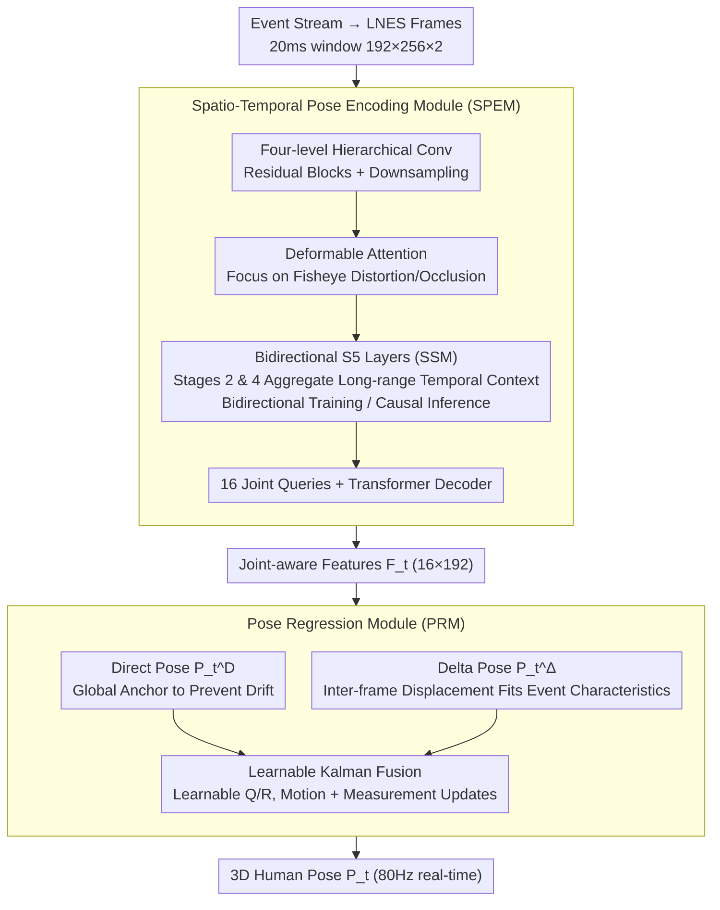

# E-3DPSM: A State Machine for Event-Based Egocentric 3D Human Pose Estimation

**Conference**: CVPR 2026  
**arXiv**: [2604.08543](https://arxiv.org/abs/2604.08543)  
**Code**: [https://4dqv.mpi-inf.mpg.de/E-3DPSM/](https://4dqv.mpi-inf.mpg.de/E-3DPSM/)  
**Area**: Human Understanding  
**Keywords**: Event camera, Egocentric pose estimation, State space model, 3D human pose, Temporal consistency

## TL;DR

E-3DPSM is proposed as an event-based state machine for egocentric 3D human pose estimation. It models pose estimation as a continuous-time state evolution process, utilizing bidirectional SSMs for temporal modeling and a learnable Kalman-style fusion module to integrate direct and incremental predictions. It achieves 80Hz real-time inference, reduces MPJPE by 19%, and improves temporal stability by 2.7 times.

## Background & Motivation

Egocentric 3D human pose estimation is a core capability for VR/AR (real-time avatar control, fitness tracking, telepresence, etc.), but faces several key challenges:

**Limitations of Prior Work (RGB Cam)**: High noise in low-light environments, motion blur caused by rapid head movements, and high bandwidth/power pressure on wearable devices from high-resolution video streams.

**Background (Event Cam)**: Millisecond-level temporal resolution, high dynamic range, and nearly zero motion blur make event cameras naturally suited for fast motion and self-occlusion scenarios.

Existing event-based methods like EventEgo3D/EventEgo3D++ exhibit the following issues:

- **Architecture not fully adapted to event stream characteristics**: They rely on frame buffers to store previous frame information rather than fully exploiting the asynchronous, continuous, and change-driven nature of event data.
- **Dependency on 2D heatmaps**: This introduces quantization errors.
- **Requirement for segmentation masks**: This introduces additional sources of error.
- **Temporal jitter and drift**: Insufficient 3D accuracy in self-occlusion scenarios.

The **Key Insight** consists of three points:
- Events naturally encode 2D spatial changes, which should correspond to changes in 3D space (delta poses).
- The continuity of events is suitable for modeling as a continuous process (SSM).
- Intermediate supervisions like 2D heatmaps and segmentation can be removed.

## Method

### Overall Architecture

E-3DPSM treats egocentric 3D pose estimation as a continuous-time state machine in three steps. First, the raw event stream is converted into LNES frames $\{\mathbf{L}_t\}_{t=1}^N$ (20ms window, 192×256×2). Next, the Spatio-Temporal Pose Encoding Module (SPEM) extracts temporal-aware joint features. Finally, the Pose Regression Module (PRM) simultaneously predicts the direct pose $\mathbf{P}_t^D$ and the incremental pose $\mathbf{P}_t^\Delta$, which are fused via a learnable Kalman-style module to obtain the final 3D pose $\mathbf{P}_t$. The pipeline deliberately omits intermediate supervisions like 2D heatmaps and segmentation masks.

### Key Designs

**1. Spatio-Temporal Pose Encoding Module (SPEM): Exploiting Event Stream Temporality**

Previous event-based methods relied solely on frame buffers, failing to grasp the asynchronous and change-driven nature of the data. SPEM utilizes a four-level hierarchical convolution to extract spatial features (two residual blocks + downsampling per level). Deformable attention is added at the end of each level to adaptively focus on key regions, handling fisheye distortion and self-occlusion. Crucially, event-specific bidirectional S5 layers (SSMs) are inserted at stages 2 and 4 to aggregate long-range temporal context at each spatial location independently. The model uses bidirectional mode during training to utilize full context and switches to causal mode during inference for real-time support. Finally, 16 learnable joint queries $\mathbf{U}=\{\mathbf{u}_1,\ldots,\mathbf{u}_{16}\}$ interact with the encoder features through a Transformer Decoder to output joint-aware features $\mathbf{F}_t \in \mathbb{R}^{16 \times 192}$.

**2. Pose Regression Module (PRM): Suppressing Drift and Jitter via Learnable Kalman Fusion**

Since events naturally encode "change," the PRM does not only regress absolute positions. Direct pose regression uses an MLP to output $\mathbf{P}_t^D \in \mathbb{R}^{16 \times 3}$ as a global anchor to prevent drift. Incremental pose regression concatenates current features with previous pose embeddings to predict inter-frame displacement $\mathbf{P}_t^\Delta \in \mathbb{R}^{16 \times 3}$, which is easier to learn due to its alignment with event characteristics. The **Key Challenge** lies in fusion: simple summation $\mathbf{P}_t = \mathbf{P}_{t-1}^D + \mathbf{P}_t^\Delta$ accumulates drift, and post-hoc fixed Kalman filtering lacks task adaptivity. PRM integrates the Kalman filter into the network, maintaining internal state $\mathbf{X}_t$ and covariance $\Sigma_t$. It uses delta poses for motion updates and direct poses for measurement updates. Process noise $\mathbf{Q}$ and observation noise $\mathbf{R}$ are set as learnable parameters, allowing the system to learn how much to trust incremental vs. direct predictions.

### Loss & Training

The model is supervised by a joint loss function with weights $\lambda_{3D} = \lambda_\Delta = \lambda_{2D} = 0.01$ and $\lambda_{BL} = \lambda_{BA} = 10^{-3}$:

$$\mathcal{L}_{total} = \lambda_{3D}\mathcal{L}_{3D} + \lambda_\Delta\mathcal{L}_\Delta + \lambda_{2D}\mathcal{L}_{2D} + \lambda_{BL}\mathcal{L}_{BL} + \lambda_{BA}\mathcal{L}_{BA}$$

Where $\mathcal{L}_{3D}$ is the 3D joint position MSE, $\mathcal{L}_\Delta$ is the MSE for incremental pose relative to GT displacement, $\mathcal{L}_{2D}$ is the 2D projection error, $\mathcal{L}_{BL}$ is the bone length L1 loss (preserving proportions), and $\mathcal{L}_{BA}$ is the bone direction cosine loss (ensuring anatomical plausibility). No synthetic data pre-training is required. The model is trained using Adam with a batch size of 32 on the EE3D-R dataset for 15 epochs ($\eta=10^{-3}$) and fine-tuned on EE3D-W for 10 epochs ($\eta=10^{-4}$), taking 34 hours on 4 A40 GPUs.

## Key Experimental Results

### Main Results

| Method | EE3D-R MPJPE↓ | EE3D-R PA-MPJPE↓ | EE3D-R $e_{smooth}$↓ | EE3D-W MPJPE↓ | EE3D-W PA-MPJPE↓ | EE3D-W $e_{smooth}$↓ |
|------|-------------|-----------------|---------------------|-------------|-----------------|---------------------|
| EgoPoseFormer | 151.66 | 96.99 | 66.50 | 220.40 | 130.45 | 79.23 |
| EventEgo3D | 110.39 | 84.52 | 27.06 | 195.50 | 108.20 | 45.29 |
| EventEgo3D++ | 103.28 | 77.06 | 22.93 | 172.43 | 98.41 | 40.87 |
| **Ours (Causal)** | **84.45** | **62.64** | **8.40** | **158.86** | **93.46** | **23.57** |
| **Ours (Non-Causal)** | **81.32** | **60.21** | **6.65** | **155.82** | **90.85** | **22.65** |

**Gain**: MPJPE reduced by ~19% (EE3D-R), $e_{smooth}$ improved by 2.7× (from 22.93 to 8.40).

**Evaluation on Occluded Joints**:

| Method | EE3D-R Occ MPJPE↓ | EE3D-R Occ PA-MPJPE↓ |
|------|-------------------|---------------------|
| EventEgo3D++ | 88.43 | 49.53 |
| **Ours (Causal)** | **67.49** | **41.85** |

### Ablation Study

**SPEM Module Ablation**:

| Config | MPJPE↓ | PA-MPJPE↓ | $e_{smooth}$↓ | Description |
|------|--------|----------|-------------|------|
| w/o SSM Blocks | 118.53 | 87.48 | 16.94 | Significant degradation without temporal modeling |
| Single SSM (Stage 4) | 90.18 | 66.06 | 7.84 | Early temporal context is important |
| w/o Deformable Attn | 88.27 | 64.98 | 7.71 | Spatial adaptivity is beneficial |

**PRM Module Ablation**:

| Config | MPJPE↓ | PA-MPJPE↓ | $e_{smooth}$↓ | Description |
|------|--------|----------|-------------|------|
| w/o Fusion (Simple Add) | 141.22 | 84.17 | 10.14 | Serious drift |
| Direct Pose Only | 91.26 | 65.43 | 17.22 | High jitter |
| Static Fusion | 88.31 | 65.63 | 9.93 | Inferior to adaptive fusion |
| **Full model** | **84.45** | **62.64** | **8.40** | Optimal performance |

### Key Findings

1. **Causal mode approaches non-causal performance**: Non-causal training with causal inference still yields competitive results, indicating good generalization.
2. **High real-time performance**: 80Hz on A6000 and 52Hz on 3050Ti.
3. **No synthetic pre-training needed**: Streamlined compared to previous methods.
4. **Bone length/direction losses are crucial**: Maintaining anatomical plausibility prevents non-physical predictions.
5. Even with post-processing Kalman smoothing added to baselines, they still underperform compared to this method, suggesting improvements stem from architectural design rather than smoothing tricks.

## Highlights & Insights

1. **Depth utilization of event characteristics**: Aligning "event-encoded change" with "3D delta pose" is an elegant modality-task alignment.
2. **SSM for Event Cameras**: First introduction of S5 layers to egocentric 3D pose estimation; SSM's continuous state evolution naturally fits the asynchronous nature of event streams.
3. **Learnable Kalman Fusion**: Outperforms simple addition or fixed-parameter filtering by allowing the model to automatically learn which signal source to trust.
4. **Removal of intermediate supervision**: Eliminating 2D heatmaps and segmentation masks simplifies the pipeline and removes potential error sources.

## Limitations & Future Work

1. **Challenges in heavy occlusion + high dynamics**: Accuracy still has room for improvement in these extreme scenarios.
2. **Validated only on fisheye egocentric views**: Generalization to third-person perspectives is unknown.
3. **Small EE3D dataset**: Limited real-world laboratory data; in-the-wild data would be more challenging.
4. **16-joint model limitations**: Hands and facial joints are not covered; full body pose requires more joints.
5. **Exploration of Mamba**: Potential for further improvements using newer SSM architectures like Mamba to replace S5.

## Related Work & Insights

- **EventEgo3D/EventEgo3D++**: Direct precursors and targets for improvement.
- **S5 / Mamba**: Successful applications of SSMs in the event camera domain.
- **EgoPoseFormer**: RGB method adapted for event input as a comparison baseline.
- Insight: The "change-encoding" characteristic of event cameras has broader applications in 3D vision (e.g., scene flow, depth estimation), and the delta prediction + fusion paradigm is worth generalizing.

## Rating

- Novelty: ⭐⭐⭐⭐⭐ — Elegantly models pose estimation as a continuous state machine with delta+direct fusion.
- Experimental Thoroughness: ⭐⭐⭐⭐ — Comprehensive ablation on two benchmarks, though datasets are relatively small.
- Writing Quality: ⭐⭐⭐⭐ — Clear structure, complete derivations, and intuitive illustrations.
- Value: ⭐⭐⭐⭐ — Provides a new paradigm for event-based 3D vision with practical 80Hz real-time utility.

<!-- RELATED:START -->

## Related Papers

- [\[CVPR 2026\] Egocentric Visibility-Aware Human Pose Estimation](egocentric_visibility-aware_human_pose_estimation.md)
- [\[CVPR 2026\] Forecasting 3D Scanpaths in Egocentric Video](forecasting_3d_scanpaths_in_egocentric_video.md)
- [\[CVPR 2026\] EventGait: Towards Robust Gait Recognition with Event Streams](eventgait_towards_robust_gait_recognition_with_event_streams.md)
- [\[CVPR 2026\] EgoPoseFormer v2: Accurate Egocentric Human Motion Estimation for AR/VR](egoposeformer_v2_accurate_egocentric_human_motion_estimation_for_arvr.md)
- [\[ECCV 2024\] Event-based Head Pose Estimation: Benchmark and Method](../../ECCV2024/human_understanding/event-based_head_pose_estimation_benchmark_and_method.md)

<!-- RELATED:END -->
