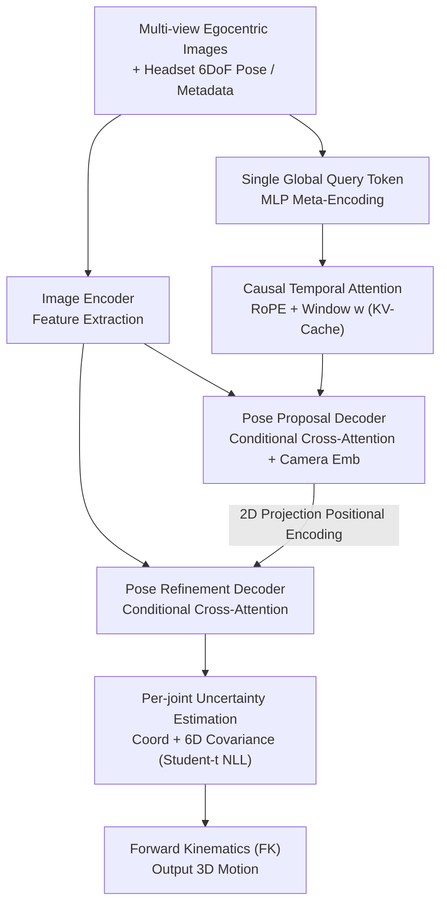

# EgoPoseFormer v2: Accurate Egocentric Human Motion Estimation for AR/VR

**Conference**: CVPR2026  
**arXiv**: [2603.04090](https://arxiv.org/abs/2603.04090)  
**Code**: Not open-sourced  
**Area**: Human Understanding  
**Keywords**: Egocentric Pose Estimation, Transformer, Semi-Supervised Learning, Automatic Labeling, AR/VR, Temporal Modeling

## TL;DR

Ours proposes EgoPoseFormer v2 (EPFv2), achieving SOTA accuracy in egocentric 3D human motion estimation (MPJPE 4.02cm, a 15-22% improvement over its predecessor) on the EgoBody3M benchmark with 0.8ms GPU latency. This is realized through an end-to-end Transformer architecture (Single Global Query + Causal Temporal Attention + Conditional Multi-view Cross-Attention) and an automatic labeling system based on uncertainty distillation.

## Background & Motivation

**Core AR/VR Requirement**: Egocentric 3D motion estimation is a fundamental capability for AR/VR interaction, yet recovering full-body 3D poses from headset cameras remains an open challenge.

**View Constraints**: The egocentric perspective covers only limited body regions, suffers from frequent self-occlusion, and provides restricted scene context.

**Limitations of Prior Work**: Early methods (EgoGlass, UnrealEgo) relied on single-frame heatmap regression, leading to prediction jitter and temporal inconsistency; LSTM methods (EgoBody3M) improved smoothness but lacked 3D geometric modeling.

**Architecture Limitations of Prior Work**: EgoPoseFormer v1 used a design with one query token per joint, causing computational cost to scale linearly with the number of joints. Its two-stage architecture prevented end-to-end training (gradients could not flow back to the coarse estimation stage), and its reliance on deformable attention hindered deployment on edge devices.

**Key Challenge**: Real-world egocentric data collection and annotation are extremely costly, leaving a vast amount of unlabeled in-the-wild data underutilized.

**Design Motivation**: VR devices require ultra-low latency (<1ms) and edge-computing-friendly operators. Low-level operations like deformable attention are difficult to optimize on consumer-grade hardware.

## Method

### Overall Architecture

EPFv2 aims to reconstruct full-body 3D motion from sparse headset viewpoints end-to-end with sufficient efficiency for VR deployment. It utilizes an encoder-decoder structure: the image encoder extracts multi-view features, while headset poses and auxiliary metadata are compressed into a **single** global pose query token, which absorbs historical information via causal temporal attention. Subsequently, two structurally identical Transformer decoders produce a Pose Proposal (coarse estimation) followed by Pose Refinement (fine estimation). Each keypoint is predicted with an associated uncertainty, and the final full-body pose is generated through Forward Kinematics (FK). Unlike v1, the entire pipeline is fully differentiable, allowing gradients to flow back through both stages.

### Key Designs

**1. Single Global Query Token: Decoupling Complexity from Body Representation**

v1 assigned a query token to every joint, meaning complexity scaled with joint count, slowing down inference as detail increased. EPFv2 uses only one token to aggregate all information, initialized by encoding headset 6DoF poses and auxiliary metadata through an MLP: $\mathbf{q}_t = \text{MLP}_{\text{query}}(\mathbf{H}_t)$. Since all information converges on this single token, the computational budget remains constant regardless of the body representation—whether using keypoints or parametric models (joint rotations + body scale).

**2. Conditional Multi-view Cross-Attention: Hardware-Friendly Standard Operators**

v1 relied on deformable attention, which is accurate but difficult to deploy on consumer VR devices. Ours switches to a standard structure that performs multi-head cross-attention on each view independently followed by linear fusion. The proposal stage is conditioned on learnable camera embeddings $\xi^v$, while the refinement stage incorporates positional encodings from projecting 3D coarse keypoints back to 2D. This serves as a spatial anchor, replicating the effect of v1's stereo deformable attention while remaining hardware-friendly.

**3. Causal Temporal Attention: Inferring Occluded Parts from History**

Self-occlusion is frequent in egocentric views; legs and feet are often invisible. EPFv2 employs causal self-attention with RoPE (Rotary Positional Embedding) to allow the current query token to attend to historical tokens within a window $w$. Standard causal masking is used during training, and KV-Cache is utilized during inference for efficiency. Consequently, even if legs are occluded in a specific frame, the model can infer a plausible pose using temporal cues rather than jittering sporadically.

**4. Per-joint Uncertainty Estimation: Awareness of Invisibility**

For each keypoint, the model predicts both coordinates and a 6D uncertainty vector (the Cholesky factor $\mathbf{L}$ of the covariance matrix), trained with a Negative Log-Likelihood loss based on the Student-t distribution. Compared to the commonly used Laplacian distribution, Student-t is smoother at the origin and has heavier tails, making it more robust to large residuals. Empirically, frequently occluded joints like feet and legs exhibit higher predicted uncertainty, a signal subsequently leveraged by the automatic labeling system for distillation.

### Loss & Training

The primary loss weights multiple objectives:

$$\mathcal{L} = \lambda_{\text{pos}} w_d \mathcal{L}_{\text{mse}}(\mathbf{P}_r, \hat{\mathbf{P}}) + \lambda_{\text{pos}}(1-w_d) \mathcal{L}_{\text{tNLL}}(\mathbf{P}_r, \hat{\mathbf{P}}, \Sigma) + \lambda_{\text{pos}} \mathcal{L}_{\text{mse}}(\mathbf{P}_p, \hat{\mathbf{P}}) + \lambda_{\text{jerk}} [\mathcal{L}_{\text{jerk}}(\mathbf{P}_r) + \mathcal{L}_{\text{jerk}}(\mathbf{P}_p)]$$

Where $w_d$ uses a cosine schedule to dynamically balance MSE and uncertainty likelihood, and the Jerk loss ($\lambda_{\text{jerk}}=0.8$) encourages temporal smoothness.

Beyond supervised training, Ours includes an **Automatic Labeling System (ALS)** to leverage unlabeled in-the-wild data via a teacher-student semi-supervised framework. The teacher model (ViT encoder initialized with DINOv3) is trained on labeled data to generate pseudo-labels for large-scale unlabeled data. The teacher receives raw input while the student receives strongly augmented versions (asymmetric augmentation). During distillation, the student mimics both the pose and the teacher's per-joint confidence structure using $\mathcal{L}_{\text{uncertainty}} = \|s_T - s_S\|$. On 70M frames of in-the-wild data (EGO-ITW-70M), the gains from data scaling persist.

## Key Experimental Results

### Main Results: EgoBody3M Benchmark Comparison

| Method | MPJPE (cm) ↓ | MPJVE ↓ | Wrist MPJPE | Shoulder MPJPE | Leg MPJPE | Foot MPJPE |
|------|-------------|---------|-----------|-----------|-----------|-----------|
| UnrealEgo (ECCV22) | 7.41 | 1.27 | - | - | - | - |
| EgoBody3M (ECCV24) | 5.18 | 0.54 | 6.14 | 2.80 | 8.40 | 10.25 |
| EgoPoseFormer v1 (ECCV24) | 4.75 | 0.87 | 6.01 | 2.72 | 7.95 | 10.16 |
| **EPFv2 (Ours) w/o ALS** | **4.17** | **0.42** | 5.74 | 2.38 | 6.91 | 9.11 |
| **EPFv2 (Ours) with ALS** | **4.02** | **0.42** | **4.99** | **2.33** | **6.66** | **8.69** |

### Ablation Study

| Variant | Overall MPJPE | Wrist MPJPE | Leg MPJPE |
|------|:---:|:---:|:---:|
| ① Direct Keypoint Head (No FK) | 4.35 | 6.02 | 7.17 |
| ② No Temporal Attention | 4.35 | 6.04 | 7.21 |
| ③ No Projection Conditioning | 4.30 | 5.96 | 7.15 |
| ④ No Auxiliary Info | 4.39 | 5.98 | 7.34 |
| ⑤ No Uncertainty | 4.25 | 5.83 | 7.00 |
| ⑥ EPFv2 Full (Ours w/o ALS) | 4.17 | 5.74 | 6.91 |
| ⑦ + ALS (No Uncertainty Distillation) | 4.08 | 5.07 | 6.74 |
| ★ + ALS + Uncertainty Distillation | **4.02** | **4.99** | **6.66** |

### Key Findings

- **Significant Accuracy Gain**: EPFv2 outperforms EgoBody3M by 22.4% and EPFv1 by 15.4% in MPJPE.
- **Improved Temporal Stability**: MPJVE is reduced by 22.2% compared to EgoBody3M and by 51.7% compared to EPFv1.
- **ALS Impact on Wrists**: Wrist MPJPE improved from 5.74 to 4.99 (13.1% Gain), as wrists are particularly difficult due to frequent occlusion and rapid motion.
- **Lightweight Models Benefit More**: MobileNetV4-S shows a larger proportional Gain from ALS than ResNet-18, indicating ALS is especially effective for lightweight deployment scenarios.
- **Real-time Performance**: 0.8ms GPU latency satisfies the real-time requirements of VR devices.
- **FK Superiority**: Predicting joint rotations via Forward Kinematics is more accurate than direct 3D keypoint regression due to the physical structural prior.

## Highlights & Insights

- The single global query token design is elegant, decoupling model computation from body representation and supporting both keypoints and parametric models.
- Replacing deformable attention with standard cross-attention plus projection conditioning maintains accuracy while being deployment-friendly.
- The Automatic Labeling System (ALS) provides a clear and effective paradigm, with uncertainty distillation serving as a logical enhancement; the data scaling gain curve is convincing.
- 0.8ms latency makes this one of the most viable solutions for actual VR device deployment.

## Limitations & Future Work

- The unlabeled dataset EGO-ITW-70M is private, limiting the reproducibility of the ALS results.
- Evaluation is limited to the EgoBody3M benchmark, lacking quantitative cross-dataset comparisons.
- The teacher model depends on DINOv3-L weights; the efficacy of the semi-supervised pipeline may be bounded by the quality of the vision foundation model.
- Generalization to in-the-wild scenarios is shown only through qualitative results (XR-MBT), lacking quantitative validation.
- Failure cases in extreme occlusion scenarios (e.g., long-term full-body invisibility) are not addressed.

## Related Work & Insights

- **Egocentric Pose Estimation**: EgoGlass, UnrealEgo (Heatmap) → EgoBody3M (LSTM Temporal) → EgoPoseFormer v1 (Deformable Attention Transformer) → EPFv2.
- **Egocentric Datasets**: EgoCap → Mo2Cap2 → xR-EgoPose → UnrealEgo → EgoBody3M (First large-scale real-world dataset) → Nymeria, EMHI.
- **Semi-supervised/Automatic Labeling**: Follows the classic pseudo-labeling paradigm, which was previously largely unexplored in egocentric motion estimation; the closest work, EgoPW, requires additional external views.

## Rating

- Novelty: ⭐⭐⭐⭐ — The single query design and hardware-friendly attention are practical, and the application of ALS in this field is pioneering.
- Experimental Thoroughness: ⭐⭐⭐⭐ — Comprehensive ablation and data scaling experiments, though benchmark diversity is limited and private data affects reproducibility.
- Writing Quality: ⭐⭐⭐⭐⭐ — Clear structure, well-argued motivation, and thorough comparison with previous work.
- Value: ⭐⭐⭐⭐ — High engineering value for AR/VR pose estimation; 0.8ms latency and edge-friendly design are highly practical.

<!-- RELATED:START -->

## Related Papers

- [\[CVPR 2026\] E-3DPSM: A State Machine for Event-Based Egocentric 3D Human Pose Estimation](e-3dpsm_a_state_machine_for_event-based_egocentric_3d_human_pose_estimation.md)
- [\[CVPR 2026\] GazeShift: Unsupervised Gaze Estimation and Dataset for VR](gazeshift_unsupervised_gaze_estimation_and_dataset_for_vr.md)
- [\[CVPR 2026\] MAMMA: Markerless Accurate Multi-person Motion Acquisition](mamma_markerless_accurate_multi-person_motion_acquisition.md)
- [\[ECCV 2024\] MANIKIN: Biomechanically Accurate Neural Inverse Kinematics for Human Motion Estimation](../../ECCV2024/human_understanding/manikin_biomechanically_accurate_neural_inverse_kinematics_for_human_motion_esti.md)
- [\[CVPR 2026\] Forecasting 3D Scanpaths in Egocentric Video](forecasting_3d_scanpaths_in_egocentric_video.md)

<!-- RELATED:END -->
