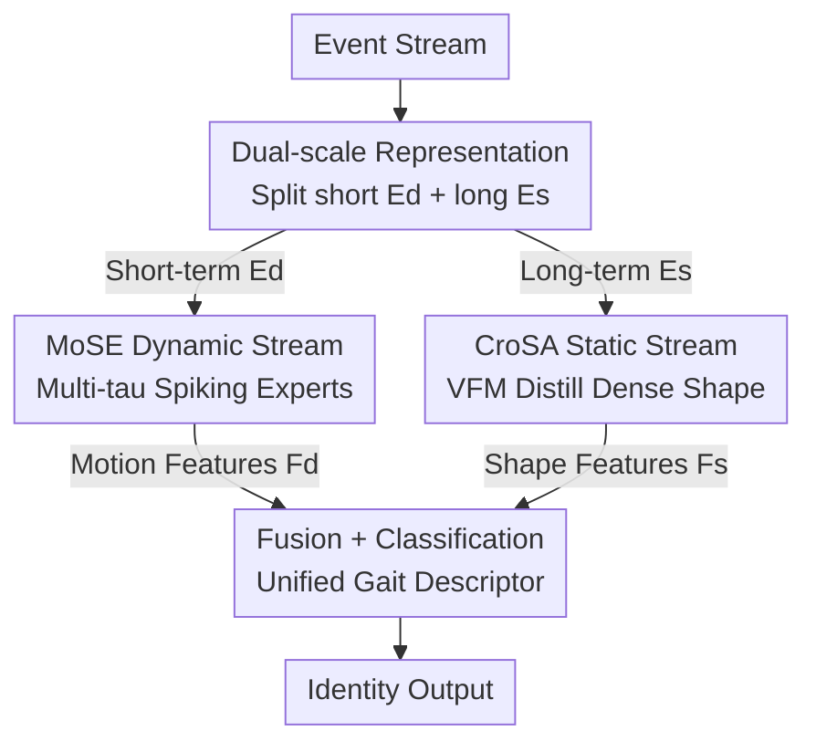

# EventGait: Towards Robust Gait Recognition with Event Streams

**Conference**: CVPR 2026  
**Paper**: [CVF Open Access](https://openaccess.thecvf.com/content/CVPR2026/html/Xu_EventGait_Towards_Robust_Gait_Recognition_with_Event_Streams_CVPR_2026_paper.html)  
**Code**: https://github.com/QUEAHREN/EventGait  
**Area**: Human Understanding / Gait Recognition  
**Keywords**: Gait Recognition, Event Camera, Spiking Neural Networks, Cross-modal Structural Alignment, Dual-stream Network  

## TL;DR
EventGait performs gait recognition using event cameras and proposes a dual-stream framework: a dynamic stream uses a Mixture of Spiking Experts (MoSE) with varying membrane time constants to adaptively capture multi-scale motion, while a static stream employs Cross-modal Structural Alignment (CroSA) with DINOv2 as a teacher to distill dense shape priors into sparse events. It matches camera-based methods in normal light and significantly outperforms them in low light (+37.3% at night) on both synthetic and real event gait benchmarks.

## Background & Motivation

**Background**: Gait recognition is a non-intrusive, privacy-preserving biometric modality capable of long-distance operation. Prevailing modalities include silhouettes, skeletons, parsing maps, RGB images, and point clouds; recent methods have shifted from intermediate representations to end-to-end RGB approaches.

**Limitations of Prior Work**: RGB cameras suffer from low temporal resolution ($\approx 30$ ms) and narrow dynamic range ($< 80$ dB), leading to degraded visual cues under low light, occlusion, or motion blur. While LiDAR point clouds are robust to illumination, they are prohibitively expensive and energy-intensive (approx. $\$75$K per LiDAR vs. $\$1.5$K per event camera), hindering large-scale deployment.

**Key Challenge**: A trade-off exists between "robustness $\leftrightarrow$ cost" among image-based methods and 3D sensors. Gait recognition requires both **stable static body shape** and **high-frequency dynamic motion rhythm**. Event cameras, with microsecond-level resolution ($< 3$ µs) and high dynamic range ($> 120$ dB), naturally suppress irrelevant textures (clothing/color). However, prior methods (e.g., EV-Gait) aggregate event streams into grid-like "event frames" over long windows. This **voxelization** destroys two things: ① high-frequency temporal cues are smoothed over, losing dynamic rhythm; ② spatial representations become too sparse for deep networks to extract discriminative appearance features.

**Goal**: To fully exploit the potential of event cameras without degrading temporal precision or spatial density, creating a robust gait recognizer that matches RGB performance in normal light and surpasses it in low light.

**Key Insight**: Robust event-based gait recognition should not only encode static shapes but also preserve fine-grained dynamics from high-resolution events. Thus, "dynamics" and "shapes" should be explicitly decoupled and modeled via specialized mechanisms.

**Core Idea**: Use "short-term segments + Mixture of Spiking Experts" to model high-frequency motion and "long-term segments + VFM distillation" to recover dense shapes. This dual-stream approach preserves temporal advantages while compensating for spatial sparsity.

## Method

### Overall Architecture
EventGait is an end-to-end **dual-stream** framework. The input event stream is processed via a **dual-scale temporal design**, where a long window $T$ is partitioned into two granularities: **short-term segments** $\mathbf{E}_d$ with small $\Delta T = T/K$ for the dynamic stream, and a **long-term segment** $\mathbf{E}_s$ aggregating the entire window $T$ for the static stream. The dynamic stream consists of **Mixture of Spiking Experts (MoSE)** to output motion features $\mathbf{F}_d$; the static stream is a CNN encoder supervised by a frozen **Cross-modal Structural Alignment (CroSA)** teacher (DINOv2) to output dense shape features $\mathbf{F}_s$. These features are fused via $\Phi(\cdot)$ into a unified gait descriptor $\mathbf{F}_{gait}$ for downstream decoding and classification. Notably, the CroSA RGB teacher branch is **only present during training**; at inference, the static stream processes events only.

### Key Designs

**1. Dual-scale Event Representation + Dual-stream Decomposition**

Event cameras asynchronously record log-intensity changes $e_i=(x_i,y_i,t_i,p_i)$. When changes exceed a threshold $c$, an event with polarity $p_i\in\{+1,-1\}$ is triggered. For deep network compatibility, the window $T$ is divided into $K$ bins using a linear interpolation kernel:

$$E_p(x,y,k)=\sum_{e_i\in E_p}\max\!\Big(0,\,1-\frac{|t_i-t_k|}{\Delta T}\Big),\quad \Delta T=T/K,$$

resulting in $\mathbf{E}\in\mathbb{R}^{2\times K\times H\times W}$. The dynamic stream uses short-term $\mathbf{E}_d$ (high-frequency motion), while the static stream uses long-term $\mathbf{E}_s$ (stable shape), allocating the conflict between "temporal precision" and "spatial stability" to specialized streams.

**2. MoSE (Mixture of Spiking Experts)**

Traditional CNNs/RNNs fail to capture event sparsity. The authors utilize **Spiking Neural Networks (SNN)**. The membrane potential $U(t)$ of an LIF neuron integrates sparse spikes over time:

$$\tau\frac{dU(t)}{dt}=-U(t)+R\cdot I(t),\qquad S(t)=\Theta(U(t)-U_{th}),$$

where the membrane time constant $\tau$ controls decay. Small $\tau$ ("fast" neurons) capture high-frequency bursts in bright scenes, while large $\tau$ ("slow" neurons) accumulate sparse signals in low light. MoSE uses $N$ parallel spiking experts $\{E_1,\dots,E_N\}$ with different initial $\tau_i$. A spiking gating network $\mathcal{G}(\cdot)$ adaptively calculates mixing coefficients $\alpha_i$:

$$\hat{E}_t=\sum_{i=1}^{N}\alpha_i\,E_i(E_t).$$

**3. CroSA (Cross-modal Structural Alignment)**

To address the sparsity of $\mathbf{E}_s$, CroSA employs **cross-modal distillation**. A frozen DINOv2 teacher $F_{teacher}$ processes grayscale versions of synchronous RGB frames $\mathbf{I}_g$ to generate $z_{img}$. A CNN-based event static encoder $F_{student}$ generates $z_{evs}$ via an alignment layer $\mathcal{A}(\cdot)$. The $\ell_2$ distance minimizes the gap:

$$z_{img}=F_{teacher}(\mathbf{I}_g),\quad z_{evs}=\mathcal{A}(F_{student}(\mathbf{E}_s)),\qquad \mathcal{L}_{align}=\|z_{evs}-z_{img}\|_2^2.$$

**4. Synthetic Pipeline + Benchmarks**

Due to the lack of massive event gait data, the authors developed a pipeline to synthesize event streams from RGB videos (using frame interpolation and v2e models). This created **CCGR-Mini-E** (970 IDs, 53 covariates) and **SUSTech1K-E** (1,050 IDs, multi-modal pairs).

### Loss & Training
The total loss combines classification and alignment:

$$\mathcal{L}_{total}=\mathcal{L}_{ce}+\mathcal{L}_{tri}+\lambda_d\mathcal{L}_{align},$$

where $\mathcal{L}_{ce}$ is cross-entropy and $\mathcal{L}_{tri}$ is triplet loss. $\lambda_d$ (default 0.2) balances the alignment term.

## Key Experimental Results

### Main Results
In-domain evaluation on SUSTech1K-E (Rank-1). EventGait (4.6M parameters) outperforms state-of-the-art camera methods by $+5.2\%$ overall and even surpasses LiDAR methods in some cases:

| Input | Method | Params | CL (Clothing) | NT (Night) | Overall |
|------|------|------|-----------|-----------|---------|
| Point Cloud | LidarGait++ (CVPR25) | 4.4M | 92.4 | 92.2 | 92.7 |
| Silhouette | GaitBase (CVPR23) | 8.0M | 49.6 | 25.9 | 76.1 |
| Event | EVGait (CVPR19) | 45.2M | 67.8 | 78.7 | 65.4 |
| Event | **Ours** | **4.6M** | **93.3** | **84.8** | **92.8** |

Compared to GaitBase, performance gains reach $+18.4\%$ in clothing-change and $+37.3\%$ at night.

### Ablation Study
The dual-stream architecture is critical, and 3 experts in MoSE is the optimal balance (SUSTech1K-E):

| Configuration | NM | CL | NT | Overall | Note |
|------|----|----|----|---------|------|
| Static Only | 82.6 | 61.6 | 76.9 | 82.0 | Missing motion |
| Dynamic Only | 74.5 | 52.0 | 71.7 | 72.4 | Missing structure |
| Dual-stream | 92.5 | 78.1 | 84.8 | 92.8 | Full model |
| MoSE (1 expert) | — | — | — | 88.4 | Standard SNN |
| MoSE (3 experts)| — | — | — | 92.8 | Default |

### Key Findings
- **Dual-stream complementarity**: Removing either stream causes a performance drop of $10\%+$.
- **Multi-tau MoSE**: Using 3 experts (92.8) yields significant gains over a single SNN (88.4).
- **Moderate CroSA supervision**: $\lambda_d=0.2$ is optimal; excessive weighting introduces identity-irrelevant textures from RGB.
- **Low-light superiority**: Performance drops only $9.6\%$ across light conditions, whereas silhouette methods drop $30\%+$.

## Highlights & Insights
- **Explicit decoupling of dynamics and shape** allows each mechanism to focus on its strength, avoiding trade-offs in temporal/spatial resolution.
- **MoSE applies MoE to the temporal domain** of spiking neurons, letting the network hold different "temporal filters" (membrane constants) for varying lighting/motion.
- **CroSA utilizes VFM knowledge transfer** without increasing inference cost, distilling dense human structure priors into sparse event encoders.
- **Cost-efficiency**: Achieving LiDAR-level performance at a fraction of the hardware cost ($1/50$).

## Limitations & Future Work
- **Reliance on synthetic data**: Current benchmarks are synthesized, introducing a sim-to-real gap. 
- **Training-time RGB**: CroSA requires synchronized RGB frames for distillation, which may not always be available in pure event-collection pipelines.
- **Cross-domain challenges**: Rank-1 on CCGR-Mini remains low ($3.7\%$ in Table 3), indicating that high covariate and viewpoint variance is still unresolved.

## Related Work & Insights
- **vs. EV-Gait**: EventGait preserves sub-bin temporal precision and uses a dual-stream design, achieving higher accuracy with 10x fewer parameters.
- **vs. Silhouette methods**: These fail under low light; EventGait remains robust due to the high dynamic range of event cameras.
- **vs. LiDAR methods**: EventGait matches accuracy while using much cheaper sensors, demonstrating that 2D event streams can provide sufficient spatio-temporal dynamics.

## Rating
- Novelty: ⭐⭐⭐⭐⭐ Decoupling + MoSE + CroSA provides a fresh paradigm for event gait recognition.
- Experimental Thoroughness: ⭐⭐⭐⭐⭐ Extensive evaluation across 5 categories with comprehensive ablations.
- Writing Quality: ⭐⭐⭐⭐ Clear motivation; some implementation details are relegated to the appendix.
- Value: ⭐⭐⭐⭐⭐ High potential for low-cost, robust surveillance and security applications.

<!-- RELATED:START -->

## Related Papers

- [\[CVPR 2026\] MMGait: Towards Multi-Modal Gait Recognition](mmgait_multi_modal_gait_recognition.md)
- [\[CVPR 2026\] Text-guided Feature Disentanglement for Cross-modal Gait Recognition](text-guided_feature_disentanglement_for_cross-modal_gait_recognition.md)
- [\[CVPR 2026\] HyperGait: Unleashing the Power of Parsing for Gait Recognition in the Wild via Hypergraph](hypergait_unleashing_the_power_of_parsing_for_gait_recognition_in_the_wild_via_h.md)
- [\[CVPR 2026\] Unlocking Motion from Large Vision Models with a Semantic and Kinematic Duality for Gait Recognition](unlocking_motion_from_large_vision_models_with_a_semantic_and_kinematic_duality_.md)
- [\[CVPR 2026\] MS^2Gait: A Multi-Scale Spatio-Temporal Fusion Network for LiDAR-based Gait Recognition](ms2gait_a_multi-scale_spatio-temporal_fusion_network_for_lidar-based_gait_recogn.md)

<!-- RELATED:END -->
