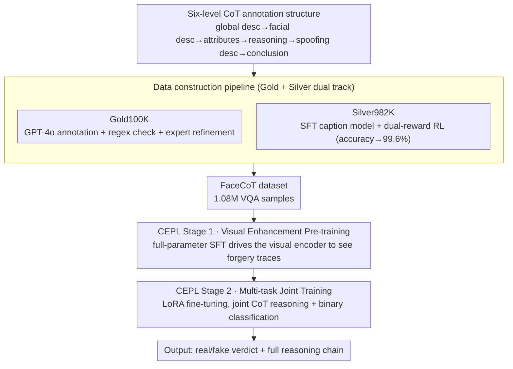

# FaceCoT: Chain-of-Thought Reasoning in MLLMs for Face Anti-Spoofing

**Conference**: CVPR 2026  
**arXiv**: [2506.01783](https://arxiv.org/abs/2506.01783)  
**Code**: Coming soon (the FaceCoT dataset will be released)  
**Area**: Human Understanding  
**Keywords**: Face Anti-Spoofing, CoT Reasoning, VQA Dataset, Progressive Learning, RL-Augmented Annotation  

## TL;DR
Builds FaceCoT, the first large-scale VQA dataset for face anti-spoofing (FAS) — 1.08M samples covering 14 attack types — with six-level CoT reasoning annotations (from global description to local reasoning to final conclusion); it also proposes CoT-Enhanced Progressive Learning (CEPL), a two-stage training strategy that lifts average AUC by 4.06% and cuts HTER by 5.00% across 11 benchmark datasets, surpassing all SOTA methods.

## Background & Motivation

**Background**: Existing FAS methods rely mostly on a single visual modality, leading to poor generalization and a lack of interpretability. The breakthroughs of MLLMs in image-text understanding and semantic reasoning open up a new path for FAS that fuses visual and linguistic reasoning.

**Limitations of Prior Work**: The key bottleneck is the **absence of high-quality vision-language multimodal FAS datasets** — existing FAS datasets only provide images plus binary labels, with no structured reasoning-chain information. As a result, models can neither learn to reason nor offer interpretable decisions.

**Key Challenge**: How to construct a large-scale, high-quality FAS CoT VQA dataset, and design an effective training strategy that lets the MLLM fully exploit CoT data to improve both detection performance and interpretability.

**Goal**: Build the dataset (scale + quality + structured reasoning) and pair it with a training recipe that prevents the binary-classification objective from starving the reasoning task.

**Key Insight**: Human discrimination follows a "global-to-local" path; if this path is written out as a learnable chain, the model gains both a supervisable reasoning skeleton and an explainable output instead of a black-box verdict.

**Core Idea**: Turn FAS into a structured chain-of-thought VQA task and train the MLLM progressively — first to see fine-grained forgery traces, then to jointly reason and discriminate.

## Method

### Overall Architecture

FaceCoT aims to make the MLLM output not just a "real/fake" binary, but a structured reasoning chain for face anti-spoofing. It stands on two legs: one is data construction — combining FaceCoT-Gold100K (GPT-4o auto-annotation + human refinement) and FaceCoT-Silver982K (auto-annotated by an RL-augmented caption model) into a 1.08M-sample VQA dataset; the other is training — a two-stage CoT-Enhanced Progressive Learning (CEPL) that first teaches the model to see fine-grained forgery traces, then to jointly reason and discriminate.

### Key Designs

**1. Six-level CoT annotation structure: writing the human "global-to-local" discrimination path into a learnable chain**

FAS datasets have long offered only images plus binary labels, so models learn neither reasoning nor interpretability. FaceCoT decomposes each sample's reasoning process into six levels: Caption (global scene description) → Facial Description (facial feature description) → Facial Attributes (enumerated facial attributes) → Reasoning (logical inference over multi-scale information) → Spoofing Description (description of spoofing traces and methods) → Conclusion (final Yes/No). The whole chain is formatted with XML tags, giving the model a clear, supervisable reasoning skeleton instead of letting it produce a conclusion in a black box.

**2. Data construction pipeline: using RL to push auto-annotation accuracy from 88% to 99.6%**

High-quality CoT annotation is too costly to do purely by hand, yet too inaccurate to do purely automatically. FaceCoT proceeds in two steps: Gold100K uses GPT-4o for auto-annotation with attack-type-specific hints (e.g., "photographing a poster constitutes spoofing"), then a regex match for validation; the 581 hard cases that still fail after a second round go to human experts for correction. Silver982K then SFTs a caption model on Gold100K and augments it with dual-reward RL — an accuracy reward (1 if the conclusion matches the label) plus a format reward (1 if the output follows the template). This RL pushes annotation accuracy from 88% to **99.6%**, enabling low-cost scaling to nearly a million samples.

**3. CEPL two-stage training: first let the visual encoder "see clearly", then jointly reason and discriminate**

If trained end-to-end in one shot, the binary-classification objective converges quickly and starves the reasoning task into under-optimization. CEPL splits training into two stages: Stage 1 (Visual Enhancement Pre-training) does full-parameter SFT on the CoT data, using language-guided supervision to drive the visual encoder to attend to subtle forgery traces; Stage 2 (Multi-task Joint Training) inherits Stage 1's visual encoder, resets the connector and language decoder to pretrained weights with LoRA fine-tuning, then jointly trains the CoT reasoning and binary-classification losses. Laying a solid visual foundation first and jointly optimizing later precisely avoids the mutual interference between tasks.

### Loss & Training

- Input resolution 448×448, backbone MiniCPMV-2.6-8B
- AdamW optimizer, initial lr=1e-6, weight decay=0.1
- 10 epochs, batch size 256, 8× A100
- At evaluation, Yes/No logits are extracted from the first generated token and softmaxed to yield a continuous confidence score

## Key Experimental Results

### 1-to-11 Cross-Domain Generalization (the most challenging setting)

| Method | Avg. HTER ↓ | Avg. AUC ↑ |
|------|------------|-----------|
| I-FAS (AAAI 2025) | 11.30% | 93.71% |
| **Ours-100K** | 7.65% | 96.59% |
| **Ours-All** | **6.30%** | **97.77%** |

Achieves the best performance on all 11 evaluation sets. In particular, on HKBU-MARs-V1+ and HiFiMask (which contain attack types unseen during training), AUC improves by about 10% and 14% respectively.

### Leave-one-out Protocol

| Method | Avg. HTER ↓ | Avg. AUC ↑ |
|------|------------|-----------|
| I-FAS | 1.33% | 99.50% |
| **Ours** | **1.06%** | **99.85%** |

### Key Findings
- **CEPL vs single-stage**: CEPL reduces HTER by 1.19% and improves AUC by 0.68% — progressive learning effectively resolves task interference
- **CoT data vs plain labels**: training on CoT data reduces HTER by 5.79% at 224 resolution — the gain is larger at low resolution
- **RL vs plain SFT caption model**: RL lowers HTER from 8.00% to 6.87%, proving RL improves not only accuracy but also semantic quality
- **Zero-shot vs CoT fine-tuning**: MiniCPMV's zero-shot 17.91% HTER → 6.30% after fine-tuning, a drop of 11.61 points

## Highlights & Insights
- **Pioneering dataset**: a 1.08M-sample FAS VQA dataset, the first in this field, covering 14 attack types
- **RL-augmented annotation**: dual-reward RL lifts the caption model's annotation accuracy from 88% to 99.6%, providing a low-cost, high-quality data-scaling path
- **Interpretability**: the model not only gives a verdict but also outputs a full reasoning chain, which is critical in safety-sensitive scenarios
- **Strong cross-domain generalization**: still generalizes strongly to 3D mask attacks unseen during training, with AUC improving by 10%+
- **Well-designed two-stage training**: letting the visual encoder learn fine-grained features via CoT first, then jointly training classification, avoids task interference

## Limitations & Future Work
- The dataset is derived from CelebA-Spoof and WFAS, so its demographic diversity depends on the original datasets
- Some rare attack types (e.g., adultdull with only 165 samples) have extremely few samples
- It is validated only in the FAS domain; whether the CoT construction method generalizes to other safety-detection tasks remains to be verified

## Related Work & Insights
- **vs I-FAS (AAAI 2025)**: I-FAS also uses an MLLM for interpretable FAS but only provides simple descriptions; FaceCoT provides a six-level structured reasoning chain with higher information density
- **vs FLIP (CVPR 2023)**: FLIP uses CLIP for cross-domain FAS; FaceCoT uses an MLLM + CoT reasoning for stronger generalization
- **vs LLaVA-CoT**: LLaVA-CoT is a general CoT reasoning framework, whereas FaceCoT is a CoT structure designed specifically for FAS

### Transferable Insights
- FaceCoT's data construction pipeline (GPT-4o + human refinement → RL-augmented caption model for scaling) can be reused to build VQA datasets for other safety-detection tasks
- The two-stage training strategy (visual enhancement first, then joint training) offers a useful reference for other MLLM tasks that require fine-grained visual understanding
- The approach of using RL to improve annotation quality is worth trying in more automated data-annotation scenarios

## Rating
- Novelty: ⭐⭐⭐⭐ The first FAS VQA dataset + CoT progressive learning, bringing MLLM reasoning into a traditional CV safety task
- Experimental Thoroughness: ⭐⭐⭐⭐⭐ 11 cross-domain benchmarks + two protocols + multiple ablations + cross-backbone validation + fine-grained attack-type analysis
- Writing Quality: ⭐⭐⭐⭐ Overall clear but extremely information-dense, with rich supplementary material
- Value: ⭐⭐⭐⭐⭐ Both the dataset and the methodology significantly advance FAS and the broader safety-AI field

<!-- RELATED:START -->

## Related Papers

- [\[CVPR 2026\] From Intuition to Investigation: A Tool-Augmented Reasoning MLLM Framework for Generalizable Face Anti-Spoofing](from_intuition_to_investigation_a_tool-augmented_reasoning_mllm_framework_for_ge.md)
- [\[ICCV 2025\] DADM: Dual Alignment of Domain and Modality for Face Anti-Spoofing](../../ICCV2025/human_understanding/dadm_dual_alignment_of_domain_and_modality_for_face_anti-spoofing.md)
- [\[AAAI 2026\] PA-FAS: Towards Interpretable and Generalizable Multimodal Face Anti-Spoofing via Path-Augmented Reinforcement Learning](../../AAAI2026/human_understanding/pa-fas_towards_interpretable_and_generalizable_multimodal_face_anti-spoofing_via.md)
- [\[CVPR 2026\] IDperturb: Enhancing Variation in Synthetic Face Generation via Angular Perturbations](idperturb_enhancing_variation_in_synthetic_face_generation_via_angular_perturbat.md)
- [\[CVPR 2026\] Face Time Traveller: Travel Through Ages Without Losing Identity](face_time_traveller_travel_through_ages_without_losing_identity.md)

<!-- RELATED:END -->
