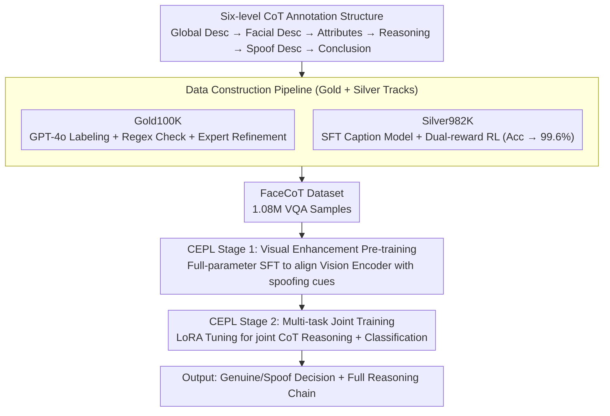

# FaceCoT: Chain-of-Thought Reasoning in MLLMs for Face Anti-Spoofing

**Conference**: CVPR 2026  
**arXiv**: [2506.01783](https://arxiv.org/abs/2506.01783)  
**Code**: Coming soon (FaceCoT dataset will be released)  
**Area**: Human Understanding  
**Keywords**: Face Anti-Spoofing, CoT Reasoning, VQA Dataset, Progressive Learning, RL-enhanced Labeling  

## TL;DR
This work constructs FaceCoT, the first large-scale VQA dataset for face anti-spoofing (FAS), containing 1.08 million samples across 14 attack types with six-level Chain-of-Thought (CoT) reasoning annotations (from global description to local reasoning to final conclusion). It proposes the CoT-Enhanced Progressive Learning (CEPL) two-stage training strategy, achieving an average AUC improvement of 4.06% and an HTER reduction of 5.00% across 11 benchmarks, surpassing all SOTA methods.

## Background & Motivation
Existing FAS methods primarily rely on a single visual modality, suffering from poor generalization and a lack of explainability. Breakthroughs in MLLMs for image-text understanding and semantic reasoning provide new opportunities for FAS through joint visual-linguistic reasoning. However, the Key Challenge is the **lack of high-quality multimodal FAS datasets**—existing datasets only provide images with binary labels, devoid of structured reasoning chains.

## Core Problem
The Goal is to construct a large-scale, high-quality FAS CoT VQA dataset and design effective training strategies to enable MLLMs to fully utilize CoT data for enhancing both detection performance and explainability.

## Method

### Overall Architecture

The goal of FaceCoT is to enable MLLMs to provide structured reasoning chains rather than simple "Genuine/Spoof" binary outputs. The approach consists of two tracks: one is data construction—merging FaceCoT-Gold100K (GPT-4o auto-labeling + manual refinement) and FaceCoT-Silver982K (RL-enhanced caption model auto-labeling) into a 1.08M sample VQA dataset; the other is training—using the two-stage CoT-Enhanced Progressive Learning (CEPL) to first let the model learn fine-grained spoofing artifacts and then perform joint reasoning and discrimination.

### Key Designs

**1. Six-level CoT Annotation Structure: Formalizing human "Global-to-Local" judgment into a learnable chain**

FAS datasets have long lacked reasoning and explainability. FaceCoT decomposes the reasoning process into six levels: Caption (global scene) → Facial Description (facial features) → Facial Attributes (list of attributes) → Reasoning (logic based on multi-scale info) → Spoofing Description (spoofing features/methods) → Conclusion (final Yes/No). The chain is formatted with XML tags to provide a clear, supervised skeleton for the model.

**2. Data Construction Pipeline: Boosting auto-labeling accuracy from 88% to 99.6% via RL**

Pure manual labeling is too costly, while pure automated labeling is inaccurate. FaceCoT employs a two-step approach: Gold100K uses GPT-4o with targeted hints (e.g., "poster photos constitute spoofing"), followed by regex matching; 581 hard cases failing the second round are manually corrected. Silver982K uses a caption model SFTed on Gold100K, enhanced by dual-reward RL—Accuracy Reward (1 if conclusion matches label) + Format Reward (1 if output conforms to template). This RL mechanism boosts labeling accuracy from 88% to **99.6%**, enabling low-cost scaling to nearly one million samples.

**3. CEPL Two-stage Training: Visual encoding before joint reasoning**

End-to-end training often leads to rapid convergence of the binary classification goal, leaving the reasoning task under-optimized. CEPL splits training: Stage 1 (Visual Enhancement Pre-training) performs full-parameter SFT on CoT data using language-guided supervision to drive the vision encoder to focus on subtle spoofing artifacts. Stage 2 (Multi-task Joint Training) inherits the vision encoder, resets adaptive layers and the language decoder to pre-trained weights with LoRA, and jointly trains on CoT reasoning and classification losses. Building a visual foundation first avoids task interference.

### Loss & Training

- Input resolution: 448×448; Backbone: MiniCPMV-2.6-8B.
- AdamW optimizer, initial lr=1e-6, weight decay=0.1.
- 10 epochs, batch size 256, 8× A100.
- Inference: Extracts Yes/No logits from the first generated token to compute softmax for continuous confidence scores.

## Key Experimental Results

### 1-to-11 Cross-domain Generalization (Highly Challenging Setting)

| Method | Avg. HTER ↓ | Avg. AUC ↑ |
|------|------------|-----------|
| I-FAS (AAAI 2025) | 11.30% | 93.71% |
| **Ours-100K** | 7.65% | 96.59% |
| **Ours-All** | **6.30%** | **97.77%** |

Ours achieves peak performance across all 11 evaluation sets. Notably, on HKBU-MARs-V1+ and HiFiMask (containing unseen attack types), AUC improves by approximately 10% and 14%, respectively.

### Leave-one-out Protocol

| Method | Avg. HTER ↓ | Avg. AUC ↑ |
|------|------------|-----------|
| I-FAS | 1.33% | 99.50% |
| **Ours** | **1.06%** | **99.85%** |

### Ablation Study
- **CEPL vs. Single-stage**: CEPL reduces HTER by 1.19% and increases AUC by 0.68%, proving progressive learning resolves task interference.
- **CoT Data vs. Pure Labels**: CoT training at 224 resolution reduces HTER by 5.79%, showing higher gains at lower resolutions.
- **RL vs. Pure SFT Caption Model**: RL reduces HTER from 8.00% to 6.87%, demonstrating improvements in both accuracy and semantic quality.
- **Zero-shot vs. CoT Fine-tuning**: MiniCPMV zero-shot (17.91% HTER) → fine-tuned (6.30%), a reduction of 11.61 points.

## Highlights & Insights
- **Groundbreaking Dataset**: The first FAS VQA dataset with 1.08M samples covering 14 attack types.
- **RL-enhanced Labeling**: Dual-reward RL increases labeling accuracy from 88% to 99.6%, providing a low-cost path for high-quality data expansion.
- **Explainability**: The model outputs a complete reasoning chain alongside its judgment, which is crucial for security-sensitive scenarios.
- **Strong Cross-domain Generalization**: Demonstrates robust performance on unseen 3D mask attacks with 10%+ AUC gains.
- **Rational Training Design**: Segmenting training into visual enhancement followed by joint classification successfully avoids task interference.

## Limitations & Future Work
- The dataset is derived from CelebA-Spoof and WFAS; demographic diversity is limited by the source datasets.
- Data for certain rare attack types (e.g., adultdull with only 165 samples) is extremely sparse.
- Verification is limited to the FAS domain; the generalizability of the CoT construction method to other security detection tasks remains to be explored.

## Related Work & Insights
- **vs. I-FAS (AAAI 2025)**: I-FAS uses MLLMs for explainable FAS but provides only simple descriptions; FaceCoT offers a six-level structured reasoning chain with higher information density.
- **vs. FLIP (CVPR 2023)**: FLIP utilizes CLIP for cross-domain FAS; FaceCoT uses MLLM + CoT reasoning for superior generalization.
- **vs. LLaVA-CoT**: While LLaVA-CoT is a general CoT framework, FaceCoT provides a structure specifically tailored for FAS.

## Rating
- Novelty: ⭐⭐⭐⭐ First FAS VQA dataset + CoT progressive learning, introducing MLLM reasoning to traditional CV security.
- Experimental Thoroughness: ⭐⭐⭐⭐⭐ 11 cross-domain benchmarks + two protocols + multiple ablations + cross-backbone validation.
- Writing Quality: ⭐⭐⭐⭐ Systematic and clear despite the heavy information load.
- Value: ⭐⭐⭐⭐⭐ Dataset and methodology provide significant advancement for FAS and broader AI security.

<!-- RELATED:START -->

## Related Papers

- [\[CVPR 2026\] From Intuition to Investigation: A Tool-Augmented Reasoning MLLM Framework for Generalizable Face Anti-Spoofing](from_intuition_to_investigation_a_tool-augmented_reasoning_mllm_framework_for_ge.md)
- [\[ICCV 2025\] DADM: Dual Alignment of Domain and Modality for Face Anti-Spoofing](../../ICCV2025/human_understanding/dadm_dual_alignment_of_domain_and_modality_for_face_anti-spoofing.md)
- [\[AAAI 2026\] PA-FAS: Towards Interpretable and Generalizable Multimodal Face Anti-Spoofing via Path-Augmented Reinforcement Learning](../../AAAI2026/human_understanding/pa-fas_towards_interpretable_and_generalizable_multimodal_face_anti-spoofing_via.md)
- [\[CVPR 2025\] Optimal Transport-Guided Source-Free Adaptation for Face Anti-Spoofing](../../CVPR2025/human_understanding/optimal_transport-guided_source-free_adaptation_for_face_anti-spoofing.md)
- [\[ECCV 2024\] Towards Unified Representation of Invariant-Specific Features in Missing Modality Face Anti-Spoofing](../../ECCV2024/human_understanding/towards_unified_representation_of_invariant-specific_features_in_missing_modalit.md)

<!-- RELATED:END -->
