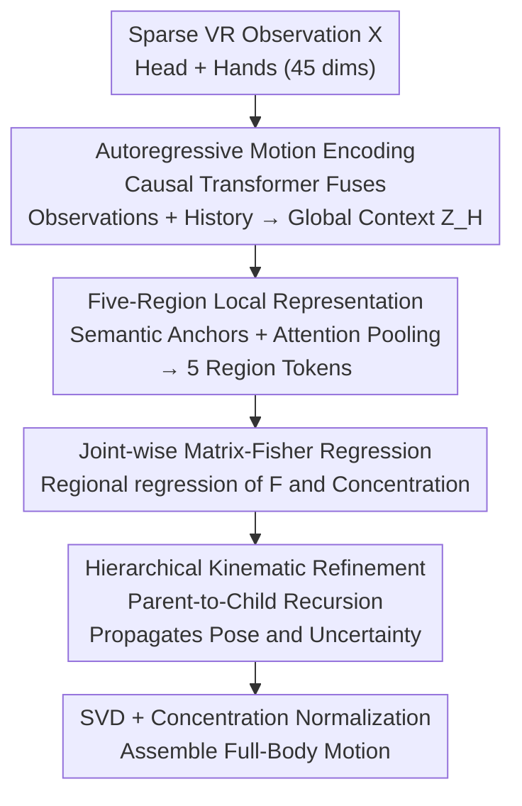

# FisherPoser: Human Motion Estimation from Sparse Observations with Hierarchical Region-Wise Fisher-Matrix Uncertainty Modeling

**Conference**: CVPR 2026  
**Paper**: [CVF Open Access](https://openaccess.thecvf.com/content/CVPR2026/html/Xia_FisherPoser_Human_Motion_Estimation_from_Sparse_Observations_with_Hierarchical_Region_Wise_CVPR_2026_paper.html)  
**Code**: None  
**Area**: Human Understanding / 3D Pose Estimation  
**Keywords**: Sparse VR Motion Capture, Matrix-Fisher Distribution, SO(3) Uncertainty, Regional Modeling, Kinematic Hierarchical Decoding  

## TL;DR
FisherPoser models the estimation of full-body poses from three 6-DoF signals (HMD + two controllers) as probabilistic inference on the $SO(3)$ manifold. Instead of a single rotation, each joint outputs a Matrix-Fisher distribution. By utilizing "five-region tokens + parent-to-child recursion along kinematic chains," both pose and uncertainty are propagated hierarchically. This approach sets new SOTA records for MPJPE/MPJRE on the AMASS sparse VR benchmark while providing well-calibrated per-joint confidence.

## Background & Motivation
**Background**: Sparse motion capture in consumer-grade VR can only observe three rigid bodies—the Head-Mounted Display (HMD) and two controllers—resulting in approximately 45-dimensional signals. The goal is to reconstruct the full-body pose for 22 joints of the SMPL skeleton. Mainstream methods are data-driven: training mappings from head-hand signals to full-body poses on large datasets like AMASS, using either deterministic regression (one pose per frame) or generative models (VAE, normalizing flow, diffusion) to sample multiple candidates.

**Limitations of Prior Work**: The torso is indirectly constrained by the HMD, and the arms are partially constrained by controllers, while the lower limbs have almost no observations. This severe under-determination leads to a typical one-to-many ambiguity, where a single head-hand trajectory corresponds to infinitely many kinematically plausible poses. Deterministic regression tends to collapse into a fragile solution, whereas generative methods rely heavily on data priors and lack well-calibrated uncertainty, making it difficult to reliably select a single hypothesis during inference. Reinforcement learning or physical simulations are sensitive to reward design and sim-to-real gaps. Adding pelvis or foot sensors is effective but sacrifices the "minimalist three-point" user experience.

**Key Challenge**: The paper identifies three fundamental flaws in existing learning frameworks: (1) Lack of intrinsic uncertainty quantification, often forcing deterministic values for weakly constrained joints like lower limbs; (2) Modeling the body as a single entity, ignoring the significant heterogeneity in motion statistics and observability across different body regions; (3) Parallel prediction of joints that violates parent-child dependencies in human kinematic chains, often leading to physiologically implausible poses.

**Goal**: To address these issues simultaneously using only head-hand signals—by explicitly representing rotational ambiguity, modeling regional differences, and propagating information hierarchically along the kinematic chain.

**Core Idea**: Replace single rotation regression with Matrix-Fisher distributions on the $SO(3)$ manifold. The mode of the distribution provides the pose, while the concentration characterizes the uncertainty. This "distribution with uncertainty" is treated as a propagatable state, refined hierarchically across regions and limb chains.

## Method

### Overall Architecture
The input consists of $T$ frames of sparse observations $X$ (per-frame position $p^*$, linear velocity $\dot p^*$, and rotation matrix $R^*$ of the head/hands, totaling $N_c=45$ dimensions). The output is the rotation $R^{(j)}_t \in SO(3)$ of 22 joints relative to their parents. Instead of direct regression, FisherPoser predicts a Matrix-Fisher parameter matrix $F^{(j)}_t \in \mathbb{R}^{3\times3}$ for each joint, defining a probability distribution:

$$p\!\left(R^{(j)}_t \mid F^{(j)}_t\right) = \frac{1}{c(F^{(j)}_t)} \exp\!\left(\mathrm{tr}\big[(F^{(j)}_t)^\top R^{(j)}_t\big]\right),$$

where $c(\cdot)$ is the normalization constant. SVD of $F$ as $F = USV^\top$ yields the mode rotation $\hat R = U\,\mathrm{diag}(1,1,|UV|)\,V^\top$ and the concentration vector $s\in\mathbb{R}^3$ (singular values; larger values indicate higher certainty).

The pipeline consists of three stages: ① Autoregressive Motion Encoding—a causal Transformer fuses current sparse observations and historical poses into a global context $Z_H$; ② Local Motion Representation—five region tokens are constructed from semantic anchors and historical joint features to drive joint-wise Matrix-Fisher regression within each region; ③ Hierarchical Probabilistic Refinement—distributions are propagated recursively from parent to child joints along four limb chains, followed by concentration normalization and assembly to regress full-body motion.

### Key Designs

**1. Matrix-Fisher Probabilistic Modeling on $SO(3)$: Transforming "Ambiguity" into a Trainable, Propagatable Quantity**

Addressing the fragility of deterministic regression for under-constrained joints, FisherPoser outputs a Matrix-Fisher distribution on the $SO(3)$ manifold. Matrix-Fisher is chosen over Euclidean Gaussian distributions because rotations inherently live on a manifold. MF concentration parameters naturally encode the strength of observational constraints on joint orientation, directly quantifying one-to-many ambiguity. Furthermore, it uses continuous rotation matrices with unconstrained parameters, making optimization more stable than Bingham distributions on quaternions.

Training utilizes Maximum Likelihood Estimation (MLE) on the manifold, specifically the negative log-likelihood loss $L_{MF} = \log c(F) - \mathrm{tr}[F^\top R]$, supplemented by a rotation loss using the mode $\hat R$: $L_{R} = -\mathrm{tr}[\hat R^\top R]$. A key engineering detail: singular values $S$ (concentration) have a vast dynamic range, making direct optimization unstable. The authors introduce a learnable, data-dependent scalar $u$ as an uncertainty adjuster. The final concentration is $S' = \exp(u)\cdot S$, adaptively scaling the dispersion to stabilize training. The resulting uncertainty is well-calibrated: experiments show concentration decreases and samples diverge during complex contact transitions (e.g., for the left knee), while concentration increases and samples converge to a single mode during stable phases.

**2. Five-Region Conditioning: Aligning Model Capacity with Heterogeneous Observability**

To address the issue of "modeling the body as a single entity" which dilutes sparse signals, the authors partition the body into five kinematic regions $\mathcal{R}=\{\text{Torso, L-Arm, R-Arm, L-Leg, R-Leg}\}$ (Torso = pelvis-spine-neck-head; Arms = shoulder-elbow-wrist-hand; Legs = hip-knee-ankle-foot), each assigned a learnable regional index embedding.

Each region token is constructed by fusing three sources of evidence: (i) Global context $z_{H_t}$; (ii) Semantic anchors $a^{(r)}_t$ customized for the region; (iii) Historical features $h^{(j)}_{t-1}$ of joints within the region. Anchors are essential: they encode priors on what each region should observe. Torso anchors use the head's absolute pose/velocity as a global reference; arm anchors use displacement, relative velocity, and rotation $R^{H\top}_t R^{L/R}_t$ relative to the HMD to capture upper limb motion. Since legs have no direct observations, leg anchors use weak priors such as HMD forward direction $f^H_t$, head height $p^H_{t,z}$, and head speed $|\dot p^H_t|$ to provide a stable base. The region token uses $Q^{(r)}_t = W_Q[z_{H_t}; a^{(r)}_t; e_r]$ as a query for cross-attention pooling over historical joint features, then concatenates the context/anchor/index through a two-layer MLP to obtain $T^r$. The five regions are processed in parallel, each with a dedicated regression head $H_r$ outputting initial Fisher parameters and concentration logits. This allows the lower limbs to remain stable via weak anchors while the upper limbs fully utilize strong observations without mutual interference.

**3. Parent-to-Child Recursion along the Kinematic Chain: Propagating Calibrated Uncertainty**

To address the violation of kinematic dependencies in parallel prediction, a hierarchical refinement stage is added. This recurse from proximal to distal joints along four limb chains (e.g., Shoulder → Elbow → Wrist). When refining a child joint $c$, the global context $z_{H_t}$, the corresponding region token, and the parent joint $p$'s current Fisher matrix $F^{(p)}_{pred,t}$ and concentration $u^{(p)}_{pred,t}$ are concatenated into a feature $f^{(c)}_t$. This is fed into child-specific networks $\Gamma^{(c)}_F$ and $\Gamma^{(c)}_u$ to obtain refined $F^{(c)}_{prop,t}$ and $u^{(c)}_{prop,t}$.

The key insight is that "not only the pose, but also the uncertainty is propagated," using a hybrid weight $\lambda\in[0,1]$ to linearly fuse recursive and direct regional predictions:

$$F^{(c)}_{pred,t} = (1-\lambda)F^{(c)}_{dir,t} + \lambda F^{(c)}_{prop,t}, \quad u^{(c)}_{pred,t} = (1-\lambda)u^{(c)}_{dir,t} + \lambda u^{(c)}_{prop,t}.$$

The recursion proceeds joint-by-joint, allowing child joints to inherit parent pose and uncertainty characteristics. Torso joints bypass recursion for efficiency—this constitutes the "hybrid hierarchical decoding" of region-wise conditioning and limb-wise recursion. Final parameters $F^{(j)}_{final,t} = U \exp(u)S V^\top$ are used to compute $L_{MF}$ and a geodesic mode alignment loss $L_{mode} = \sum_j \|\log(\hat R^{(j)\top}_t R^{(j)}_{gt,t})\|_2^2$, along with physics-related losses (in supplementary material).

## Key Experimental Results

The dataset is AMASS (SMPL representation), using two standard protocols: P1 (CMU/BMLrub/HDM05 with 90%/10% split) and P2 (larger training set with Transitions and HumanEva for testing). Metrics include MPJRE (Mean Per Joint Rotation Error, deg), MPJPE (Mean Per Joint Position Error, mm), MPJVE (Mean Per Joint Velocity Error, mm/s), and Jitter.

### Main Results
Comparison against SOTA methods (AvatarPoser, AGRoL, AvatarJLM, SAGE, HMDPoser, RPM):

| Protocol | Metric | Ours | Previous Best | Gain |
|----------|---------|------|---------------|------|
| P1 | MPJRE(°) | **2.04** | HMDPoser 2.28 | 10.5% |
| P1 | MPJPE(mm) | **29.7** | HMDPoser 31.9 | 6.9% |
| P1 | Jitter | 5.33 | SAGE 6.55 | 18.7% |
| P2 | MPJRE(°) | **3.89** | HMDPoser 4.27 | 8.9% |
| P2 | MPJPE(mm) | **53.4** | HMDPoser 54.4 | 1.8% |
| P2 | Jitter | **3.18** | HMDPoser 5.62 | 43.4% |

On P1, the MPJRE/MPJPE improvement over SAGE reaches 19.4%/9.5%. For MPJVE, it is not the lowest (P1: 205.2 vs RPM-Reactive: 174.1; P2: 270.4 vs AGRoL: 241.4). While RPM has the lowest jitter and MPJVE, it incurs a significant accuracy cost (MPJRE/MPJPE are 37.2%/21.8% worse than Ours). This method achieves a superior balance between accuracy and smoothness.

### Ablation Study
Component-wise contribution (P1):

| Configuration | MPJRE(°) | MPJPE(mm) | Jitter | Description |
|---------------|---------|-----------|--------|-------------|
| Ours-AR | 4.26 | 63.2 | 8.06 | Autoregressive Transformer only (deterministic) |
| Ours-Fisher | 2.87 | 38.7 | 5.64 | Added Matrix-Fisher head + NLL |
| Ours-Fisher-Part | 2.13 | 30.9 | 5.36 | Added five-region tokens |
| Ours (Full) | **2.04** | **29.7** | **5.33** | Added hierarchical limb refinement |

Uncertainty parameterization comparison:

| Configuration | MPJRE(°) | MPJPE(mm) | MPJVE | Jitter |
|---------------|---------|-----------|-------|--------|
| Ours-AR (Deterministic) | 4.26 | 63.2 | 240.7 | 8.06 |
| Ours-AR-Gaussian (Axis-angle) | 3.03 | 45.0 | 292.0 | 20.73 |
| Ours (SO(3) Matrix-Fisher) | **2.04** | **29.7** | **205.2** | **5.33** |

### Key Findings
- **Transitioning to Matrix-Fisher yield the largest gain, followed by partitioning**: AR→Fisher reduced MPJPE from 63.2 to 38.7; adding region tokens further reduced it to 30.9 (the paper cites partitioning as "the largest gain"). Hierarchical refinement pushed all metrics into SOTA territory, proving the components are complementary.
- **Euclidean Gaussian parameterization compromises temporal stability**: While an axis-angle Gaussian head improved accuracy over the deterministic baseline (MPJPE 63.2→45.0), it severely worsened MPJVE/Jitter (Jitter spiked to 20.73). This confirms that Euclidean parameterization is mismatched with rotational geometry; only modeling rotations on $SO(3)$ with separated mode and per-axis concentration ensures both high precision and smooth motion.
- **Uncertainty is well-calibrated**: The left knee concentration curve is tightly coupled with pose sample dispersion—concentration drops and samples diverge during contact transitions (reflecting true ambiguity), then converge as concentration increases during stable phases.
- **Significant gains in lower limbs and high-dynamic scenarios**: For motions like squats, climbing, or jumping, hip and knee flexion are more realistic, with noticeable reductions in pelvis drift, foot sliding, and inter-frame flipping.

## Highlights & Insights
- **Uncertainty as a "Propagatable State"**: Unlike most methods where uncertainty is a post-hoc product, FisherPoser allows the parent joint's Fisher matrix and concentration to directly enter the child joint's input features. This ensures that ambiguity information actively participates in downstream decisions.
- **Anchors as Explicit Domain Priors**: By using head height/velocity for legs and relative transforms for arms, the "anchoring by observability" strategy can be transferred to any sparse structured prediction task (e.g., IMU mocap).
- **Hybrid Decoding for Efficiency and Hierarchy**: Using direct paths for the torso and recursion for limbs balances efficiency with kinematic consistency, avoiding the overhead of serializing all joints.

## Limitations & Future Work
- The autoregressive architecture may suffer from drift failures during long-sequence inference.
- Physics-related losses are mentioned in the supplementary material but not detailed in the main text; their specific contribution is difficult to verify from the main paper. ⚠️ Refer to original text.
- MPJVE is not optimal (surpassed by RPM/AGRoL at the cost of precision), indicating further room for improvement in velocity smoothing.
- Background: The method is validated on AMASS synthetic/retargeted mocap; end-to-end testing with real-world HMD sensor noise, latency, and drift is needed. Adaptive hybrid weights $\lambda$ (per-joint/per-region) vs. global constants are not explicitly detailed.
- Future Work: Introducing richer anchors (e.g., contact, terrain cues), extending to real-world long-duration sessions with drift, and interaction with objects.

## Related Work & Insights
- **vs AvatarPoser / AvatarJLM**: These use Transformers for direct regression or two-stage dependency modeling, but remain deterministic. FisherPoser introduces $SO(3)$ distributions and propagates uncertainty, providing superior stability for under-constrained lower limbs.
- **vs SAGE / AGRoL (Generative)**: Generative models can sample candidates but are computationally expensive and lack calibration. FisherPoser provides a single distribution with both mode and confidence, allowing reliable hypothesis selection without multiple sampling iterations.
- **vs HMDPoser (Additional Sensors)**: While HMDPoser uses pelvis/foot sensors, this work achieves higher accuracy (MPJRE/MPJPE) using only the minimalist head-hand configuration through regional conditioning and probabilistic modeling.
- **vs Prior Matrix-Fisher Regression (Mohlin et al.)**: Previous MF work focused on single rotation estimation. This work is the first to combine it with regional conditioning and kinematic refinement for sparse VR scenarios.

## Rating
- Novelty: ⭐⭐⭐⭐ Systematically coupling Matrix-Fisher modeling, regional conditioning, and hierarchical uncertainty propagation for sparse VR mocap is novel and well-motivated.
- Experimental Thoroughness: ⭐⭐⭐⭐ Two protocols, six SOTAs, and thorough ablation/calibration visualizations. Lacks real-device testing and sensitivity analysis for hyper-parameters like $\lambda$.
- Writing Quality: ⭐⭐⭐⭐ Clear logic from "three flaws" to "three designs," with well-defined formulas and anchors.
- Value: ⭐⭐⭐⭐ Refreshing accuracy limits for minimalist VR configurations while providing usable per-joint confidence is highly valuable for VR/embodied interaction.

<!-- RELATED:START -->

## Related Papers

- [\[CVPR 2026\] Pressure2Motion: Hierarchical Human Motion Reconstruction from Ground Pressure with Text Guidance](pressure2motion_hierarchical_human_motion_reconstruction_from_ground_pressure_wi.md)
- [\[CVPR 2026\] Ground Reaction Inertial Poser: Physics-based Human Motion Capture from Sparse IMUs and Insole Pressure Sensors](ground_reaction_inertial_poser_physics-based_human_motion_capture_from_sparse_im.md)
- [\[CVPR 2026\] Decoupled Generative Modeling for Human-Object Interaction Synthesis](decoupled_generative_modeling_for_human-object_interaction_synthesis.md)
- [\[CVPR 2026\] Hierarchical Enhancement of Semantic Priors for Disentangled Text-Driven Motion Generation](hierarchical_enhancement_of_semantic_priors_for_disentangled_text-driven_motion_.md)
- [\[CVPR 2026\] Action Motifs: Self-Supervised Hierarchical Representation of Human Body Movements](action_motifs_self-supervised_hierarchical_representation_of_human_body_movement.md)

<!-- RELATED:END -->
