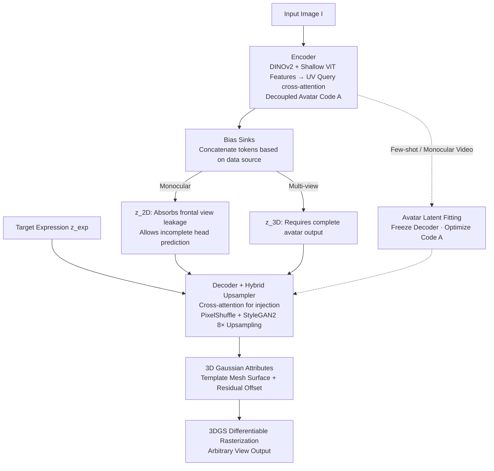

# FlexAvatar: Learning Complete 3D Head Avatars with Partial Supervision

**Conference**: CVPR 2026  
**arXiv**: [2512.15599](https://arxiv.org/abs/2512.15599)  
**Code**: [Available](https://tobias-kirschstein.github.io/flexavatar/)  
**Area**: Human Understanding / 3D Head Avatar Generation  
**Keywords**: 3D Head Avatar, Single-image Reconstruction, Bias Sinks, 3D Gaussian Splatting, Transformer

## TL;DR

FlexAvatar is proposed to resolve the entanglement between driving signals and target viewpoints by introducing learnable "bias sinks" tokens to unify training across monocular and multi-view data, enabling the generation of complete, high-quality, and animatable 3D head avatars from a single image.

## Background & Motivation

Creating high-quality animatable 3D head avatars from a single image is a highly challenging problem. The challenges stem from two aspects: (1) large unobservable regions make 3D reconstruction severely under-constrained; (2) the model must infer realistic facial animations without having seen any expressions for the specific identity.

**Limitations of Prior Work**:

- **Multi-view data** provides complete 3D supervision but is limited in scale and difficult to acquire.
- **Monocular video data** (e.g., face videos scraped from the internet) covers a wide range of identities but offers only a single viewpoint, leading to a strong frontal bias. This causes models trained on such data to reconstruct only incomplete 3D heads.
- **3DMM priors** (e.g., FLAME) provide coarse geometry and animation capabilities but limit expressivity.

**Key Insight**: The authors identify the root of the problem as the **entanglement between the driving signal and the target viewpoint** in monocular training data. Specifically, in a monocular self-reenactment setting, the expression control signal is extracted from the target image itself. The model can exploit the expression input to "guess" the viewpoint, which encourages the model to predict only a partial 3D head to satisfy the loss function. Simply mixing monocular and multi-view training data does not resolve this entanglement.

## Method

### Overall Architecture

FlexAvatar aims to reconstruct a complete, drivable 3D head from a single image. The difficulty lies in the training data, which constitutes a mix of multi-view captures (view-complete but identity-sparse) and monocular videos (identity-rich but frontal-only). The system follows an encoder-decoder pipeline: the encoder $E$ first compresses the input image $I$ into a compact avatar code $\mathcal{A} \in \mathbb{R}^{H_l \times W_l \times D}$ (defined on a template head UV space), which is decoupled from viewpoint and expression. The decoder $D$ then injects the target expression $z_{exp}$ into this code to generate a set of animated 3D Gaussian attributes. Finally, the 3DGS differentiable rasterization renderer $\mathcal{R}$ renders the output from any viewpoint. The core mechanism is not the network architecture itself, but how monocular and multi-view data are leveraged without mutual interference—which is addressed by "bias sinks."

### Key Designs

**1. Encoder: Anchoring image information to the UV manifold for decoupled avatar encoding**

To ensure subsequent animations are not disturbed by the viewpoint and expression of the input moment, the first step is to compress the image into "what this person looks like" rather than "how this photo was taken." The encoder uses a pre-trained DINOv2 with a shallow learnable ViT to extract image features $f_{img}$. Queries $Q$ with sinusoidal positional encoding are then laid out in the UV space of a template head mesh. Each query retrieves information belonging to its surface area from the image features via cross-attention. Since the query points are anchored to a fixed UV manifold and share the same topology across identities, the retrieved avatar code $\mathcal{A}$ is naturally independent of specific viewpoints and expressions, providing a clean space for animation and fitting.

**2. Bias Sinks: Using two tokens to "absorb" viewpoint leakage from monocular data**

This is the core contribution, targeting the entanglement identified in the motivation: during monocular self-reenactment, the driving image and target image are the same ($I_{drive} = I_{target}$), and the expression code $z_{target}$ secretly contains information about the target viewpoint $\pi_{target}$. The model can minimize loss by predicting only half a face based on this leaked viewpoint, lacking the incentive to complete the 3D structure. The authors' solution is minimal: prepare two learnable tokens—$z_{2D}$ for monocular samples and $z_{3D}$ for multi-view samples. During training, the corresponding token is appended to the expression sequence:

$$s_{exp} \leftarrow [s_{exp}, z_{bias}]$$

This token acts as a "bias trash can," allowing the decoder to identify the data source. When following the $z_{2D}$ path, the model is permitted to predict an incomplete head and dump frontal biases into this token. When following the $z_{3D}$ path, it must produce a complete avatar. Crucially, both paths share the same backbone weights. The $z_{3D}$ path benefits from the identity generalization provided by massive monocular data, while the frontal bias of monocular data is isolated by $z_{2D}$. During inference, the system always switches to $z_{3D}$, achieving both generalization and 3D completeness.

**3. Decoder and Hybrid Upsampler: "Lighting up" avatars into Gaussians without 3DMM dependency**

After obtaining the avatar code, it must be animated and upsampled. The decoder also uses cross-attention to let the avatar code interact with the serialized expression code. Animation is learned in a data-driven manner rather than being bound to a predefined expression base like FLAME, allowing for subtle expressions beyond 3DMM capabilities. To upsample the low-resolution UV encoding, the model combines PixelShuffle with StyleGAN2 CNN blocks for a total 8× upsampling. PixelShuffle handles efficient pixel placement, while StyleGAN blocks handle high-frequency texture details. Finally, a grid sampling and MLP retrieve each Gaussian's attributes. Positions are initialized on the template mesh surface with learned residual offsets, ensuring geometric stability while allowing for detail.

**4. Avatar Latent Space Fitting: Supporting few-shot and monocular video creation**

The training naturally produces a smooth avatar latent space. By performing optimization in this space, the model can cover more scenarios. For few-shot avatar creation, an initial $\mathcal{A}^{init}$ is encoded from one image, and the code is then optimized across all available observations. For monocular video, the same fitting process is used while freezing the decoder. Compared to Autodecoders that optimize from scratch, this approach converges much faster due to the reliable initial value from the encoder—achieving better results in 10 minutes than competitors do in 4 hours.

### Loss & Training

The reconstruction loss combines four terms:

$$\mathcal{L}_{rec} = \mathcal{L}_1 + \mathcal{L}_{SSIM} + \mathcal{L}_{DINO} + \mathcal{L}_{SAM}$$

| Loss Term | Description |
|-----------|-------------|
| $\mathcal{L}_1$ | L1 pixel loss |
| $\mathcal{L}_{SSIM}$ | Structural Similarity loss |
| $\mathcal{L}_{DINO}$ | Perceptual loss on DINOv2 middle feature maps |
| $\mathcal{L}_{SAM}$ | Perceptual loss on SAM middle feature maps |

Training details:
- Joint training on 5 datasets (2 monocular + 2 multi-view + 1 synthetic multi-view).
- Adam optimizer, learning rate 1e-4.
- Perceptual loss introduced after 400k steps (to avoid early overfitting to noise).
- Total 1M steps, batch size 20, approximately 3 weeks on a single A100.

## Key Experimental Results

### Main Results

**3D Portrait Animation (VFHQ Dataset)**

| Method | PSNR↑ | SSIM↑ | LPIPS↓ | CSIM↑ |
|--------|-------|-------|--------|-------|
| GAGAvatar | 21.83 | 0.818 | 0.122 | 0.816 |
| LAM | 22.65 | 0.829 | 0.109 | 0.822 |
| **Ours** | **23.47** | **0.837** | **0.099** | **0.830** |

**Single-image Avatar Creation (Ava256 Dataset)**

| Method | PSNR↑ | SSIM↑ | LPIPS↓ | AKD↓ | CSIM↑ |
|--------|-------|-------|--------|------|-------|
| Portrait4Dv2 | 11.9 | 0.671 | 0.404 | 7.77 | 0.578 |
| GAGAvatar | 12.7 | 0.709 | 0.371 | 7.45 | 0.555 |
| LAM | 13.1 | 0.702 | 0.399 | 11.2 | 0.411 |
| **Ours** | **16.9** | **0.762** | **0.265** | **5.52** | **0.695** |

A PSNR gain of 3.8+ dB and significant LPIPS leads indicate that the completeness and quality of generated 3D heads are significantly superior to existing methods.

### Ablation Study

| Config | 2D | 3D | Bias Sinks | StyleGAN | PSNR↑ | CSIM↑ |
|--------|:---:|:---:|:---:|:---:|-------|-------|
| only 2D | ✓ | | | ✓ | 13.7 | 0.593 |
| only 3D | | ✓ | | ✓ | 13.2 | 0.119 |
| w/o bias sinks | ✓ | ✓ | | ✓ | 14.5 | 0.583 |
| w/o StyleGAN | ✓ | ✓ | ✓ | | 17.1 | 0.614 |
| Ours_ref | ✓ | ✓ | ✓ | ✓ | 17.2 | 0.621 |
| Ours + fitting | ✓ | ✓ | ✓ | ✓ | 16.9 | **0.682** |

### Key Findings

- **Using only monocular data**: Good generalization but incomplete 3D (due to entanglement).
- **Using only multi-view data**: Complete 3D but very poor generalization (CSIM only 0.119).
- **Simple mixing without bias sinks**: Fails to resolve entanglement; performance remains close to the monocular-only baseline.
- **Bias Sinks are effective**: They allow the model to adopt different strategies for different data sources.
- **Fitting further improves results**: Identity preservation (CSIM) and expression fidelity (AKD) improve significantly with only ~1 minute of optimization.

## Highlights & Insights

1. **Clever Problem Diagnosis**: Identifying the "driving signal-target view entanglement" as the core obstacle is more insightful than simply adding more data.
2. **Simple yet Effective Design**: Using only two learnable tokens to decouple dataset bias without complex architectural changes.
3. **Independence from 3DMM**: Learning animations in a data-driven way avoids the limitations of predefined expression spaces like FLAME.
4. **Unified Multi-scenario Framework**: A single model handles single-image, few-shot, and monocular video avatar creation.
5. **Efficiency**: On the NeRSemble benchmark, 10-minute fitting outperforms CAP4D's 4-hour optimization.

## Limitations & Future Work

- Illumination is "baked" from the input image, lacking explicit control—which may look unnatural in different virtual environments.
- While the architecture is 3DMM-independent, the experiments still use FLAME expression codes, limiting fine details like the tongue.
- Scalability to full-body or general dynamic neural radiance fields is possible but currently only validated for heads.
- Training requires ~3 weeks on an A100, which is computationally expensive.

## Related Work & Insights

- **LAM's** encoder design (UV space queries + cross-attention) provided inspiration for FlexAvatar.
- **Avat3r's** model-free animation approach (cross-attention to expression sequences) is adopted.
- The **NeRF-in-the-wild** idea of per-image embeddings is similar to bias sinks, but bias sinks operate at the dataset level rather than the image level.
- The design philosophy of bias sinks (learnable tokens absorbing specific biases) may have broad implications for other multi-source data training scenarios.

## Rating

- **Novelty**: ⭐⭐⭐⭐⭐ — Precise problem diagnosis (view-expression entanglement) and original bias sinks solution.
- **Experimental Thoroughness**: ⭐⭐⭐⭐⭐ — Verified across 4 tasks and 3 datasets with detailed ablations.
- **Writing Quality**: ⭐⭐⭐⭐ — Clear logic, intuitive diagrams, and thorough explanation of the problem.
- **Value**: ⭐⭐⭐⭐⭐ — A substantial breakthrough for single-image 3D avatar creation with a generalizable bias sink concept.

<!-- RELATED:START -->

## Related Papers

- [\[NeurIPS 2025\] VASA-3D: Lifelike Audio-Driven Gaussian Head Avatars from a Single Image](../../NeurIPS2025/human_understanding/vasa-3d_lifelike_audio-driven_gaussian_head_avatars_from_a_single_image.md)
- [\[CVPR 2025\] WildAvatar: Learning In-the-Wild 3D Avatars from the Web](../../CVPR2025/human_understanding/wildavatar_learning_in-the-wild_3d_avatars_from_the_web.md)
- [\[CVPR 2026\] ActAvatar: Temporally-Aware Precise Action Control for Talking Avatars](actavatar_temporally-aware_precise_action_control_for_talking_avatars.md)
- [\[CVPR 2026\] SyncDreamer: Controllable and Expressive Avatar Generation Beyond the Talking Head](syncdreamer_controllable_and_expressive_avatar_generation_beyond_the_talking_hea.md)
- [\[CVPR 2026\] MatchED: Crisp Edge Detection Using End-to-End, Matching-based Supervision](matched_crisp_edge_detection_using_end-to-end_matching-based_supervision.md)

<!-- RELATED:END -->
