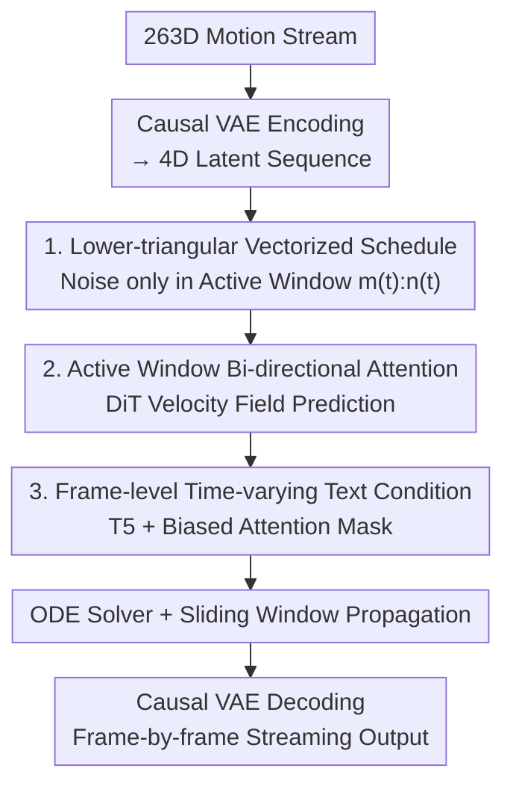

# FloodDiffusion: Tailored Diffusion Forcing for Streaming Motion Generation

**Conference**: CVPR 2026  
**Paper**: [CVF Open Access](https://openaccess.thecvf.com/content/CVPR2026/html/Cai_FloodDiffusion_Tailored_Diffusion_Forcing_for_Streaming_Motion_Generation_CVPR_2026_paper.html)  
**Code**: https://shandaai.github.io/FloodDiffusion/ (Project page, models/code/weights open-sourced)  
**Area**: Human Motion Generation / Diffusion Models  
**Keywords**: Streaming Motion Generation, Diffusion Forcing, Text-to-Motion, Real-time Generation, Causal VAE  

## TL;DR
FloodDiffusion tails the diffusion forcing framework from the video domain for text-driven streaming human motion generation. Through three key modifications—lower-triangular time scheduling, bi-directional attention within an active window, and frame-level time-varying text conditioning—it achieves a SOTA streaming FID of 0.057 on HumanML3D, approaching the performance of non-streaming methods for the first time.

## Background & Motivation
**Background**: The majority of text-to-motion research focus on "non-streaming" generation—taking a complete text prompt and outputting a full motion sequence at once (e.g., MDM, MoMask, T2M-GPT). However, scenarios like real-time NPCs and robotic control require "streaming" capabilities: text prompts change over time (e.g., "lift knee" then "squat"), and motions must be generated and output incrementally while responding immediately to new instructions.

**Limitations of Prior Work**: Existing streaming solutions follow two main routes, both with significant drawbacks. ① **Chunk-by-chunk diffusion** (e.g., PRIMAL): Each chunk must wait for the context to fill before denoising starts, leading to high "initial frame latency." ② **Autoregression + Diffusion Head** (e.g., MotionStreamer): Tokens are generated sequentially, making it difficult to explicitly utilize long-range history of past motions.

**Key Challenge**: Streaming motion generation is essentially "time-series generation under time-varying control signals." It requires both low initial latency and the ability to utilize complete history, yet the two existing routes force a choice between them.

**Key Insight**: A framework in video generation called **diffusion forcing** assigns different noise levels to each frame in a sequence. Theoretically, this offers both low initial latency and explicit history utilization. The authors adapt this concept for motion generation.

**Core Idea**: The authors discovered that a vanilla implementation of video-based diffusion forcing fails to produce a realistic motion distribution. The contribution of this work is identifying "why it fails" and performing three targeted "tailoring" modifications. They mathematically prove that the modified framework can precisely replicate the target data distribution (unlike the original, which optimizes an ELBO proxy). The customized framework is named "Flood" (referencing the frame-by-frame inundation of denoising).

## Method

### Overall Architecture
FloodDiffusion is a **latent space** diffusion framework. It utilizes a **Causal VAE** to downsample the 263-dimensional motion stream (global velocity, root rotation, joint rotation, foot contact) by a factor of 4 in time, encoding it into a compact 4-dimensional latent sequence. Diffusion occurs only in this latent space to minimize streaming latency. The denoiser follows a DiT-style backbone to predict the velocity field $\hat{u}_t$ of the latents.

The mechanism for "streaming" denoising involves expanding scalar diffusion time schedules $\alpha_t, \beta_t$ into **vectorized time schedules**. Each frame $k$ in the sequence has its own $\alpha_t^k, \beta_t^k$ following a **lower-triangular** shape as time progresses. At any moment $t$, only frames within an "active window" $[m(t), n(t))$ are being denoised; frames before the window are fixed, and frames after are pure noise. During inference, the window slides forward, and each generated latent frame is immediately decoded into motion output.

### Key Designs

**1. Lower-triangular Vectorized Time Scheduling: Transforming "Streaming" into Provable Local Computation**

Vanilla diffusion forcing samples **random** timesteps for each frame, resulting in inconsistent window sizes, training-inference mismatches, and no deterministic boundary for pure noise. The authors adopt a deterministic lower-triangular schedule. Let $n_s$ be the streaming slope; the noise coefficient for frame $k$ is:
$$\alpha_t^k = \mathrm{clamp}\!\left(t - \tfrac{k}{n_s},\, 0,\, 1\right),\qquad \beta_t^k = 1 - \alpha_t^k,\qquad \sigma_t = 0$$
Frames progress from noise to data in a cascaded manner. Defining the active window as $m(t)=\lceil (t-1)\,n_s\rceil$ (completely denoised) and $n(t)=\lceil t\,n_s\rceil$ (active frames), the authors prove the **Streaming Locality Theorem**: the velocity field is zero outside the active window,
$$u_t(\mathbf{X}_t,\mathbf{c}^{0:K}) = \big[\mathbf{0}^{0:m(t)},\; u_t^{m(t):n(t)},\; \mathbf{0}^{n(t):K}\big]^\top$$
Thus, each step only requires computation for the window $[m(t), n(t))$. This compresses unbounded total sequence computation into bounded local computation: initial latency is only 1 frame ($N/n_s$ steps), and control response latency is capped by $n_s$ frames. This triangular structure is critical (Remark 3.9) because its hard saturation $\alpha_t^k\in\{0,1\}$ provides a deterministic truncation point $n_s$, which random or non-deterministic schedules lack. The schedule maintains **exact likelihood** rather than the ELBO approximation of the original diffusion forcing.

**2. Bi-directional Attention within the Active Window: Utilizing the Latest Text for Buffer Frames**

While video versions of diffusion forcing use causal attention, the valid context at time $t$ in this task is the entire interval $[0, n(t))$ rather than a strict prefix (Remark 3.10). If causal masking is used, frames within the active window at different noise levels cannot see "future" legal context within the window, leading to suboptimal denoising. The authors implement **bi-directional self-attention** within the active window, ensuring buffer frames are denoised based on the latest prompt. Ablations show this is vital: switching to causal attention causes FID to crash from 0.057 to 3.377.

**3. Frame-level Time-varying Text Conditioning: Native Prompt Switching without Refresh Detection**

In streaming scenarios, text changes over time ("walk" → "sit" → "stand"). Existing methods rely on manual "refresh mechanisms"—stopping generation upon detecting a new prompt—which is fragile and causes inconsistent fusion. This work uses continuous, frame-level text injection. Pre-trained T5 features are flattened and aligned using the same rotary positional embeddings as motion tokens. Inside the attention mechanism, a **biased mask** ensures each motion frame only attends to the text segment active at its current time. This allows the model to be trained directly on time-varying conditions, reflecting new prompts immediately during inference without any stop/refresh logic.

### Loss & Training
Training is performed via flow matching in the latent space ($\sigma_t=0$), directly regressing the conditional velocity target:
$$\hat{u}_t = \arg\min_{u^\theta_t}\ \mathbb{E}_{t,\mathbf{z},\boldsymbol{\epsilon}}\big[\,\|u^\theta_t(\mathbf{x}_t,\mathbf{c}) - u_t(\mathbf{x}_t\mid\mathbf{z})\|^2\big]$$
where $t\sim\mathrm{Unif}(0,T)$, $\mathbf{z}\sim p_\text{data}$, $\boldsymbol{\epsilon}\sim p_\text{init}$, and $\mathbf{x}_t=\boldsymbol{\alpha}_t\odot\mathbf{z}+\boldsymbol{\beta}_t\odot\boldsymbol{\epsilon}$. Loss is calculated only on the active window $A=\{m,\dots,n-1\}$ (Algorithm 1). Hyperparameters: Causal VAE temporal downsampling of 4, latent dimension of 4. Diffusion backbone trained with $n_s=5$. Trained first on HumanML3D and then jointly with BABEL to cover time-varying prompt scenarios. Optimal CFG=6.

## Key Experimental Results

### Main Results (HumanML3D Non-streaming + BABEL Streaming, Table 1)

| Method | Streaming | R@3↑ | FID↓ | MM-Dist↓ | PJ→ | AUJ↓ |
|------|------|------|------|----------|-----|------|
| Real motion | — | 0.797 | 0.002 | 2.974 | 1.100 | 41.20 |
| MoMask (Non-Str SOTA) | ✗ | 0.807 | **0.045** | 2.958 | — | — |
| ReMoDiffuse | ✗ | 0.795 | 0.103 | 2.974 | — | — |
| PRIMAL (Streaming) | ✓ | 0.780 | 0.511 | 3.120 | 1.304 | 19.36 |
| MotionStreamer (Streaming) | ✓ | 0.802 | 0.092 | 2.909 | 0.912 | 16.57 |
| **FloodDiffusion** | ✓ | **0.810** | 0.057 | **2.887** | **0.713** | **14.05** |

FloodDiffusion achieves the best R@k and MM-Dist. Its FID of 0.057 is second only to the non-streaming MoMask and significantly outperforms all streaming baselines. Streaming-specific metrics PJ (Peak Jerk) and AUJ (Area Under Jerk) are notably better, indicating smoother transitions.

### Ablation Study (Key Designs, Table 3)

| Configuration | FID↓ | R@3↑ | MM-Dist↓ |
|------|------|------|----------|
| Full (Ours) | **0.057** | **0.810** | **2.887** |
| w/o Bi-directional Attention (to Causal) | 3.377 | 0.625 | 4.296 |
| w/o Lower-triangular Schedule (to Random) | 3.883 | 0.532 | 4.651 |

Removing either component causes FID to crash to the 3.0+ range, proving both modifications are "make-or-break" requirements.

### Key Findings
- **Bi-directional attention is essential for diffusion forcing**: Unlike chunk-by-chunk diffusion where causal masking only slightly degrades FID (0.51 to 0.92), in diffusion forcing it causes a crash (0.057 to 3.377) because frames in the active window must see the whole window's context for effective denoising.
- **Structured cascaded scheduling ≫ Random scheduling**: Random timesteps result in an FID of 3.883 after 1M iterations, whereas the lower-triangular schedule achieves 0.057.
- **User Study** (Table 2): FloodDiffusion scores highest across Preference, Transition, and Consistency among generation baselines, with scores approaching real motions.

## Highlights & Insights
- **"Tailoring" over "Direct Adoption"**: The paper identifies three specific reasons why vanilla diffusion forcing fails on motion tasks and fixes them—this "engineering diagnosis" of existing frameworks is highly valuable.
- **Provable Locality**: The Streaming Locality Theorem elevates "frame-by-frame streaming with bounded latency" from an engineering trick to a mathematically guaranteed property.
- **Refresh-free Conditioning**: Using biased attention masks for frame-level text injection eliminates the need for fragile "prompt-switch detection" logic. This approach is transferable to any streaming generation task requiring real-time response to control signals.
- **1-Frame Initial Latency**: Compared to chunk-based methods that require filling a full buffer, FloodDiffusion reduces initial latency to $N/n_s$ steps (effectively 1 frame) while utilizing hundreds of frames of historical context.

## Limitations & Future Work
- **Dependence on Causal VAE**: Since diffusion occurs in a 4D latent space, the reconstruction error of the VAE acts as a ceiling for motion quality. Representation of higher DOF models (e.g., SMPL-X) is not fully explored.
- **$n_s$ as a Knob**: The streaming slope $n_s$ controls the trade-off between control response latency and the window size. A systematic sensitivity analysis of $n_s$ is lacking.
- **Evaluation Metrics**: While PJ/AUJ are used, direct measurements of end-to-end latency, jitter, or long-sequence drift in actual real-time systems are missing.

## Related Work & Insights
- **vs PRIMAL (Chunk-by-chunk)**: PRIMAL requires filling a chunk, causing high initial latency. FloodDiffusion uses a sliding window to achieve 1-frame latency and significantly better FID (0.511 → 0.057).
- **vs MotionStreamer (AR + Diffusion Head)**: MotionStreamer uses causal latents for implicit history utilization. FloodDiffusion uses bi-directional attention to explicitly process the entire active window history.
- **vs Vanilla Diffusion Forcing**: The original uses causal attention, random scheduling, and refresh mechanisms. This work's modifications allow the framework to reach SOTA on motion streams with exact likelihood.

## Rating
- Novelty: ⭐⭐⭐⭐⭐ First diffusion-forcing framework for streaming motion with provable locality.
- Experimental Thoroughness: ⭐⭐⭐⭐ Extensive datasets and metrics, though missing $n_s$ sensitivity analysis.
- Writing Quality: ⭐⭐⭐⭐ Clear narrative regarding the "diagnosis and repair" of the framework.
- Value: ⭐⭐⭐⭐⭐ Strong baseline for real-time NPCs and robotics; refresh-free design is highly portable.

<!-- RELATED:START -->

## Related Papers

- [\[AAAI 2026\] Streaming Generation of Co-Speech Gestures via Accelerated Rolling Diffusion](../../AAAI2026/human_understanding/streaming_generation_of_co-speech_gestures_via_accelerated_rolling_diffusion.md)
- [\[CVPR 2026\] Avatar Forcing: Real-Time Interactive Head Avatar Generation for Natural Conversation](avatar_forcing_real-time_interactive_head_avatar_generation_for_natural_conversa.md)
- [\[CVPR 2026\] Towards Decompositional Human Motion Generation with Energy-Based Diffusion Models](towards_decompositional_human_motion_generation_with_energy-based_diffusion_mode.md)
- [\[CVPR 2026\] Ultra Diffusion Poser: Diffusion-Based Human Motion Tracking From Sparse Inertial Sensors and Ranging-Based Between-Sensor Distances](ultra_diffusion_poser_diffusion-based_human_motion_tracking_from_sparse_inertial.md)
- [\[CVPR 2026\] Towards Highly-Constrained Human Motion Generation with Retrieval-Guided Diffusion Noise Optimization](towards_highly-constrained_human_motion_generation_with_retrieval-guided_diffusi.md)

<!-- RELATED:END -->
