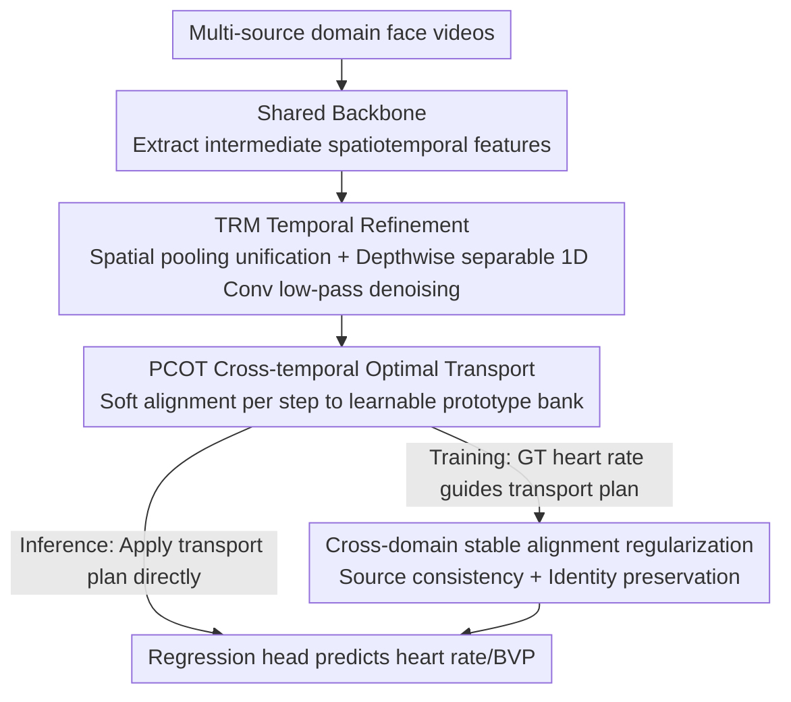

# FLOW: Optimal Transport-Driven Feature Warping for Generalized Remote Physiological Measurement

**Conference**: CVPR 2026  
**Paper**: [CVF Open Access](https://openaccess.thecvf.com/content/CVPR2026/html/Zhao_FLOW_Optimal_Transport-Driven_Feature_Warping_for_Generalized_Remote_Physiological_Measurement_CVPR_2026_paper.html)  
**Code**: None  
**Area**: Human Understanding / Remote Physiological Measurement (rPPG) / Domain Generalization  
**Keywords**: rPPG, Domain Generalization, Optimal Transport, Prototype Alignment, Temporal Features

## TL;DR
FLOW treats "distributional shift" in end-to-end rPPG models during cross-domain deployment as a feature-level Optimal Transport (OT) problem. It first utilizes a lightweight Temporal Refinement Module (TRM) to unify and denoise temporal features across domains, then applies Prototype-based Cross-temporal Optimal Transport (PCOT) using a learnable prototype bank for soft alignment. Coupled with two regularization terms, it achieves cross-domain SOTA on four rPPG benchmarks in a plug-and-play, backbone-agnostic manner.

## Background & Motivation
**Background**: Remote photoplethysmography (rPPG) estimates heart rate/blood volume pulse (BVP) non-contactly from face videos. In recent years, end-to-end neural networks (DeepPhys, PhysNet, PhysFormer, etc.) that directly regress physiological signals from raw videos have become mainstream, no longer relying on handcrafted spatiotemporal map (STMap) preprocessing.

**Limitations of Prior Work**: These end-to-end models suffer drastic performance drops when transferred to new scenarios with different lighting, camera sensors, skin tones, or motion patterns. For instance, PhysNet's Pearson correlation $R$ on the PURE dataset can be as low as −0.15, indicating a complete failure to capture physiological rhythms. Since domain shifts are unavoidable in real-world deployment and acquiring labeled data for every target domain is impractical, Domain Generalization (DG, without access to target domains during training) has become a critical bottleneck for rPPG.

**Key Challenge**: While DG has been extensively studied in image classification, its application to end-to-end rPPG remains nearly unexplored. Existing rPPG generalization efforts either remain at the data-level STMap preprocessing stage with manual pipelines or only modify architectures under single-source settings. They neither address the generalization of the "raw video → physiological signal" end-to-end pipeline nor provide a theoretical basis for aligning representations across multiple source domains. Furthermore, rPPG is a temporal regression task, and classic OT-based domain alignment has primarily been validated in classification problems, making it non-trivial to adapt.

**Goal**: Design a feature-level domain alignment mechanism for end-to-end, multi-source rPPG that is both plug-and-play and theoretically grounded, ensuring that the alignment process does not destroy the rhythmic structure of the physiological signals.

**Key Insight**: The authors reinterpret "inter-domain differences" as a structured transport problem, using the geometry of Optimal Transport for principled feature alignment. Compared to adversarial or purely statistical (MMD/CORAL) alignment, OT provides interpretable, mathematically sound domain-invariant representations and is naturally compatible with various rPPG backbones.

**Core Idea**: Replace adversarial or second-order statistical alignment with "feature-level OT warping." Every time step is soft-mapped to a set of learnable, domain-invariant but physiologically consistent prototypes, thereby eliminating domain-specific appearance factors while preserving intrinsic cardiac rhythms.

## Method
The overall strategy of FLOW is to insert two lightweight modules into the intermediate features extracted by any rPPG backbone: first "unify + denoise," then "align across domains," and finally stabilize the alignment via two regularization terms. This is a purely feed-forward pipeline without adversarial training. Input consists of face videos from multiple source domains, from which the backbone extracts intermediate spatiotemporal features. TRM unifies diverse feature shapes into consistent temporal sequences and performs low-pass denoising. PCOT then soft-aligns each time step to a shared prototype bank to obtain domain-invariant representations. The model is trained using OT alignment loss, source consistency, identity preservation, and task regression losses. During inference, the learned transport plan is directly applied to predict heart rates without requiring ground truth.

### Overall Architecture

### Key Designs

**1. TRM Temporal Refinement Module: Unifying and denoising heterogeneous temporal features before alignment**

Before PCOT alignment, intermediate features extracted by the backbone may contain spatial entanglement and high-frequency motion artifacts with diverse shapes (e.g., $B\times C\times H\times W$ or $B\times C\times T\times H\times W$). Performing transport directly would align noise into the representation. TRM first applies global spatial pooling to compress arbitrary shapes into a unified temporal sequence $X=\mathrm{Pool}_{\text{spatial}}(F)\in\mathbb{R}^{B\times T\times C}$, ensuring all temporal tokens share a consistent semantic basis. It then uses stacked depthwise separable 1D convolution blocks for residual refinement: $Y^{(l+1)}=\mathrm{Norm}\big(X^{(l)}+F_{\text{TRM}}(X^{(l)})\big)$. Each block consists of depthwise temporal filtering $Z_{t,c}=\sum_{i=1}^{k} w^{(d)}_{c,i}X^{(l)}_{t+i,c}$ (capturing local rhythmic dependencies) + pointwise channel fusion $\tilde Z_t=\phi(W_p Z_t+b_p)$ (GELU nonlinearity), with a complexity of only $O(BTCk)$. From a signal processing perspective, TRM acts as a low-pass temporal filter that suppresses short-term noise layer-by-layer and enhances phase stability and rhythmic consistency—a necessary precursor for stable OT alignment.

**2. PCOT Prototype-based Cross-temporal Optimal Transport: Soft warping time steps to domain-invariant prototypes**

This is the core of FLOW. Since temporal signals from different domains exhibit varying rhythms and domain-specific distortions, PCOT maintains a set of learnable prototypes $P=\{p_k\}_{k=1}^K$ and associated physiological anchors $H=\{h_k\}_{k=1}^K$. Each time step is modeled as a "distribution over shared prototypes" using entropy-regularized OT. The transport cost accounts for both feature similarity and physiological consistency:

$$C_{t,k}=\|W(x_t-p_k)\|_2^2+\lambda_{hr}\Big(1-\exp\big(-\tfrac{(h_t-h_k)^2}{2\sigma^2}\big)\Big),$$

where $W$ is a learnable diagonal weighting matrix and $h_t$ is the heart rate estimated by an auxiliary head (HeadHR). The first term enforces semantic similarity, while the second penalizes physiological inconsistency, forcing prototypes to encode domain-invariant but physiologically plausible features. The matching between the empirical distribution of temporal features $\mu$ ($\mu_t=1/T$) and the prototype distribution $\nu$ ($\nu_k=1/K$) is formulated as entropy-regularized OT: $S_\varepsilon(\mu,\nu)=\min_{\Pi\in U(\mu,\nu)}\langle C,\Pi\rangle+\varepsilon H(\Pi)$. This is solved via Sinkhorn iterations to find the optimal coupling $\Pi^\star=\mathrm{Diag}(u)\,K\,\mathrm{Diag}(v)$ ($K=\exp(-C/\varepsilon)$), which is fully differentiable. The alignment result is given by the barycentric projection: $\tilde x_t=\sum_{k=1}^K \pi^\star_{t,k}p_k$. This re-expresses temporal features on the prototype manifold, removing domain-specific appearances and smoothing the sequence. To eliminate entropic bias, the alignment loss uses the debiased Sinkhorn divergence $L_{OT}=S_\varepsilon(\mu,\nu)-\tfrac12 S_\varepsilon(\mu,\mu)-\tfrac12 S_\varepsilon(\nu,\nu)$. Compared to MMD/CORAL which perform global statistical alignment, PCOT performs step-by-step soft warping, preserving the rhythmic structure essential for rPPG.

**3. Two Regularizations for Stable Cross-domain Alignment: Preventing collapse and excessive deformation**

While OT is principled, transport plans can become unstable or overly smooth when domain gaps are large. The authors introduce two complementary regularizations. First is the **source consistency regularization**: for each source domain $D_j$, the average prototype assignment histogram $\bar h_j=\frac{1}{|D_j|}\sum_{i\in D_j}\frac1T\sum_t \pi^\star_{t,k}$ is calculated, and the variance between domain histograms is minimized: $L_{src}=\frac1M\sum_j\|\bar h_j-\bar h\|_2^2$. This forces all domains to share consistent prototype occupancy patterns. Second is the **identity preservation regularization**: it constrains the distance between representations before and after alignment $L_{id}=\frac{1}{BT}\sum_{b,t}\|\tilde x_{b,t}-x_{b,t}\|_2^2$, preventing excessive deformation of features and preserving subject identity and intrinsic rhythms. The final objective $L_{total}=L_{task}+\lambda_{OT}L_{OT}+\lambda_{src}L_{src}+\lambda_{id}L_{id}$ integrates task regression, OT alignment, global domain consistency, and local physiological preservation without requiring adversarial training.

### Loss & Training
The total loss is $L_{total}=L_{task}+\lambda_{OT}L_{OT}+\lambda_{src}L_{src}+\lambda_{id}L_{id}$: $L_{task}$ is the rPPG regression task loss, $L_{OT}$ handles prototype alignment via debiased Sinkhorn divergence, and $\lambda_{src}, \lambda_{id}$ balance alignment flexibility with representation stability. During training, ground truth heart rate signals guide and refine the transport plan for better prototype alignment. During inference, the learned transport plan is directly applied to predict heart rates, requiring no ground truth (refer to Appendix D of the original paper for detailed training/inference procedures).

## Key Experimental Results

Multi-source domain generalization was evaluated on four public datasets: UBFC-rPPG(U), PURE(P), BUAA-MIHR(B), and MMPD(M). Metrics include MAE↓, RMSE↓, and Pearson correlation R↑.

### Main Results
In multi-source DG (leave-one-domain-out), FLOW consistently outperforms traditional handcrafted methods, end-to-end rPPG baselines, and DG baselines (CORAL/MMD, compared fairly using the same backbone):

| Method | Avg. MAE↓ | Avg. RMSE↓ | Avg. R↑ |
|------|-----------|------------|---------|
| POS (Handcrafted) | 8.64 | 11.58 | 0.41 |
| PhysNet (End-to-end) | 18.30 | 22.98 | 0.14 |
| PhysFormer | 16.51 | 21.98 | 0.23 |
| CORAL+ (DG Baseline) | 9.97 | 14.21 | 0.55 |
| MMD+ (DG Baseline) | 9.35 | 13.28 | 0.57 |
| **FLOW (Ours)** | **6.84** | **10.75** | **0.70** |

By domain, FLOW achieves an MAE of 2.23 and R of 0.97 on BUAA-MIHR, surpassing the strongest DG baseline MMD (MAE 2.80 / R 0.95). In UBFC-rPPG and PURE, its correlation R is more than 0.4 higher than MMD, demonstrating superior robustness to appearance and motion changes.

In the source-limited setting (only two source datasets), it also maintains a stable lead, such as the average results for target domain MMPD:

| Method | MAE↓ | RMSE↓ | R↑ |
|------|------|-------|-----|
| PhysNet | 12.57 | 17.00 | 0.20 |
| NEST | 10.46 | 15.13 | 0.33 |
| CORAL+ | 11.15 | 15.57 | 0.27 |
| MMD+ | 10.74 | 15.48 | 0.28 |
| **FLOW** | **8.65** | **13.26** | **0.48** |

### Ablation Study
Removing TRM and PCOT sequentially on BUAA-MIHR and MMPD (Table 5):

| Config | BUAA MAE↓ | BUAA RMSE↓ | MMPD MAE↓ | MMPD RMSE↓ | Description |
|------|-----------|------------|-----------|------------|------|
| FLOW (Full) | 2.23 | 3.36 | 7.38 | 13.12 | Both TRM and PCOT enabled |
| w/o TRM | 3.12 | 4.61 | 8.16 | 14.10 | Without temporal refinement; denoising capability decreased |
| w/o PCOT | 4.67 | 6.13 | 10.24 | 14.94 | Without prototype OT alignment; largest performance drop |

### Key Findings
- **PCOT is the primary contributor**: Removing it causes BUAA MAE to jump from 2.23 to 4.67, a much larger increase than removing TRM (to 3.12), indicating that prototype-based OT alignment is the core of cross-domain robustness.
- **Backbone-agnostic and plug-and-play**: Integrating FLOW into various backbones like RhythmFormer, EfficientPhys, PhysFormer, and PhysNet significantly reduces MAE. Compared to MMD/CORAL using the same PhysFormer backbone (Table 4), FLOW achieves the lowest metric values across multiple source-target configurations.
- **Statistical alignment is insufficient**: Methods like MMD/CORAL, which only align global distribution statistics, occasionally show negative correlations in certain scenarios (e.g., PURE+MMPD). This confirms that rPPG cross-domain tasks require preserving temporal rhythms rather than just minimizing distribution distance—exactly what PCOT's soft warping and identity preservation aim to solve.

## Highlights & Insights
- **Reinterpreting domain drift as "feature warping"** is clever: using entropy-regularized OT and barycentric projection to soft-map temporal features to a prototype manifold naturally removes domain-specific appearances while retaining rhythms. It is more interpretable than adversarial alignment and more respectful of temporal structure than MMD/CORAL.
- **Incorporating physiological anchors into the transport cost** is a significant highlight: the second term of the cost function uses the Gaussian difference between auxiliary heart rate estimates $h_t$ and prototype anchors $h_k$, embedding "physiological consistency" directly into the OT geometry.
- **Lightweight and plug-and-play**: TRM uses only depthwise separable 1D convolutions ($O(BTCk)$) and PCOT is based on differentiable Sinkhorn iterations. The entire non-adversarial suite can be integrated into existing end-to-end rPPG architectures. Small modifications allowed this "feature-level OT warping + prototype bank" approach to potentially transfer to other cross-domain temporal regression tasks like wearable sensors or speech rhythms.

## Limitations & Future Work
- The authors provide a multi-source generalization bound under conditional OT, linking alignment quality to target risk. However, whether theoretical assumptions (e.g., domain conditional distributions, prototype capacity $K$) hold under complex real-world shifts requires further empirical validation.
- The training phase relies on ground truth heart rate signals to guide the transport plan, creating a dependency on label quality and the accuracy of the auxiliary HeadHR.
- Experiments were conducted on four common rPPG datasets; specialized stress tests for extreme domains such as diverse skin tones, vigorous motion, or low light are limited. Sensitivity analysis of hyper-parameters like $K$, $\lambda_{hr}$, and $\varepsilon$ is limited in the main text.
- Future directions: replacing ground truth guidance with self-supervised or weakly-supervised transport refinement to reduce label dependency, and introducing online updates or adaptive expansion for the prototype library.

## Related Work & Insights
- **vs. MMD / CORAL**: While they align only first or second-order statistics of global distributions, FLOW utilizes step-by-step prototype OT warping and temporal refinement to preserve rhythms, showing more stability where statistical methods fail.
- **vs. STMap-based rPPG Generalization**: Those works focus on data-level preprocessing and manual pipelines, whereas FLOW is a feature-level alignment for fully end-to-end, multi-source pipelines.
- **vs. Classic OT for Domain Adaptation/Generalization**: FLOW is the first to apply OT alignment to end-to-end rPPG temporal regression tasks, introducing physiological anchors and debiased Sinkhorn divergence to suit rhythmic signals.

## Rating
- Novelty: ⭐⭐⭐⭐⭐ First feature-level OT domain generalization framework for end-to-end multi-source rPPG.
- Experimental Thoroughness: ⭐⭐⭐⭐ Extensive benchmarks and backbones, though could use more stress tests on extreme domains.
- Writing Quality: ⭐⭐⭐⭐ Clear mechanisms and formulas with a solid motivation.
- Value: ⭐⭐⭐⭐ Lightweight, plug-and-play, and backbone-agnostic with direct value for real-world rPPG deployment.

<!-- RELATED:START -->

## Related Papers

- [\[CVPR 2026\] PHASE-Net: Physics-Grounded Harmonic Attention System for Efficient Remote Photoplethysmography Measurement](phase-net_physics-grounded_harmonic_attention_system_for_efficient_remote_photop.md)
- [\[CVPR 2025\] Optimal Transport-Guided Source-Free Adaptation for Face Anti-Spoofing](../../CVPR2025/human_understanding/optimal_transport-guided_source-free_adaptation_for_face_anti-spoofing.md)
- [\[CVPR 2026\] FlowPalm: Optical Flow Driven Non-Rigid Deformation for Geometrically Diverse Palmprint Generation](flowpalm_optical_flow_driven_non-rigid_deformation_for_geometrically_diverse_pal.md)
- [\[CVPR 2026\] HUMAPS-4D: A Multimodal Dataset for HUman Motion Analysis with Physiological and Semantic informations](humaps-4d_a_multimodal_dataset_for_human_motion_analysis_with_physiological_and_.md)
- [\[CVPR 2026\] FMPose3D: monocular 3D pose estimation via flow matching](fmpose3d_monocular_3d_pose_estimation_via_flow_matching.md)

<!-- RELATED:END -->
