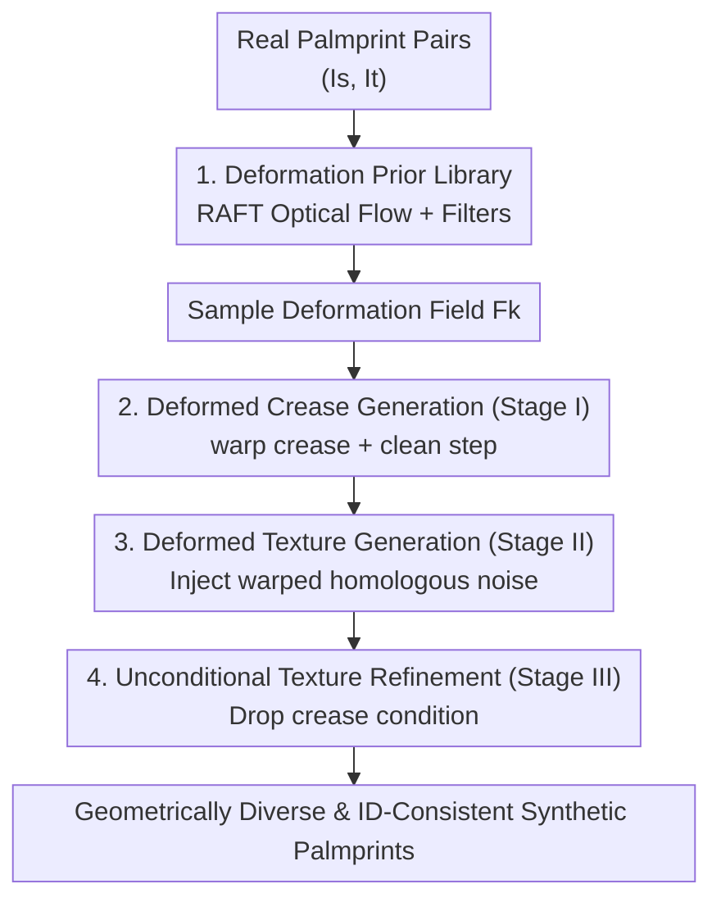

# FlowPalm: Optical Flow Driven Non-Rigid Deformation for Geometrically Diverse Palmprint Generation

**Conference**: CVPR 2026  
**Paper**: [CVF Open Access](https://openaccess.thecvf.com/content/CVPR2026/html/Zou_FlowPalm_Optical_Flow_Driven_Non-Rigid_Deformation_for_Geometrically_Diverse_Palmprint_CVPR_2026_paper.html)  
**Code**: https://yuchenzou.github.io/FlowPalm/ (Project Page)  
**Area**: Human Understanding / Biometrics / Diffusion Models  
**Keywords**: Palmprint Generation, Optical Flow, Non-rigid Deformation, Diffusion Models, Identity Consistency  

## TL;DR
FlowPalm utilizes RAFT optical flow to statistically derive non-rigid deformation fields from real palmprint pairs, constructing a "deformation library." During diffusion sampling, these deformations are injected into the pipeline via three stages: crease warping for the backbone and warped noise for the texture. This produces geometrically diverse and identity-consistent synthetic palmprints. Notably, a recognition model trained solely on synthetic data (85.20% TAR) outperforms one trained on real data (73.59%).

## Background & Motivation

**Background**: Palmprint recognition has become a popular biometric due to its rich texture and privacy-friendly nature. However, high-performance recognition models require large-scale, diverse, and high-quality datasets, while the collection of real palmprints is restricted by privacy policies and strict protocols. Consequently, recent studies have employed GANs or diffusion models to synthesize palmprints with new identities—typically by parameterizing crease lines using B-splines or polynomial curves as conditions—to replace real data for trainer training.

**Limitations of Prior Work**: Existing synthesis methods focus almost exclusively on "appearance modeling"—enhancing styles or transferring textures—while neglecting the inherent **geometric diversity** of real palmprints. In real-world scenarios, hand bending, joint movement, camera viewpoints, and imaging parameters introduce complex non-rigid deformations, which are critical for recognition robustness. Current methods either **completely ignore** geometric deformation (Diff-Palm) or rely on **manual simplified perturbations**, such as line oscillations (RPG-Palm, PFIG-Palm) or affine transformations (PCE-Palm).

**Key Challenge**: Manual deformations cannot replicate the spatially varying, local elastic bending superimposed with global shape changes found in real hands. This leads to limited geometric diversity in synthetic data, creating a performance bottleneck for recognition. Generating realistic deformations is difficult because: (1) it is hard to accurately model and simulate spatially varying non-rigid deformations; (2) it is challenging to maintain identity consistency when introducing deformation (excessive warp destroys identity textures).

**Core Idea**: Instead of manually designing deformations, FlowPalm **lets the real data speak for itself**. It uses the pre-trained RAFT optical flow model to estimate dense deformation fields between real palmprint pairs of the same identity. These statistics serve as a geometric prior. Exploiting the "noise-content equivariance" of diffusion models (where spatial transformations of input noise result in corresponding structural changes in the output), FlowPalm progressively injects deformations into both crease conditions and noise during sampling to achieve "geometric diversity + identity consistency."

## Method

### Overall Architecture
FlowPalm consists of two main components: **(1) Deformation Prior Construction**, which estimates optical flow fields from real palmprint pairs and applies two-level quality filters to build a "deformation library" $\mathcal{L}=\{F_1,\dots,F_N\}$; and **(2) Deformation-Driven Three-Stage Generation**, which samples a deformation field $F_k$ from the library and injects it into the denoising process. Stage I generates "deformed creases" under warped conditions; Stage II injects "warped homologous noise" to grow textures aligned with the creases; Stage III performs unconditional refinement by dropping the crease condition to enhance realism.

Palmprints consist of **principal lines/creases (identity structure)** and **texture (fine details)**. The key insight is that for identity consistency post-deformation, creases and noise must be **warped synchronously**—crease warping controls global structural deformation, while warped noise ensures the texture follows the backbone.

### Key Designs

**1. Deformation Prior Library: "Collecting" Non-Rigid Deformation via Optical Flow**

To address the failure of manual perturbations to replicate real deformations, the authors statistically derive deformations from real data. Given a source $I_s$ and target $I_t$ of the same identity, RAFT-Large estimates a dense field $F=(u,v)$, where $(u_{x,y}, v_{x,y})$ represents the displacement such that $\mathbf{I}_t(x,y)\approx \mathbf{I}_s(x+u_{x,y},\,y+v_{x,y})$. This field naturally captures local elastic bending and global pose variations.

To filter out unreliable optical flow, two checks are applied: ① **Smoothness Check**: Physically plausible deformations should vary smoothly, measured by a discontinuity ratio $\mathcal{D}(\mathbf{F})=\frac{1}{HW}\sum_{x,y}\mathbb{I}(\|\nabla\mathbf{F}(x,y)\|_2>\delta)$. ② **Identity Consistency Check**: Even if geometrically plausible, failed deformations often distort identity. The warped source $\hat{\mathbf{I}}_t=\mathcal{W}(\mathbf{I}_s,\mathbf{F})$ is compared against $\mathbf{I}_t$ using a recognition model $\mathcal{R}(\cdot)$ to ensure cosine similarity $\mathcal{C}(\mathbf{F}) > \tau_c$. High-quality fields form the library $\mathcal{L}$.

**2. Deformed Crease Generation (Stage I): Global Structural Control**

This stage operates during $t\in[T,\,0.5T]$. Given a manual crease map $\mathbf{C}$, it is warped using bilinear sampling: $\mathbf{C}^{(k)}_w=\mathcal{W}(\mathbf{C},\mathbf{F}_k)$. The diffusion model performs deterministic DDIM sampling $(\eta=0)$ conditioned on $\mathbf{C}^{(k)}_w$. At the final step $t^\star=0.5T$, a **clean denoising step** explicitly removes noise to obtain a clean structural signal:

$$\mathbf{x}_{\text{clean}}=\frac{\mathbf{x}_{t^\star}-\sqrt{1-\bar\alpha_{t^\star}}\,\boldsymbol{\epsilon}_\theta(\mathbf{x}_{t^\star},\mathbf{C}^{(k)}_w,t^\star)}{\sqrt{\bar\alpha_{t^\star}}}$$

This $\mathbf{x}_{\text{clean}}$ provides a geometrically consistent canvas for the next stage.

**3. Deformed Texture Generation (Stage II): Warped Homologous Noise for Alignment**

To keep texture synchronized with creases, this stage ($t\in[0.5T,\,0.25T]$) leverages **noise-content equivariance**. The authors inject a **warped homologous Gaussian noise** $\mathbf{n}_{\text{warp}}=\mathcal{T}_{\text{warp}}(\boldsymbol{\xi},\mathbf{F}_k)$ into the clean crease signal, where $\mathcal{T}_{\text{warp}}$ uses an $\int$-Noise strategy to ensure the warped noise still follows $\mathcal{N}(0,\mathbf{I})$. The noisy state is reconstructed at $t^\star$:

$$\mathbf{x}^{\text{new}}_{t^\star}=\sqrt{\bar\alpha_{t^\star}}\,\mathbf{x}_{\text{clean}}+\sqrt{1-\bar\alpha_{t^\star}}\,\mathbf{n}_{\text{warp}}$$

Subsequent DDIM steps grow textures aligned with the warped backbone. Unlike Diff-Palm, which gradually aligns distributions via DDPM, FlowPalm uses a clean step to swap the noise component once, significantly reducing computation.

**4. Unconditional Texture Refinement (Stage III): Eliminating Over-Constraint Artifacts**

There is a distribution mismatch between training conditions (extracted textures) and sampling conditions (manual creases). Maintaining the crease condition throughout sampling results in over-constrained, unrealistic textures. To bridge this, a branch is trained by **randomly dropping the crease condition**. In the final phase ($t<\tau_u\cdot T$), the condition is removed, and refinement is performed via unconditional denoising $\boldsymbol{\epsilon}_\theta(\mathbf{x}_t,\varnothing,t)$.

### Loss & Training
The framework builds on a pre-trained DDIM noise predictor $\boldsymbol{\epsilon}_\theta$ ($T=250$). Architecture: U-Net (256×256), batch size 128, Adam optimizer ($8\times10^{-5}$) for 100k steps with EMA. Recognition evaluation: MobileFaceNet backbone, trained for 40 epochs on 2000 synthetic identities (40 images per identity).

## Key Experimental Results

### Main Results
Testing on six public palmprint databases (XJTU-UP, MPD, etc.), using TAR@FAR=$10^{-6}$ (%). Comparison of recognition models trained purely on synthetic data:

| Setting | Method | Geometric Transform | Avg. TAR |
|------|------|---------|---------|
| w/o Aug. | Diff-Palm (CVPR'25) | None | 9.84 |
| w/o Aug. | UAA (ICCV'25) | Affine | 51.35 |
| w/o Aug. | **FlowPalm** | Non-Rigid | **58.95** |
| w/ Aug. | Diff-Palm | None | 79.02 |
| w/ Aug. | PFIG-Palm | Oscillation | 62.00 |
| w/ Aug. | **FlowPalm** | Non-Rigid | **85.20** |

**Key Finding**: **Syn. Only (85.20%) outperforms Real Only (73.59%)**. The recognition model trained solely on FlowPalm data surpasses the one trained on real data by 11.6%, demonstrating that non-rigid deformation introduces essential intra-class geometric diversity missing even in real datasets.

### Ablation Study
Ablation of deformation components (TAR@FAR=$10^{-6}$):

| Deform Sel. | Crease Warp | Noise Warp | w/o Aug. | w/ Aug. |
|:---:|:---:|:---:|---:|---:|
| × | × | × | 7.78 | 74.78 |
| × | ✓ | ✓ | 51.73 | 76.61 |
| ✓ | × | ✓ | 27.43 | 71.00 |
| ✓ | ✓ | × | 7.58 | 74.08 |
| **✓** | **✓** | **✓** | **58.95** | **85.20** |

**Key Findings**:
- **Noise Warp is critical**: Removing it (✓✓×) drops performance from 58.95 to 7.58, as textures fail to follow the crease deformation, destroying identity.
- **Crease Warp is essential**: Without it (✓×✓), accuracy falls to 27.43 due to structural misalignment.
- **Deformation Selection matters**: Omitting the quality check (×✓✓) drops TAR to 51.73, as unfiltered noisy deformations damage the palmprint structure.

## Highlights & Insights
- **"Deformation as Data"**: Shifting from manual perturbations to statistical collection from real data via optical flow is a powerful paradigm shift. This approach is transferable to other biometrics affected by non-rigid changes (fingerprints, iris, facial expressions).
- **Dual Warp Mechanism**: Driving both condition and noise warping with a single $F_k$ naturally ensures structural and textural alignment, which is the cornerstone of identity consistency.
- **Clean Step Acceleration**: Using a clean step to explicitly swap noise components allows for a single injection of warped noise followed by deterministic DDIM, which is more efficient than iterative alignment.
- **Refinement via Condition Drop**: Recognizing the mismatch between training and sampling conditions and using an unconditional window to "relax" the output is a practical solution for over-constrained generation.

## Limitations & Future Work
- **Dependence on Paired Real Data**: Constructing the deformation library requires real palmprint pairs of the same identity, meaning the method is not yet fully data-free.
- **Empirical Thresholds**: Parameters $\tau_d=0.01$ and $\tau_c=0.4$ require manual tuning; their cross-dataset transferability remains unverified.
- **Performance on CASIA**: On the CASIA dataset, FlowPalm occasionally shows smaller gains compared to others, likely because CASIA contains less inherent geometric variation.

## Related Work & Insights
- **vs. Diff-Palm (CVPR'25)**: Diff-Palm lacks geometric deformation. FlowPalm introduces non-rigid modeling (dual warp) and significantly improves Syn. Only TAR from 79.02 to 85.20.
- **vs. RPG-Palm / PFIG-Palm**: These use manual oscillations or affine transforms which fail to capture local elastic bending. FlowPalm achieves a lower Fréchet Distance (0.15 vs. 0.24+), indicating higher realism.
- **Noise-Content Equivariance**: The application of $\int$-Noise warp properties to biometrics represents a successful domain-specific adaptation of fundamental diffusion research.

## Rating
- **Novelty**: ⭐⭐⭐⭐⭐ First to statistically collect real non-rigid deformations via optical flow for biometric synthesis.
- **Experimental Thoroughness**: ⭐⭐⭐⭐ Solid results across six datasets and multiple training paradigms, though lacks sensitivity analysis for thresholds.
- **Writing Quality**: ⭐⭐⭐⭐ Clear three-stage transition logic and strong motivation for the dual-warp design.
- **Value**: ⭐⭐⭐⭐⭐ "Syn. Only" beating "Real Only" provides significant practical value for privacy-constrained biometric research.

<!-- RELATED:START -->

## Related Papers

- [\[CVPR 2026\] FLOW: Optimal Transport-Driven Feature Warping for Generalized Remote Physiological Measurement](flow_optimal_transport-driven_feature_warping_for_generalized_remote_physiologic.md)
- [\[CVPR 2026\] Unified Number-Free Text-to-Motion Generation Via Flow Matching](unified_number-free_text-to-motion_generation_via_flow_matching.md)
- [\[CVPR 2026\] MotionMaster: Generalizable Text-Driven Motion Generation and Editing](motionmaster_generalizable_text-driven_motion_generation_and_editing.md)
- [\[CVPR 2026\] ReMoGen: Real-time Human Interaction-to-Reaction Generation via Modular Learning from Diverse Data](remogen_real-time_human_interaction-to-reaction_generation_via_modular_learning_.md)
- [\[CVPR 2026\] Hierarchical Enhancement of Semantic Priors for Disentangled Text-Driven Motion Generation](hierarchical_enhancement_of_semantic_priors_for_disentangled_text-driven_motion_.md)

<!-- RELATED:END -->
