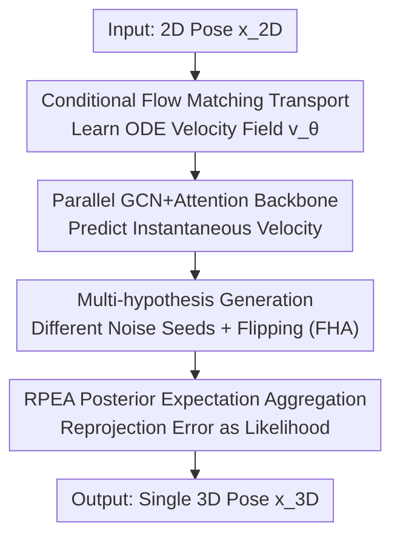

# FMPose3D: monocular 3D pose estimation via flow matching

**Conference**: CVPR 2026  
**Paper**: [CVF Open Access](https://openaccess.thecvf.com/content/CVPR2026/html/Wang_FMPose3D_monocular_3D_pose_estimation_via_flow_matching_CVPR_2026_paper.html)  
**Code**: https://github.com/AdaptiveMotorControlLab/FMPose3D  
**Area**: Human Understanding / 3D Vision  
**Keywords**: Monocular 3D Pose Estimation, Flow Matching, Multi-hypothesis Generation, Bayesian Posterior Aggregation, 2D-to-3D lifting  

## TL;DR
The authors reformulate monocular 2D-to-3D pose lifting as a "conditional distribution transport" problem. By utilizing Flow Matching to learn an ODE velocity field, the method transports Gaussian noise to valid 3D pose distributions in only 3 integration steps. A Reprojection Error-based Expectation Aggregation (RPEA) module merges multiple hypotheses into a single estimate. This approach outperforms diffusion-based methods on Human3.6M, MPI-INF-3DHP, and animal datasets while being approximately 5 times faster during inference.

## Background & Motivation
**Background**: Mainstream monocular 3D human pose estimation follows a two-stage 2D-to-3D lifting paradigm: extracting 2D joints via an off-the-shelf detector and "lifting" them to 3D coordinates. Since multiple 3D poses can project to the same 2D pose from a single viewpoint, this lifting is inherently ill-posed. Deterministic regression models often collapse into blurry predictions by "averaging all reasonable solutions."

**Limitations of Prior Work**: To characterize this uncertainty, recent works have shifted toward probabilistic multi-hypothesis modeling, where diffusion models (DiffPose, D3DP, CHAMP) have shown the best results by treating lifting as iterative denoising of random noise. However, the reverse process of diffusion is an SDE, requiring numerous sequential sampling steps per hypothesis. Even with DDIM acceleration, 10–15 steps are typically needed for high precision; for instance, a single-frame DiffPose without DDIM only achieves 3.36 FPS. This "accuracy vs. speed" trade-off hinders real-time deployment.

**Key Challenge**: Multi-hypothesis modeling requires generative models, but iterative sampling in generative models (like diffusion) is slow. The root cause is that diffusion learns a stochastic denoising SDE with random trajectories and many steps.

**Goal**: To maintain multi-hypothesis modeling capabilities while compressing sampling steps to single digits and ensuring stable convergence from multiple hypotheses to a single accurate prediction.

**Key Insight**: Flow Matching (FM) learns a deterministic velocity field governed by an ODE, which continuously transports a simple noise distribution to the target data distribution. Its deterministic trajectories allow sampling to be completed with very few integration steps (even a single step). The authors hypothesize that FM can similarly perform pose distribution "transport" and is naturally faster than diffusion.

**Core Idea**: The 3D pose estimation is formulated as a conditional distribution transport problem—mapping a Gaussian prior to a reasonable 3D pose distribution conditioned on the 2D pose. A conditional velocity field replaces the diffusion denoising chain, generating multiple hypotheses using different noise seeds, which are then fused by a Bayesian optimal aggregation module.

## Method

### Overall Architecture
FMPose3D takes a 2D pose $x_{2D}\in\mathbb{R}^{J\times2}$ from an image and outputs a 3D pose $\hat{x}_{3D}\in\mathbb{R}^{J\times3}$. Instead of direct coordinate regression, it learns a **conditional velocity field** $v_\theta(x_t,t,c)$ (with condition $c=x_{2D}$), defining a continuous trajectory starting from Gaussian noise $x_0\sim\mathcal{N}(0,I)$, driven by an ODE, and ending at the "valid 3D pose distribution." During inference, given a 2D pose, the velocity field is integrated starting from noise using explicit Euler integration (defaulting to 3 steps) to obtain a 3D hypothesis. By using different noise seeds, multiple hypotheses are generated and finally fused into a robust prediction by the RPEA module.

The entire pipeline is a serial structure: "Velocity field backbone → ODE sampling → Multi-hypothesis → Posterior aggregation," with horizontal flipping at test time used as an additional source of hypotheses (FHA).

### Key Designs

**1. Conditional Flow Matching: Deterministic ODE Velocity Field vs. Diffusion Denoising Chain**

Addressing the slow sampling of diffusion, this work rephrases lifting as conditional distribution transport. During training, given a ground truth pair $(x_{2D},x_1)$, noise is sampled as $x_0\sim\mathcal{N}(0,I)$ and time as $t\sim\mathcal{U}[0,1)$. An intermediate state $x_t=(1-t)x_0+t\,x_1$ is constructed along a **linear interpolation path**. The **target velocity** on this path is $v_t=\frac{dx_t}{dt}=x_1-x_0$ (a constant vector independent of $t$). The network $v_\theta(x_t,t,c)$ is trained to approximate this via the Conditional Flow Matching (CFM) objective:

$$\mathcal{L}_{\text{CFM}}(\theta)=\mathbb{E}_{x_0\sim p_0,\,t\sim\mathcal{U}[0,1)}\big[\,\|v_\theta(x_t,t,c)-(x_1-x_0)\|_2^2\,\big].$$.

During inference, the learned velocity field is treated as an ODE $\frac{dx_t}{dt}=v_\theta(x_t,t,c)$, integrated from $x_0\sim\mathcal{N}(0,I)$ to $t=1$: $\hat{x}_{3D}=x_0+\int_0^1 v_\theta(x_t,t,c)\,dt$. In practice, this is approximated using $S$ steps of explicit Euler: $x_{t+1/S}=x_t+\frac{1}{S}v_\theta(x_t,t,c)$. Because the target velocity follows a straight-line direction and the trajectory is deterministic, $S=3$ steps are sufficient—this is the fundamental reason it is an order of magnitude faster than diffusion, which requires 10–15 steps.

**2. Parallel GCN + Self-Attention Backbone: Capturing Local Topology and Global Joint Relations**

The velocity field network $v_\theta$ must consume $(x_t, x_{2D}, t)$ at each ODE step to predict per-joint velocities. Three lightweight MLP embedding layers map the current 3D state, 2D condition, and time into a latent space, concatenated into per-joint features $F_t\in\mathbb{R}^{J\times D}$. The backbone uses **two parallel branches**: a local branch using GCN to model the skeleton as a graph for short-range dependencies/topology, and a global branch using self-attention to capture long-range context. The outputs are concatenated, passed through LayerNorm + MLP, and finally a per-joint regression head outputs velocity $v_\theta\in\mathbb{R}^{J\times3}$. Ablations show that parallel fusion (49.3 mm) significantly outperforms serial GCN→Attention (50.5 mm) or single-branch models (50.1 / 50.9 mm), as the serial structure limits the exploitation of complementarity between local and global cues.

**3. Multi-hypothesis Generation + Flip Hypothesis Aggregation (FHA): Diversifying Deterministic Trajectories**

The ODE trajectory is deterministic for a fixed noise seed. The key observation of this paper is that by varying the initial noise $x_0$, the same 2D input is transported to different valid 3D poses. Thus, sampling $N$ seeds yields $N$ hypotheses $\{H_1,\dots,H_N\}$, achieving multi-hypothesis modeling without stochastic denoising. Additionally, Flip Hypothesis Aggregation (FHA) is used at test time: the original image and its horizontally flipped version are fed as two independent batches of hypotheses into the aggregation module (rather than simply averaging their final predictions). $N=40$ (20 original + 20 flipped) is used for Human3.6M. Due to the parallel design, generating 40 hypotheses still maintains 145.59 FPS.

**4. RPEA Posterior Expectation Aggregation: Reprojection Error as Likelihood for MMSE**

To converge $N$ hypotheses into an accurate prediction, the authors utilize Bayesian decision theory: under MSE loss, the optimal estimate (MMSE) is the posterior expectation $\hat{X}_{\text{MMSE}}=\mathbb{E}[X_{3D}\mid X_{2D}]=\int X_{3D}\,p(X_{3D}\mid X_{2D})\,dX_{3D}$. Since the true posterior is analytically intractable, RPEA provides a principled approximation: a valid 3D hypothesis must be consistent with its 2D observation. Thus, the **2D reprojection error** $L$ serves as a likelihood proxy, assuming $p(H_i\mid X_{2D})\propto\exp(-\alpha L(H_i,X_{2D}))$ (where $\alpha$ is a temperature hyperparameter). Aggregation is performed joint-wise in two steps: ① **Filtering**—for the $j$-th joint, candidates are ranked by their reprojection loss, and the Top-K lowest loss candidates form a high-likelihood set $\mathcal{H}_{K,j}$; ② **Weighted Aggregation**—a weighted average is computed over this set to approximate the posterior expectation:

$$\hat{X}^{\text{RPEA}}_j=\sum_{H_{i,j}\in\mathcal{H}_{K,j}} w_{i,j}\,H_{i,j},\qquad w_{i,j}=\frac{\exp(-\alpha L_{i,j})}{\sum_{H_{k,j}\in\mathcal{H}_{K,j}}\exp(-\alpha L_{k,j})}.$$

Concatenating all joints yields the final pose. Compared to the uniform averaging in DiffPose (which fails to leverage sample diversity) or JPMA's joint-wise selection of a single best point (which saturates after $N>12$ and destroys skeleton structure), RPEA is theoretically closer to Bayesian optimality and shows sustained performance gains as the number of hypotheses increases.

### Loss & Training
Training uses a single CFM objective $\mathcal{L}_{\text{CFM}}=\|v_\theta-(x_1-x_0)\|_2^2$ with Adam optimization. For Human3.6M, 2D poses detected by CPN are used; for MPI-INF-3DHP, ground truth 2D poses are used. The number of ODE steps is $S=3$. RPEA hyperparameters $\alpha$ and Top-K are tuned; RPEA is not used for animal dataset experiments.

## Key Experimental Results

### Main Results

Human3.6M (Input: Detected 2D poses, Metric: MPJPE ↓ in mm, $N$ = number of hypotheses):

| Method | Type | MPJPE ↓ |
|------|------|---------|
| SimpleBaseline (ICCV'17) | Deterministic | 62.9 |
| GraFormer (CVPR'22) | Deterministic | 51.8 |
| MLP-JCG (TMM'23) | Deterministic | 49.7 |
| CVAE ($N{=}200$) | Probabilistic | 58.0 |
| DiffPose ($N{=}5$) | Probabilistic (Diffusion) | 49.7 |
| ProPose ($N{=}1$) | Probabilistic | 51.9 |
| **FMPose3D ($N{=}2$)** | Probabilistic (FM) | 49.3 |
| **FMPose3D ($N{=}40$)** | Probabilistic (FM) | **47.3** |

At $N=40$, the result is 47.3 mm, a relative improvement of ~4.8% over DiffPose's 49.7 mm. Cross-dataset generalization (trained on Human3.6M, tested on MPI-INF-3DHP without fine-tuning):

| Method | All PCK ↑ | All AUC ↑ |
|------|-----------|-----------|
| UGRN | 84.1 | 53.7 |
| ProPose | 84.4 | 52.1 |
| **FMPose3D ($N{=}2$)** | 85.9 | 53.7 |
| **FMPose3D ($N{=}20$)** | **86.4** | **54.6** |

Animal Datasets (P-MPJPE ↓): 61.5 on Animal3D (vs AniMer 80.4) and 44.0 on CtrlAni3D (vs AniMer 44.1). Ours achieves state-of-the-art results even without RPEA, surpassing SMAL shape-fitting baselines.

### Ablation Study

Backbone architecture ablation (Human3.6M, MPJPE ↓):

| Attention | GCN | Connection Type | MPJPE ↓ |
|-----------|-----|----------|---------|
| ✓ | - | Single Branch | 50.9 |
| - | ✓ | Single Branch | 50.1 |
| ✓ | ✓ | Serial GCN→Attn | 50.5 |
| ✓ | ✓ | **Parallel Fusion** | **49.3** |

Inference Speed (Single RTX 4090, $S$ = steps, $N$ = hypotheses):

| Method | Steps | $N$ | FPS |
|------|-------|-----|-----|
| DiffPose (w/o DDIM) | 50 | 5 | 3.36 |
| DiffPose (DDIM) | 5 | 5 | 27.15 |
| **FMPose3D** | 3 | 1 | **160.11** |
| **FMPose3D** | 3 | 40 | 145.59 |

### Key Findings
- **RPEA is critical for performance and scalability**: Mean aggregation remains stagnant as $N$ increases (averaging masks diversity); joint-wise JPMA saturates after $N>12$ and degrades P-MPJPE by breaking skeletal structure. RPEA continuously reduces MPJPE with $N$, while its pose-wise variant yields optimal P-MPJPE.
- **Parallel is superior to Serial**: A serial GCN→Attn structure restricts the complementarity of local/global cues, whereas parallel fusion capitalizes on both.
- **Significant Speed Advantage**: Even with $N=40$, FMPose3D is ~5.4× faster than DiffPose due to deterministic 3-step ODEs and parallelizable hypotheses.

## Highlights & Insights
- **Turning "Determinism" into Diversity**: Since ODE trajectories are deterministic for a fixed seed, the authors leverage "different seeds → different valid solutions" to obtain multi-hypothesis modeling. This maintains fast sampling while recovering uncertainty—a key shift for FM in ill-posed lifting tasks.
- **RPEA using Reprojection Error as Likelihood Proxy**: This quantifies the geometric prior that "valid 3D must be consistent with 2D" into a Bayesian likelihood. The two-step Top-K filtering + softmax weighting approximates MMSE efficiently and is portable to any generative estimation task with consistency constraints.
- **Pioneering Flow Matching for 2D-to-3D Lifting**: This is the first work to successfully apply FM to pose lifting. Superior performance across both human and animal domains (with vast morphological differences) proves the robustness of this transport paradigm.

## Limitations & Future Work
- Dependency on off-the-shelf 2D detectors makes this a two-stage method where 2D errors propagate (a common limitation in lifting).
- The likelihood assumption in RPEA (exponentiated negative reprojection error) is a "reasonable but not necessarily exact" approximation; $\alpha$ and Top-K require tuning. Note: Camera parameters/projection details were not fully elaborated in the main text.
- Animal experiments did not utilize RPEA, and the impact of multi-hypothesis gains in that domain requires further study.
- Future work could explore single-step velocity fields (as FM can theoretically support single-step sampling) and incorporate more geometric priors beyond FHA into hypothesis generation.

## Related Work & Insights
- **vs. DiffPose / D3DP (Diffusion-based)**: Both perform probabilistic lifting, but diffusion learns stochastic SDEs (10–15 steps). This work learns deterministic ODE velocity fields (3 steps), yielding better accuracy (47.3 vs 49.7 mm) and 5× faster speed. RPEA replaces the uniform averaging used in DiffPose.
- **vs. JPMA (Aggregation in D3DP)**: JPMA selects a single "best" joint/pose, saturating with large $N$ and breaking structure in joint-wise mode. RPEA uses weighted posterior expectation over Top-K candidates, which is theoretically closer to Bayesian optimality and maintains skeletal consistency.
- **vs. CVAE / NF / GAN (Other Probabilistic)**: FM offers a simpler training objective (single CFM regression loss) and faster deterministic sampling, avoiding GAN instability, NF architectural constraints, or CVAE diversity issues.

## Rating
- Novelty: ⭐⭐⭐⭐⭐ First application of Flow Matching to 2D-to-3D pose lifting with a Bayesian-motivated RPEA module.
- Experimental Thoroughness: ⭐⭐⭐⭐ Coverage of two human and two animal datasets, speed benchmarks, and aggregation comparisons; some metrics (P-MPJPE) are reserved for the supplement.
- Writing Quality: ⭐⭐⭐⭐⭐ Clear derivations ranging from FM mechanisms to RPEA's Bayesian justification.
- Value: ⭐⭐⭐⭐⭐ Balances accuracy and real-time performance (160 FPS), providing a more practical paradigm for probabilistic 3D pose estimation than diffusion.

<!-- RELATED:START -->

## Related Papers

- [\[CVPR 2026\] Unified Number-Free Text-to-Motion Generation Via Flow Matching](unified_number-free_text-to-motion_generation_via_flow_matching.md)
- [\[CVPR 2026\] MotionHiFlow: Text-to-Motion via Hierarchical Flow Matching](motionhiflow_text-to-motion_via_hierarchical_flow_matching.md)
- [\[CVPR 2026\] Gaussian-Mixture Latent Flow for Stochastic 3D Human Motion Prediction](gaussian-mixture_latent_flow_for_stochastic_3d_human_motion_prediction.md)
- [\[CVPR 2026\] E-3DPSM: A State Machine for Event-Based Egocentric 3D Human Pose Estimation](e-3dpsm_a_state_machine_for_event-based_egocentric_3d_human_pose_estimation.md)
- [\[CVPR 2026\] MGDHand: Multi-Granularity Prior-to-Inertial Distillation Framework for Sequential 3D Hand Pose Estimation from Sparse IMUs](mgdhand_multi-granularity_prior-to-inertial_distillation_framework_for_sequentia.md)

<!-- RELATED:END -->
