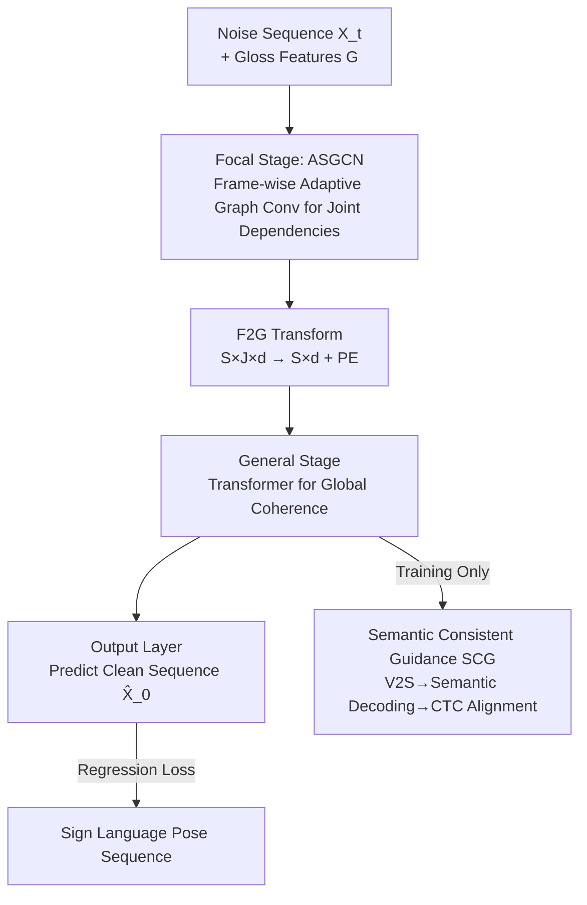

# Focal–General Diffusion Model with Semantic Consistent Guidance for Sign Language Production

**Conference**: CVPR 2026  
**Paper**: [CVF Open Access](https://openaccess.thecvf.com/content/CVPR2026/html/Yu_Focal-General_Diffusion_Model_with_Semantic_Consistent_Guidance_for_Sign_Language_CVPR_2026_paper.html)  
**Code**: See paper project page (no specific GitHub repository provided) ⚠️ Subject to original text  
**Area**: Human Understanding / Sign Language Production / Diffusion Models  
**Keywords**: Sign Language Production, Gloss-to-Pose, Diffusion Models, Adaptive Graph Convolution, Cross-modal Semantic Consistency  

## TL;DR
Addressing the common flaw in the Gloss-to-Pose stage of Sign Language Production (SLP)—which typically models only global sequences while ignoring fine-grained joint-level dependencies—this paper proposes the Focal–General Diffusion Model (FGDM). By employing a two-stage denoising structure that "focuses on joints first, then coordinates the global sequence," combined with a frame-wise Adaptive Semantic Graph Convolutional Network (ASGCN) and a Semantic Consistent Guidance (SCG) mechanism that injects CTC-based semantic supervision into diffusion training, the model achieves new SOTA performance on PHOENIX14T and USTC-CSL.

## Background & Motivation
**Background**: Sign Language Production (SLP) is generally decomposed into two stages: Text-to-Gloss (T2G, translating spoken text into gloss sequences) and Gloss-to-Pose (G2P, mapping each gloss to continuous skeletal poses and interpolating smooth transitions). While T2G has been effectively addressed by NMT-like methods, the challenges and research value are concentrated in G2P—the generated pose sequences can subsequently drive digital humans or synthetic sign language videos. Recently, the mainstream of G2P has shifted from autoregressive Transformers to diffusion models (e.g., G2P-DDM, GCDM, Sign-IDD).

**Limitations of Prior Work**: Existing SOTA diffusion methods treat each pose frame as an **indivisible unit** for modeling, overemphasizing global sequence modeling while failing to capture joint-level fine-grained dependencies. This leads to a decline in generated pose quality, where the intricacies of hand gestures (specific finger or joint movements) become blurred.

**Key Challenge**: In sign language poses, **the semantic and spatial dependency strength of joints changes dynamically over time**—the coupling between the same pair of joints differs entirely across different glosses and moments. However, existing GCN-based methods use a "frame-shared" static adjacency matrix, which inherently lacks the flexibility to adjust per timestep. Furthermore, diffusion models "blindly fit coordinates" under regression losses (L1/L2), with no mechanism to ensure the generated poses align **semantically** with the target glosses. A few non-diffusion methods have attempted semantic guidance, but the cross-modal alignment gap is too large, training is unstable, and they cannot be directly transferred due to the specific nature of diffusion training.

**Goal**: (1) Enable the model to precisely model joint-level dependencies while maintaining global coherence; (2) Effectively introduce semantic signals as cross-modal supervision within the diffusion framework.

**Core Idea**: Replace single global modeling with a two-stage denoising structure: "Focal (focusing on local joints) → General (coordinating the global sequence)." The joint-level stage utilizes frame-wise adaptive graph convolution (ASGCN). Simultaneously, a CTC-style semantic alignment loss (SCG) is injected into diffusion training as auxiliary supervision, with its intensity dynamically adjusted according to the current denoising timestep.

## Method

### Overall Architecture
FGDM is a conditional diffusion model aimed at generating a 3D skeletal pose sequence $X=\{x_i\}_{i=1}^{S}$ given a gloss sequence $G=\{g_i\}_{i=1}^{L}$, where each frame $x_i\in\mathbb{R}^{J\times 3}$ contains the 3D coordinates of $J$ keypoints. During training, following DDPM, noise is added to the target sequence $X_0$ to obtain $X_t$ (Eq. 1: $Q(X_t|X_0):=\sqrt{\bar a_t}X_0+\epsilon\sqrt{1-\bar a_t}$, where $\bar a_t=\prod_s a_s$, using a cosine variance schedule). The network denoises $X_t$ conditioned on the gloss to predict the clean sequence $\hat X_0$. During inference, it starts from Gaussian noise and iteratively refines the sequence over $I$ steps.

The denoising network is the core innovation, forming a clear pipeline: the noise sequence undergoes Iconicity Disentanglement ($\mathbb{R}^{S\times J\times3}\!\to\!\mathbb{R}^{S\times J\times7}$) and embedding. The gloss sequence is processed by a Gloss Encoder, fused with temporal embeddings to obtain gloss features $G\in\mathbb{R}^{L\times c}$. Subsequently, it enters the **Focal stage** ($L_1$ layers of ASGCN+TCN, spatial-temporal decomposition, targeting joint-level dependencies). Through the **F2G Transform** (compressing the $S\times J\times d_f$ shape into $S\times d_g$ with positional encoding), it enters the **General stage** ($L_2$ layers of Transformer decoder, coordinating long-range global coherence). Finally, the Output Layer produces $\hat X_0$. During training, an additional **SCG branch** is connected: the General output is projected into the semantic space via a V2S Adapter and decoded into gloss logits by a Semantic Decoder to calculate the SCG loss (enabled only during training).

### Key Designs

**1. Focal–General Two-stage Denoising: Local Joint Detailing followed by Global Sequence Coordination**

To address the issue where "existing diffusion methods over-emphasize global modeling and lose joint-level details," FGDM splits the denoising network into two stages with complementary responsibilities. The Focal stage consists of $L_1$ stacked layers of ASGCN + TCN, following a spatial-temporal decomposition (ASGCN for spatial joint dependencies, TCN for temporal dynamics). It treats the pose as a "graph of $J$ joints" modeled frame-by-frame to resolve joint-level coupling. The General stage first utilizes the F2G Transform to collapse the joint dimension into a high-level feature vector ($S\times J\times d_f\!\to\!S\times d_g$, Eq. 10), then uses $L_2$ Transformer decoder layers for cross-attention—self-attention for inter-frame long-range dependencies and cross-attention to inject gloss features $G$ as K/V (Eq. 11), ensuring global coherence and natural transitions. This "local-to-global" progressive modeling allows both scales to perform their specific roles: ablation shows that a General-only baseline achieves a BLEU-1 of 22.54%, which jumps to 28.09% (DEV) with the Focal stage, proving joint-level modeling is the missing key.

**2. ASGCN: Frame-wise Adaptive, Semantic-Injected Graph Convolution**

This core contribution addresses the contradiction that "static shared adjacency matrices cannot adjust joint dependencies according to the moment." Unlike conventional GCNs with a fixed adjacency matrix, ASGCN provides each frame $i$ with its own adjacency matrix $A^i$, fused from three components (Eq. 3):

$$A^i = (A^i_a + A^i_b)\odot M^i$$

Where $A^i_a$ represents **Contextual Correlation**: for frame $i$, it computes a joint correlation map $C^i\in\mathbb{R}^{(2n+1)\times J\times J}$ with $n$ neighboring frames ($n=3$, Eq. 4), followed by sigmoid gating and weighted aggregation via a **zero-initialized** linear layer $W_{Agg}$ (Eq. 5). Zero initialization ensures the model trusts priors initially and gradually introduces learned dynamic correlations, stabilizing training. $A^i_b$ represents the **Skeletal Topology Prior**: a skeletal hierarchy rooted at the neck, decomposed into $K_v$ sub-matrices and normalized. As it encodes physical structure, it is shared across all frames for structural stability. $M^i$ is the **Semantic Mask**: a set of prototype masks $M=\{MG(G_l)\}$ is generated for each gloss feature via a mask generator (Eq. 6). For frame $i$, the mean of its $J$ joints is used to calculate softmax weights $w^i$ against gloss features (Eq. 7), and the prototypes are aggregated into $\bar M^i$ (Eq. 8). Finally, spatial separation is simulated via convolution, and a scaled sigmoid maps mask values to $[0,2]$ (Eq. 9: $M^i=2\cdot\sigma(W_s\bar M^i)$)—values $>1$ **enhance** connections while $<1$ **suppress** them, allowing gloss semantics to directly modulate joint coupling.

**3. SCG Semantic Consistent Guidance: Injecting Dynamic Semantic Supervision**

Regression labels only force the model to "fit coordinates" without guaranteeing semantic intelligibility. SCG introduces an auxiliary supervision path: visual features from the General stage $X^{go}_t$ pass through a V2S Adapter (two linear layers + ReLU) as an intermediate transition (Eq. 15), then enter a Semantic Decoder. This decoder, drawing from sign language recognition architectures, consists of LSD (two 1D-TCNs + MaxPool for local features), GSD (BiLSTM for global features), and a Gloss Classifier (Eq. 16), outputting gloss logits $y^o_t\in\mathbb{R}^{S'\times(\text{num glosses}+1)}$. Supervision uses CTC: maximizing the likelihood of all alignment paths collapsible to the target gloss sequence $G$ (Eq. 18). Crucially, the loss is multiplied by a **time-dependent weight** (Eq. 17):

$$\mathcal{L}_{SCG} = -\frac{1}{e^{\alpha t/T}}\log\!\sum_{\pi\in B^{-1}(G)} p(\pi\mid y^o_t)$$

where $\alpha=10$. The intuition is: when $t$ is large (heavy noise, blurred poses), semantic supervision is weakened to avoid forcing alignment on "unclear" data; as $t$ decreases (approaching clean poses), semantic supervision becomes more influential.

### Loss & Training
The total loss comprises regression and SCG losses (Eq. 19): $\mathcal{L}=\mathcal{L}_{joint}+\lambda\mathcal{L}_{bone}+\gamma\mathcal{L}_{SCG}$. $\mathcal{L}_{joint}$ is the L1 joint coordinate loss, and $\mathcal{L}_{bone}$ is the L2 bone vector loss (Eq. 20), with $\lambda=0.1$ and $\gamma=0.0001$. Training parameters: $T=1000$, inference $I=5$ steps, Adam optimizer (lr=0.001), single A6000 GPU; $n=3$, $L_1=3$, $L_2=2$.

## Key Experimental Results

### Main Results
On PHOENIX14T (German weather forecast sign language, 7096/519/642 split), FGDM sets new SOTA performance:

| Method | B1↑(TEST) | B4↑(TEST) | ROUGE↑(TEST) | WER↓(TEST) | FID↓(TEST) |
|------|-----------|-----------|--------------|------------|------------|
| GEN-OBT (Strongest Non-diffusion) | 23.08 | 8.01 | 23.49 | 81.78 | – |
| Sign-IDD (Strongest Diffusion) | 23.16 | 8.22 | 24.51 | 79.15 | 2.44 |
| **FGDM (Ours)** | **26.51** | **9.67** | **28.45** | **70.70** | **2.31** |

Compared to Sign-IDD, ROUGE gains +3.94% and WER decreases -8.45%. Interestingly, FGDM's WER (70.70) is lower than the Ground Truth (71.94), which authors attribute to generated poses being closer to the training distribution and the correction of some mislabeled GT samples. On USTC-CSL, FGDM leads Sign-IDD by +1.51%/+3.92% in B1/B4 and -1.03% in WER (Split-I).

### Ablation Study
Ablation of main innovations (using General-only as baseline, PHOENIX14T DEV/TEST):

| Configuration | B1↑(DEV) | B4↑(DEV) | WER↓(DEV) | WER↓(TEST) |
|------|----------|----------|-----------|------------|
| Baseline (General only) | 22.54 | 7.39 | 81.00 | 79.76 |
| +Focal | 28.09 | 9.84 | 76.57 | 73.91 |
| +SCG | 25.13 | 9.12 | 78.92 | 78.12 |
| +Focal+SCG (Full) | 26.92 | 9.48 | **72.22** | **70.70** |

Ablation of components within ASGCN:

| Configuration | B1↓(DEV) | WER Change(DEV/TEST) | Description |
|------|----------|--------------------|------|
| Baseline+Focal (Full) | 28.09 | — | Full ASGCN |
| w/o $A^i_a$ (Contextual) | 23.29 | +2.59 / +4.56 | Largest drop, most critical |
| w/o $M^i$ (Semantic Mask) | 25.00 | +1.09 / +3.29 | Second most critical |
| w/o $A^i_b$ (Skeletal Topology) | 26.44 | +0.13 / +1.27 | Minimal impact |

### Key Findings
- **Focal stage contributes most**: Adding Focal alone increases BLEU-1 from 22.54 to 28.09, proving joint-level modeling was the missing core in prior global methods.
- **Contextual correlation $A^i_a$ is vital in ASGCN**: Its removal causes the sharpest drop in performance, indicating that "frame-wise learned dependencies" are more important than "fixed physical topology."
- **Layer sweet spot**: $L_1=3, L_2=2$ is optimal; further increasing $L_1$ offers negligible gains.
- **SCG Impact**: SCG's benefits are primarily reflected in semantic recognizability (WER/ROUGE) rather than pure geometric BLEU. The full system achieves optimal WER only when combining both components.

## Highlights & Insights
- **Transferable "Multi-scale Denoising"**: The Focal-General paradigm of splitting denoising into "local structural → global sequential" stages using appropriate operators (GCN vs Transformer) is applicable to other structured sequence tasks like human motion or dance generation.
- **Zero-init Gating**: Initializing $W_{Agg}$ to zero allows an elegant transition from "pure prior" to "learned dynamic correlation," preventing noise from random initializations in early training.
- **Time-aware Auxiliary Loss**: Weighting auxiliary supervision by diffusion timestep $t$ ($1/e^{\alpha t/T}$) provides a generic recipe for safely injecting semantic losses into diffusion training.
- **Semantic Modulation of Graph Structure**: Using gloss semantics to generate $[0,2]$ masks to modulate joint connections provides a lightweight and interpretable way to inject cross-modal conditions.

## Limitations & Future Work
- The mask generator $MG(\cdot)$ is currently a simple linear map, suggesting its expressive power might be underutilized.
- Evaluation relies heavily on back-translation (NSLT); the fact that WER is lower than GT suggests metrics may partly reflect "recognizability" rather than "naturalness." Human perceptual studies are needed. ⚠️
- Validation is limited to PHOENIX14T and USTC-CSL; generalization to open-domain, large-vocabulary sign language remains unproven.
- As G2P is an intermediate step, the end-to-end quality of final sign language videos (Pose-to-Video) was not verified in this study.

## Related Work & Insights
- **vs. Sign-IDD / GCDM (Diffusion)**: These treat frames as indivisible units for global modeling. This paper identifies the loss of joint-level dependencies and addresses it with the Focal stage + ASGCN.
- **vs. GEN-OBT / NAT-EA (Non-diffusion Semantic Guidance)**: Prior methods struggled with stability and cross-modal gaps; SCG addresses this for diffusion via CTC and time-aware weighting.
- **vs. ST-GCN / AGCN (Graph Convolutions)**: ASGCN extends dynamic adjacency to a **frame-wise** level and incorporates both contextual correlation and semantic masking, specifically suited for sign language where joint dependencies fluctuate rapidly.

## Rating
- Novelty: ⭐⭐⭐⭐⭐ Two-stage denoising + Frame-wise adaptive semantic GCN + Time-aware CTC supervision.
- Experimental Thoroughness: ⭐⭐⭐⭐ Strong results on two datasets with multiple ablations, though lacking human evaluation.
- Writing Quality: ⭐⭐⭐⭐ Clear motivation and mathematical derivation; minor notation inconsistencies.
- Value: ⭐⭐⭐⭐ Sets new SOTA for G2P and provides transferable insights for structured sequence generation.

<!-- RELATED:START -->

## Related Papers

- [\[CVPR 2026\] SignPR: A Progressive Vector-Quantized Diffusion Framework for Sign Language Production](signpr_a_progressive_vector-quantized_diffusion_framework_for_sign_language_prod.md)
- [\[ACL 2026\] Hybrid Autoregressive-Diffusion Model for Real-Time Sign Language Production](../../ACL2026/human_understanding/hybrid_autoregressive-diffusion_model_for_real-time_sign_language_production.md)
- [\[CVPR 2026\] BoostSLT: Boosting Sign Language Translation via a Plug-and-Play Diffusion-Based Semantic Enhancer](boostslt_boosting_sign_language_translation_via_a_plug-and-play_diffusion-based_.md)
- [\[CVPR 2026\] Sign Language Recognition in the Age of LLMs](sign_language_recognition_llms.md)
- [\[CVPR 2026\] Learning Effective Sign Features without Text for Gloss-free Sign Language Translation](learning_effective_sign_features_without_text_for_gloss-free_sign_language_trans.md)

<!-- RELATED:END -->
