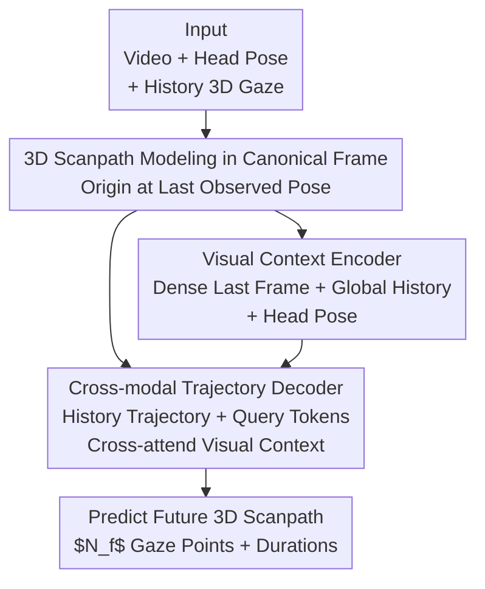

# Forecasting 3D Scanpaths in Egocentric Video

**Conference**: CVPR 2026  
**Paper**: [CVF Open Access](https://openaccess.thecvf.com/content/CVPR2026/html/Ryan_Forecasting_3D_Scanpaths_in_Egocentric_Video_CVPR_2026_paper.html)  
**Code**: None  
**Area**: Human Understanding / Egocentric Vision / Gaze Prediction  
**Keywords**: Egocentric video, 3D scanpath prediction, gaze prediction, canonical frame, cross-modal attention  

## TL;DR
This paper extends the task of "predicting where a person will look next" from 2D images to egocentric videos for the first time. It defines a new task of **predicting future gaze sequences (3D scanpaths) within a 3D world coordinate system** and proposes a Transformer architecture that uses the "last observed camera pose" as a canonical frame to fuse video, head pose, and historical gaze, establishing the first baseline on the Aria Digital Twin dataset.

## Background & Motivation
**Background**: Gaze and scanpath prediction have long been key tasks for understanding user intent and driving AR/VR rendering and robot interaction. However, the vast majority of research (methods on datasets like MIT1003, COCO-Search18) models this as a problem on **2D static images**—given an image, predict a time-ordered sequence of pixel coordinates.

**Limitations of Prior Work**: Viewing a static image on a monitor is a significant simplification of real gaze behavior. In egocentric videos captured by head-mounted devices, scenes are dynamic, and the wearer moves and rotates their head rapidly in a 3D environment. In this context, **the same future gaze target may become completely invisible in subsequent frames** (moving out of the field of view). Most existing egocentric gaze research still operates within **single-frame pixel coordinates**, failing to align across frames and preventing consistent spatial reasoning for downstream tasks.

**Key Challenge**: Downstream applications like AR/VR rendering and robot planning require gaze predictions to be **spatially consistent across multiple egocentric frames**. This necessitates results in a **persistent 3D coordinate frame**. However, egocentric data is characterized by intense head motion and scene dynamics; traditional 2D pixel-based prediction implicitly requires the model to first predict future head motion, which is both difficult and uninterpretable.

**Goal**: ① Redefine the task as predicting the next $N_f$ gaze points in a 3D coordinate system consistent across frames; ② Design an architecture capable of processing video, head pose, and historical 3D gaze; ③ Establish the first performance benchmark on real-world datasets and identify critical architectural components.

**Key Insight**: Instead of predicting in a shifting pixel plane, use the **"camera pose of the last observed frame" as a canonical frame**. By projecting historical gaze into this fixed 3D coordinate system and predicting future gaze sequences within the same frame, the prediction is naturally grounded in the 3D environment and inherently handles cases where gaze points fall outside the current view.

## Method

### Overall Architecture
The input consists of an egocentric observation: a historical 3D scanpath $S_o=\{g_1,\dots,g_{N_o}\}$ (where each gaze $g\in\mathbb{R}^4$ contains a 3D world position $x^W_i\in\mathbb{R}^3$ and duration $m_i$), the corresponding video stream $V$, and the camera pose $p=(R^W,t^W)$ per frame. The output is a future scanpath $S_f$ of $N_f$ gaze points. The pipeline merges two branches: first, a **Canonical Frame** is defined to project all data into a fixed 3D coordinate system; then, a **Visual Context Encoder** encodes multi-frame video and head poses into a visual context; finally, a **Cross-modal Trajectory Decoder** allows historical trajectory tokens and learnable query tokens to cross-attend to the visual context to decode the future 3D scanpath.

### Key Designs

**1. 3D Scanpath Modeling in a Canonical Frame: Moving "where to look" from the dynamic pixel plane to a fixed 3D coordinate system**

This is the most fundamental contribution of the paper, addressing the pain point that future gaze points may be invisible in subsequent frames and cannot be aligned. The authors define a canonical 3D coordinate system $C$ for each scanpath, with the origin set at the **camera position of the last observed frame $p^W_{N_o}$**. All input gaze points are projected into this system to obtain $S^C_o$, and future gaze points are predicted within it. This offers two advantages: first, the coordinate system is grounded in the real 3D scene and remains persistent across different head poses within a path; second, if a gaze point falls outside the camera's view, the 3D output space can naturally represent it, whereas 2D pixel modeling would fail. The task is set to **predict a fixed number of future gaze points** rather than a continuous time series, as time is a confounding variable in scanpaths—the authors treat duration as a secondary, more ambiguous variable, focusing primarily on the sequence of future gaze positions.

**2. Visual Context Encoder: Generating temporal visual context using "Dense Last Frame + Global History + Head Pose"**

Egocentric gaze prediction requires temporal context beyond a single frame to handle scene dynamics and ego-motion. This branch encodes multi-frame visuals and head positions into a unified context. For each observed gaze $g_i$, the corresponding frame $v_i$ is processed using a **frozen pre-trained visual encoder DINOv2-B** $\psi$. A key design choice is asymmetric processing: for the **canonical frame $v_{N_o}$, a full per-patch dense feature map** is used (capturing dense semantic and spatial info of the frame where predictions occur); for **previous frames $v_{1:N_o-1}$, only global feature vectors** are used (capturing overall visual motion relative to the canonical frame). Both are embedded into a $d$-dimensional space via linear layers $E_{\text{dense}},E_{\text{global}}\in\mathbb{R}^{d_\psi\times d}$. To account for viewpoint changes, each camera position $p^W_i$ is projected into the canonical frame to obtain a relative pose $p^C_i\in\mathbb{R}^7$ (quaternion orientation + 3D position), embedded via $E_{\text{pose}}$, and concatenated with visual features to form $C_{\text{visual}}$. Sinusoidal positional encodings are added to represent relative time before passing the data through a 2-layer Transformer with self-attention to facilitate interaction across frames, resulting in the updated visual context $C'_{\text{visual}}$.

**3. Cross-modal Trajectory Decoder: "Glimpsing" future gaze within the visual context via learnable query tokens**

With the visual context established, historical gaze behavior must be aligned with visual information to predict the future. The observed gaze points $S_o$ are embedded into historical trajectory features $C_{\text{traj}}$ via a linear layer and concatenated with a set of **learnable trajectory query vectors** $Q=\{q_1,\dots,q_{N_f}\}$, where each $q_i$ will be decoded into a future gaze point. $[C_{\text{traj}},Q]$ is fed into a 2-layer Transformer decoder: within each layer, trajectory features interact via self-attention and cross-attend to the visual context $C'_{\text{visual}}$. To align historical trajectories with visual context temporally, $C_{\text{traj}}$ also receives sinusoidal temporal positional encodings. Finally, the queries are decoded into predictions via a linear projection layer: $S^{\text{pred}}_f=\text{Proj}(Q')$, where each $g^{\text{pred}}_i\in\mathbb{R}^4$ provides a position $x^{C,\text{pred}}_i$ and duration $m^{\text{pred}}_i$ in the 3D canonical system.

### Loss & Training
A multi-task loss is used to jointly supervise gaze positions and durations, both using MSE:

$$L(S^{\text{pred}}_f,S_f)=\lambda_1 L_{\text{pos}}(X^{\text{pred}}_f,X_f)+\lambda_2 L_{\text{dur}}(M^{\text{pred}}_i,M_i)$$

Implementation details: $N_o=N_f=10$; input images are $224\times224$; DINOv2 produces a $16\times16\times768$ feature map for the canonical frame; hidden dimension $d=256$; optimized with AdamW, learning rate 2e-4, weight decay 1e-2, trained for 3 epochs (sampling 87k overlapping trajectories from the training set).

## Key Experimental Results

### Dataset & Protocol
The **Aria Digital Twin (ADT)** dataset is used: 30Hz video, 30Hz eye tracking, and SLAM-estimated poses from Project Aria glasses, with 3D digital twins allowing for ground-truth 3D gaze points via ray-scene intersection. 184 videos are split into 147 train / 18 val / 19 test. Consecutive, proximal 3D gaze points are clustered into fixations, resulting in 646 non-overlapping test segments (~2.8s average). Metrics include distance-based (DTW / EUC / FRE / EYE / TDE in meters) and the MultiMatch suite (Shape/Direction/Length/Position/Duration).

### Main Results (3D Scanpath Prediction on ADT, lower is better)

| Method | DTW↓ | EUC↓ | FRE↓ | EYE↓ | TDE↓ | Pos↓ |
|------|------|------|------|------|------|------|
| Dataset average | 2.014 | 2.014 | 2.948 | 3.199 | 1.445 | 1.975 |
| Last observed point (strong heuristic) | 1.533 | 1.533 | 2.646 | 1.977 | 1.310 | 1.504 |
| Linear extrapolation | 4.642 | 4.660 | 8.133 | 5.506 | 1.504 | 4.309 |
| TPP-Gaze (adapted to 3D) | 1.972 | 2.102 | 3.245 | 2.158 | 0.947 | 1.840 |
| Ours - Trajectory only | 1.450 | 1.456 | 2.280 | 1.901 | 0.930 | 1.419 |
| **Ours - Video, pose (Full)** | **1.377** | **1.382** | **2.173** | **1.800** | **0.859** | **1.350** |

The full model leads across most metrics, significantly outperforming TPP-Gaze (an image-based method adapted to 3D). This indicates that 3D egocentric scanpaths require different modeling techniques compared to static images. Notably, **"Last observed point" is a very strong baseline**: because the canonical frame is anchored to the last observed gaze point and head motion has high degrees of freedom, gaze often remains near the center of the field of view, consistent with the strong center prior in 2D egocentric gaze estimation.

### Ablation Study

| Configuration | DTW↓ | EUC↓ | EYE↓ | Description |
|------|------|------|------|------|
| Trajectory only | 1.450 | 1.456 | 1.901 | No vision, no pose |
| Single image, no pose | 1.410 | 1.421 | 1.836 | + Single frame vision |
| Single image, pose | 1.402 | 1.421 | 1.823 | + Single frame + pose |
| Video, no pose | 1.395 | 1.412 | 1.814 | Multi-frame video |
| **Video, pose (Full)** | **1.377** | **1.382** | **1.800** | Full model |

**Pose Gain in Depth Direction (Table 2, Euclidean error split by Plane/Depth)**:

| Video | Pose | X-Y Plane | Z (Depth) |
|-------|------|----------|-----------|
| × | × | 0.916 | 0.927 |
| ✓ | × | 0.907 | 0.918 |
| ✓ | ✓ | **0.898** | **0.890** |

**Historical Gaze Context Length (Table 4)**: DTW is 1.720 at context=0, drops to 1.450 with 1 point, and reaches 1.377 with 10 points—historical gaze is the most critical input. **Decoder Attention Structure (Table 5)**: Causal (1.419) < Partial causal (1.403) < **Bidirectional (1.377)**; bidirectional attention performs best.

### Key Findings
- **Historical gaze trajectory contributes the most**: DTW drops from 1.720 (0 context) to 1.450 (1 context), a much larger jump than that provided by subsequent vision or pose inputs.
- **Head pose primarily aids depth**: While pose gain is modest across most metrics, Table 2 shows it **most significantly reduces Euclidean error along the Z (depth) axis** (0.918→0.890). This confirms that explicit head motion modeling is necessary for geometrically grounded 3D predictions.
- **Designing for 3D improves 2D results**: Table 3 shows that projecting 3D predictions back to 2D pixels still outperforms TPP-Gaze trained directly in 2D. This suggests that leveraging 3D information produces more accurate predictions even in 2D space. ⚠️ However, the overall gain from vision/pose is relatively small, which the authors suggest may require larger-scale data to fully exploit.

## Highlights & Insights
- **The "Canonical Frame" is the key to correct egocentric gaze prediction**: Building a fixed 3D coordinate system at the last observed camera pose solves frame alignment, out-of-view gaze points, and geometric grounding. This modeling approach is transferable to other egocentric tasks like trajectory or interaction prediction.
- **Asymmetric visual encoding (Dense vs. Global) is pragmatic**: Using dense patch features only for the "prediction frame" while using global vectors for historical frames provides sufficient spatial semantics while controlling computational cost.
- **Honest presentation of strong heuristic baselines**: The authors clearly state that "last-observed-point" is hard to beat and explain why (anchor point + head motion characteristics). This transparency is valuable for understanding the true nature of the task.

## Limitations & Future Work
- The authors acknowledge the overall gains from dynamic vision and head pose are small, suggesting that **larger-scale data may be required**. Currently, the method is only validated on the indoor digital twin scenes of the ADT dataset.
- Duration is treated as a secondary variable, and the full model is not always optimal for the Duration metric; ⚠️ duration modeling remains an open problem.
- It relies on reliable 3D gaze ground-truth (eye tracking × digital twin) and SLAM poses. Obtaining GT 3D gaze in real-world scenes without digital twins is much more difficult.
- The model predicts a fixed $N_f=10$ future gaze points, with no explicit handling of variable-length or variable-timespan predictions.

## Related Work & Insights
- **vs. 2D Image Scanpath Prediction (e.g., TPP-Gaze)**: These predict gaze sequences on fixed images in pixel coordinates. This paper predicts in cross-frame consistent 3D world coordinates; adapting TPP-Gaze to 3D yields inferior results, proving that static image assumptions do not fit egocentric contexts.
- **vs. 2D Egocentric Gaze Prediction (e.g., Zhang et al.)**: These predict gaze in future 2D pixel frames, which implicitly requires head motion prediction and lacks inter-frame interpretability. This paper uses a 3D coordinate system where predicted points are persistent across frames.
- **vs. Gaze-driven Action Prediction (GazeMotion / GIMO / FICTION)**: These either predict gaze direction or use coarse voxel 3D outputs. This paper predicts **3D gaze points** (not just directions) and does not require body pose measurements, offering finer resolution than voxels.

## Rating
- Novelty: ⭐⭐⭐⭐⭐ First to systematically define and study the 3D scanpath prediction task in egocentric video; canonical frame modeling is a conceptually deep new formulation.
- Experimental Thoroughness: ⭐⭐⭐⭐ Comprehensive comparison with heuristics, existing methods, and ablations, though limited to the ADT dataset with relatively small vision-based gains.
- Writing Quality: ⭐⭐⭐⭐ Clear explanation of task motivation and coordinate system design; honest analysis of strong baselines.
- Value: ⭐⭐⭐⭐ Establishes the 3D task paradigm and first baseline for AR/VR gaze prediction; the frame-of-reference idea is highly transferable.

<!-- RELATED:START -->

## Related Papers

- [\[CVPR 2026\] E-3DPSM: A State Machine for Event-Based Egocentric 3D Human Pose Estimation](e-3dpsm_a_state_machine_for_event-based_egocentric_3d_human_pose_estimation.md)
- [\[CVPR 2026\] Beyond Scanpaths: Graph-Based Gaze Simulation in Dynamic Scenes](beyond_scanpaths_graph-based_gaze_simulation_in_dynamic_scenes.md)
- [\[CVPR 2026\] Egocentric Visibility-Aware Human Pose Estimation](egocentric_visibility-aware_human_pose_estimation.md)
- [\[ECCV 2024\] 3D Hand Pose Estimation in Everyday Egocentric Images](../../ECCV2024/human_understanding/3d_hand_pose_estimation_in_everyday_egocentric_images.md)
- [\[CVPR 2026\] UniDex: A Robot Foundation Suite for Universal Dexterous Hand Control from Egocentric Human Videos](unidex_a_robot_foundation_suite_for_universal_dexterous_hand_control_from_egocen.md)

<!-- RELATED:END -->
