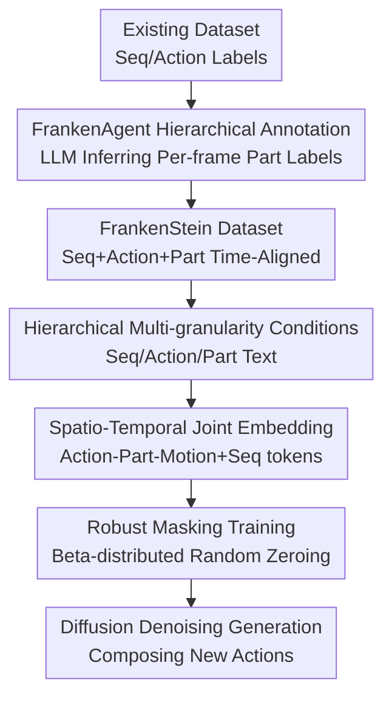

# FrankenMotion: Part-level Human Motion Generation and Composition

**Conference**: CVPR 2026  
**Paper**: [CVF Open Access](https://openaccess.thecvf.com/content/CVPR2026/html/Li_FrankenMotion_Part-level_Human_Motion_Generation_and_Composition_CVPR_2026_paper.html)  
**Code**: https://coral79.github.io/frankenmotion/ (Project page; code and data to be open-sourced after publication)  
**Area**: Human Understanding / Human Motion Generation  
**Keywords**: Human motion generation, part-level control, spatio-temporal composition, diffusion models, LLM annotation  

## TL;DR
Addressing the limitation where text-to-human motion generation only allows sequence or action-level control but lacks control over individual body parts, this paper first utilizes an LLM agent (FrankenAgent) to automatically label existing mocap datasets into a three-level, temporally aligned fine-grained dataset named FrankenStein (Sequence / Atomic Action / Body Part). Subsequently, a diffusion-based model called FrankenMotion is trained, driven by per-frame text prompts for each body part, enabling the composition of complex motions not seen during training (e.g., "raising the left arm while sitting").

## Background & Motivation
**Background**: Text-to-motion generation has progressed rapidly recently, with the mainstream approach using diffusion models to map a text description (e.g., "a person walks then sits down") into SMPL pose sequences. This relies on text-annotated mocap datasets such as HumanML3D, KIT-ML, and BABEL.

**Limitations of Prior Work**: Existing methods only provide control at the **sequence level** (entire sentence) or **action level** (atomic actions like walk/stand/knock), failing to control **specific body parts**. The root cause is the lack of part-level, temporally aligned annotations in datasets—BABEL only provides action labels like 'walk' or 'knock' without specifying what each part is doing. A few works incorporating part labels (e.g., FineMoGen) force all parts to share a fixed set of time windows, failing to represent **asynchronous** part movements like "the left arm and legs doing different things at different times."

**Key Challenge**: To achieve control that is precise to both part and time, it is essential to have **per-frame, per-part, and naturally temporally aligned** annotations. However, manual per-frame labeling for all body parts is prohibitively expensive.

**Goal**: (1) Create a three-level, temporally aligned, part-level annotated dataset at low cost; (2) Train a generation model that can simultaneously process sequence/action/part-level text and **compose** these atomic elements into new actions.

**Key Insight**: A key observation is that **high-level actions inherently contain part-level information, and LLMs are adept at reasoning it out**: "tying shoelaces" necessarily involves spine bending and hands knotting; "sitting down" involves knee bending. Thus, an LLM can be used to **infer** what each part is doing per frame from existing sequence/action annotations.

**Core Idea**: Composing complex motions as "atomic part movement elements + composition relations," using an LLM to automatically supplement part-level annotations, and applying a hierarchical conditional diffusion model to learn these atomic elements and their composition, thereby achieving fine-grained control and zero-shot composition.

## Method

### Overall Architecture
The method consists of two main components. **The first is the data**: FrankenAgent (an LLM agent) takes the sequence annotations $\hat{A}_s$ and atomic action annotations $\hat{A}_a$ from existing datasets to infer and output three-level, temporally aligned structured annotations $A=\{A_s, A_a, A_p\}$, where the part-level annotation $A_p$ is unique to this work. This automatically constructs FrankenStein, the largest part-level motion dataset to date. **The second is the model**: FrankenMotion is a transformer diffusion model that takes text prompts from three levels (sequence, action, part) and integrates them into a joint spatio-temporal latent space to predict clean motion sequences during the DDPM denoising process. A random masking strategy is used during training to handle the sparsity of part annotations. At inference, users can provide a single sentence, sparse part prompts, or edit existing control signals.

### Key Designs

**1. FrankenAgent: Inferring Per-frame Part Annotations from High-level Labels via LLM**

This step directly addresses the root pain point of lacking part-level data. A basic annotation element is defined as $a=(L, t_s, t_e)$, where the text label $L$ describes the motion segment during $[t_s, t_e]$. The goal is to obtain the three-level set $A=\{A_s, A_a, A_p\}$: the sequence level has one entry $A_s=\{(L_s, 0, T)\}$; atomic actions $A_a=\{(L_i, t_s^i, t_e^i)\}_{i=1}^N$ are $N$ contiguous, non-overlapping segments ($t_s^1=0$, $t_e^N=T$, $t_s^i=t_e^{i-1}$); part annotations $A_p=\{A_k\}_{k=1}^K$ provide a string of atomic segment annotations $A_k=\{(L_k^j, t_s^j, t_e^j)\}$ for $K$ predefined parts (head, left/right arms, left/right legs, spine, trajectory). FrankenAgent works as $A_p, A_a, A_s = \text{FrankenAgent}(\hat{A}_a, \hat{A}_s)$ (Eq. 1), using Deepseek-R1 as the backbone due to its long-context reasoning capabilities. Two key designs prevent overfitting and hallucinations: allowing labels to be **unknown** (as not every part needs labeling every frame, thus annotations are naturally **sparse**) and explicitly requiring temporal alignment, coverage of all parts, and decomposing complex actions into interpretable segments. Human evaluation shows a labeling accuracy of 93.08% and Gwet's AC1 = 0.91, indicating high reliability.

**2. Multi-granularity Hierarchical Conditioning: Driven by Seq + Action + Part Text Simultaneously**

This is the core for implementing fine-grained control in model inputs. The model uses a transformer diffusion framework. For a motion of $T$ frames, it accepts three levels of text: sequence-level $L_s=\{L_s\}$ (full description), action-level $L_a=\{L_a^j\}$ (action labels for $W$ non-overlapping windows), and part-level $L_p=\{L_k^i\}$ (prompts for part $k$ at frame $i$, the finest granularity). In a sample-prediction mode, the model $f_\theta$ predicts clean motion from noisy motion $x_\sigma^{[1...T]}$ and the three-level text: $\hat{x}_0^{[1...T]} = f_\theta(x_\sigma^{[1...T]}, \sigma, L_s, L_a, L_p)$ (Eq. 3). This design explicitly encodes "Motion = Atomic Part Elements + High-level Semantics"—part-level governs "specifically what a hand is doing," while action/sequence levels govern "what meaningful action these part combinations form," allowing the model to learn composition relations and generate unseen combinations (e.g., raising the left arm while sitting).

**3. Spatio-Temporal Joint Embedding: Aligning Heterogeneous Text into Per-frame Feature Space**

Since the three levels of text vary in granularity, dimension, and temporal range, they must be aligned. All text features are extracted using CLIP (ViT-B/32, frozen), and PCA is applied to action and part labels to reduce them to $D=50$, resulting in $F_a\in\mathbb{R}^{W\times D}$ and $F_p\in\mathbb{R}^{T\times(K\times D)}$. The critical alignment involves **expanding the embedding of each action window to the frame range it covers** to obtain $F_a\in\mathbb{R}^{T\times D}$, so each frame is associated with both part-level and action-level text features. These are concatenated into $F_{a+p}$, then concatenated with noisy motion and passed through an MLP to obtain per-frame motion-text fusion features $F_{a+p+m}\in\mathbb{R}^{T\times D_{m+t}}$. Sequence-level text is separately encoded via CLIP+MLP into a global vector $F_s$ and appended as an **additional token**, alongside the diffusion timestep embedding. The final input size is $\mathbb{R}^{(T+2)\times D_{m+t}}$. Thus, per-frame details use frame tokens while global semantics use additional tokens, enabling joint encoding in the same latent space.

**4. Beta Distribution Random Masking: Robustness to Sparse and Incomplete Part Conditions**

As part annotations are naturally sparse (many frames/parts are unknown) and users might provide only a few part prompts during inference, the model must function correctly with "incomplete conditions." Unknown text features are first **zeroed out** to form a sparse condition. Furthermore, for **labeled** part text $L_k^i$, it is randomly zeroed with probability $p$, where $p\sim\text{Beta}(5r, 5(1-r))$ and $r$ is the target mask rate. Different $p$ values are sampled for each labeled part in every training step. This random masking simulates various "partial condition" scenarios during inference, significantly improving generalization and robustness under sparse supervision. The training objective is the standard DDPM regression loss $L=\mathbb{E}[\lVert f_\theta(x_\sigma^{[1...T]}, \sigma, c) - x_0\rVert_2^2]$ (Eq. 4), where $c=(L_s, L_a, L_p)$ represents the hierarchical text conditions.

### Loss & Training
Standard DDPM sample-prediction objective (Eq. 4). Cosine noise schedule, 100 diffusion steps; AdamW optimizer, learning rate $2\times10^{-4}$, batch size 32; frozen CLIP ViT-B/32 text encoder. The main model was trained for approximately 47.5 hours on a single H100, and each evaluation model was trained for about 16 hours on a single A100.

## Key Experimental Results

### Dataset Quality
50 motions were randomly sampled and evaluated by 3 experts for binary correctness of part/action/sequence labels. The average accuracy of FrankenAgent was **93.08%**, with an inter-annotator agreement Gwet's AC1 = **0.91** (highly reliable). The scale of FrankenStein is shown below; notably, it is the **only** dataset featuring both atomic action and part labels.

| Dataset | Seq Labels | Atomic Action Labels | Part Labels | Duration | Total Labels |
|--------|:---:|:---:|:---:|------|------|
| BABEL | ✓ | ✓ | ✗ | 43.5h | 91.4k |
| HumanML3D | ✓ | ✗ | ✗ | 28.6h | 44.9k |
| KIT-ML | ✓ | ✗ | ✗ | 11.2h | 6.3k |
| **FrankenStein (Ours)** | ✓ | ✓ | **✓** | 39.1h | **138.5k** (incl. 46.1k part, 28.8k new LLM-inferred labels) |

### Main Results
Baselines (STMC / DART / UniMotion) were adapted and retrained for this task on FrankenStein. Semantic correctness was measured using R-Precision (R@1/R@3) and M2T, while realism was measured using FID and Diversity.

| Method | Avg-part R@1 ↑ | Per-seq R@1 ↑ | Per-seq R@3 ↑ | Per-action FID ↓ | Per-seq FID ↓ |
|------|:---:|:---:|:---:|:---:|:---:|
| GT (Upper Bound) | 52.04 | 72.66 | 91.47 | 0.00 | 0.00 |
| STMC | 40.67 | 43.58 | 62.32 | 0.10 | 0.20 |
| DartControl | 38.67 | 54.28 | 76.95 | 0.14 | 0.28 |
| UniMotion | 45.72 | 62.66 | 82.08 | 0.05 | 0.08 |
| **FrankenMotion** | **47.21** | **65.27** | **85.62** | **0.04** | **0.06** |

FrankenMotion leads overall in semantic correctness and realism (lowest FID). Qualitatively: STMC follows part instructions but fails to compose coherent motions, with stiff transitions and ignored details like "turning"; DART suffers from error accumulation in autoregression, producing repetitive segments (repeatedly sitting and standing); UniMotion is generally realistic but lacks part structure and misses subtle movements (like turning).

### Ablation Study: Importance of Hierarchical Inputs
Hierarchical text conditions were incrementally added to observe the change in part-level generation quality (M2M = motion-to-motion consistency).

| Input Conditions | Avg-part R@3 ↑ | Avg-part M2M ↑ | FID ↓ |
|------|:---:|:---:|:---:|
| Part Only | 56.34 | 0.72 | 0.08 |
| Part + Action | 57.74 | 0.73 | 0.07 |
| Part + Action + Seq (Full) | **58.97** | **0.75** | **0.05** |

### Key Findings
- **Part-only text is already strong**: The M2T for part-only conditions is close to the GT upper bound, indicating the model's robust understanding of fine-grained part text—a direct benefit of the structured part condition design.
- **High-level semantics are "necessary icing on the cake"**: Progressively adding action and sequence-level text consistently improved part-level correctness (R@3 56.34 $\rightarrow$ 58.97) and realism (FID 0.08 $\rightarrow$ 0.05), verifying that hierarchical conditions are not redundant but inject "meaningful global context."
- **Composition Generalization**: The model can generate part combinations not seen in training (e.g., sitting and raising the left arm), confirming the "atomic elements + composition" modeling approach.

## Highlights & Insights
- **"Using LLM to extract hidden part info from high-level labels"** is the most clever move: It transforms the expensive per-frame part labeling problem into an LLM commonsense reasoning problem (sitting $\rightarrow$ knees bend). The use of the unknown mechanism controls hallucinations, achieving 93% accuracy for fine-grained data others lack. This paradigm of "augmenting existing datasets with structured labels via LLM" is transferable to many tasks lacking fine-grained labels.
- **Asynchronous Part Annotation + Expanding Action Windows to Frame Scale**: Unlike FineMoGen which forces parts to share fixed windows, Ours allows **asynchronous** part movements, closer to real motion. Temporal alignment via "expanding window embeddings to frames" is simple and effective.
- **Beta Distribution Random Masking**: A single random zeroing strategy simultaneously solves "annotation sparsity" and "incomplete conditions during inference," representing a reusable trick for sparse conditional generation.

## Limitations & Future Work
- **Ours Acknowledges**: Currently unable to generate minute-long sequences in a single forward pass; long-term temporal structure modeling is a future direction.
- **Personal Observation**: 
    1. Part labels are inferred by LLM rather than ground truth observations; a 7% error rate enters training as noise, which might amplify biases for extremely subtle or rare actions.
    2. Evaluation metrics depend on another set of pre-trained text-to-motion models (individual evaluators for part/action/seq), which might introduce circular dependency.
    3. Body parts are defined by 7 coarse segments (head/limbs/spine/trajectory); finer details like fingers or facial expressions are not covered.
- **Improvement Ideas**: Integrate autoregressive methods or segmental splicing with consistency constraints for long sequences; use a small amount of real part-level mocap for semi-supervised correction of LLM annotation noise.

## Related Work & Insights
- **vs. FineMoGen**: Both perform part-level generation, but FineMoGen uses stage-based annotations forcing shared windows, while Ours allows **asynchronous** part movements and per-frame alignment, offering higher flexibility.
- **vs. STMC**: STMC is a test-time post-processing method that stitches outputs from a pre-trained MDM, lacking end-to-end spatio-temporal reasoning and struggling with coherent action composition. Ours learns part composition end-to-end for more natural transitions.
- **vs. UniMotion**: UniMotion supports hierarchical control for sequence and frame-level (action) but **lacks part control**, easily missing subtle motions like turning. Ours explicitly adds structured part conditions for better fine-grained accuracy.
- **vs. DART**: DART is autoregressive and follows sequence-level text, prone to error accumulation and repetition. Ours uses non-autoregressive diffusion with hierarchical conditions for more stable modeling of the entire segment.

## Rating
- Novelty: ⭐⭐⭐⭐⭐ First work to provide atomic, time-aligned part-level annotations and support simultaneous spatial (part) + temporal (action) control.
- Experimental Thoroughness: ⭐⭐⭐⭐ Comprehensive main comparisons, ablations, and manual label evaluations, though lacking long-sequence and cross-dataset generalization.
- Writing Quality: ⭐⭐⭐⭐ Clear formal definitions of three-level annotations; well-explained pipeline via figures and text.
- Value: ⭐⭐⭐⭐⭐ Output of both dataset and model; the "LLM-supplemented structured annotation" paradigm is a driver for the controllable motion generation field.

<!-- RELATED:START -->

## Related Papers

- [\[CVPR 2026\] Multi-level Causal LLM-based Text-to-Motion Generation with Human Alignment (MoTiGA)](multi-level_causal_llm-based_text-to-motion_generation_with_human_alignment.md)
- [\[CVPR 2026\] ParTY: Part-Guidance for Expressive Text-to-Motion Synthesis](party_part-guidance_for_expressive_text-to-motion_synthesis.md)
- [\[CVPR 2026\] MoLingo: Motion-Language Alignment for Text-to-Human Motion Generation](molingo_motion-language_alignment_for_text-to-motion_generation.md)
- [\[CVPR 2026\] Towards Decompositional Human Motion Generation with Energy-Based Diffusion Models](towards_decompositional_human_motion_generation_with_energy-based_diffusion_mode.md)
- [\[CVPR 2026\] Stability-Driven Motion Generation for Object-Guided Human-Human Co-Manipulation](stability-driven_motion_generation_for_object-guided_human-human_co-manipulation.md)

<!-- RELATED:END -->
