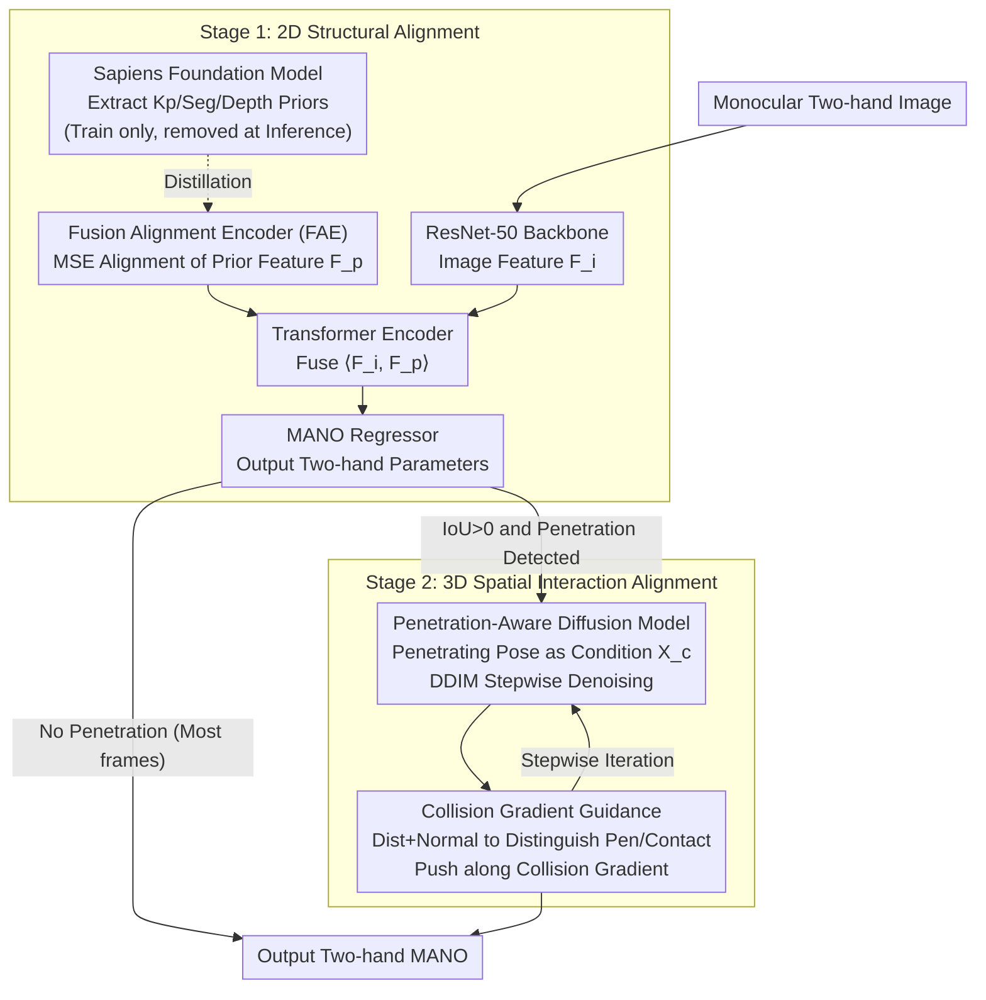

# A2P: From 2D Alignment to 3D Plausibility for Occlusion-Robust Two-Hand Reconstruction

**Conference**: CVPR 2026  
**arXiv**: [2503.17788](https://arxiv.org/abs/2503.17788)  
**Code**: [Project Page](https://gaogehan.github.io/A2P/)  
**Area**: Human Understanding / Hand Reconstruction  
**Keywords**: Two-hand reconstruction, fusion alignment encoder, penetration-free diffusion, MANO, Sapiens

## TL;DR

Ours decouples two-hand reconstruction into 2D structural alignment + 3D spatial interaction alignment: Stage 1 utilizes a Fusion Alignment Encoder to implicitly distill three 2D priors (keypoints, segmentation, depth) from Sapiens (foundation model-free during inference, 56fps). Stage 2 employs a penetration-aware diffusion model + collision gradient guidance to map penetrating poses to physically plausible configurations—achieving a reduction in MPJPE to 5.36mm on InterHand2.6M (surpassing the Prev. SOTA 4DHands by 2.13mm) and a 7x reduction in penetration volume.

## Background & Motivation

**Background**: Monocular 3D two-hand reconstruction is a critical capability for AR/VR, robotics, and character animation. Large-scale hand datasets (InterHand2.6M/Re:InterHand) have driven progress in methods based on data scaling, enhanced backbones, and attention-based hand relationship modeling (IntagHand/ACR/4DHands). Simultaneously, the effectiveness of 2D priors from foundation models (keypoints/segmentation/depth) and diffusion generative priors has been validated in human body reconstruction.

**Limitations of Prior Work**: (1) Existing two-hand methods (IntagHand/ACR/4DHands) lack explicit 2D-3D alignment mechanisms, leading to spatial inconsistency and unnatural interactions; (2) 2D cues are unreliable during mutual occlusion, causing frequent finger penetrations; (3) Direct application of foundation models (e.g., Sapiens with 1B parameters) is computationally expensive (3fps), and 2D-3D feature alignment for multi-task prediction is ambiguous; (4) Diffusion priors (InterHandGen) serve only as output regularizers and do not explicitly model 3D spatial interactions.

**Key Challenge**: 2D priors are unreliable in occluded regions $\rightarrow$ requiring augmentation from 3D interaction priors; however, 3D generative priors require accurate 2D alignment as anchors, otherwise they drift into implausible states. These two dependencies are mutually reliant yet individually limited.

**Goal**: (1) Utilize multi-modal 2D priors for structural alignment under efficient inference conditions; (2) Achieve physical plausibility in 3D spatial interactions (eliminate penetration) via generative models.

**Key Insight**: The problem is decoupled into two complementary stages—2D structural alignment (prior distillation to solve pose estimation under occlusion) and 3D spatial interaction alignment (conditional diffusion to solve physical penetration), addressing failures at the source through progressive correction.

**Core Idea**: Use the Sapiens foundation model to provide 2D prior guidance during training + replace it with a distilled small model for inference (18.7× speedup), and then employ conditional diffusion + collision gradient guidance to map penetrating poses to plausible configurations.

## Method

### Overall Architecture

A2P aims to solve the two most difficult failure types in monocular two-hand reconstruction: unreliable 2D cues during mutual occlusion leading to incorrect poses, and physically impossible configurations such as finger-to-finger penetration. The authors decouple this into two complementary stages, allowing each to focus on its strengths.

Stage 1 handles "2D Structural Alignment": ResNet-50 extracts image features $\mathbf{F}_i$. During training, the Sapiens foundation model extracts three 2D prior features (keypoints, segmentation, and depth) $\mathbf{F}_k, \mathbf{F}_s, \mathbf{F}_d$, which are fused into $\mathbf{F}_p$. A lightweight Fusion Alignment Encoder distills $\mathbf{F}_p$, allowing the Sapiens model to be discarded during inference. The dual features $\langle\mathbf{F}_i, \mathbf{F}_p\rangle$ are fused via a Transformer Encoder and fed into a MANO regressor to obtain two-hand parameters. Stage 2 handles "3D Spatial Interaction Alignment": This is activated only when the hand bounding box IoU > 0 and penetration is detected. The penetrating MANO parameters are treated as conditions for a diffusion model. During DDIM denoising, collision gradients push the pose toward a "non-penetrating" direction, outputting a physically plausible configuration. For most frames without penetration, Stage 2 is bypassed.

### Key Designs

**1. Fusion Alignment Encoder (FAE): Distilling Foundation Model 2D Priors into an Efficient Inference Model**

Using foundation models like Sapiens with 1B parameters directly as priors provides high accuracy but only at 3fps, making it impractical. A natural compromise is to use explicit foundation model predictions (coordinates, segmentation maps, depth maps) as additional inputs, but this allows prediction errors to cascade. FAE avoids explicit prediction: during training, Sapiens extracts three prior features, fused by a Projection layer into $\mathbf{F}_p = \text{Proj}(\mathbf{F}_k, \mathbf{F}_s, \mathbf{F}_d)$. Then, a ResNet-50 with only 52.6M parameters (FAE) uses MSE loss to align with $\mathbf{F}_p$, implicitly embedding foundation model structural knowledge. During inference, the Sapiens branch is removed, and FAE improves the frame rate from 3fps to 56fps (18.7× speedup) with only a 0.47mm increase in MRRPE. Its trade-off can be summarized as "foundation-level guidance without foundation-level cost"—distilling implicit features rather than explicit predictions preserves structural information while avoiding error cascades.

**2. Penetration-Aware Diffusion Model: Modeling "Penetration Correction" as a Conditional Generation Problem**

Incomplete 2D priors under occlusion often manifest as physical errors like finger penetration—a problem Stage 1 cannot solve. Prior works either treat diffusion as an output regularizer (InterHandGen) or extract interaction features via CNNs (Zuo et al.), but none directly model the "penetration $\rightarrow$ plausible" mapping. A2P uses a Transformer-based MDM-style diffusion process (1000 steps + cosine noise schedule) to explicitly learn this mapping. The key lies in data pair construction: on one hand, real penetrating poses from low-performance models are used as condition $\mathbf{X}_c$ with GT as target $\mathbf{X}_0$; on the other hand, clean GT MANO parameters are corrupted with noise until penetration occurs, forming (penetrating condition, plausible target) pairs. The denoising objective is to recover plausible poses from noisy inputs and penetrating conditions:

$$\mathcal{L}_{diffusion} = \|\mathbf{X}_0 - \mathcal{D}(\mathbf{X}_t, \mathbf{X}_c)\|_2$$

This makes the diffusion model "rehabilitation" rather than "generation from scratch." Stabilizing two-hand interaction reconstruction is significantly easier than sampling from zero, and because it only activates during IoU > 0 and detected penetration, it avoids overhead for most frames.

**3. Collision Gradient Guidance: Injecting Physical Constraints at Each Denoising Step**

Generative data distributions alone cannot guarantee zero penetration; explicit physical constraints are required during sampling. The challenge is distinguishing "penetration to be corrected" from "normal finger contact," as both involve close vertex distances. Collision gradient guidance uses a mixed distance-orientation criterion: after each DDIM step, the estimated $\hat{\mathbf{X}}_0$ is passed through MANO to obtain mesh vertices. First, distance between vertices of the two hands $\mathbf{N}_{ij} = |\mathbf{V}_{t-1}^i - \mathbf{V}_c^j|^2$ is used to find neighbor pairs where $\mathbf{N}_{ij} < d_{threshold}$. Then, the normal cosine similarity $\cos(\theta_{ij}) < \cos(\theta_{thre})$ is checked—opposite normals imply one hand has entered the interior of the other (penetration, needs correction), while similar normals suggest surfaces are naturally aligned (contact, should not be moved). Collision loss is calculated only for neighbor pairs classified as penetration and updated via GMoF robust function gradients:

$$\hat{\mathbf{X}}_0 = \hat{\mathbf{X}}_0 - \lambda \nabla \mathcal{L}_{collision}$$

GMoF suppresses outlier vertices, preventing single-point anomalies from dominating the gradient direction and making corrections smoother.

### Loss & Training

Stage 1: $\mathcal{L}_{total} = \mathcal{L}_{hand}$ (MANO parameters + 3D/2.5D joints L1) $+ \mathcal{L}_{prior}$ (MSE between FAE and fused priors). 4×A100, AdamW lr=1e-4 (dropped 10× at epoch 4), batch 48. Training data: InterHand2.6M + Re:InterHand + COCO + FreiHAND + HO-3D. Stage 2: L2 denoising loss, 1000-step cosine schedule.

## Key Experimental Results

### Main Results——InterHand2.6M (5fps test)

| Method | MRRPE↓ | MPJPE↓ | MPVPE↓ | IH MPJPE↓ | SH MPJPE↓ |
|------|--------|--------|--------|-----------|-----------|
| IntagHand | - | 9.95 | 10.29 | 10.27 | 9.67 |
| ACR | - | 8.09 | 8.29 | 9.08 | 6.85 |
| InterWild | 26.74 | 7.85 | 8.16 | 8.24 | 6.72 |
| InterHandGen | 25.42 | 7.50 | 7.78 | 8.13 | 6.47 |
| 4DHands | 24.58 | 7.49 | 7.72 | - | - |
| **Ours** | **21.60** | **5.36** | **5.58** | **5.93** | **4.84** |

### Ablation Study——Stepwise Module Addition (InterHand2.6M)

| Configuration | MRRPE↓ | MPJPE↓ | MPJPE-XY↓ | MPJPE-Z↓ |
|------|--------|--------|-----------|----------|
| Baseline | 25.30 | 7.77 | 5.21 | 4.54 |
| + Keypoint Prior | 24.71 | 6.48 (-1.29) | 4.28 | 4.43 |
| + Segmentation Prior | 24.52 | 6.19 (-0.29) | 4.21 | 4.40 |
| + Depth Prior | 22.38 | 5.74 (-0.45) | 4.13 | **3.37** |
| + Penetration Diffusion | **21.60** | **5.36** (-0.38) | **3.87** | **3.01** |

### Key Findings

- **Prior Complementarity**: Keypoints contribute the most (-1.29 MPJPE), depth priors primarily improve the Z-dimension (4.54→3.37), and segmentation priors provide reliable 2D silhouettes during occlusion.
- **Generalization**: On HIC in-the-wild data (not in the training set), Ours outperforms 4DHands (MPJPE 9.32→6.67mm).
- **Penetration Metrics**: PenVol 0.76→0.11 (7× reduction), PenDist 0.04→0.01; penetration elimination is highly effective.
- **FAE Efficiency**: 52.6M parameters (vs. 1B), 56fps (vs. 3fps), with only 0.47mm increase in MRRPE.

## Highlights & Insights

- **Foundation-level Guidance without Foundation-level Cost**: The FAE implicit distillation strategy serves as a practical solution, achieving an 18.7× speedup with nearly no loss in accuracy.
- **Diffusion for "Repair" rather than "Generation"**: Mapping penetrating poses to plausible poses is more stable than zero-shot sampling. Activating only upon IoU detection avoids unnecessary computational overhead.
- **Mixed Distance-Orientation Collision Criterion**: Distance-near + opposite-normals = penetration; distance-near + same-normals = normal contact. This design precisely distinguishes between penetration and contact, avoiding erroneous corrections.
- **Surpassing SOTA with Less Data**: 4DHands utilized 3 two-hand + 9 single-hand datasets; Ours achieves a 2.13mm lower MPJPE with fewer datasets, demonstrating the inherent effectiveness of the Method.

## Limitations & Future Work

- 2D priors are unreliable under motion blur, leading to degraded FAE features.
- Video temporal information is not utilized; combining with the spatio-temporal modeling of 4DHands is a potential direction.
- Diffusion inference still introduces overhead (even if triggered only by penetration), limiting real-time performance.
- Collision gradient guidance requires MANO mesh reconstruction and is not directly applicable to non-MANO representations (e.g., implicit hand models).

## Related Work & Insights

- **vs. 4DHands**: 4DHands uses RAT+SIR to model hand relationships but lacks explicit penetration handling. A2P uses diffusion to explicitly learn the penetration-to-plausible mapping.
- **vs. InterHandGen**: Diffusion is used only as regularization, resulting in insufficient penetration suppression (PenVol 0.76). A2P explicitly models conditional penetration removal + collision gradients (PenVol 0.11).
- **vs. Zuo et al.**: Uses CNN Encoders for interaction features but lacks strong geometric constraints. A2P diffusion operates directly in MANO parameter space.

## Rating

- Novelty: ⭐⭐⭐⭐ 2D prior distillation + two-stage penetration diffusion is a novel decoupled design.
- Experimental Thoroughness: ⭐⭐⭐⭐⭐ Comprehensive results on InterHand2.6M/HIC/FreiHAND + in-the-wild data.
- Writing Quality: ⭐⭐⭐⭐ Clear motivation and logically consistent pipeline.
- Value: ⭐⭐⭐⭐ Significant MPJPE reduction and penetration elimination provides practical value for interaction reconstruction.

<!-- RELATED:START -->

## Related Papers

- [\[CVPR 2026\] JUMP-Hand: Learning Joint-wise Uncertainty to Gate Mixture of View Experts for Multi-View 3D Hand Reconstruction](jump-hand_learning_joint-wise_uncertainty_to_gate_mixture_of_view_experts_for_mu.md)
- [\[CVPR 2026\] HandDreamer: Zero-Shot Text to 3D Hand Model Generation](handdreamer_zero_shot_text_to_3d_hand_model_generation.md)
- [\[CVPR 2025\] WiLoR: End-to-end 3D Hand Localization and Reconstruction in-the-wild](../../CVPR2025/human_understanding/wilor_end-to-end_3d_hand_localization_and_reconstruction_in-the-wild.md)
- [\[CVPR 2026\] SAM 3D Body: Robust Full-Body Human Mesh Recovery](sam_3d_body_robust_full-body_human_mesh_recovery.md)
- [\[CVPR 2026\] MGDHand: Multi-Granularity Prior-to-Inertial Distillation Framework for Sequential 3D Hand Pose Estimation from Sparse IMUs](mgdhand_multi-granularity_prior-to-inertial_distillation_framework_for_sequentia.md)

<!-- RELATED:END -->
