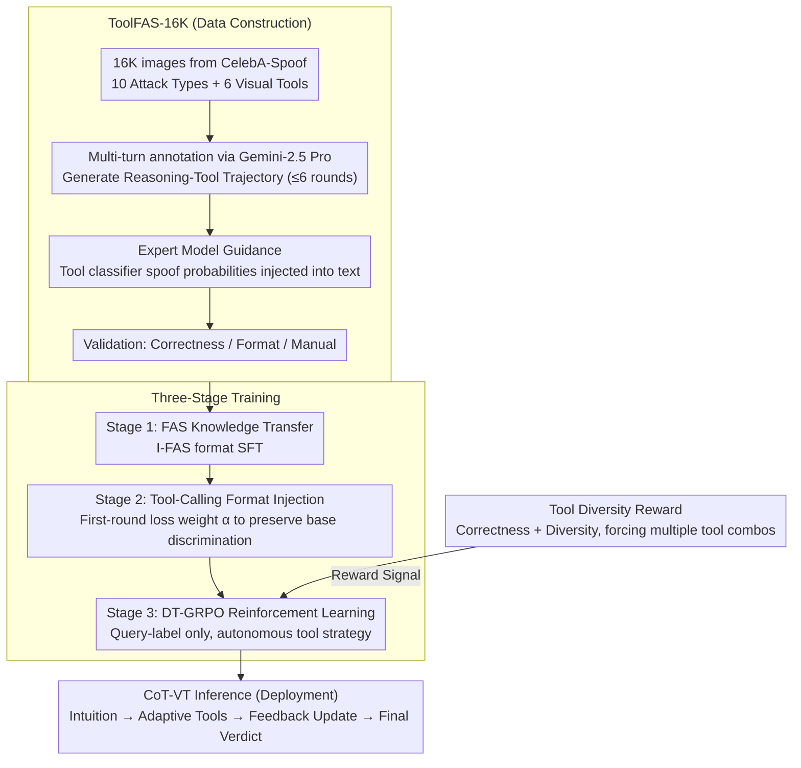

# From Intuition to Investigation: A Tool-Augmented Reasoning MLLM Framework for Generalizable Face Anti-Spoofing

**Conference**: CVPR 2026  
**arXiv**: [2603.01038](https://arxiv.org/abs/2103.01038)  
**Code**: None  
**Area**: Human Understanding  
**Keywords**: Face Anti-Spoofing, Multimodal Large Language Model, Tool-Augmented Reasoning, Chain-of-Thought, Reinforcement Learning

## TL;DR

The TAR-FAS framework is proposed, reconstructing the Face Anti-Spoofing (FAS) task into a Chain-of-Thought with Visual Tools (CoT-VT) paradigm for the first time. This allows MLLMs to adaptively invoke external visual tools (LBP/FFT/HOG, etc.) during reasoning, upgrading from "intuitive judgment" to "fine-grained investigation," achieving SOTA on the 1-to-11 cross-domain protocol.

## Background & Motivation

**Background**: Face recognition systems face spoofing attacks such as printed photos, video replay, and 3D masks. FAS technology is used to enhance system reliability. Early methods perform well in-domain but exhibit poor cross-domain generalization.

**Limitations of Prior Work**: Recent MLLM-based FAS methods (e.g., I-FAS) convert binary classification into text generation but only capture coarse-grained semantic cues (e.g., mask contours, screen borders), lacking perception of fine-grained visual patterns in high-quality fake samples.

**Key Challenge**: MLLMs suffer from "blindness to low-level visual features," whereas FAS relies precisely on these fine-grained features to distinguish real and fake faces. Brief text descriptions further exacerbate this problem.

**Goal**: How to guide MLLMs to perceive subtle spoofing cues that are easily overlooked?

**Key Insight**: Drawing from the success of traditional FAS methods—basic visual operators like LBP, HOG, and FFT have been proven effective in extracting fine-grained spoof features. These operators are embedded as "external tools" into the MLLM's CoT reasoning process.

**Core Idea**: Let the MLLM act like a detective, starting with an intuitive judgment and then conducting a deep investigation using tools—"From Intuition to Investigation."

## Method

### Overall Architecture

TAR-FAS transforms face anti-spoofing from a "conclude at a glance" process into a "suspect first, then gather evidence" process, which the authors call the CoT-VT (Chain-of-Thought with Visual Tools) paradigm. When a face image enters, the MLLM first provides an initial judgment based on intuition (e.g., "looks like a screen replay"). Instead of finishing, it adaptively calls external visual tools for "forensics": invoking FFT to check for moiré patterns if replay is suspected, LBP to see if skin texture is too uniform for printed photos, or Zoom-In and HOG to check edges and structure for 3D masks. Each tool's output is fed back into the context as text, and the model updates its judgment accordingly until a final verdict is reached. This reasoning chain itself provides interpretable evidence.

To enable a standard MLLM to behave like a "tool-using detective," the authors built a complete pipeline from data to reinforcement learning: first creating the ToolFAS-16K dataset with tool-calling trajectories, then using three-stage training to gradually instill "face understanding → tool-calling formats → autonomous tool-use strategies" into the model. Three key designs—ToolFAS-16K, three-stage training, and DT-GRPO tool diversity rewards—support the data, training flow, and RL strategy respectively.

### Key Designs

**1. ToolFAS-16K: Transforming traditional spoof operators into "forensic trajectories" for MLLMs**

The MLLM's weakness is its near "blindness" to low-level visual features, whereas traditional operators like LBP, FFT, and HOG excel at isolating these fine-grained spoof traces. Rather than forcing the model to learn them directly, the authors package these operators as tools and feed the model demonstration data on "when to call which tool and how to interpret results." The authors selected 16,172 images from CelebA-Spoof, covering real samples and 10 attack types, with 6 tools: Zoom-In (local magnification), LBP (texture analysis), FFT and Wavelet (frequency analysis), Laplacian Edge, and HOG (structural analysis). Annotations were generated by Gemini-2.5 Pro, producing a trajectory of $L$ rounds of "reasoning-tool use" for each sample (maximum $L^{max}=6$).

To ensure reliability, an expert model guidance step was added: a binary classifier $\mathcal{E}_k$ was trained for each tool to predict a spoof probability $p_k$, which was then translated into a text prompt (e.g., "FFT shows an 87% probability of spoof traces") and injected into the annotation. This serves as a "second opinion" to anchor the general model's interpretation. Finally, the data passed through correctness, format, and manual validation.

**2. Three-Stage Training: Learning faces, then tool formats, then autonomous strategies**

Direct reinforcement learning is impractical as the model initially lacks FAS knowledge and tool-calling formats. Training is split into three progressive steps. Stage 1 is FAS knowledge transfer, using I-FAS format data $\mathcal{D}_1$ for SFT to align vision and language and establish basic face concepts. Stage 2 is tool-calling format injection, training on ToolFAS-16K for multi-turn output formats. To prevent the basic classification ability from being diluted by long trajectories, a scaling factor $\alpha$ is applied to the first-round generation loss to maintain fundamental discrimination. Stage 3 is DT-GRPO (Diverse-Tool Group Relative Policy Optimization), where only query-label pairs are provided, and RL allows the model to explore efficient tool-use strategies autonomously.

**3. DT-GRPO Diversity Reward: Preventing reliance on "universal tools"**

If only correctness rewards are used in Stage 3, a "lazy solution" emerges: the model discovers one or two tools that work in most cases and ignores others, losing the complementary advantages of different tools and failing on attack types they don't cover. Thus, the authors added a tool diversity reward to the standard GRPO reward, encouraging the model to try different combinations of tools within a single trajectory. This results in a robust strategy where the model spontaneously chooses the most appropriate tool combinations for different attacks like 3D masks or screen replays.

### Loss & Training

- Stage 1: Standard auto-regressive cross-entropy loss $\mathcal{L}_1$
- Stage 2: Weighted combination of multi-round NLL loss: $\mathcal{L}_2 = \alpha \cdot \mathcal{L}_{nll}(0) + (1-\alpha) \cdot \sum_{l=1}^{L} \mathcal{L}_{nll}(l)$
- Stage 3: GRPO + Tool Diversity Reward

## Key Experimental Results

### Main Results (Protocol 2: One-to-Eleven Cross-Domain Testing)

Trained on CelebA-Spoof and tested across 11 datasets:

| Method | Avg. HTER(%) ↓ | Avg. AUC ↑ |
|------|---------------|-----------|
| ViTAF | 23.85 | 82.82 |
| ViT-L | 21.08 | 85.61 |
| FLIP | 18.73 | 87.90 |
| I-FAS | 11.30 | 93.71 |
| **TAR-FAS (Ours)** | **7.54** | **96.67** |

Compared to the Prev. SOTA I-FAS, HTER is reduced by 33% and AUC is improved by 3 percentage points.

### Detailed Results by Dataset

| Dataset | TAR-FAS HTER(%) | I-FAS HTER(%) | Gain |
|--------|----------------|---------------|------|
| CASIA-MFSD | **0.00** | 1.11 | Perfect Detection |
| HKBU-MARs | **3.48** | 18.64 | 81% Reduction |
| HiFiMask | **17.97** | 28.23 | 36% Reduction |
| CASIA-SURF-3DMask | **2.09** | 6.18 | 66% Reduction |

### Key Findings

- Improvements are most significant on difficult attacks like 3D masks (HiFiMask, HKBU-MARs), proving that tool-augmented reasoning is particularly effective for fine-grained spoof cues.
- The reasoning chains generated by TAR-FAS are highly interpretable, clearly showing the transition from "intuitive observation" to "tool investigation."
- DT-GRPO enables the model to autonomously learn efficient tool-use strategies without explicit tool-use labels.

## Highlights & Insights

- **Novelty**: For the first time, traditional FAS visual operators (LBP/FFT/HOG) are integrated as tools into an MLLM reasoning framework, cleverly combining the fine-grained perception of traditional methods with the reasoning generalization of MLLMs.
- **Mechanism**: Expert model guidance, loss scaling factors, and tool diversity rewards each target specific bottlenecks in training tool-using agents.
- **Value**: The reasoning chain provides not just a result but an investigation process, enhancing the trustworthiness of the FAS system.

## Limitations & Future Work

- The toolset is fixed at 6 types; future work could extend this to more tools or automatically discover effective ones.
- The annotation pipeline depends on commercial models (Gemini-2.5 Pro), which is costly.
- Inference time increases due to multi-round tool calling; real-time performance needs optimization.
- Validated only on FAS tasks; the CoT-VT paradigm could be extended to other fine-grained vision tasks.

## Related Work & Insights

- **I-FAS**: The first MLLM-based FAS method; this work introduces tool-augmented reasoning on its foundation.
- **ReAct / DeepEyes**: Pioneering work in tool-using MLLM agents; this work brings that paradigm to the FAS field.
- **GRPO**: Group Relative Policy Optimization proposed by DeepSeek; this work extends it to DT-GRPO.

## Rating

- Novelty: ⭐⭐⭐⭐⭐ First to introduce tool-augmented reasoning to FAS, innovative CoT-VT paradigm.
- Experimental Thoroughness: ⭐⭐⭐⭐ Comprehensive testing across 11 datasets, though lacks inference time analysis.
- Writing Quality: ⭐⭐⭐⭐ Clear and intuitive analogy from "intuition to investigation."
- Value: ⭐⭐⭐⭐⭐ Provides an excellent example of the MLLM + Domain Tools hybrid paradigm.

<!-- RELATED:START -->

## Related Papers

- [\[CVPR 2026\] FaceCoT: Chain-of-Thought Reasoning in MLLMs for Face Anti-Spoofing](facecot_cot_reasoning_face_anti_spoofing.md)
- [\[AAAI 2026\] PA-FAS: Towards Interpretable and Generalizable Multimodal Face Anti-Spoofing via Path-Augmented Reinforcement Learning](../../AAAI2026/human_understanding/pa-fas_towards_interpretable_and_generalizable_multimodal_face_anti-spoofing_via.md)
- [\[ECCV 2024\] TF-FAS: Twofold-Element Fine-Grained Semantic Guidance for Generalizable Face Anti-Spoofing](../../ECCV2024/human_understanding/tf-fas_twofold-element_fine-grained_semantic_guidance_for_generalizable_face_ant.md)
- [\[ICCV 2025\] DADM: Dual Alignment of Domain and Modality for Face Anti-Spoofing](../../ICCV2025/human_understanding/dadm_dual_alignment_of_domain_and_modality_for_face_anti-spoofing.md)
- [\[CVPR 2026\] rPPG-VQA: A Video Quality Assessment Framework for Unsupervised rPPG Training](rppg_vqa_video_quality_assessment.md)

<!-- RELATED:END -->
