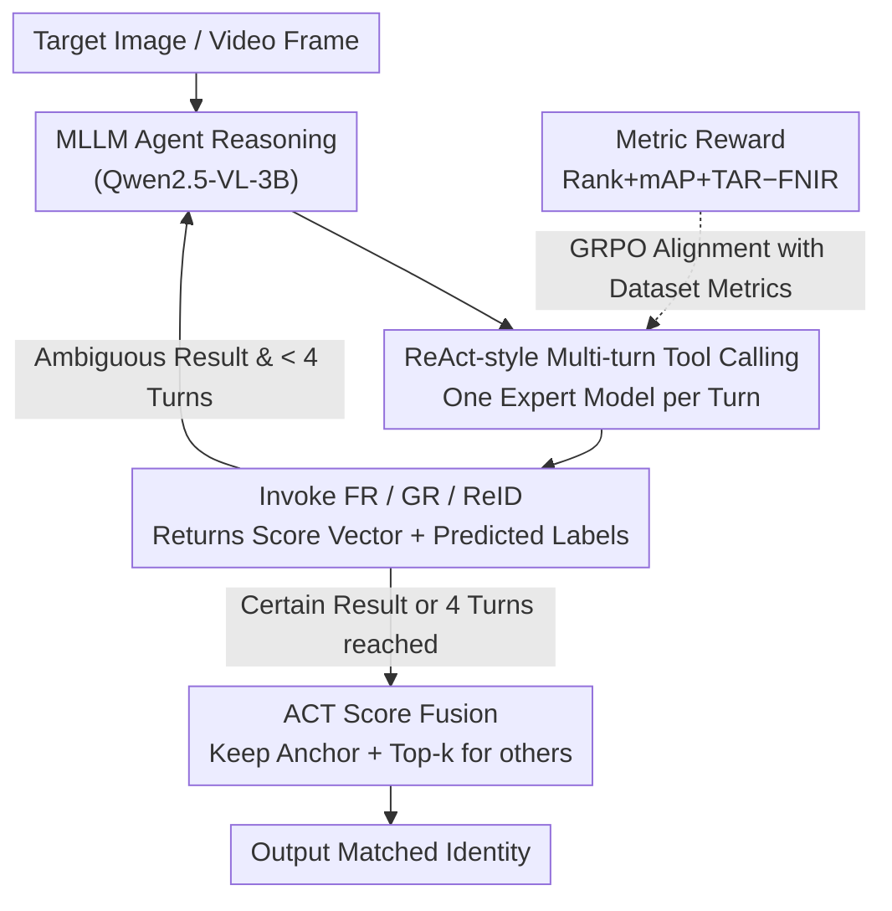

# FusionAgent: A Multimodal Agent with Dynamic Model Selection for Human Recognition

**Conference**: CVPR 2026  
**arXiv**: [2603.26908](https://arxiv.org/abs/2603.26908)  
**Code**: [https://github.com/FusionAgent](https://github.com/FusionAgent) (Project Page)  
**Area**: Human Understanding  
**Keywords**: Model Fusion, Multimodal Large Language Models, Dynamic Model Selection, Biometric Recognition, Reinforcement Learning Fine-Tuning

## TL;DR
This paper proposes FusionAgent, a Multimodal Large Language Model (MLLM) agent framework for dynamic sample-level model selection in whole-body biometric recognition. By encapsulating expert models (Face Recognition, Gait Recognition, Person Re-ID) as tools, the agent learns to adaptively select the optimal model combination for each test sample through Reinforcement Fine-Tuning (RFT). Combined with a novel ACT score fusion strategy, it significantly outperforms existing SOTA fusion methods.

## Background & Motivation

1. **Background**: Whole-body recognition requires integrating multiple biometric modalities, such as face, gait, and body shape. Expert models (FR/GR/ReID) excel in different scenarios and are typically integrated via score fusion. Existing fusion methods include rule-based approaches (Z-score, Min-max, etc.) and learning-based approaches (QME, etc.), yet they all employ a fixed model combination strategy—applying the same full set of models to every test sample.

2. **Limitations of Prior Work**: (1) Static fusion assumes all models contribute to every sample, whereas a face model provides no useful information for a subject facing away from the camera. (2) Scores from low-quality inputs can pollute fusion results; even with quality-aware methods (like QME), low-quality model scores still affect the final output. (3) Invoking all models for every sample is computationally inefficient and unnecessary.

3. **Key Challenge**: The optimal model combination is sample-dependent—inputs with varying quality, angles, and resolutions require different subsets of models. Using the full suite of models for all samples ignores computational waste and degrades fusion quality due to the introduction of low-quality scores.

4. **Goal**: (1) How to adaptively select the optimal subset of models for each sample? (2) How to effectively fuse heterogeneous scores from dynamically selected models?

5. **Key Insight**: Model selection is modeled as a tool-calling decision problem for an MLLM agent. The agent observes input sample features, performs reasoning, and decides which models to invoke, learning the optimal strategy via reinforcement learning from result feedback.

6. **Core Idea**: Use an MLLM agent for sample-level dynamic model selection, transforming the "which model to use" decision from manual rules into a learnable reasoning process. This is paired with Anchor-based Top-$k$ (ACT) score fusion for robust selective integration.

## Method

### Overall Architecture
FusionAgent addresses the specific problem of determining which biometric models (face, gait, or ReID) should be trusted for a given human image or video frame. Unlike previous methods that weighted and fused all expert scores, which often introduced noise (e.g., face scores from back-view images), FusionAgent allows an MLLM to determine "which models to call and how many."

The workflow is as follows: Each biometric model is encapsulated as a tool that returns a score vector and prediction labels for the gallery upon invocation. An agent based on Qwen2.5-VL-3B receives multimodal inputs and performs iterative reasoning in a ReAct style—evaluating sample features and intermediate results to decide the next model to call. Once sufficient confidence is reached or the step limit is met, the heterogeneous scores are integrated using the ACT fusion strategy. The agent is fine-tuned using GRPO, with a composite reward signal based on format, tool-call success, recognition accuracy, and dataset-level metrics.

### Key Designs

**1. ReAct-style Multi-turn Tool Calling: Breaking down model selection**

Predicting the optimal model combination directly is a combinatorial explosion problem—$Z$ models result in $2^Z$ possible subsets, making RL convergence difficult. FusionAgent adopts a ReAct (reason-then-act) controller: in each turn, the agent reasons based on the current sample and existing results, selects **one** model, receives its output, and decides whether to add another model or stop (up to 4 turns). This reduces learning complexity and makes decisions dependent on intermediate results—early stopping if the first model is certain, or additional calls if results are ambiguous.

**2. Metric-based Reward: Aligning the agent with dataset-level metrics**

Biometric indicators such as TAR@FAR and FNIR@FPIR are **threshold-dependent** and meaningful only when calculated across an entire dataset. Per-sample accuracy does not fully reflect these metrics. Beyond per-sample accuracy, FusionAgent uses a dataset-level reward: for each query, $N=6$ rollouts are sampled to obtain model combinations $M_{o_i}$. Using this as a baseline, $\gamma=0.8$ of sample combinations are kept stable while 20% are explored. The resulting scores are fused via ACT to compute integrated metrics over the training set:

$$R_{mat} = \text{Rank} + \text{mAP} + \text{TAR} - \text{FNIR}$$

This reward ensures the agent learns a strategy that optimizes deployment metrics for the entire dataset rather than just individual sample correctness.

**3. ACT (Anchor-based Confidence Top-k) Score Fusion: Fusing heterogeneous dynamic scores**

Dynamic selection introduces a challenge: the set of selected models varies per sample, and their score scales differ. Simple summation is easily biased by scale and low-confidence noise. ACT utilizes an "Anchor + Sparse Contribution" approach: the **first** model selected by the agent is the anchor model $m_a$, and its entire score vector is preserved as the baseline for global ranking. Other selected models are Z-score normalized, and only the contributions of the top-$k$ scores are retained:

$$c_{m,q,g} = \begin{cases} z_{m,q,g} \cdot s_{m,q,g}, & g \in \mathcal{T}_{m,q} \\ 0, & \text{otherwise}\end{cases}$$

The final fused score is:

$$\mathbf{s}_q' = \frac{1}{1 + |\mathbf{M}_q|}\Big(\mathbf{s}_{m_a,q} + \sum_{m \in \mathbf{M}_q} \mathbf{c}_{m,q}\Big)$$

The top-$k$ filter prevents non-matching gallery individuals (impostors) from erroneously raising their fused rank due to high scores from a single weak model, ensuring auxiliary models only contribute where they are most confident.

### Loss & Training
- Optimization via GRPO with a composite reward $R = R_f + R_{tool} + R_{acc} + R_{mat}$.
- Base model: Qwen2.5-VL-3B with LoRA (rank=64, α=128).
- Learning rate $2 \times 10^{-5}$ (linear decay), KL coefficient $\beta = 0.04$.
- Trained for 200 steps on 4x H100 GPUs, taking approximately 4 hours.
- Biometric model weights are frozen during training.

## Key Experimental Results

### Main Results — CCVID Dataset

| Method | Rank1↑ | mAP↑ | TAR↑ | FNIR↓ |
|------|--------|------|------|-------|
| AdaFace (Single) | 94.0 | 87.9 | 75.7 | 13.0±3.5 |
| Z-score | 92.2 | 90.6 | 73.9 | 15.1±1.5 |
| QME (Prev. SOTA) | **94.1** | 90.8 | 76.2 | 12.3±1.4 |
| **FusionAgent (CoT)** | 93.4 | **92.6** | **85.9** | **10.1±1.5** |

TAR improved from 76.2% to 85.9% (+9.7%), and FNIR decreased from 12.3% to 10.1%.

### Main Results — LTCC Dataset

| Method | Rank1↑ | mAP↑ | TAR↑ | FNIR↓ |
|------|--------|------|------|-------|
| QME | 73.8 | 39.6 | 35.0 | 64.3±8.0 |
| **FusionAgent (CoT)** | **75.5** | **41.0** | **37.0** | **50.0±8.5** |

FNIR decreased from 64.3% to 50.0% (-14.3%), showing massive gains in open-set search performance.

### Ablation Study

| Configuration | Rank1 | mAP | TAR | FNIR |
|------|-------|-----|-----|------|
| QME (baseline) | 73.8 | 39.6 | 35.0 | 64.3 |
| Agent + Z-score | 74.8 | **41.7** | **37.1** | 63.7 |
| Agent + FarSight | 74.8 | **41.7** | **37.2** | 62.5 |
| Agent + ACT (Ours) | **75.5** | 41.4 | 36.5 | **51.0** |

- Agent selection combined with any fusion method outperforms QME, proving dynamic selection is key.
- ACT provides the largest gain in FNIR (-11.5%) due to effective impostor score suppression via top-$k$ filtering.

### Key Findings
- **Dynamic model selection is the primary driver of performance**: Even with simple Z-score fusion, agent-based selection outperforms QME.
- **Hard selection (using all models) is inferior to dynamic selection**: Proves that "using more models ≠ better"; selective fusion is crucial.
- **FNIR benefits most**: In open-set search, impostor noise is effectively controlled by top-$k$ filtering.
- **Cross-domain Generalization**: Zero-shot performance on LTCC after training on MEVID remains close to in-domain performance.

## Highlights & Insights
- **Redefining model fusion as an agent tool-use problem**: This framework elevates score fusion research. Instead of designing complex formulas, the AI decides which models to use and how to integrate them.
- **ReAct Multi-turn Design**: Decomposes the $2^Z$ search space into sequential steps, making RL feasible and allowing strategy adjustment based on intermediate results.
- **Metric-based Reward Design**: Intelligently encodes dataset-level evaluation metrics (TAR@FAR, FNIR@FPIR) into RL signals, allowing the agent to optimize for global deployment criteria.
- **Interpretability via CoT Reasoning**: Chain-of-Thought reasoning explains model choices (e.g., "Clear frontal face detected, selecting face recognition model as anchor"), enhancing system trust.

## Limitations & Future Work
- Inference speed is relatively slow (2.81s/sample in CoT mode) due to the Qwen2.5-VL-3B backbone, limiting real-time use.
- The 3B model has limited reasoning capacity; larger MLLMs might yield better selection strategies.
- The toolset is currently fixed; generalizing to new tools requires retraining the agent.
- ACT's top-$k$ hyperparameter requires tuning and may vary across datasets.

## Related Work & Insights
- **vs. QME**: QME uses quality-aware weighting but retains all models. FusionAgent outperforms it by selecting subsets, suggesting "which model to use" is more critical than "what weight to assign."
- **vs. Traditional score fusion**: Adding an agent to simple fusion methods (Z-score) allows them to exceed complex learned methods, indicating selection is the current bottleneck.
- **vs. SapiensID**: Unlike end-to-end multimodal models, FusionAgent maintains modularity and interpretability through its agentic framework.

## Rating
- Novelty: ⭐⭐⭐⭐ Introducing MLLM agents to model selection/fusion is novel; metric reward design is creative.
- Experimental Thoroughness: ⭐⭐⭐⭐⭐ Three datasets, multiple baselines, extensive ablation, cross-domain evaluation, and statistical analysis.
- Writing Quality: ⭐⭐⭐⭐ Clear problem modeling and framework, though some formulas could be more concise.
- Value: ⭐⭐⭐⭐ The agent + tool-use paradigm is inspiring for multi-model fusion and selection across different domains.

<!-- RELATED:START -->

## Related Papers

- [\[CVPR 2026\] A Two-Stage Dual-Modality Model for Facial Expression Recognition](a_two_stage_dual_modality_model_for_facial_expression_recognition.md)
- [\[CVPR 2026\] Dynamic Label Noise Suppression with Optimal Teacher Pool for Facial Expression Recognition](dynamic_label_noise_suppression_with_optimal_teacher_pool_for_facial_expression_.md)
- [\[CVPR 2026\] M4Human: A Large-Scale Multimodal mmWave Radar Benchmark for Human Mesh Reconstruction](m4human_a_large-scale_multimodal_mmwave_radar_benchmark_for_human_mesh_reconstru.md)
- [\[CVPR 2026\] HUMAPS-4D: A Multimodal Dataset for HUman Motion Analysis with Physiological and Semantic informations](humaps-4d_a_multimodal_dataset_for_human_motion_analysis_with_physiological_and_.md)
- [\[ICCV 2025\] EgoAgent: A Joint Predictive Agent Model in Egocentric Worlds](../../ICCV2025/human_understanding/egoagent_a_joint_predictive_agent_model_in_egocentric_worlds.md)

<!-- RELATED:END -->
