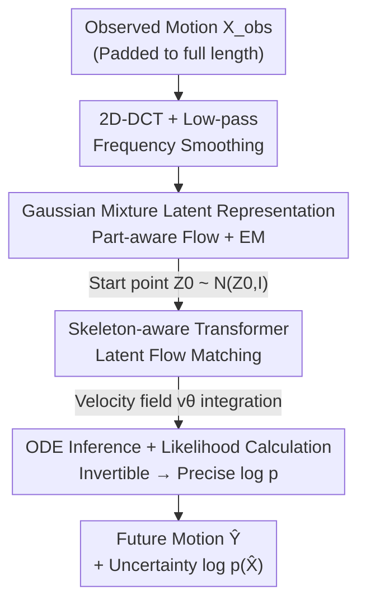

# Gaussian-Mixture Latent Flow for Stochastic 3D Human Motion Prediction

**Conference**: CVPR 2026  
**Paper**: [CVF Open Access](https://openaccess.thecvf.com/content/CVPR2026/html/Ma_Gaussian-Mixture_Latent_Flow_for_Stochastic_3D_Human_Motion_Prediction_CVPR_2026_paper.html)  
**Code**: Undisclosed  
**Area**: Human Understanding / Stochastic Human Motion Prediction  
**Keywords**: Stochastic Motion Prediction, Normalizing Flows, Flow Matching, Gaussian Mixture Prior, Uncertainty Quantification  

## TL;DR
To address the long-standing issues in stochastic human motion prediction—sacrificing plausibility for accuracy and diversity and the inability to reliably quantify uncertainty—this paper learns a data-driven Gaussian Mixture Prior via EM in the latent space to decouple different motion modes. It then employs a fully invertible Latent Flow Matching (integrated with a skeleton-aware Transformer) for prediction. This approach enables both precise log-likelihood for uncertainty measurement and SOTA accuracy and plausibility on Human3.6M and AMASS.

## Background & Motivation
**Background**: Human Motion Prediction (HMP) aims to predict future motion from observed 3D pose frames. Early methods treated this as a regression problem, predicting only a single "most likely" future, ignoring the inherent multimodality of human motion (e.g., a history can lead to walking, sitting, or turning). Recent mainstream research has shifted to **stochastic prediction**, using deep generative models like VAEs and diffusion models to learn the distribution of future movements. The goal has expanded from "accuracy" to "accuracy + diversity + plausibility," ideally providing the uncertainty of each prediction.

**Limitations of Prior Work**: The authors identify two overlooked flaws. First, **plausibility is sacrificed**, leading to physically impossible poses (e.g., joint angles exceeding physiological limits). This is rooted in the use of a **unimodal prior** (like the standard Gaussian in VAEs) for multimodal human behavior, which causes "semantic entanglement" between distinct actions like "walking" and "sitting." Second, **uncertainty modeling is insufficient**. VAEs and diffusion models only provide the Variational Lower Bound (VLB), which is an approximate likelihood and an unreliable metric for safety-sensitive scenarios like autonomous driving or human-robot collaboration.

**Key Challenge**: There is a structural mismatch between the representational capacity of unimodal priors and the multimodal nature of human motion. Furthermore, generative frameworks used for accuracy (SDE Diffusion, VAE) are often **non-invertible or have intractable likelihoods**, making it difficult to achieve both high-quality sampling and exact likelihood estimation.

**Goal**: (1) Decouple motion modes in the latent space using a data-driven multimodal prior to improve plausibility; (2) Utilize a fully invertible, likelihood-tractable model so that uncertainty can be directly read from precise log-likelihoods.

**Key Insight**: The authors observe that normalizing flows and Flow Matching naturally satisfy "invertibility + tractable likelihood," filling the gap left by diffusion/VAE models. Meanwhile, Gaussian Mixture Models (GMM) are inherently multimodal; if the mixture distribution can be learned in the latent space, behavioral modes can be separated.

**Core Idea**: An **unsupervised Gaussian Mixture Prior is learned via EM** in the latent space to decouple multimodal motion, followed by **Latent Flow Matching (ODE) and a skeleton-aware Transformer** for prediction. The invertible architecture allows for exact log-likelihood calculation, unifying "accuracy + plausibility + quantifiable uncertainty" into a single framework. This is the first Latent Flow Matching method for HMP.

## Method

### Overall Architecture
The proposed method is a **two-phase framework**: first **constructing the latent space**, then **learning the dynamics** within it.

In Phase One (Latent Space Construction), a part-aware flow model serves as the latent backbone (the same invertible model acts as the encoder forward and decoder backward). Motion sequences are projected to the frequency domain via 2D-DCT and low-pass filtered to encourage continuous motion, then mapped to latent variables $\mathbf{Z}=f_\theta(\mathbf{X})$. Simultaneously, the **EM algorithm** fits the target latent distribution to a $K$-component Gaussian mixture $q_z(\mathbf{Z})=\sum_i \beta_i \mathcal{N}(\boldsymbol{\mu}_i, \boldsymbol{\sigma}_i)$. This ensures different behaviors fall into different sub-Gaussians, achieving decoupling without action labels.

In Phase Two (Latent Space Prediction), the observed sequence $\mathbf{X}_{obs}$ is padded to full length using the last frame and encoded to find the starting point $\mathbf{Z}_0$. Then, **Flow Matching** learns a velocity field $v_\theta$ to transport the distribution $p_{\mathbf{Z}_0}=\mathcal{N}(\mathbf{Z}_0, \mathbf{I})$ along a straight ODE path to the latent code $\mathbf{Z}_1$ corresponding to the ground truth future. The velocity field is implemented by a **skeleton-aware Transformer** (using joint-wise temporal trajectories as tokens). During inference, an ODE solver integrates from a sampled $\hat{\mathbf{Z}}_0$ to $\hat{\mathbf{Z}}_1$, followed by flow decoding to motion $\hat{\mathbf{X}}$, accumulating the **precise log-likelihood** $\log p(\hat{\mathbf{X}})$ as an uncertainty measure.

### Key Designs

**1. Data-driven Gaussian Mixture Latent Prior: Decoupling Multimodal Behaviors via EM**

This design addresses the issue where unimodal priors blend distinct behaviors. Instead of a standard Gaussian, the latent distribution is modeled as a mixture of $K$ Gaussian components $q_z(\mathbf{Z})=\sum_{i=1}^{K}\beta_i\mathcal{N}(\boldsymbol{\mu}_i,\boldsymbol{\sigma}_i)$, jointly optimized with the flow model via EM. In the E-step, posterior responsibility is calculated for each sequence: $q(i\mid\mathbf{Z})=\frac{\beta_i\mathcal{N}(f_\theta(\mathbf{X})\mid\boldsymbol{\mu}_i,\boldsymbol{\sigma}_i)}{\sum_j \beta_j\mathcal{N}(f_\theta(\mathbf{X})\mid\boldsymbol{\mu}_j,\boldsymbol{\sigma}_j)}$. Note that the Jacobian determinant $|\det(\partial f_\theta/\partial\mathbf{X})|$ cancels out as it is common to all components. The M-step follows two paths: **soft assignment** (weighted by $q(i\mid\mathbf{Z})$) updates the parameters $(\boldsymbol{\mu}_i,\boldsymbol{\sigma}_i)$ and coefficients $\beta_i$; then, fixing the mixture, the flow parameters $\theta$ are updated using **hard assignment** (where only the component with the highest likelihood contributes to the gradient):

$$\sum_{i=1}^{K}\Big[\mathbb{I}(i)\log\Big(\mathcal{N}\big(f_\theta(\mathbf{X})\mid\boldsymbol{\mu}_i^{new},\boldsymbol{\sigma}_i^{new}\big)\,|\det(\tfrac{\partial f_\theta}{\partial\mathbf{X}})|\Big)\Big].$$

The distinction between soft and hard assignment is critical: hard assignment **prevents mode collapse**, which would otherwise collapse the mixture back into a single mode. Unlike related works (e.g., FlowGMM) that require labels, or MGF which uses fixed pre-clustering on 2D trajectories, this mixture is **learned during training**, capturing more meaningful motion semantics.

**2. Latent Flow Matching with Skeleton-aware Transformer: Linear ODE Transport between Latent Codes**

Flow Matching avoids expensive ODE integration during training but typically sacrifices spatial oversight in data space. The authors compensate for this with two features. First, prediction is redefined as transport between two distributions: a source $p_{\mathbf{Z}_0}=\mathcal{N}(\mathbf{Z}_0,\mathbf{I})$ (centered on observed encoding $\mathbf{Z}_0$ to preserve context) and a target $p_{\mathbf{Z}_1}=\delta(\mathbf{Z}_1)$ (ground truth future code). A velocity field is learned along the interpolation $\mathbf{Z}_t=t\mathbf{Z}_1+(1-t)\hat{\mathbf{Z}}_0$ with the objective $\mathbb{E}\,\Vert(\mathbf{Z}_1-\hat{\mathbf{Z}}_0)-v_\theta(\mathbf{Z}_t,t)\Vert_2^2$. Second, $v_\theta$ uses a **skeleton-aware Transformer** that employs **temporal tokenization (per-joint trajectories)**. This joint-wise attention explicitly models spatial dependencies within the skeleton. Observed $\mathbf{X}_{obs}$ is linearly embedded and **element-wise added** to $\mathbf{Z}_t$ as a conditional signal, ensuring history-future dependencies are explicitly modeled.

**3. Two-phase Precise Likelihood from Invertibility: Converting Uncertainty to Calculable Log-Likelihood**

Since the model is fully invertible, the log-likelihood can be **exactly** calculated in two parts. First, integrating $\hat{\mathbf{Z}}_0$ to $\hat{\mathbf{Z}}_1$ along $v_\theta$ using the instantaneous change of variables: $\log p(\hat{\mathbf{Z}}_1)=\log p(\hat{\mathbf{Z}}_0)+\int_0^1 -\mathrm{tr}\big(\nabla_{\mathbf{Z}_t}v_\theta(\mathbf{Z}_t,t)\big)\mathrm{d}t$. Second, mapping $\hat{\mathbf{Z}}_1$ back to motion space $\hat{\mathbf{X}}$ via the flow model, adding the Jacobian term $\log|\det(\partial\hat{\mathbf{X}}/\partial\hat{\mathbf{Z}}_1)|$. The authors emphasize that the **conditional likelihood given observed history** is the most faithful measure of uncertainty for decision-making.

### Loss & Training
The training target is driven by alternating updates: (1) EM updates for the mixture prior $q_z(\mathbf{Z})$; (2) Velocity field regression loss for Flow Matching. Inference uses an Euler solver with 100 steps. Poses are represented by exponential maps, with 2D-DCT preprocessing.

## Key Experimental Results

### Main Results
Evaluated on Human3.6M and AMASS against VAE, Diffusion, and parametric (Motron/ProbHMI) baselines using 50 samples per history (Best-of-50).

| Dataset | Method | ADE↓ | FDE↓ | CMD↓ | FID↓ | APD↑ |
|--------|------|------|------|------|------|------|
| Human3.6M | BeLFusion | 0.372 | 0.474 | 5.988 | 0.209 | 7.602 |
| Human3.6M | CoMusion | 0.350 | 0.458 | 3.202 | 0.102 | 7.632 |
| Human3.6M | SkeletonDiff | 0.344 | 0.450 | 4.178 | 0.123 | 7.249 |
| Human3.6M | **Ours** | **0.333** | **0.399** | **3.015** | **0.088** | 4.804 |
| AMASS | CoMusion | 0.494 | 0.547 | 9.636 | — | 10.848 |
| AMASS | SkeletonDiff | 0.480 | 0.545 | 11.417 | — | 9.456 |
| AMASS | **Ours** | **0.461** | **0.474** | **8.579** | — | 7.144 |

Ours achieves SOTA in ADE/FDE, with FDE improving by ~8.5% on Human3.6M and ~13% on AMASS. CMD/FID (plausibility) are also optimal. The lower APD (diversity) compared to diffusion is intentional; Ours prioritizes "efficient coverage" of the ground truth distribution over unrealistic random guesses.

### Ablation Study

| Configuration | H36M ADE↓ | H36M FDE↓ | H36M FID↓ | AMASS CMD↓ | Note |
|------|-----------|-----------|-----------|------------|------|
| Ours (Full) | 0.333 | 0.399 | 0.088 | 8.579 | GMM prior + History + Temporal token |
| w/ Fixed Gaussian | 0.336 | 0.407 | 0.133 | 9.583 | Pre-fixed mixture centers |
| w/ Standard Normal | 0.356 | 0.421 | 0.143 | 10.706 | Back to unimodal Gaussian |
| w/ FM Only | 0.341 | 0.408 | 0.156 | 12.563 | No latent space |
| w/o Past | 0.346 | 0.419 | 0.223 | 8.849 | Source distribution $\mathcal{N}(0,I)$ |
| w/o Condition | 0.352 | 0.417 | 0.118 | 8.981 | No observed condition |
| w/ Spatial Tokenization | 0.397 | 0.461 | 0.208 | 10.056 | Per-frame tokens |

### Key Findings
- **Multimodal priors are the primary source of plausibility**: Degrading from learned mixture to standard Gaussian significantly worsens FID/CMD.
- **Overly simple latent priors harm likelihood**: Single-mode Gaussian performs worse in LL (Log-Likelihood) than having no latent space at all, indicating that forced simple priors distort complex motion modeling.
- **History must be explicitly injected**: Both `w/o Past` and `w/o Condition` lead to drop in accuracy, validating the superiority of explicit conditioning over treating the task as reconstruction.
- **Joint-wise temporal tokenization is crucial**: Switching to spatial tokenization severely degrades accuracy and plausibility.

## Highlights & Insights
- **Likelihood as a First-class Citizen**: By choosing normalizing flows and Flow Matching, the model makes invertibility a structural property, allowing uncertainty to be precise rather than a VLB approximation.
- **Balanced Diversity vs. Plausibility**: The results show the model preserves diversity for flexible actions (dancing) while prioritizing plausibility for constrained actions (sitting).
- **EM for Unsupervised Decoupling**: The soft/hard assignment strategy in latent space provides a clean unsupervised solution to motion mode separation, avoiding reliance on labels.

## Limitations & Future Work
- The learned Gaussian Mixture Prior performs less effectively when applied to secondary tasks like classification due to the lack of label supervision.
- In long-tail distributions, the mixture may still collapse to the dominant mode; the authors suggest adding constraints to the assignment process.
- The method is conservative regarding history consistency; it may fail to capture sudden intention shifts ("black swan" events) not reflected in the immediate past.

## Related Work & Insights
- **vs. Unimodal VAEs (GSPS / STARS)**: These have high APD but poor FID/CMD due to unimodal priors. Ours trades some APD for significantly better plausibility and tractable likelihood.
- **vs. Latent Diffusion (BeLFusion / SkeletonDiff)**: These use SDE training with intractable likelihoods. Ours uses ODE Flow Matching for exact likelihood and explicit historical conditioning.
- **vs. Parametric Uncertainty (Motron)**: Motron uses concentrated Gaussian sampling on SO(3) but lacks constraints, leading to poor plausibility. Ours exceeds Motron in LL metrics.

## Rating
- Novelty: ⭐⭐⭐⭐⭐ 
- Experimental Thoroughness: ⭐⭐⭐⭐ 
- Writing Quality: ⭐⭐⭐⭐ 
- Value: ⭐⭐⭐⭐ 

<!-- RELATED:START -->

...

## Related Papers

- [\[CVPR 2026\] Unified Number-Free Text-to-Motion Generation Via Flow Matching](unified_number-free_text-to-motion_generation_via_flow_matching.md)
- [\[CVPR 2025\] Stochastic Human Motion Prediction with Memory of Action Transition and Action Characteristic](../../CVPR2025/human_understanding/stochastic_human_motion_prediction_with_memory_of_action_transition_and_action_c.md)
- [\[AAAI 2026\] Spatiotemporal-Untrammelled Mixture of Experts for Multi-Person Motion Prediction](../../AAAI2026/human_understanding/spatiotemporal-untrammelled_mixture_of_experts_for_multi-person_motion_predictio.md)
- [\[CVPR 2026\] Anatomical Domain Shifts: Test-time Heterogeneous Adaptation for 3D Human Pose Prediction](anatomical_domain_shifts_test-time_heterogeneous_adaptation_for_3d_human_pose_pr.md)
- [\[CVPR 2026\] FMPose3D: monocular 3D pose estimation via flow matching](fmpose3d_monocular_3d_pose_estimation_via_flow_matching.md)

<!-- RELATED:END -->
