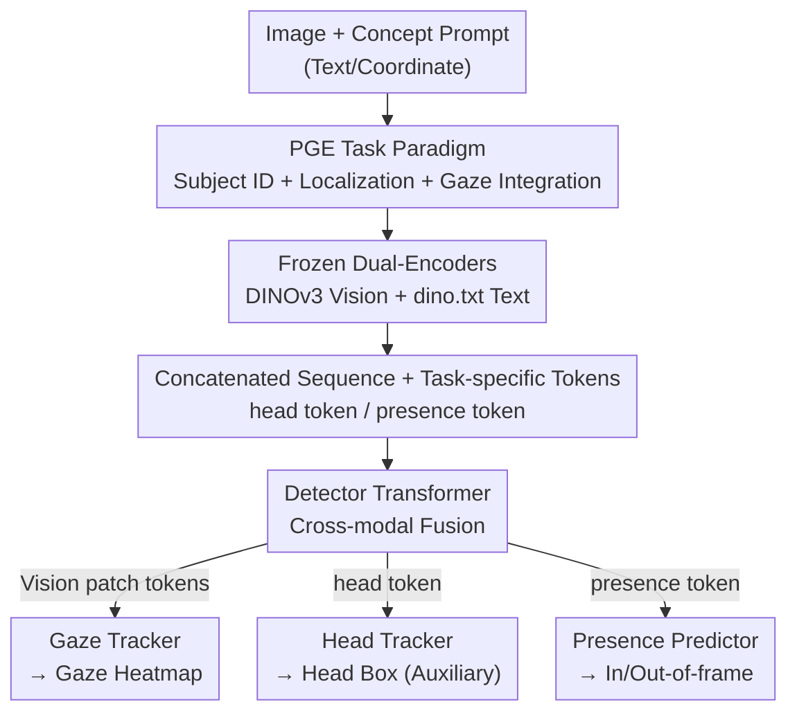

# Gaze Target Estimation Anywhere with Concepts

**Conference**: CVPR 2026  
**Paper**: [CVF Open Access](https://openaccess.thecvf.com/content/CVPR2026/html/Cao_Gaze_Target_Estimation_Anywhere_with_Concepts_CVPR_2026_paper.html)  
**Code**: https://github.com/IrohXu/GazeAnywhere (Available)  
**Area**: Human Understanding / Gaze Target Estimation  
**Keywords**: Gaze Target Estimation, Promptable Perception, Concept-driven, End-to-end, Visual Foundation Models  

## TL;DR
This paper introduces "Promptable Gaze Estimation (PGE)," a new task where a specific individual in a scene is designated via natural language or a coordinate, and the model directly produces a heatmap of their gaze location end-to-end. The authors provide the Gaze-Co dataset with 120K concept annotations and the first PGE model, GazeAnywhere, achieving SOTA across multiple benchmarks.

## Background & Motivation
**Background**: The mainstream approach for gaze-following (predicting where a person is looking in a scene) relies on multi-branch fusion architectures. These typically use specialized models to extract explicit cues (head boxes, human poses, depth maps) and then concatenate these features to regress the gaze point. Representative works such as Gaze-LLE, ViTGaze, and Sharingan depend on these intermediate representations.

**Limitations of Prior Work**: This pipeline relies heavily on priors like head/face bounding boxes during inference. In real-world scenarios (crowded scenes, poor lighting, or small faces of children that are difficult to detect), failures in the preliminary detection/tracking stage cause **cascaded** errors, leading to system failure. Furthermore, these models lack the flexibility for users to specify a specific subject for analysis; they are limited to analyzing individuals captured by the detector, or the end-to-end models cannot specify a particular subject at all.

**Key Challenge**: Gaze analysis is inherently a semantic task ("Where is that child in the red shirt looking?"), yet it has been converted into a rigid serial process of "precise localization followed by direction estimation." Localization becomes a bottleneck, even though it should not be a mandatory input.

**Goal**: Integrate "subject specification" and "gaze estimation" into a single **end-to-end task**, allowing users to specify a subject via natural language or a single point, thereby removing hard dependencies on head boxes or poses.

**Key Insight**: Open-vocabulary detectors (OVD) and the SAM series have demonstrated that vision systems can be driven by **concept-level** textual or visual prompts rather than predefined explicit localization cues. The authors transfer this "promptable" paradigm to gaze understanding.

**Core Idea**: Condition gaze prediction on a concept prompt (e.g., "a boy in a red shirt"), enabling a single model to implicitly perform subject identification, localization, and gaze estimation simultaneously, compressing a multi-stage pipeline into a single forward pass.

## Method

### Overall Architecture
The input to GazeAnywhere is an RGB image $I \in \mathbb{R}^{3\times H\times W}$ and a prompt $P$ (text or visual coordinates). The output is a gaze heatmap $\hat{H}\in\mathbb{R}^{H_{out}\times W_{out}}$, where $\hat{H}(i,j)$ represents the probability of the gaze location $(i,j)$ for the subject indicated by the prompt. The pipeline consists of one set of **frozen** dual-encoders, one **trainable** Detector Transformer, and three decoding heads, without any external detection, pose, or depth models.

Specifically, the frozen vision encoder (DINOv3) and text encoder (dino.txt) encode the image and prompt into tokens. Two projection layers map them into the same low-dimensional space $D$. The projected visual patch tokens, text tokens, and two specialized tokens (head token and presence token) are concatenated into a sequence and fed into the Detector Transformer for cross-modal fusion. Finally, three decoding heads extract the gaze heatmap, head box (auxiliary task), and in/out-of-frame binary classification from their respective tokens.

### Key Designs

**1. PGE Task Paradigm: Merging "Who" and "Where" into End-to-End Prediction**

This is the foundation of the paper, targeting the cascaded failures of multi-stage pipelines. Traditional methods require a head box to compute gaze; PGE redefines the task as producing a heatmap $\hat{H}$ directly given image $I$ and prompt $P$, fundamentally eliminating auxiliary inputs like bounding boxes, pose, or depth. Prompts are of two types: **textual prompts** using visually groundable noun phrases, and **visual prompts** providing spatial coordinates (e.g., head box center `[0.52, 0.48]`). To mitigate ambiguity in natural language (e.g., "the person in the back"), textual prompts are structured into four combinable fields: Appearance (identity + descriptors like hair color, clothing, glasses), Location, Pose, and Action. The model must implicitly learn the sequence of identifying, localizing, and estimating gaze without explicit outputs from external expert models.

**2. Frozen Dual-Encoder + Detector Transformer: Cross-modal Fusion with Foundation Model Features**

To align subject semantics with image content without dedicated localization models, the vision side uses a frozen ViT $\phi_V$ to extract patch tokens $\phi_V(I)=[c, s_1,\dots,s_{N_V}]$ (including a `[CLS]` token $c$). The text side uses a frozen encoder $\phi_T$ to map the `[EOS]` token into the image embedding space. Two trainable linear projections $W_V, W_T$ compress these into a shared low-dimensional space $D$: $Z_V = W_V\cdot\phi_V(I)$ and $Z_T = W_T\cdot\phi_T(T_E)$. The Detector Transformer $\psi$ reuses DINOv3 transformer blocks. The input is a single sequence $F=[t_h, t', s', t_p]\in\mathbb{R}^{(N_T+N_V+2)\times D}$ consisting of projected vision patch tokens $s'$, text tokens $t'$, and two task tokens. 1D sinusoidal positional encodings are added to text tokens and 2D to vision tokens. $\psi$ outputs a refined sequence distributed to the decoding heads. This lightweight configuration leverages VFM alignment while minimizing trainable parameters.

**3. Dual Task-specific Tokens: Decoupling Local Localization and Global Presence Inference**

Gaze estimation is a local task, but determining if the target is in the frame requires global context. The authors introduce two learnable tokens: the **Head Token** $t_h$ (initialized with the text `[EOS]` embedding, $t_h = t'_{eos}$) is responsible for explicit head box prediction as a supervision target for alignment. The **Target Presence Token** $t_p$ (initialized with vision `[CLS]` plus a learnable bias, $t_p = c' + E_{presence}$) performs binary classification for in/out-of-frame. After fusion via $\psi$, the head token passes through a 3-layer FFN to regress a 4D box $[x,y,w,h]$, the presence token passes through a 2-layer FFN for a logit, and the vision patch tokens are reshaped into a 2D grid and upsampled via transposed convolutions to a $64\times64$ heatmap.

**4. Gaze-Co Data Engine: Human-in-the-loop, MLLM-first Annotation Pipeline**

To address the lack of concept-annotated gaze datasets, the engine operates in three stages: **(1) Alignment and Filtering**: Unifying GazeFollow, VAT, and ChildPlay into a single schema and filtering via geometric/clarity thresholds (e.g., head width ≥30px, area ≥2500px²). **(2) Concept Generation**: Using Gemini 2.5 Pro to generate short concept phrases (appearance, location, action, pose, count). Appearance focuses on stable cues like hairstyle, glasses, and color. End terms are restricted to man/woman/boy/girl/infant/child for age/gender cues. **(3) Verification**: An MLLM reviews each concept (pass/fail), followed by human spot-checking. Consistency, completeness, and privacy are verified. Iterative prompt tuning continues until the error rate is ≤1%, resulting in 120K training samples.

### Loss & Training
The model is trained end-to-end using a weighted sum of three losses:

$$L_{total} = L_{gaze} + L_{presence} + L_{head}$$

- $L_{gaze}$: Pixel-wise BCE for the gaze heatmap, with the target being a 2D Gaussian ($\sigma=3$) at the ground-truth gaze point.
- $L_{presence}$: Focal Loss for in/out-of-frame classification.
- $L_{head}$: L1 + GIoU for the head box, $L_{head}=\lambda_{l1}\|b-\hat{b}\|_1 + \lambda_{iou}L_{iou}(b,\hat{b})$, with $\lambda_{l1}=5$ and $\lambda_{iou}=2$.

Training consists of 25 epochs (Adam + cosine, initial lr 1e-3, batch 128), followed by 5 epochs at lr 1e-5 using 4×H100 GPUs.

## Key Experimental Results

### Main Results
Baselines consist of three SOTA gaze models (Gaze-LLE / Sharingan / ViTGaze) paired with three OVDs (GroundingDINO / LLMDet / OWLv2 / RexSeek) in a two-stage pipeline. GazeAnywhere is a single end-to-end model.

| Model | Params | Latency/Sample (ms)↓ | GazeFollow Avg L2↓ | VAT L2↓ / AP↑ | ChildPlay L2↓ / AP↑ | Child-SC(OOD) L2↓ / AP↑ |
|------|--------|------|------|------|------|------|
| Gaze-LLE + RexSeek | 3B | 1183 | 0.108 | 0.121 / 0.861 | 0.119 / 0.914 | 0.172 / 0.846 |
| Gaze-LLE + OWLv2-L | 745M | 208 | 0.146 | 0.229 / 0.792 | 0.127 / 0.893 | 0.161 / 0.830 |
| Sharingan + RexSeek | 3B | 1159 | 0.207 | 0.273 / 0.601 | 0.178 / 0.863 | 0.166 / 0.810 |
| **GazeAnywhere-CLIP-L** | 430M | **35** | 0.105 | 0.137 / 0.874 | 0.104 / 0.915 | 0.146 / 0.868 |
| **GazeAnywhere-DINOv3-L** | 870M | 96 | **0.099** | **0.123 / 0.879** | 0.098 / 0.906 | **0.090 / 0.902** |

The DINOv3 version achieves SOTA results and significantly outperforms two-stage baselines on the challenging clinical OOD set (Child-SC). The CLIP-L version (430M params) achieves 35ms latency, offering a substantial speed advantage over large OVDs like RexSeek (>1100ms).

Compared to zero-shot general VLMs:

| Model | Params | GazeFollow Avg L2↓ | VAT L2↓ / AP↑ |
|------|------|------|------|
| Qwen3-VL-8B | 8B | 0.201 | 0.286 / 0.651 |
| Gemini 2.5 Flash | - | 0.216 | 0.292 / 0.661 |
| **GazeAnywhere-DINOv3-L** | 870M | **0.099** | **0.123 / 0.879** |

### Ablation Study

**Loss Term Ablation** (GazeFollow-Concept / VAT-Concept):

| $L_{gaze}$ | $L_{presence}$ | $L_{head}$ | GazeFollow Avg L2↓ | VAT L2↓ / AP↑ |
|:---:|:---:|:---:|------|------|
| ✓ | ✗ | ✗ | 0.102 | 0.135 / — |
| ✓ | ✓ | ✗ | 0.103 | 0.136 / 0.863 |
| ✓ | ✗ | ✓ | 0.099 | 0.128 / — |
| ✓ | ✓ | ✓ | **0.099** | **0.123 / 0.879** |

**Prompt Strategy Ablation** (VAT-Concept):

| Prompt Type | AUC↑ | L2↓ | AP↑ |
|------|------|------|------|
| No Prompt | 0.875 | 0.210 | 0.796 |
| Visual Prompt (Coords) | 0.914 | 0.131 | 0.894 |
| Text (Appearance Only) | 0.904 | 0.153 | 0.840 |
| Text (Location Only) | 0.893 | 0.188 | 0.826 |
| Text (All Fields) | **0.928** | **0.123** | 0.879 |

## Key Findings
- **Head auxiliary task is most significant**: Removing $L_{head}$ degrades VAT L2 from 0.123 to 0.136. It improves both gaze estimation and presence prediction. In contrast, presence loss primarily serves its own binary task with minimal impact on gaze.
- **Text prompts match visual prompts**: Using all four text fields (L2 0.123) is comparable to or better than visual point prompts (0.131). Appearance and pose are the most critical fields.
- **Encoder Choice**: DINOv3-L outperforms CLIP and SigLIP2, indicating its vision-text alignment is better suited for PGE.
- **OOD Robustness**: The model remains robust on unseen autism clinical videos (Child-SC).

## Highlights & Insights
- **Transferring Promptable Paradigm to Gaze**: Following the success of SAM/OVD, this work is the first to apply concept prompts to gaze-following, enabling subject specification within a single model.
- **Injecting Priors via Token Initialization**: Initializing the head token with text `[EOS]` and the presence token with vision `[CLS]` provides an effective semantic/global starting point for specialized tasks.
- **Latency Gain through End-to-End Design**: Eliminating external OVDs allows for 35ms processing (CLIP version), making real-time AR deployment feasible.
- **Reusable Data Engine**: The MLLM-first verification loop is a viable template for creating concept-annotated datasets for various human-centric vision tasks.

## Limitations & Future Work
- **Dependency on Structured Prompts**: The reliance on four fields to mitigate ambiguity may not fully cover free-form natural language expressions.
- **Dependency on Commercial MLLMs**: The Gaze-Co data engine relies on Gemini 2.5 Pro for generation, tying annotation quality to the commercial model's performance.
- **Single-frame Limitation**: The task is currently defined on single frames; temporal dynamics and gaze shifts in video are not explicitly modeled in the backbone.

## Related Work & Insights
- **Comparison with Gaze-LLE / Sharingan**: These rely on VFMs but require head boxes at inference time. GazeAnywhere absorbs subject specification internally, reducing forward pass latency.
- **Comparison with Two-stage OVD Pipelines**: Two-stage systems suffer from cascaded errors. GazeAnywhere's joint optimization shows clear advantages in OOD scenarios.
- **Comparison with General VLMs**: Generic VLMs lack specific gaze modeling, leading to over double the L2 error compared to PGE-specific models.

## Rating
- Novelty: ⭐⭐⭐⭐⭐ 
- Experimental Thoroughness: ⭐⭐⭐⭐⭐ 
- Writing Quality: ⭐⭐⭐⭐ 
- Value: ⭐⭐⭐⭐⭐ 

<!-- RELATED:START -->

## Related Papers

- [\[ICCV 2025\] Multi-view Gaze Target Estimation](../../ICCV2025/human_understanding/multi-view_gaze_target_estimation.md)
- [\[CVPR 2026\] GazeShift: Unsupervised Gaze Estimation and Dataset for VR](gazeshift_unsupervised_gaze_estimation_and_dataset_for_vr.md)
- [\[AAAI 2026\] Toward Gaze Target Detection in Young Autistic Children](../../AAAI2026/human_understanding/toward_gaze_target_detection_of_young_autistic_children.md)
- [\[CVPR 2026\] Render-to-Adapt: Unsupervised Personal Adaptation for Gaze Estimation](render-to-adapt_unsupervised_personal_adaptation_for_gaze_estimation.md)
- [\[CVPR 2026\] See Through the Noise: Improving Domain Generalization in Gaze Estimation](see_through_the_noise_improving_domain_generalization_in_gaze_estimation.md)

<!-- RELATED:END -->
