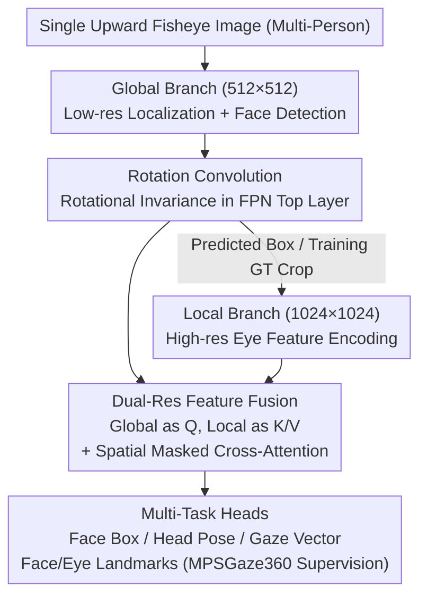

# GazeOnce360: Fisheye-Based 360° Multi-Person Gaze Estimation with Global-Local Feature Fusion

**Conference**: CVPR 2026  
**arXiv**: [2603.17161](https://arxiv.org/abs/2603.17161)  
**Code**: [https://caizhuojiang.github.io/GazeOnce360/](https://caizhuojiang.github.io/GazeOnce360/) (Project Page)  
**Area**: Human Understanding  
**Keywords**: Gaze estimation, Fisheye camera, Multi-person scenarios, Dual-resolution fusion, Synthetic data

## TL;DR
This paper proposes GazeOnce360, an end-to-end dual-resolution CNN model for 360° multi-person gaze estimation using a single upward-facing tabletop fisheye camera. It introduces MPSGaze360, the first large-scale synthetic dataset for this scenario, significantly surpassing the existing multi-stage method GAM360 in both accuracy and speed.

## Background & Motivation
**Background**: Gaze estimation is widely applied in human-computer interaction, collaboration analysis, and VR. While single-person gaze estimation is relatively mature (driven by datasets like MPIIGaze and ETH-XGaze), real-world scenarios often involve multiple people.

**Limitations of Prior Work**: (1) **Limited field of view (FOV) of front-facing cameras**, requiring multiple synchronized devices to cover all directions; (2) Existing attempts (e.g., GAM360) using fisheye cameras employ **multi-stage pipelines** (face detection → perspective projection → individual estimation), which are computationally expensive, prone to error accumulation, and may miss faces split at the boundaries of panoramic stitching.

**Key Insight**: An upward-facing fisheye camera naturally covers a 360° panorama, capturing all individuals with a single device. However, fisheye images exhibit **severe geometric distortion** and **perspective variation**, and there is a lack of public multi-person upward-facing fisheye gaze datasets. The authors address these issues through both data (synthetic dataset) and model (end-to-end dual-resolution architecture).

## Method

### Overall Architecture
**Mechanism**: GazeOnce360 aims to simultaneously estimate face bounding boxes, head poses, and gaze directions for multiple individuals in a single upward-facing fisheye image, avoiding the slow and error-prone "detect → project → estimate" multi-stage pipeline. The model feeds the image into two branches with different resolutions: the global branch processes the full fisheye image at a low resolution to locate people, detect faces, and provide spatial context, utilizing a rotation convolution layer to offset arbitrary face rotations. The local branch focuses on cropped face regions at high resolution to capture fine-grained eye features like the iris and pupil. Features from both branches are aligned and fused using cross-attention, followed by multi-task heads that regress bounding boxes, head poses, gaze vectors, and landmarks.

### Key Designs

**1. Rotation Convolution: Designing for Rotational Invariance**
**Design Motivation**: In upward-facing fisheye images, people at different positions appear rotated around the image center at various angles. Standard CNNs only possess translation invariance. Rotation convolution replicates a kernel into four orthogonal rotated versions (0°/90°/180°/270°) and weights their responses, encoding rotational invariance directly into the convolution. This is applied to the FPN top layers to handle high-level semantic features. Notably, the authors found that rotation convolution outperforms Deformable Convolution (DCN) (10.39° vs 11.05°), indicating that "rotation" is the primary challenge in fisheye distortion rather than general spatial deformation.

**2. Dual-Resolution Feature Fusion: Balancing Efficiency and Precision**
**Design Motivation**: Gaze direction depends on minute eye cues, requiring high resolution. However, processing the entire fisheye image at high resolution is computationally wasteful. This design splits the task: the global branch (512×512) extracts spatial layout and identifies human locations, while the local branch (1024×1024) specifically encodes cropped face regions. Features are fused via cross-attention with a spatial mask:

$$\text{Attention}(\mathbf{Q}, \mathbf{K}, \mathbf{V}) = \text{softmax}\!\left(\frac{\mathbf{QK}^T}{\sqrt{d_k}}\right)\mathbf{V}$$

This ensures the global position of one person does not incorrectly align with another person's eye features. This scheme achieves accuracy comparable to a full 1024 resolution model (8.968° vs 8.945°) while being 22% faster (16.23 vs 13.30 FPS).

**3. Multi-Task Supervision + MPSGaze360 Dataset**
**Novelty**: Obtaining precise pupil center labels for multiple people from an upward perspective in real life is nearly impossible. The authors used Unreal Engine 5 and MetaHuman to synthesize MPSGaze360, containing 23,496 fisheye images with 1–7 people and 69 character models. It provides 3D gaze vectors, 2D landmarks, face boxes, and 3D head poses. Eye landmark supervision proved to be the most significant contributor to gaze accuracy (reducing error from 12.14° to 8.89°), as it forces the network to explicitly locate the pupil.

### Loss & Training
Multi-task joint loss: $\mathcal{L} = \lambda_1\mathcal{L}_c + \lambda_2\mathcal{L}_b + \lambda_3\mathcal{L}_d + \lambda_4\mathcal{L}_h + \lambda_5\mathcal{L}_g + \lambda_6\mathcal{L}_{fl} + \lambda_7\mathcal{L}_{el}$, where $\mathcal{L}_c$ is the balanced cross-entropy classification loss and others are Smooth L1 losses. Trained for 150 epochs using Adam optimizer, initial lr=$10^{-3}$, with decay at 30 and 100 epochs.

## Key Experimental Results

### Main Results

| Method | Gaze Error (°) ↓ | Adjusted Gaze Error (°) ↓ | FPS ↑ |
|------|-------------|-------------------|-------|
| GAM360 (Multi-stage) | 18.96 | 18.76 | 4.23 |
| **GazeOnce360** | **10.39** | **9.99** | **16.23** |
| Gain | -8.57 | -8.77 | +12.00 |

### Ablation Study

| Configuration | Precision ↑ | Recall ↑ | Gaze Error (°) ↓ | FPS ↑ | Note |
|------|-------|-------|-------------|------|------|
| Baseline (No RotConv, No Landmarks) | 0.984 | 0.993 | 12.14 | — | Baseline |
| +RotConv | 0.992 | 0.993 | 11.14 | — | 1° Improvement |
| +RotConv+Eye Landmarks | 0.994 | 0.994 | **8.89** | — | Largest contribution |
| Single Res (512) | 0.996 | 0.992 | 16.50 | 20.49 | Poor accuracy |
| Single Res (1024) | 0.998 | 0.993 | 8.945 | 13.30 | High accuracy, slow |
| Dual Res (512+1024) | 0.999 | 0.993 | 8.968 | **16.23** | Best balance |

### Key Findings
- Eye landmark supervision is the most critical factor for gaze accuracy (26.8% reduction in error).
- Rotation convolution is superior to deformable convolution for fisheye distortion.
- The model generalizes well, with error increasing only slightly (8.945° to 10.39°) in cross-scene and cross-identity settings.
- Models trained on purely synthetic data produce reasonable gaze predictions on real fisheye images.

## Highlights & Insights
- **Value**: Establishes a valuable problem definition for 360° multi-person gaze estimation using a single tabletop camera, which is applicable to smart meeting rooms and service robots.
- **Efficiency**: The end-to-end approach nearly doubles accuracy and quadruples speed compared to multi-stage pipelines.
- **Data Strategy**: Well-designed synthetic data pipeline using UE5 MetaHuman and fisheye projection models.

## Limitations & Future Work
- Evaluation is currently limited to synthetic data; quantitative results on real-world datasets are missing.
- MPSGaze360 size is relatively limited (69 identities); diversity may not fully capture real-world complexity.
- Only the equidistant projection model was used; real lenses often vary.
- Eye resolution for distant individuals remains low, potentially limiting the effectiveness of high-resolution cropping.

## Related Work & Insights
- As a fisheye extension of GazeOnce, it inherits the anchor-based multi-task design.
- The success of rotation convolution in fisheye perception can be transferred to other tasks like object detection or segmentation in fisheye images.
- Validates the Sim-to-Real strategy for gaze tasks.

## Rating
- Novelty: ⭐⭐⭐⭐ (Novel problem definition, though components like RotConv and synthetic data are established.)
- Experimental Thoroughness: ⭐⭐⭐ (Lacks real-world quantitative comparisons and more baselines.)
- Writing Quality: ⭐⭐⭐⭐ (Clear structure, rich illustrations, and detailed dataset generation process.)
- Value: ⭐⭐⭐⭐ (First end-to-end solution for fisheye gaze estimation with practical utility.)

<!-- RELATED:START -->

## Related Papers

- [\[CVPR 2026\] Render-to-Adapt: Unsupervised Personal Adaptation for Gaze Estimation](render-to-adapt_unsupervised_personal_adaptation_for_gaze_estimation.md)
- [\[CVPR 2026\] See Through the Noise: Improving Domain Generalization in Gaze Estimation](see_through_the_noise_improving_domain_generalization_in_gaze_estimation.md)
- [\[CVPR 2026\] Pose-guided Enriched Feature Learning for Federated-by-camera Person Re-identification](pose-guided_enriched_feature_learning_for_federated-by-camera_person_re-identifi.md)
- [\[CVPR 2026\] Gaze Target Estimation Anywhere with Concepts](gaze_target_estimation_anywhere_with_concepts.md)
- [\[CVPR 2026\] MAMMA: Markerless Accurate Multi-person Motion Acquisition](mamma_markerless_accurate_multi-person_motion_acquisition.md)

<!-- RELATED:END -->
