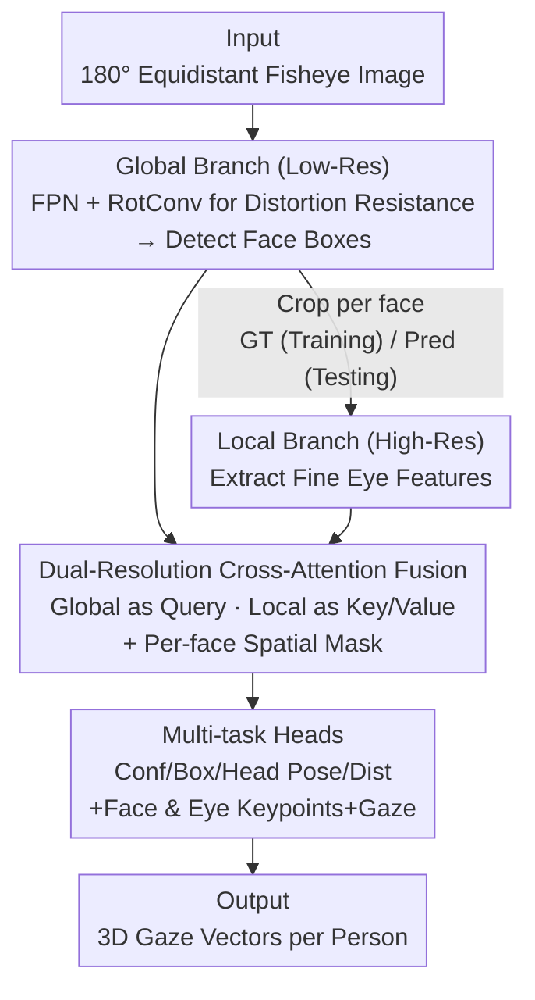

# GazeOnce360: Fisheye-Based 360° Multi-Person Gaze Estimation with Global-Local Feature Fusion

**Conference**: CVPR 2026  
**Paper**: [CVF Open Access](https://openaccess.thecvf.com/content/CVPR2026/html/Cai_GazeOnce360_Fisheye-Based_360deg_Multi-Person_Gaze_Estimation_with_Global-Local_Feature_Fusion_CVPR_2026_paper.html)  
**Code**: [Project Page](https://caizhuojiang.github.io/GazeOnce360/)  
**Area**: Human Understanding / Gaze Estimation  
**Keywords**: Multi-person gaze estimation, fisheye camera, rotational convolution, dual-resolution fusion, synthetic dataset

## TL;DR
Using a single upward-facing desktop fisheye camera to capture a 360° scene, GazeOnce360 employs rotational convolutions, eye keypoint supervision, and global-local dual-resolution cross-attention to simultaneously detect and regress 3D gaze directions for multiple people in an end-to-end manner. On the self-built synthetic dataset MPSGaze360, it reduces gaze error from 18.96° (multi-stage pipeline) to 10.39° while achieving a ~4x speedup.

## Background & Motivation

**Background**: Gaze estimation for a single person has matured over a decade with large-scale datasets (MPIIGaze, ETH-XGaze, Gaze360). Appearance-based regression methods provide robust 3D gaze under in-the-wild conditions. Real interaction scenarios often involve multiple people, naturally extending the problem to "multi-person gaze estimation."

**Limitations of Prior Work**: Most existing multi-person solutions rely on **front-facing cameras** with limited fields of view; covering a whole room requires multiple synchronized devices, making deployment cumbersome. A few works using "upward-facing fisheye" configurations (e.g., GAM360) follow a **multi-stage pipeline**: detecting faces in the fisheye image $\to$ projecting each face into a frontal perspective view $\to$ estimating gaze per person. This chain is slow, difficult to deploy, suffers from cumulative errors, and often fails to detect faces split across the boundary of panoramic projections.

**Key Challenge**: The upward fisheye setup introduces three unavoidable difficulties: ① **Severe geometric distortion** caused by the lens (extreme at the periphery); ② Large field-of-view renders faces as small regions, leading to massive **computational redundancy** in high-resolution background areas; ③ **No public datasets** exist for multi-person gaze in this specific upward-facing fisheye configuration. Multi-stage pipelines merely defer these challenges rather than solving them directly.

**Goal**: Design an **end-to-end** framework that directly predicts multi-person gaze from fisheye input, simultaneously addressing distortion robustness, computational efficiency, and fine-grained eye feature extraction, while providing the missing training data.

**Key Insight**: The authors observe that **high-frequency eye details** are crucial for gaze estimation, whereas high-resolution backgrounds are not; however, global scene structure is essential for disambiguating multi-person layouts. These should naturally be processed at different resolutions. Furthermore, fisheye distortion is essentially a variation in rotation, which should be handled by rotation-friendly convolutions rather than brute-force alignment.

**Core Idea**: Combine "Rotational Convolutions for distortion resistance + Eye Keypoint Supervision for fine-grained eye movement + Global Low-Res/Local High-Res Dual-Branch Cross-Attention Fusion" to compress the multi-stage pipeline into a single-stage end-to-end model, trained on the Unreal Engine-synthesized MPSGaze360 dataset.

## Method

### Overall Architecture

GazeOnce360 is essentially an **anchor-based CNN detector with rotational convolutions**, where the detection head is extended into a multi-task head and supplemented by a high-resolution local branch. The input is a 180° equidistant projection ($r = f \cdot \theta$) fisheye image $I \in \mathbb{R}^{H\times W\times 3}$, and the output is a set of 3D gaze vectors $\{g_i\}_{i=1}^N = F(I; \Theta)$ for all $N$ visible people, defined in the camera coordinate system.

The pipeline operates as follows: The **low-resolution global branch** uses an FPN to extract large-scale spatial context, with rotational convolutions at the top levels to resist fisheye distortion and detect face bounding boxes. For each detected region, the **high-resolution local branch** extracts face crops (using GT boxes during training and predicted boxes during testing) to capture fine eye features. Features from both branches are fused via **cross-attention** and fed into **multi-task heads** that simultaneously output confidence, bounding boxes, head poses, distances, face/eye keypoints, and gaze directions. The entire model is trained end-to-end.

### Key Designs

**1. Rotational Convolution (RotConv): Adapting Kernels to Extreme Fisheye Distortion**

In desktop fisheye images, faces appear around the periphery with varying orientations. Standard convolutions, having only translation invariance, cannot handle such large-angle rotations. The authors adopt Rotational Convolutions following Wei et al. [35]: a single kernel is **replicated into four rotated versions** at orthogonal orientations. The responses from these four kernels are aggregated via weighted averaging, making the network robust to the orientation changes introduced by the fisheye lens. This is applied only at the **top level of the FPN** (high-level semantic features). In ablations, adding RotConv alone reduced gaze error from 12.14° to 11.14°. Comparisons with Deformable Convolution (DCN) showed RotConv achieved lower error (10.39° vs 11.05°), indicating that **explicitly modeling rotational distortion** is more effective than generic spatial adaptation.

**2. Eye Keypoint Multi-task Supervision: Precise Geometry for Gaze Accuracy**

Gaze direction is extremely sensitive to eye geometry, but precise pupil/eye-center annotations are difficult to obtain in real-world data. Leveraging synthetic data with precise MetaHuman model coordinates, the authors use **eye keypoints (both eye centers + pupils)** as auxiliary supervision. The network outputs $\{y_c, y_b, y_d, y_h, y_g, y_{fl}, y_{el}\}$ (confidence, box, distance, head pose, gaze, face keypoints, eye keypoints). Keypoints serve as auxiliary signals to shape "spatially meaningful eye representations." Ablations show that adding eye keypoint supervision to RotConv further reduces gaze error from 11.14° to **8.89°**, the largest gain among all components. Interestingly, **adding both face and eye keypoints performed worse than eye keypoints alone** (8.945° vs 8.890°), as face keypoints primarily encode coarse head geometry which may introduce noise or conflicting signals.

**3. Dual-Resolution Feature Fusion: Global Context + Local Eye Details via Cross-Attention**

The large fisheye field-of-view means faces occupy small regions. Processing the entire image at high resolution is redundant, while looking at local crops loses global disambiguation info (like multi-person layouts). Two parallel ResNet-50 branches (shared architecture, independent parameters) handle this: the global branch processes a low-res image for layout and pose, while the local branch processes high-res face crops. For fusion, high-res features $F_h \in \mathbb{R}^{N\times H_h\times W_h\times C_h}$ are globally average-pooled into compact face descriptors $\bar{F}_h \in \mathbb{R}^{N\times C_h}$. The global features are flattened into a sequence $\tilde{F}_{l,s}$ with positional encodings. **Global features act as Query, while local face descriptors act as Key/Value** in cross-attention:

$$\text{Attention}(Q,K,V) = \text{softmax}\!\left(\frac{QK^\top}{\sqrt{d_k}}\right)V$$

Fusion uses residual aggregation $F_{\text{fuse},s} = F_{l,s} + M \odot \text{Attention}(Q,K,V)$, where $M$ is a **per-face spatial mask** that restricts attention to the global feature map region corresponding to that face. This injects high-res semantics only at face locations. This dual-resolution approach (512+1024) maintains accuracy (8.968° vs 8.945° for single 1024) while being **22% faster** in inference.

### Loss & Training

The model is optimized via a multi-task loss:

$$L = \lambda_1 L_c + \lambda_2 L_b + \lambda_3 L_d + \lambda_4 L_h + \lambda_5 L_g + \lambda_6 L_{fl} + \lambda_7 L_{el}$$

$L_c$ uses cross-entropy for balanced classification, while others (box, distance, head pose, gaze, keypoints) use Smooth L1 for positive samples. All weights are set to 1 in the main experiments. Training uses Adam with an initial learning rate of $10^{-3}$, decaying at epochs 30 and 100. It is trained for 150 epochs with a batch size of 9 on 3 RTX 2080 Ti GPUs.

### MPSGaze360 Dataset

To address the lack of data, the authors synthesized MPSGaze360 using UE5 + MetaHuman. It features randomized numbers of people, spatial arrangements, head/eye orientations, and eyelid closure. For each sample, **five orthogonal perspective views** are rendered and projected into a single 180° equidistant fisheye image. The dataset contains **23,496 images**, 1–7 faces per image, across 69 different meta-human models. Annotations include 3D gaze, 2D face/eye keypoints, bounding boxes, 3D head pose, and distance.

## Key Experimental Results

Experiments used MPSGaze360 (5,673 train / 804 test, 1024×1024). The metric is **Gaze Error (°)**, alongside detection precision/recall, distance error, head pose error, and FPS. **Adjusted Gaze Error** is reported for cross-method comparisons (calculated only on faces successfully detected by both methods).

### Main Results: Comparison with GAM360 (D2 Cross-Scene + Cross-Identity)

| Method | Gaze Error (°)↓ | Adjusted Gaze Error (°)↓ | FPS↑ |
|:---|:---:|:---:|:---:|
| GAM360 (Multi-stage) | 18.96 | 18.76 | 4.23 |
| **GazeOnce360 (Ours)** | **10.39** | **9.99** | **16.23** |

The end-to-end approach nearly halves the gaze error under the most difficult D2 setting and is ~4x faster, validating the avoidance of per-face projection.

### Ablation Study: RotConv and Keypoint Supervision

| Configuration | Prc.↑ | Rec.↑ | Dist(cm)↓ | Head pose(°)↓ | Gaze(°)↓ |
|:---|:---:|:---:|:---:|:---:|:---:|
| w/o RotConv, w/o ldmks | 0.9836 | 0.9927 | 3.486 | 5.010 | 12.14 |
| RotConv only | 0.9923 | 0.9934 | 3.422 | 4.150 | 11.14 |
| RotConv + Face Ldmks | 0.9888 | 0.9932 | 3.447 | 3.769 | 9.782 |
| RotConv + Eye Ldmks | 0.9936 | 0.9940 | 3.387 | 3.448 | **8.890** |
| RotConv + Face & Eye Ldmks| 0.9981 | 0.9933 | 3.390 | 3.411 | 8.945 |

### Ablation Study: Dual-Res vs. Single-Res

| Configuration | Gaze(°)↓ | FPS↑ | Note |
|:---|:---:|:---:|:---|
| Single (512) | 16.50 | 20.49 | Fast, but poor eye details |
| Single (1024) | 8.945 | 13.30 | Accurate but slow |
| **Dual (512,1024)** | 8.968 | **16.23** | Accuracy parity with 1024, +22% speed |

### Key Findings
- **Eye keypoint supervision is the most impactful component**: Adding it to RotConv dropped error from 11.14° to 8.89°, outperforming face keypoints. 
- **RotConv > DCN**: Under D2 settings, RotConv (10.39°) outperformed Deformable Convolution (11.05°), proving explicit rotation modeling is superior for fisheye distortion.
- **Robust Generalization**: Error rises modestly from standard split (8.945°) to cross-identity D1 (9.446°) and cross-scene D2 (10.39°); models trained on synthetic data show promising qualitative results on real fisheye images.

## Highlights & Insights
- **Smart Resolution Division**: Splitting gaze estimation into "low-res global for layout" and "high-res local for eye details" via masked cross-attention effectively eliminates redundant background computation. This trade-off can be applied to other tasks where targets are small but context-dependent.
- **Synthetic Data for Supervision**: Precise pupil/eye-center labels are nearly impossible to get in reality. UE5/MetaHuman provides "naturally precise coordinates," making them a powerful, noise-free auxiliary supervision signal—a significant advantage of synthetic data beyond mere quantity.
- **Breaking Cumulative Error via End-to-End**: By replacing the "detect-project-estimate" chain with a single network, the model avoids miss-detections from projection artifacts and minimizes error propagation, leading to substantial leads in both accuracy and speed.

## Limitations & Future Work
- Performance degrades for **extreme head poses** or people **far from the camera**. The framework relies heavily on synthetic training; though it generalizes qualitatively, the domain gap remains to be quantified.
- The dual-resolution fusion uses masks based on bounding boxes; **detection errors directly pollute the fusion**, as evidenced by the Adjusted Gaze Error metric.
- Future directions: Incorporating real-world semi-supervised data, data augmentation for occlusion, and extending RotConv to continuous angular adaptation.

## Related Work & Insights
- **vs GAM360 [8]**: GAM360 uses a multi-stage pipeline (detect $\to$ project $\to$ estimate), which is slow and prone to projection-induced failures. This work's end-to-end approach is faster and more accurate (D2 error 10.39° vs 18.96°).
- **vs GazeOnce [36]**: Both are anchor-based multi-person gaze detectors, but GazeOnce targets **perspective cameras**. This work introduces RotConv, dual-res fusion, and a UE5 fisheye dataset specifically for 360° scenarios.
- **vs Fisheye Unwrapping [14,25]**: Those methods unwrap fisheye images into multiple perspective views, introducing boundary artifacts. This work follows the "intrinsic compatibility" route, using rotation-equivariant convolutions directly on the fisheye domain.

## Rating
- Novelty: ⭐⭐⭐⭐ First end-to-end 360° multi-person gaze solution for upward fisheye cameras. Components are clever combinations of existing techniques for a specific problem.
- Experimental Thoroughness: ⭐⭐⭐ Ablations are comprehensive, but lacks quantitative evaluation on real-world fisheye data with ground truth.
- Writing Quality: ⭐⭐⭐⭐ Clear correspondence between motivation, challenges, and design.
- Value: ⭐⭐⭐⭐ High deployment value for collaborative spaces and robotics; the dataset is a valuable contribution to the field.

<!-- RELATED:START -->

## Related Papers

- [\[ECCV 2024\] Gaze Target Detection Based on Head-Local-Global Coordination](../../ECCV2024/human_understanding/gaze_target_detection_based_on_head-local-global_coordination.md)
- [\[CVPR 2026\] Pose-guided Enriched Feature Learning for Federated-by-camera Person Re-identification](pose-guided_enriched_feature_learning_for_federated-by-camera_person_re-identifi.md)
- [\[CVPR 2026\] MS^2Gait: A Multi-Scale Spatio-Temporal Fusion Network for LiDAR-based Gait Recognition](ms2gait_a_multi-scale_spatio-temporal_fusion_network_for_lidar-based_gait_recogn.md)
- [\[CVPR 2026\] Gaze Target Estimation Anywhere with Concepts](gaze_target_estimation_anywhere_with_concepts.md)
- [\[CVPR 2026\] MAMMA: Markerless Accurate Multi-person Motion Acquisition](mamma_markerless_accurate_multi-person_motion_acquisition.md)

<!-- RELATED:END -->
