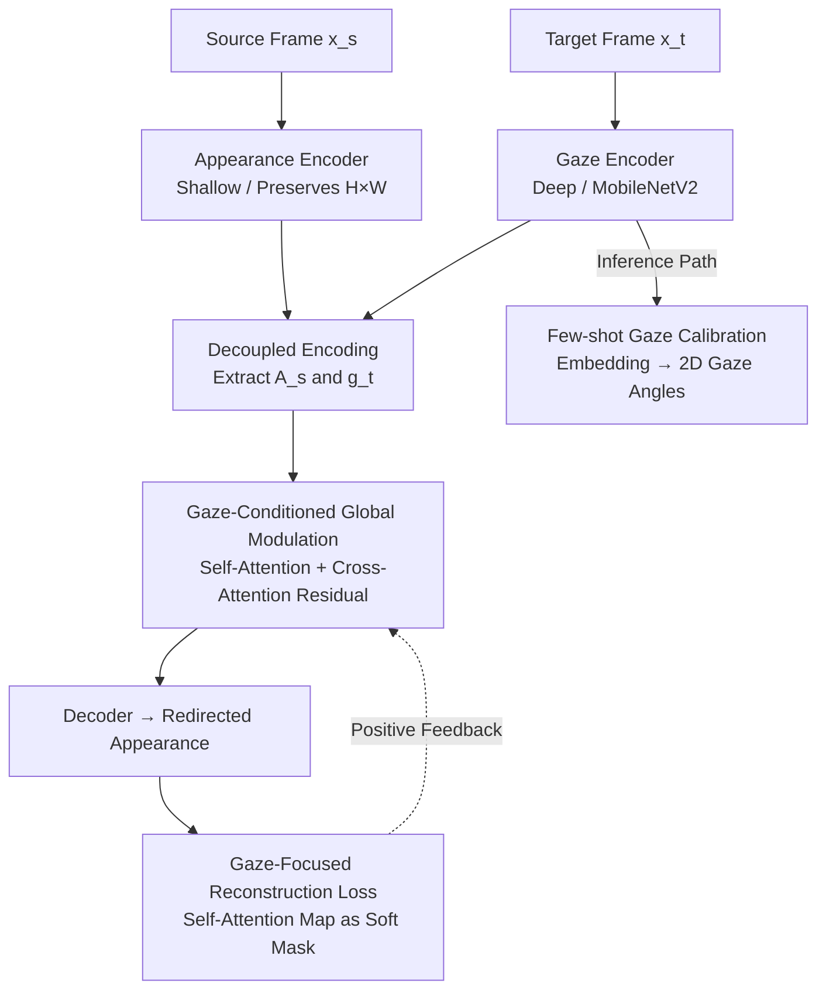

# GazeShift: Unsupervised Gaze Estimation and Dataset for VR

**Conference**: CVPR 2026  
**Paper**: [CVF Open Access](https://openaccess.thecvf.com/content/CVPR2026/html/Shapira_GazeShift_Unsupervised_Gaze_Estimation_and_Dataset_for_VR_CVPR_2026_paper.html)  
**Code**: https://github.com/gazeshift3/gazeshift (Available)  
**Area**: Human Understanding / Gaze Estimation  
**Keywords**: Unsupervised Gaze Estimation, VR Near-eye Imaging, Gaze Redirection, Cross-attention, Off-axis Dataset

## TL;DR
Addressing the dilemma of "off-axis near-eye IR cameras + no reliable labels" in VR headsets, this work releases VRGaze (68 subjects, 2.1M frames), the first large-scale off-axis gaze dataset. It proposes GazeShift, which uses "gaze redirection between two frames of the same eye" as an unsupervised proxy task. By decoupling gaze and appearance via standard cross-attention and using the model's own attention maps as soft masks to focus on the eye region, the model achieves a 1.84° error on VRGaze with only 342K parameters and 55 MFLOPs (5ms inference on headset GPUs), approaching supervised performance.

## Background & Motivation

**Background**: Gaze estimation is a core component for VR/XR (foveated rendering, hands-free interaction, adaptive content). To reduce field-of-view obstruction, modern headsets mount near-eye IR cameras obliquely at the corners, known as "off-axis" geometry, where the camera sees local single-eye images with significant perspective distortion.

**Limitations of Prior Work**: Supervised methods rely on large-scale precise labels, but gaze labels themselves are often unreliable—instructing subjects to fixate on targets does not guarantee true gaze due to blinks and involuntary saccades, making labeling both slow and error-prone. Furthermore, public datasets do not match VR scenarios: OpenEDS2020 is entirely "on-axis," NVGaze is mostly on-axis with a limited off-axis subset, and TEyeD mostly features non-VR environments with inaccurate labels.

**Key Challenge**: While unsupervised gaze learning has been explored, existing methods (e.g., Cross-Encoder, Yu & Odobez) are designed for **remote RGB cameras and full faces**. They rely on geometric priors, multi-view consistency, or complex warping fields, none of which generalize to the "single-eye, IR, off-axis" near-eye modality. Additionally, Cross-Encoder uses a shared encoder for both gaze and appearance, allowing the decoder to "peek" at target appearance information, leading to decoupling leakage.

**Goal**: (1) Fill the data gap for off-axis near-eye imaging; (2) Design an unsupervised framework that is free of gaze-specific modules, applicable to both near-eye and remote scenarios, and lightweight enough for headsets.

**Key Insight**: Head-mounted cameras naturally suppress variations in external lighting and camera position. Consequently, **gaze variation becomes the dominant source of appearance difference between different frames of the same eye**. If a model learns to "redirect the gaze of a source frame to that of a target frame," the conditional embedding used for redirection must be rich in gaze information.

**Core Idea**: Use "same-eye cross-temporal gaze redirection" as a proxy task. Implement gaze-appearance decoupling via standard cross-attention (instead of geometric warping), and use the model's self-attention maps as soft masks for the loss. This creates a positive feedback loop: more accurate attention → more focused reconstruction → more accurate attention.

## Method

### Overall Architecture
During training, GazeShift performs a generative proxy task: given a source frame $x_s$ and a target frame $x_t$ from the same eye of the same person, an **appearance encoder** extracts a spatial feature map $A_s \in \mathbb{R}^{H \times W \times C_a}$ from the source, while a **gaze encoder** extracts a non-spatial gaze embedding $g_t \in \mathbb{R}^{C_g}$ from the target. The decoder then "redirects" the source appearance to the target's gaze direction, supervised by a reconstruction loss. Since the training pairs come from the same eye, the frame difference is primarily gaze-related, forcing the model to compress gaze information into $g_t$.

During inference, the generative components are discarded—**only the gaze encoder is retained**. The embedding is passed through a lightweight calibration module (per-person linear regression for VR, shared MLP for remote) to map it to 2D gaze angles.

### Key Designs

**1. Decoupled Dual Encoders: Separate Properties via Architecture**

To address the leakage in Cross-Encoder's shared backbone, the authors observe that gaze and appearance are **fundamentally different**: gaze is abstract and non-spatial (2-3 scalar angles), requiring a **deep** encoder; appearance is concrete, spatial, and tied to local image structures, requiring a **shallow** encoder that preserves 2D structure. The architecture explicitly splits into two branches: $A_s = f_{app}(x_s)$ and $g_t = f_{gaze}(x_t)$. This asymmetric "deep gaze + shallow appearance" split reflects their nature and inherently promotes decoupling.

**2. Gaze-Conditioned Global Modulation: Global Querying without Destroying Structure**

To modulate $A_s$ with $g_t$ without disrupting spatial structure, the model first applies multi-head self-attention: $A_s' = \text{SelfAttn}(A_s)$. Then, $g_t$ is linearly projected to $C_a$ dimensions to serve as a **single global query** $q_g$. Using $A_s'$ as keys and values, cross-attention computes a gaze-conditioned global context vector:
$$c = \text{CrossAttn}(q_g, A_s', A_s') \in \mathbb{R}^{C_a}.$$
This vector $c$ is broadcast spatially to $C \in \mathbb{R}^{H \times W \times C_a}$ and added as a residual: $F = A_s' + C$. This acts as a feature-wise **global modulation**, shifting the latent representation toward the target gaze while maintaining spatial integrity. Crucially, the gaze embedding only influences the decoder through this "buffer layer," preventing appearance information from backflowing into the gaze representation.

**3. Gaze-Focused Reconstruction Loss: Self-Attention as a Soft Mask**

Standard redirection uses pixel-wise MSE, treating all pixels equally. This forces the gaze embedding to store irrelevant background details. Ours **resuses the model's own self-attention maps** as a soft mask. Since appearance changes are dominated by gaze, these maps naturally highlight gaze-related regions (around the iris). Given upsampled attention weights $w$ and a sharpening parameter $\gamma > 0$:
$$L_{focus} = \frac{1}{\sum_i w_i^{\gamma}} \sum_i w_i^{\gamma} (x_{t,i} - \hat{x}_{t,i})^2$$
where $i$ indexes pixels. $\gamma = 1$ is standard weighting; $\gamma > 1$ sharpens focus on the eye, while $\gamma < 1$ diffuses it. This coupling between attention and reconstruction fidelity creates positive feedback without extra regularization.

**4. Few-shot Gaze Calibration: Mapping Embeddings to Angles**

After unsupervised pre-training, the gaze encoder outputs latent embeddings. For VR, which requires high precision, **few-shot per-person calibration** is used: a linear regression fits a few labeled points to 2D angles. Per-person calibration is necessary because the kappa angle (offset between optical and visual axes) varies by individual. For remote scenarios, a small shared MLP is trained on 100–200 labeled samples across subjects.

### Loss & Training
The objective is the gaze-focused reconstruction loss $L_{focus}$. Training batches consist strictly of frame pairs from the same eye at different times. In VRGaze, the gaze encoder uses MobileNetV2 blocks to meet edge real-time constraints.

## Key Experimental Results

### Main Results

Comparison on VRGaze (off-axis VR) between supervised and unsupervised methods:

| Supervision | Method | Calibration | Mean Error [°] |
| :--- | :--- | :--- | :--- |
| Supervised | Appearance-Based | per-person | 1.54 |
| Supervised | Feature-Based | per-person | 3.2 |
| Unsupervised | VAE | per-person | 5.30 |
| Unsupervised | Cross-Encoder | per-person | 2.15 |
| Unsupervised | **GazeShift** | per-person | **1.84** |
| Unsupervised | Cross-Encoder | person-agnostic (K=200) | 2.26 |
| Unsupervised | **GazeShift** | person-agnostic (K=200) | **2.13** |

GazeShift (1.84°) closely approaches supervised appearance-based performance (1.54°) and significantly outperforms Cross-Encoder.

Remote Camera (MPIIGaze, unsupervised training on Columbia, cross-dataset 100-shot evaluation):

| Supervision | Method | Error [°] | Params | FLOPs |
| :--- | :--- | :--- | :--- | :--- |
| Supervised | ResNet-18 | 8.35 | 11M | 75M |
| Unsupervised | Cross-Encoder | 8.32 | 11M | 75M |
| Unsupervised | **GazeShift (MobileNetV2)** | **8.00** | **1M** | **2M** |
| Unsupervised | GazeShift (ResNet-18) | 7.56 | 11M | 75M |

The lightweight version outperforms Cross-Encoder with 35× fewer FLOPs and 10× fewer parameters.

### Ablation Study

| # | Dual Encoders | Attn Redirection | Focus Loss | Error [°] |
| :--- | :---: | :---: | :---: | :---: |
| 1 | × | × | × | 2.15 |
| 2 | ✓ | × | × | 2.10 |
| 3 | ✓ | ✓ | × | 2.07 |
| 4 | ✓ | ✓ | ✓ | **1.84** |

### Key Findings
- **Focus loss is the primary driver**: While separate encoders and cross-attention provide gains, the jump from 2.07° to 1.84° comes from the gaze-focused loss.
- **Off-axis data is indispensable**: Models trained on on-axis OpenEDS2020 show a 5.2° error on VRGaze, proving that on-axis models cannot capture off-axis geometric distortions.
- **Effective Decoupling**: Gaze embeddings remain stable under lighting/contrast perturbations (cosine distance 0.08) but change significantly with gaze direction (0.17).
- **Edge Deployment**: The 342K parameter gaze encoder runs in 5ms on the Xclipse 920 mobile GPU of an Exynos 2200.

## Highlights & Insights
- **Camera stability as a foundation**: The fact that head-mounted cameras suppress external variables makes the redirection proxy task viable. This suggests a generalizable strategy: when capture devices lock certain variables, self-supervised tasks can more cleanly extract the target factors.
- **Self-attention as feedback**: Using the model's internal attention to provide spatial supervision for the loss is an elegant, zero-cost mechanism for achieving spatial focus.
- **Cross-attention as a structural buffer**: Decoupling is achieved not just through objectives but through an architectural bottleneck that physically separates gaze and appearance paths.

## Limitations & Future Work
- **External Variations**: While valid for VR, the assumption that frame differences are dominated by gaze may struggle in AR/MR due to uncontrolled lighting, reflections, and eyelid movements.
- **Training Pair Selection**: The method relies on constructing frame pairs with low non-gaze variance. In truly "in-the-wild" data, this selection process remains a challenge.
- **Generalization**: There is still a performance gap in "person-agnostic" (zero-calibration) scenarios (2.13° vs 1.84°).

## Related Work & Insights
- **vs Cross-Encoder**: Addresses information leakage by replacing the shared backbone with separate encoders and a cross-attention "buffer," reducing error while significantly lowering compute requirements.
- **vs Yu & Odobez**: Replaces complex, non-differentiable geometric warping with standard attention modules, achieving better results with simpler components.
- **Dataset Contribution**: VRGaze fills the gap left by OpenEDS (on-axis) and NVGaze (limited off-axis) by providing a large-scale, high-fidelity off-axis near-eye IR dataset.

## Rating
- Novelty: ⭐⭐⭐⭐
- Experimental Thoroughness: ⭐⭐⭐⭐⭐
- Writing Quality: ⭐⭐⭐⭐
- Value: ⭐⭐⭐⭐⭐

<!-- RELATED:START -->

<!-- RELATED:END -->

## Related Papers

- [\[CVPR 2026\] Render-to-Adapt: Unsupervised Personal Adaptation for Gaze Estimation](render-to-adapt_unsupervised_personal_adaptation_for_gaze_estimation.md)
- [\[CVPR 2026\] Gaze Target Estimation Anywhere with Concepts](gaze_target_estimation_anywhere_with_concepts.md)
- [\[CVPR 2026\] HamiPose: Hamiltonian Optimization for Unsupervised Domain Adaptive Pose Estimation](hamipose_hamiltonian_optimization_for_unsupervised_domain_adaptive_pose_estimati.md)
- [\[CVPR 2026\] EgoPoseFormer v2: Accurate Egocentric Human Motion Estimation for AR/VR](egoposeformer_v2_accurate_egocentric_human_motion_estimation_for_arvr.md)
- [\[CVPR 2026\] See Through the Noise: Improving Domain Generalization in Gaze Estimation](see_through_the_noise_improving_domain_generalization_in_gaze_estimation.md)

<!-- RELATED:END -->
