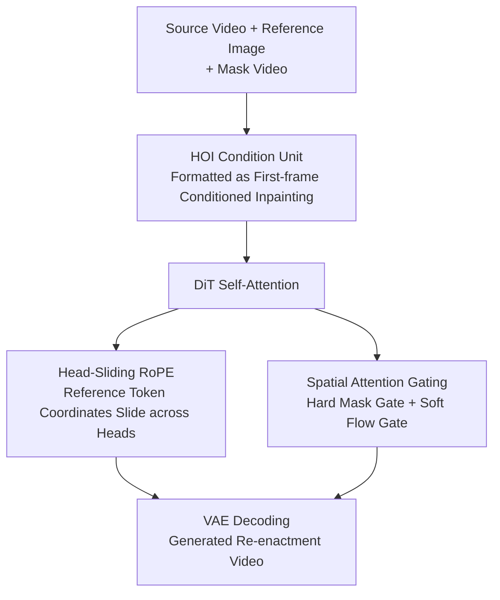

# GenHOI: Towards Object-Consistent Hand-Object Interaction with Temporally Balanced and Spatially Selective Object Injection

**Conference**: CVPR 2026  
**Paper**: [CVF Open Access](https://openaccess.thecvf.com/content/CVPR2026/html/Huang_GenHOI_Towards_Object-Consistent_Hand-Object_Interaction_with_Temporally_Balanced_and_Spatially_CVPR_2026_paper.html)  
**Code**: [Project Page](https://xuanhuang0.github.io/GenHOI/) (Code not open sourced)  
**Area**: Video Generation / Digital Human / Hand-Object Interaction  
**Keywords**: Hand-Object Interaction, Video Re-enactment, Head-Sliding RoPE, Spatial Attention Gating, Object Consistency

## TL;DR
GenHOI attaches a lightweight module of only 157M parameters (approx. 0.95%) to a pre-trained large video generation model (Wan-14B-I2V). By employing **Head-Sliding RoPE** (balancing the influence of reference object tokens across frames temporally) and **Spatial Attention Gating** (focusing object-conditioned attention on interaction zones spatially), it achieves natural hand-object interaction videos with consistent object appearance across frames in in-the-wild scenarios without damaging the base model's generalization. It significantly outperforms SOTA models like VACE and HOI-Swap in both self-re-enactment and cross-re-enactment metrics.

## Background & Motivation
**Background**: In digital human video synthesis (e.g., "anchors demonstrating products" in e-commerce or online education), Hand–Object Interaction (HOI) is a core challenge. Models must generate physically plausible hand-object contact while maintaining identity information like color, texture, and logos of the reference object throughout the video. Current mainstream routes include specialized HOI re-enactment methods (frame-by-frame warping in HOI-Swap, layout-guided diffusion in Re-HOLD) and general-purpose video editing models (VACE).

**Limitations of Prior Work**: Specialized HOI methods are mostly trained and evaluated in-domain, failing in real-world in-the-wild scenarios (e.g., HOI-Swap's self-re-enactment PSNR is only 24.29) because they rely heavily on task priors and extensively modify the base model, losing generalization. General-purpose models, pre-trained on internet-scale data, are robust but fail in "object consistency"—the same cup often deforms as the video progresses.

**Key Challenge**: Generalization requires minimal modification to the pre-trained model and fewer task priors; however, minimal modification fails to suppress "object degradation across frames" inherent to HOI. These are difficult to balance. The authors identify two specific causes for "degradation": ① **Temporal Dimension**—due to the nature of 3D RoPE in self-attention, "attention weakens with distance." Assigning a fixed frame coordinate (e.g., $-1$) to reference tokens makes them strongest for the earliest frames and weakest for the latest, causing objects to blur in later frames. ② **Spatial Dimension**—reference object information injected indiscriminately into the whole image pollutes the background that should remain unchanged, introducing artifacts.

**Goal**: To "softly" inject reference object information while preserving base model capabilities—avoiding temporal bias and spatial over-pollution.

**Core Idea**: Instead of retraining or adding branches, perform "surgical adjustments" to self-attention: use **Head-Sliding RoPE** to "slide" the frame coordinates of reference tokens across different attention heads to average out their impact across all frames; and use **Spatial Attention Gating** to rigidly cut off reference token $\rightarrow$ background information flow, supplemented by soft modulation of injection intensity.

## Method

### Overall Architecture
Given a source video $V=\{I_1,\dots,I_F\}$ and a reference object image $I_{ref}$, the goal is to re-enact realistic interaction between the hand and the target object. Training uses self-supervised reconstruction: deriving a reference video $V_r$, a binary mask video $V_{mask}$, and a reference image $I_{ref}$ from the source video, and having the model reconstruct $V$ from random noise $X_{rand}$ conditioned on these three inputs:

$$V = D\big(M(X_{rand}, E(I_{ref}), E(V_r), \psi(V_{mask}))\big)$$

where $(E,D)$ are the pre-trained VAE encoder/decoder, and $M$ is the DiT denoiser, and $\psi$ is average pooling. The pipeline consists of three steps: first, the **HOI Condition Unit (HCU)** organizes the "reference video + mask" into the base model's input format, re-framing the task as "first-frame conditioned video inpainting"; then, **Head-Sliding RoPE** (temporal) and **Spatial Attention Gating** (spatial) are inserted into the DiT self-attention for balanced and selective object injection; finally, the VAE decodes the video. During inference, replacing the reference image enables object re-enactment.

### Key Designs

**1. HOI Condition Unit: Re-framing "Object Swapping" as First-frame Conditioned Inpainting**

Applying general video models to HOI directly either requires new branches/parameters (hurting generalization) or fails to guide the model on where to modify. The HCU integrates HOI cues into the latent input stream without adding branches. It constructs a reference video $V_r$ based on masks: the first frame ($F=0$) preserves the original $V$ as an appearance anchor; for other frames, the interaction area is removed and filled with a constant $\lambda=127$ (becoming 0 after normalization), while the background is kept:

$$V_r = \begin{cases} V, & F=0 \\ (1-V_{mask})\cdot V + V_{mask}\cdot\lambda, & F>0 \end{cases}$$

The noisy target latent $X_t$, reference video latent $E(V_r)$, and pooled mask $\psi(V_{mask})$ are concatenated along the channel dimension as DiT input $L_v=\mathrm{Concat}(X_t, E(V_r), \psi(V_{mask}))$. This frames generation as "first-frame conditioned video inpainting," where $E(V_r)$ provides background context and $\psi(V_{mask})$ indicates where to edit. This non-invasive integration serves as the container for subsequent attention designs.

**2. Head-Sliding RoPE: Averaging Reference Token Impact to Cure Temporal Degradation**

This addresses "temporal degradation." Under standard RoPE, attention weakens with distance. Fixed coordinates for reference tokens lead to decaying influence over time. Previous methods (like "separate RoPE" in Stand-In or OminiControl) use fixed indices (e.g., $-1$), where the frame component is $e^{j(-1)\theta}$, leading to distortion in later frames. GenHOI slides the reference token's frame coordinate according to the attention head index $n_{head}$:

$$[R_f] = \Big[\, e^{\,j\lceil \frac{N_f}{N_{head}} n_{head}\rceil\theta} \,\Big]_{N\times D_1}\,,\quad \big[\, e^{\,j f^m\theta} \,\big]_{M\times D_1}$$

where $N_f$ is the total frames and $N_{head}$ is the number of heads. Intuitively: the first head makes the reference token "stand" near frame 0, the second head near a later frame, and so on. Averaged across all heads, the response is flattened across the entire video while maintaining distinct spatial coordinates. The model differentiates reference tokens from video tokens without favoring any specific frame. In ablations, this improves PSNR by 1.15 dB over separate RoPE.

**3. Spatial Attention Gating: Hard Mask for Isolation and Soft Flow for Modulation**

This addresses "spatial pollution" using two levels. **Hard Mask Gate**: Video tokens are divided into the HOI zone $T_{V_{HOI}}$ and background zone $T_{V_B}$. A binary mask $M$ controls the flow in the $Q,K,V$ attention:

$$M_{m,n} = \begin{cases} 0 & m\in\{Q_{V_B}\}, n\in\{K_{ref}\} \\ 0 & m\in\{Q_{ref}\}, n\in\{K_{V_{HOI}},K_{V_B}\} \\ 1 & \text{otherwise} \end{cases}\,,\qquad T_{out}=\mathrm{softmax}\!\Big(\frac{M\odot QK^\top}{\sqrt{d_k}}\Big)V$$

This prevents background queries from attending to reference keys (as $V_r$ already provides background context) and prevents reference queries from attending back to video tokens (maintaining self-regularization). Thus, reference information flows unidirectionally into the HOI zone. ⚠️ *Note: The paper's text and Fig 4 have conflicting notations for mask values (0/1); logically, 0 should mask and 1 should allow.*

**Soft Flow Gate** provides token-wise dynamic modulation: the updated video token $T'_v$ passes through LayerNorm + Linear + Sigmoid to produce gating coefficients, which are element-wise multiplied:

$$G_v = \sigma\big(F(\mathrm{LN}(T'_v))\big)\,,\qquad \tilde{T}_v = G_v \odot T'_v$$

It amplifies information-rich regions and suppresses redundant responses. Together, the gates focalize HOI zones and protect backgrounds.

### Loss & Training
Based on pre-trained Wan-14B-I2V. Self-supervised reconstruction training used ~19,000 video segments, trained on 16× H100 (80GB) for 3 days with a learning rate of $1\times10^{-5}$. Reference images and first frames are drawn from the original video during training; for inference, reference images are user-provided, and first frames are generated via image editing. Learnable parameters are only 157M (~0.95% of the 16.5B total).

## Key Experimental Results

### Main Results
Evaluation was performed on the reformulated **AnchorCrafter HOI** dataset ($\ge$720p, 50 self-re-enactment and 50 cross-re-enactment segments). Metrics include PSNR/SSIM/LPIPS (fidelity), FID/FVD (perceptual realism), and Object CLIP (OC, measuring object consistency). A user study with 30 participants (VQ for Video Quality, RF for Reference Fidelity, 1–5 scale) was used for cross-re-enactment.

Results for short video generation (81 frames):

| Setting | Method | PSNR↑ | SSIM↑ | LPIPS↓ | OC↑ | Cross-FVD↓ | User RF↑ |
|:---|:---|:---|:---|:---|:---|:---|:---|
| Short Video | HOI-Swap | 24.29 | 0.843 | 0.173 | 0.787 | 570.5 | 1.20 |
| Short Video | MimicMotion | 20.13 | 0.685 | 0.206 | 0.777 | 608.5 | 2.09 |
| Short Video | UniAnimate-DiT | 22.20 | 0.754 | 0.179 | 0.846 | 640.5 | 2.97 |
| Short Video | VACE (runner-up) | 28.60 | 0.937 | 0.056 | 0.880 | 524.7 | 2.80 |
| Short Video | **GenHOI** | **31.71** | **0.952** | **0.036** | **0.937** | **429.5** | **4.64** |

GenHOI significantly leads VACE across all metrics. For long videos (401 frames), the gap widens (e.g., PSNR difference increases from 3.11 to 4.37), confirming the advantage of anti-degradation in long sequences.

### Ablation Study
Ablations under self-re-enactment (HCU as baseline):

| Configuration | PSNR↑ | LPIPS↓ | FVD↓ | OC↑ | Description |
|:---|:---|:---|:---|:---|:---|
| HCU | 28.25 | 0.058 | 248.6 | 0.907 | Baseline: Base model + HOI Unit |
| HCU + separate RoPE | 29.73 | 0.050 | 223.8 | 0.908 | Conditional RoPE with fixed frame coords |
| HCU + ref-in-bbox | 30.34 | 0.044 | 101.9 | 0.919 | Pasting ref image into mask zone |
| HCU + HS RoPE | 30.88 | 0.039 | 103.9 | 0.915 | Switched to Head-Sliding RoPE |
| HCU + HS RoPE + SAG | 31.21 | 0.038 | 98.09 | 0.920 | Added Spatial Attention Gating |
| **Full (+ FLF)** | **31.71** | **0.036** | **67.95** | **0.937** | Added First & Last Frame conditions |

### Key Findings
- **Head-Sliding RoPE is primary for object consistency**: It improves PSNR by 1.15 dB over separate RoPE and 0.54 dB over ref-in-bbox. While ref-in-bbox preserves appearance, it biases the model toward "stating pasting" rather than natural interaction.
- **Spatial Attention Gating (SAG) provides robust protection**: It reduces FVD from 103.9 to 98.09, primarily by suppressing background pollution and constraining capacity to interaction zones.
- **First & Last Frame (FLF) conditions**: Improved PSNR from 31.21 to 31.71 and significantly dropped FVD, anchoring overall quality.
- **Extremely Lightweight**: Adding only 157M parameters (0.95%) preserves generalization while achieving SOTA results with minimal training data (~19k videos).

## Highlights & Insights
- **Turning "3D RoPE distance decay" into a feature**: While others used fixed coordinates to distinguish token types, the authors recognized this caused temporal bias. "Sliding" coordinates across heads averages the temporal response—an elegant, near-zero-cost positional encoding modification.
- **Clear division of Hard and Soft Gates**: The hard gate manages "reachability" (topological cutoff) while the soft gate manages "intensity" (content-based modulation), turning "spatial selectivity" into two orthogonal, controllable knobs.
- **Plug-and-play Adaptation Paradigm**: Without retraining the base model or adding branches, modifying only 0.95% of parameters within the self-attention mechanism specializes a general model into an HOI expert.

## Limitations & Future Work
- **Reliance on external first-frame editing**: Inference depends on existing image editing tools for the first frame; failure in first-frame generation affects the entire re-enactment.
- **Mask notation inconsistency**: Discrepancies between the text and figures regarding 0/1 mask values require caution during replication.
- **Limited evaluation dataset**: Tested primarily on e-commerce/anchor scenarios (50 segments each); robustness to complex bi-manual operations or heavy occlusion remains unverified.
- **Sensitivity to mask accuracy**: Hard gating depends on precise HOI/background token division; inaccuracies at hand-object boundaries may decrease gating efficacy.

## Related Work & Insights
- **vs VACE (General Video Editing)**: VACE has strong generalization but poor object consistency (OC 0.880, RF 2.80). GenHOI specializes in object consistency by addressing temporal bias and spatial pollution directly.
- **vs HOI-Swap (Specialized HOI)**: HOI-Swap uses frame-by-frame warping; it fails in-the-wild (PSNR 24.29). GenHOI's use of a large pre-trained base model provides a massive generalization advantage.
- **vs Stand-In / OminiControl**: These methods use separate RoPE with fixed frame indices, leading to uneven temporal responses; Head-Sliding RoPE provides a direct correction to this specific issue.

## Rating
- Novelty: ⭐⭐⭐⭐ Head-Sliding RoPE and the dual-gate architecture are clever, low-cost solutions to specific degradation causes.
- Experimental Thoroughness: ⭐⭐⭐⭐ Comprehensive metrics and qualitative studies, though tested on a relatively narrow dataset domain.
- Writing Quality: ⭐⭐⭐⭐ Clear motivation-to-mechanism logic, though minor inconsistencies in notation/numbers exist.
- Value: ⭐⭐⭐⭐ The lightweight adapter paradigm for HOI consistency is highly practical for e-commerce and digital human applications.

<!-- RELATED:START -->

## Related Papers

- [\[CVPR 2026\] Decoupled Generative Modeling for Human-Object Interaction Synthesis](decoupled_generative_modeling_for_human-object_interaction_synthesis.md)
- [\[CVPR 2026\] ReGenHOI: Unifying Reconstruction and Generation for 3D Human-Object Interaction Understanding](regenhoi_unifying_reconstruction_and_generation_for_3d_human-object_interaction_.md)
- [\[CVPR 2026\] RegFormer: Transferable Relational Grounding for Efficient Weakly-Supervised Human-Object Interaction Detection](regformer_transferable_relational_grounding_for_efficient_weakly-supervised_huma.md)
- [\[ICCV 2025\] Dynamic Reconstruction of Hand-Object Interaction with Distributed Force-aware Contact Representation](../../ICCV2025/human_understanding/dynamic_reconstruction_of_hand-object_interaction_with_distributed_force-aware_c.md)
- [\[CVPR 2026\] IMU-HOI: A Symbiotic Framework for Coherent Human-Object Interaction and Motion Capture via Contact-Conscious Inertial Fusion](imu-hoi_a_symbiotic_framework_for_coherent_human-object_interaction_and_motion_c.md)

<!-- RELATED:END -->
