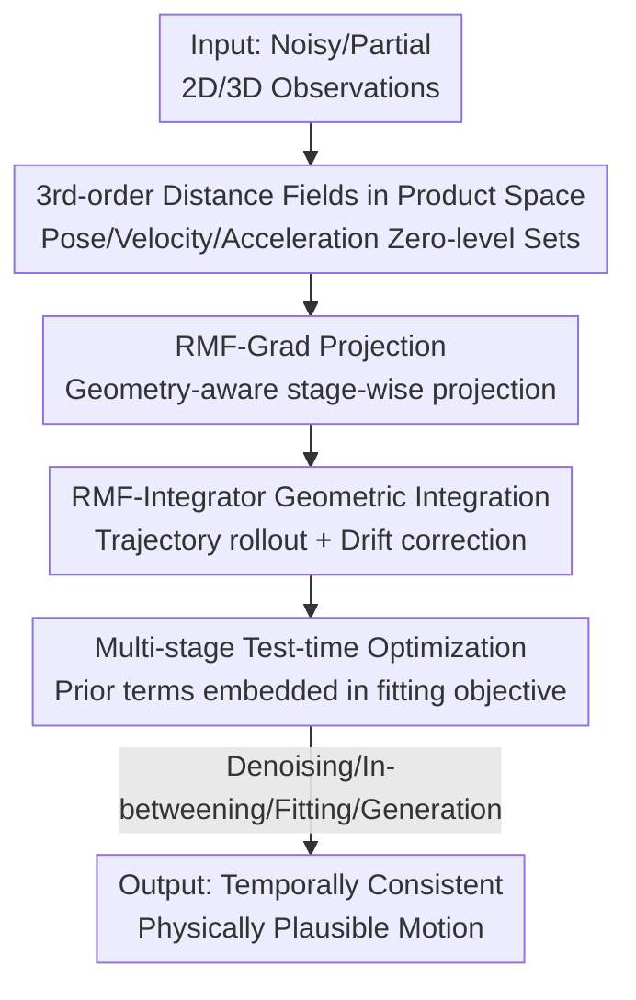

# Geometric Neural Distance Fields for Learning Human Motion Priors

**Conference**: CVPR 2026  
**Paper**: [CVF Open Access](https://openaccess.thecvf.com/content/CVPR2026/html/Yu_Geometric_Neural_Distance_Fields_for_Learning_Human_Motion_Priors_CVPR_2026_paper.html)  
**Code**: To be open-sourced (authors promise release after publication)  
**Area**: 3D Human Motion / Human Understanding  
**Keywords**: Human motion priors, neural distance fields, Riemannian manifolds, second-order dynamics, test-time optimization  

## TL;DR
This paper proposes NRMF (Neural Riemannian Motion Fields), which models the third-order dynamics of human motion—"pose, velocity, and acceleration"—as the zero-level sets of three conditional neural distance fields. Equipped with a geometric projection algorithm and a geometric integrator, this single unconditional prior robustly handles tasks such as denoising, in-betweening, monocular fitting, and generation. It outperforms VAE and diffusion-based priors on benchmarks like AMASS, 3DPW, and PROX.

## Background & Motivation
**Background**: 3D human motion recovery from sparse or noisy observations typically relies on a "motion prior" to constrain the plausibility of the solution. Early works (PoseNDF, NRDF, DPoser) modeled static pose distributions frame-by-frame. Modern methods shift toward dynamics modeling using either autoregressive VAEs (HuMoR, PhaseMP) or diffusion models (MDM, RoHM).

**Limitations of Prior Work**: Frame-wise pose priors ignore temporal consistency, leading to over-smoothed or unrealistic transitions. VAE-based methods suffer from posterior collapse and error accumulation (drift) over time. Diffusion-based methods are slow during inference, specialize in clean short sequences, and face challenges when performing inversion with observations as conditions. Even RoHM, which attempts to bridge the gap, produces over-smoothed transitions due to insufficient handling of high-order dynamics like acceleration. While MoManifold considers acceleration, it models each joint's acceleration in isolation and is restricted to fixed short-time windows.

**Key Challenge**: Existing priors either model only up to 0th-order (pose) or 1st-order (velocity) information, missing 2nd-order (acceleration) dynamics crucial for "naturalness." Alternatively, those addressing acceleration often fail to respect the non-Euclidean geometry ($SO(3)$ manifold) of joint rotations, using Euclidean approximations that collapse under heavy noise.

**Goal**: Construct a universal, expressive, and robust unconditional motion prior that captures the full pose-velocity-acceleration dynamics while strictly adhering to the underlying geometry of articulated motion.

**Key Insight**: The authors explicitly represent the "manifold of plausible motion" as the zero-level set of a distance field. The (geodesic) distance from any state to this manifold indicates its "implausibility." Thus, constraining motion involves projecting states onto the zero-level set. This perspective naturally supports decoupling different orders of dynamics into mutually conditional sub-fields.

**Core Idea**: Use three conditional neural distance fields established on the product manifold $\mathcal{M}=SO(3)^{N_J}\times so(3)^{N_J}\times \mathbb{R}^{3\times N_J}$ (corresponding to pose, velocity, and acceleration) to implicitly represent the plausible motion distribution, accompanied by geometry-aware projection and integration algorithms.

## Method

### Overall Architecture
The core of NRMF is treating the human motion state $X_t=[\mathbf{t}_r,\;\boldsymbol{\theta},\;\dot{\boldsymbol{\theta}},\;\ddot{\boldsymbol{\theta}}]$ (root translation, joint rotations, angular velocity, angular acceleration) as a point on the product manifold $\mathcal{M}$. "Plausible motion" is modeled as the zero-level set $\mathcal{S}=\{x\mid f_\Gamma(x)=\mathbf 0\}$ of an implicit distance field $f_\Gamma:\mathcal{M}\to\mathbb{R}^3_+$. The output of $f_\Gamma$ is the unsigned geodesic distance to the nearest plausible state. During training, these three distance fields are learned on AMASS. During deployment, a projection algorithm (RMF-Grad) pushes noisy states toward the zero-level set, and a geometric integrator (RMF-Integrator) "rolls out" coherent trajectories from plausible accelerations/velocities. These are embedded into a multi-stage test-time optimization framework for downstream tasks.

The pipeline follows a sequential "Representation → Projection → Integration → Optimization" structure:

### Key Designs

**1. Product Space 3rd-order Neural Distance Fields: Recovering High-order Dynamics**
To address existing limitations, the authors decouple the distance field $f_\Gamma$ into three mutually conditional sub-fields:
$$f_\Gamma=\big[\;f^R_\Phi(\boldsymbol\theta),\;\; f^\omega_\Psi(\dot{\boldsymbol\theta}\mid\boldsymbol\theta),\;\; f^{\dot\omega}_\Xi(\ddot{\boldsymbol\theta}\mid\boldsymbol\theta,\dot{\boldsymbol\theta})\;\big]$$
These measure the implausibility of pose, transition (velocity), and acceleration, with each order conditioned on lower orders. Crucially, these fields are built on their correct geometric spaces: pose in $SO(3)^{N_J}$, velocity in the Lie algebra $so(3)^{N_J}$ (tangent space), and acceleration in $\mathbb{R}^{3\times N_J}$. Each sub-field uses a hierarchical network with an MLP decoder to predict the geodesic distance to the nearest sample in the dataset:
$$\Phi^\star=\arg\min_\Phi\sum_i\big\|\,f^R_\Phi(\boldsymbol\theta_i)-\min_{\boldsymbol\theta'\in\mathcal{D}_\theta} d_{SO}^{N_J}(\boldsymbol\theta_i,\boldsymbol\theta')\,\big\|$$
Unlike MoManifold, these fields consider the full body pose, preserving inter-joint dependencies.

**2. RMF-Grad: Geometry-aware Adaptive-step Projection**
The authors designed a three-stage cascaded projection. Each stage follows the gradient of the corresponding distance field. For pose, the Riemannian exponential map ensures the update remains on $SO(3)$:
$$\boldsymbol\theta_{t+1}=\mathrm{Exp}_{\boldsymbol\theta_t}\!\Big(-\alpha_\theta\, f^R_\Phi(\boldsymbol\theta_t)\,\frac{\mathrm{grad}\,f^R_\Phi(\boldsymbol\theta_t)}{\|\mathrm{grad}\,f^R_\Phi(\boldsymbol\theta_t)\|}\Big)$$
Velocity and acceleration are updated via gradient descent in their tangent/Euclidean spaces. The step size is adaptive to the distance, termed "adaptive-step hybrid." This geometric projection remains robust under high noise, where Euclidean projections like PoseNDF typically fail.

**3. RMF-Integrator: Geometric Projection Integrator for Rollout and Drift Correction**
To generate coherent sequences, the authors propose a deterministic geometric integrator, effectively an Euler integration with prior projection:
$$\dot{\boldsymbol\theta}_{t+1}=\Pi^\omega\big(\dot{\boldsymbol\theta}_t+\lambda_t\ddot{\boldsymbol\theta}_t\big),\qquad \boldsymbol\theta_{t+1}=\Pi^R\big(\mathrm{Exp}_{\boldsymbol\theta_t}(\alpha_t\,[\dot{\boldsymbol\theta}_t]_x)\big)$$
By applying the projection $\Pi$ at each step, the integration continuously pulls the trajectory and its derivatives toward the plausible manifold, performing real-time denoising and drift correction.

**4. Multi-stage Test-time Optimization: Deployment as a Conditional Solver**
To serve downstream tasks given observations $O_{0:T}$, a two-stage optimization is used:
- **Stage I**: Uses only the 0th-order pose prior for initialization, minimizing $E_I=L_{data}+\lambda_\beta L_\beta+\lambda_\theta L_\theta+\lambda_{reg}L_{reg}$, where $L_\theta=f^R_\Phi(\boldsymbol\theta_i)$.
- **Stage II**: Introduces transition and acceleration priors $L_{\dot\theta}=f^\omega_\Psi(\dot{\boldsymbol\theta}_i)$ and $L_{\ddot\theta}=f^{\dot\omega}_\Xi(\ddot{\boldsymbol\theta}_i)$, along with physical constraints, using the RMF-Integrator for refinement.

## Key Experimental Results

### Main Results

**Motion Denoising (AMASS, 4cm Gaussian noise, 90 frames)**: NRMF leads in position and acceleration errors (mm, Acc Err lower is better).

| Methods | All Pos. Err ↓ | Vtx ↓ | Acc Err ↓ |
|------|------|------|------|
| HuMoR (VAE) | 35.5 | — | 4.67 |
| RoHM (Diffusion) | 32.4 | — | 2.61 |
| NRDF + T-NRDF | 22.6 | — | 2.97 |
| Motion-NDF | 23.5 | — | 2.64 |
| **NRMF (Ours)** | **19.9** | — | **2.25** |

**Monocular Mesh Refinement (3DPW, SMPLer-X initialization)**:

| Methods | MPJPE ↓ | MPVPE ↓ | Acc Err ↓ | Trans Err(×10⁻³) ↓ |
|------|------|------|------|------|
| SMPLer-X | 82.65 | 94.23 | 23.71 | 31.63 |
| + NRDF (0th order only) | 71.88 | 83.23 | 24.31 | 26.38 |
| + RoHM | 69.78 | 79.72 | 9.13 | 12.37 |
| **+ NRMF (full)** | **66.13** | **75.61** | **6.52** | **5.67** |

### Ablation Study

| Configuration | MPJPE ↓ | Acc Err ↓ | Trans Err(×10⁻³) ↓ | Description |
|------|------|------|------|------|
| + No prior | 84.67 | 26.75 | 34.54 | Pixel alignment only |
| + NRDF (0th-order) | 71.88 | 24.31 | 26.38 | No high-order constraints |
| + T-NRDF (1st-order) | 66.98 | 9.89 | 7.98 | Acc Err drops significantly |
| + A-NRDF (2nd-order) | 70.88 | **6.73** | 11.87 | Minimizes Acc Err |
| **NRMF (full)** | **66.13** | 6.52 | **5.67** | Best overall |

### Key Findings
- **Transition (1st-order) priors contribute most to reducing acceleration error**: Adding T-NRDF reduces Acc Err from 24.31 to 9.89.
- **Respecting geometry is critical**: Methods correctly handling rotation geometry (NRDF, NRMF) significantly outperform Euclidean projections under high noise.
- **Generation tasks**: NRMF achieves the lowest FIDm (5.317) while maintaining competitive diversity.

## Highlights & Insights
- **Implicit Perspective**: Modeling "implausibility = distance to manifold" is elegant. Representing the prior as a zero-level set makes motion constraint a simple gradient projection.
- **Unified Prior**: A single unconditional prior handles four distinct tasks by simply changing the data term $L_{data}$, avoiding the inversion difficulties of diffusion models.
- **Projection + Integrator Split**: The projection ensures single-frame plausibility, while the integrator ensures temporal consistency and corrects drift.

## Limitations & Future Work
- **Runtime**: Iterative optimization is slow; processing a sequence can take minutes.
- **Theoretical Proof**: There is no formal proof that the projection-integrator converges to an optimal trajectory; future work could explore Riemannian Langevin MCMC.
- **Data Dependency**: Plausibility is bounded by the AMASS distribution, potentially biasing toward "average" motion for extreme athletics.

## Related Work & Insights
- **vs NRDF/PoseNDF**: NRMF extends frame-wise pose distance fields to include 1st-order (transition) and 2nd-order (acceleration) fields, solving temporal inconsistency.
- **vs HuMoR**: While VAEs suffer from drift, NRMF's integrator actively performs drift correction through manifold projection.
- **vs RoHM/MDM**: NRMF addresses the over-smoothing and inversion difficulties inherent in diffusion models by directly modeling and constraining high-order dynamics.

## Rating
- Novelty: ⭐⭐⭐⭐⭐ 
- Experimental Thoroughness: ⭐⭐⭐⭐⭐ 
- Writing Quality: ⭐⭐⭐⭐ 
- Value: ⭐⭐⭐⭐⭐ 

<!-- RELATED:START -->

## Related Papers

- [\[CVPR 2026\] Hierarchical Enhancement of Semantic Priors for Disentangled Text-Driven Motion Generation](hierarchical_enhancement_of_semantic_priors_for_disentangled_text-driven_motion_.md)
- [\[ICLR 2026\] NeuroGaze-Distill: Brain-informed Distillation and Depression-Inspired Geometric Priors for Robust Facial Emotion Recognition](../../ICLR2026/human_understanding/neurogaze-distill_brain-informed_distillation_and_depression-inspired_geometric_.md)
- [\[CVPR 2025\] Learning Affine Correspondences by Integrating Geometric Constraints](../../CVPR2025/human_understanding/learning_affine_correspondences_by_integrating_geometric_constraints.md)
- [\[CVPR 2026\] Learning Long-term Motion Embeddings for Efficient Kinematics Generation](learning_long-term_motion_embeddings_for_efficient_kinematics_generation.md)
- [\[CVPR 2026\] MoLingo: Motion-Language Alignment for Text-to-Human Motion Generation](molingo_motion-language_alignment_for_text-to-motion_generation.md)

<!-- RELATED:END -->
