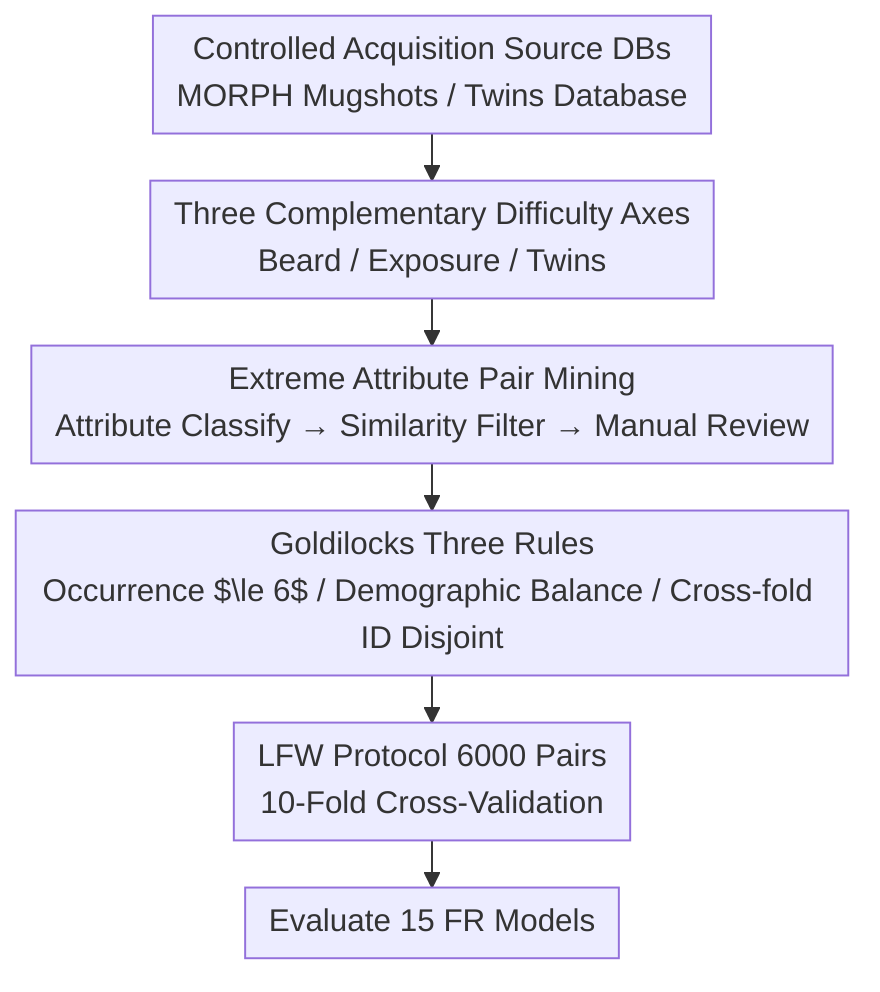

# Goldilocks Test Sets for Face Verification

**Conference**: CVPR 2026  
**Paper**: [CVF Open Access](https://openaccess.thecvf.com/content/CVPR2026/html/Wu_Goldilocks_Test_Sets_for_Face_Verification_CVPR_2026_paper.html)  
**Code**: https://github.com/HaiyuWu/SOTA-FaceRecognition-Train-and-Test  
**Area**: Human Understanding  
**Keywords**: Face Verification, Test Set Benchmark, Facial Attributes, Twin Identification, Demographic Fairness  

## TL;DR
While mainstream face verification test sets have reached saturation (LFW 99.8%), this study does not rely on reducing image quality or adding occlusions to create difficulty. Instead, it extracts three types of "natural but difficult" image pairs from high-quality controlled face databases: extreme beard differences (Hadrian), strong exposure differences (Eclipse), and identical twins (ND-Twins). A set of "Goldilocks Three Rules" is proposed to ensure the test sets are "just right" in difficulty, resulting in difficulty levels that surpass artificial benchmarks relying on synthetic masks or reduced resolution.

## Background & Motivation
**Background**: Since ArcFace, Face Recognition (FR) models have been evaluated on a standard set of benchmarks including LFW, CFP-FP, CPLFW, CALFW, and AgeDB-30. As training set sizes have expanded, accuracy on these sets has rapidly saturated—models commonly achieve 99.8% on LFW, and even the "hardest" set, CPLFW, has reached ~94%, making it nearly impossible to distinguish model quality.

**Limitations of Prior Work**: To re-introduce difficulty, recent "hard" test sets (MLFW with synthetic masks, XQLFW with reduced resolution, TALFW with adversarial perturbations) mostly follow the path of "manually degrading image quality." However, this difficulty stems from image degradation and does not reflect where models fail under **normal quality and normal faces**.

**Key Challenge**: The true weaknesses of FR models are hidden in three types of pairs that are "semantically difficult despite perfect image quality": ① Genuine pairs of the same person with large attribute differences (e.g., one clean-shaven, one with a heavy beard); ② Impostor pairs of different people with highly similar attributes; ③ People who look alike (twins, relatives). These challenges are completely bypassed by the current "degraded quality" approach.

**Goal**: Construct test sets that expose the three types of weaknesses mentioned above without damaging image quality; simultaneously solve design flaws in old test sets (repeated images, demographic imbalance, and identity leakage across cross-validation folds).

**Key Insight**: The authors noted that controlled face databases (MORPH mugshots, Twins Challenge database) have high image quality and provide attribute/demographic metadata, which is ideal for selecting extreme attribute pairs under "high quality" constraints.

**Core Idea**: "Substitute image degradation with extreme natural attribute pairings to create difficulty," and add a "Goldilocks Three Rules" layer to ensure the difficulty is "just right"—neither so hard that it causes random guessing due to noise/repetition, nor so loose that it saturates again.

## Method

### Overall Architecture
This paper does not propose a new model but rather a **test set construction pipeline**: starting from controlled source databases, "extreme pairs" are mined based on target attributes as candidates; these are filtered via FR similarity to remove samples that are too easy, too hard, or have label noise; the Goldilocks Three Rules are applied to constrain sample distribution; finally, they are assembled into a 6,000-pair test set following the LFW 10-fold cross-validation protocol to evaluate 15 FR models (5 loss algorithms × 3 training sets). The three test sets (Hadrian / Eclipse / ND-Twins) share the same pipeline, differing only in target attributes and source databases.

### Key Designs

**1. Three Complementary Difficulty Axes: Breaking "Natural but Hard" into Beard, Exposure, and Twins**

Addressing the pain point that "existing hard test sets rely on image degradation and bypass natural semantic difficulty," the authors developed three test sets for three natural weaknesses. **Hadrian** targets facial hair variation: genuine pairs are designed with high contrast (e.g., {no beard, heavy beard}), while impostor pairs are designed with high similarity (e.g., {heavy beard, heavy beard})—since research shows that greater beard variation reduces similarity, while similarity is highest among beard-wearing individuals. **Eclipse** targets lighting variation: faces are categorized into five levels of exposure—Strong Underexposure (SU), Underexposure (U), Mid (M), Overexposure (O), and Strong Overexposure (SO). Genuine pairs use {high exposure, low exposure}, and impostor pairs use {high, high} or {low, low}. To isolate variables, Eclipse only uses clean-shaven faces, while Hadrian suppresses exposure effects, ensuring "single-attribute" comparisons. **ND-Twins** targets similarity in appearance: existing look-alike sets (SLLFW, DoppelVer) collect "doppelgängers," which models easily clear with 96%+, making them too easy. This paper uses a dedicated identical twins database where 15 models average only 71.56% accuracy, truly exposing the difficulty of "looking alike."

**2. Extreme Attribute Pair Mining: Three-stage Refining of Attribute Classification → Similarity Filtering → Manual Review**

Simply pairing by attribute labels is insufficient as it introduces label noise and "fake-hard" pairs. The authors use three stages to refine candidates to "truly hard and truly correct." First, an attribute classifier (threshold 0.9) filters target attribute images. Second, FR models extract features to calculate cosine similarity; 7,000 pairs each for genuine/impostor are sampled, and thresholds are used to exclude suspected label errors—impostor similarity $> 0.7$ and genuine similarity $< 0.3$ are removed (the former are likely mislabeled same-person pairs, and vice versa). Hadrian additionally requires an age difference $\le 5$ years in genuine pairs to isolate the age variable. The final step is **manual review**: visual checks for identity label noise, genuine pairs that actually lack difference ("fake-hard"), and impostor pairs whose attributes are actually quite different ("fake-similarity"). For Hadrian, 543 genuine pairs, 279 impostor pairs (wrong attributes), and 44 pairs (identity noise) were removed. This "algorithm screening + manual refining" is key to making the test set "cleanly difficult."

**3. Goldilocks Three Rules: Making Difficulty "Just Right" Rather Than "Too Hard/Too Loose"**

This is the core methodological contribution, named after the "Goldilocks" fairy tale—not too hot, not too cold, but just right. Rule 1: **Limit occurrences of a single image**: each image appears $\le 6$ times in the 6,000 pairs ($\le 3$ times each for genuine and impostor). This is crucial—tests show that without this constraint, a few extremely difficult samples appear repeatedly and inflate evaluation bias, causing models to drop below 50% (worse than random guessing) on ND-Twins and below 55% on Hadrian/Eclipse, losing discriminative power. Rule 2: **Demographic Group Balancing**: FairFace is used for race labels with identity-based majority voting to ensure each demographic group contributes an equal number of pairs (Hadrian/Eclipse are strictly balanced using MORPH metadata; ND-Twins is restricted by the twins database to 85% White / 15% Black). Rule 3: **Disjoint Identities Across Folds**: In 10-fold cross-validation, genuine pairs of the same identity do not appear in multiple folds, preventing threshold leakage from the training folds to the test fold—a detail often neglected in older sets. These three rules keep the test set in the "hard but stable" sweet spot.

### A Complete Example: Assembling Hadrian
Taking African American Males (AAM) as an example: First, an attribute classifier filters "no beard" and "heavy beard" labels from 155,000 AAM images. Targets are paired as {no beard, heavy beard} for genuine and {heavy beard, heavy beard} for impostor, with 7,000 random pairs each. FR similarity is used to remove impostors $> 0.7$ and genuines $< 0.3$, age difference is capped at $\le 5$ years, and image occurrence is capped at $\le 3$. AAM genuines shrink to 2,205 pairs and impostors to 4,180. Manual review then cuts attribute errors and identity noise. Finally, AAM contributes 1,500 genuine + 1,500 impostor pairs. Caucasian Males (CM) follow the same process. Together, they form Hadrian's 6,000 pairs, divided into 10 folds of 300 genuine + 300 impostor pairs each, with disjoint identities across folds.

## Key Experimental Results

### Main Results: All Three Test Sets are Harder than Existing "Most Difficult" Benchmarks
Training with a ResNet100 backbone, 5 loss algorithms were trained on 3 training sets (MS1MV2 / WebFace4M / Glint360K), totaling 15 models. The table below shows the average accuracy (%) across 15 models. $\Delta\mathrm{Acc}$ = Ours $-$ CPLFW (CPLFW was previously the hardest common test set):

| Test Set | Target Difficulty | Average Accuracy | ∆Acc vs CPLFW |
| :--- | :--- | :--- | :--- |
| LFW | General | 99.79 | +5.75 |
| CFP-FP | Pose | 98.91 | +4.87 |
| CPLFW | Pose | 94.04 | 0 (Baseline) |
| AgeDB-30 | Age | 98.05 | +4.01 |
| CALFW | Age | 96.09 | +2.05 |
| **Hadrian** | Facial Hair | **92.62** | **−1.42** |
| **Eclipse** | Exposure | **82.81** | **−11.23** |
| **ND-Twins** | Twins | **71.56** | **−22.48** |

Accuracies for all three test sets are lower than CPLFW. Furthermore, Eclipse and ND-Twins are harder than degradation-based sets like MLFW (masks) and XQLFW (low resolution), proving that "natural attribute extreme pairing" can create equal or greater difficulty without sacrificing image quality.

### Ablation Study

| Configuration | Key Results | Description |
| :--- | :--- | :--- |
| Random MORPH5 (Domain Control) | All models $>99\%$ | Random pairing in the same source DB is very easy, proving difficulty comes from attribute design, not domain shift (Table 3). |
| Disjoint Fold IDs vs. Overlap | $\Delta$ only $\sim$0.05~0.15% | Identity leakage has a minimal impact on accuracy, but strict disjoint folds are recommended for rigor (Table 4). |
| Per-Demographic Accuracy | Inter-group diff $>30.62\%$ | On Eclipse, AAM 95% vs CF 65%, highlighting the necessity of balanced demographic evaluation (Table 5). |
| Remove "Occurrence $\le 6$" Rule | ND-Twins all $<50\%$ | Without the limit, extremely hard samples appear repeatedly, causing models to drop below random guess levels; validates Goldilocks Rule 1. |

### Key Findings
- **Difficulty stems from attribute design, not domain differences**: Random pairs from the MORPH database yielded $>99\%$ accuracy, making them easier than in-the-wild sets, which debunked the suspicion that difficulty was due to changing data domains.
- **Huge demographic gaps**: On Eclipse, African/Caucasian males reached 93–95%, while females (CF/AAF) only reached 65–74%. A gap of over 30% exists—without balanced assessment, evaluations would be dominated by Caucasian male samples and overestimate generalization.
- **"Cheating" is difficult**: The authors argue that even if attribute patterns are injected into the algorithm, the multi-classification training paradigm would cause performance drops on other sets. Furthermore, attributes like {heavy beard, extreme exposure, identical twins} rarely appear in mainstream training sets, making targeted "score-chasing" difficult.

## Highlights & Insights
- **Paradigm Shift in Difficulty Sources**: Moving from "image corruption" to "selecting natural but extreme semantic pairings" proves that high-quality images can still create difficulty exceeding degradation-type benchmarks—a strong counter-example for the "noise is necessary for difficulty" community.
- **Reusable Goldilocks Rules**: Capping occurrences, balancing demographics, and fold-identity disjointness constitute a set of "test set hygiene" principles independent of specific attributes, which can be migrated to any LFW-protocol face (or general verification) benchmark.
- **Counter-intuitive role of "Occurrence $\le 6$"**: Limiting repetition is actually the key knob for controlling difficulty—unlimited repetition allows a few extremely difficult samples to dominate the evaluation, making it too hard to provide differentiation.
- **Engineering Cleverness in Variable Isolation**: Hadrian suppresses exposure while Eclipse suppresses beards, making the two sets clean single-attribute controls for each other, which helps in attributing exactly where "the model failed."

## Limitations & Future Work
- **Small Scale**: 6,000 pairs is consistent with common test sets but much smaller than the IJB series, limiting generalization assessment. The authors use Goldilocks rules to mitigate this by including as many images/demographics as possible.
- **Hard to satisfy all rules for ND-Twins**: Due to the scarcity of twin data, demographic balance could not be achieved, and fold-disjoint IDs were only partially satisfied (one ID across 9 folds).
- **⚠️ Low gain from Fold-Disjoint IDs**: Ablations show identity leakage only affects accuracy by $\sim$0.1%. The authors' insistence on strict disjointness is more for design rigor than empirical necessity—this rule's practical value could be further re-evaluated.
- **Future Directions**: Scaling up twin/relative data, extending Goldilocks rules to IJB-scale sets using the TAR@FAR protocol, and adding more natural attribute axes (e.g., makeup, accessories).

## Related Work & Insights
- **vs MLFW / XQLFW / TALFW (Degradation-based hard sets)**: These rely on masks, resolution drops, and adversarial noise. This paper uses natural attribute pairings, maintaining quality while exceeding their difficulty, better reflecting weaknesses in real deployments.
- **vs SLLFW / DoppelVer (Look-alike sets)**: These collect "doppelgängers," but models easily pass with 96%+, failing to reflect the true difficulty of twins. ND-Twins uses identical twins to push accuracy down to 71.57%, truly exposing the "look-alike" issue.
- **vs LFW Evaluation Protocol**: Completely follows the LFW 10-fold cross-validation structure for comparability but fixes three design flaws overlooked by the LFW series (repeated samples, demographic imbalance, and cross-fold identity leakage).

## Rating
- Novelty: ⭐⭐⭐⭐ Paradigm shift in difficulty source + Goldilocks rules provide clear innovation, though it is a benchmark rather than a new model.
- Experimental Thoroughness: ⭐⭐⭐⭐⭐ 15 models across multiple sets plus four types of ablations (domain/fold/demographic/repetition) provide solid evidence.
- Writing Quality: ⭐⭐⭐⭐ Construction process is clear, and the three sets follow a unified logic; some sampling numbers are slightly tedious.
- Value: ⭐⭐⭐⭐⭐ Provides a high-difficulty, non-degraded benchmark + reusable test set hygiene standards, significantly meaningful for FR evaluation.

<!-- RELATED:START -->

## Related Papers

- [\[AAAI 2026\] AHAN: Asymmetric Hierarchical Attention Network for Identical Twin Face Verification](../../AAAI2026/human_understanding/ahan_asymmetric_hierarchical_attention_network_for_identical.md)
- [\[CVPR 2026\] Anatomical Domain Shifts: Test-time Heterogeneous Adaptation for 3D Human Pose Prediction](anatomical_domain_shifts_test-time_heterogeneous_adaptation_for_3d_human_pose_pr.md)
- [\[ICLR 2026\] GaitSnippet: Gait Recognition Beyond Unordered Sets and Ordered Sequences](../../ICLR2026/human_understanding/gaitsnippet_gait_recognition_beyond_unordered_sets_and_ordered_sequences.md)
- [\[CVPR 2026\] FaceCoT: Chain-of-Thought Reasoning in MLLMs for Face Anti-Spoofing](facecot_cot_reasoning_face_anti_spoofing.md)
- [\[CVPR 2026\] IDperturb: Enhancing Variation in Synthetic Face Generation via Angular Perturbations](idperturb_enhancing_variation_in_synthetic_face_generation_via_angular_perturbat.md)

<!-- RELATED:END -->
