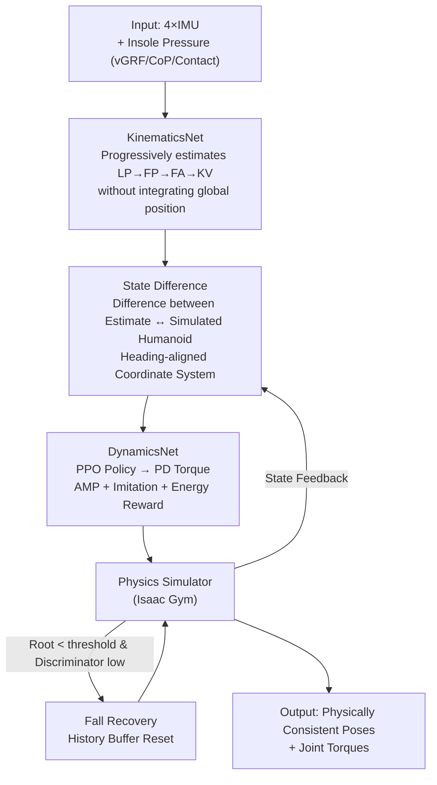

# Ground Reaction Inertial Poser: Physics-based Human Motion Capture from Sparse IMUs and Insole Pressure Sensors

**Conference**: CVPR 2026  
**Paper**: [CVF Open Access](https://openaccess.thecvf.com/content/CVPR2026/html/Hori_Ground_Reaction_Inertial_Poser_Physics-based_Human_Motion_Capture_from_Sparse_CVPR_2026_paper.html)  
**Code**: [Project Page](https://ryosukehori.github.io/grip-project/)  
**Area**: 3D Human Pose / Motion Capture / Physics Simulation  
**Keywords**: Sparse IMU Motion Capture, Insole Pressure Sensing, Physics Simulation, Reinforcement Learning, Humanoid Robot Control

## TL;DR
GRIP utilizes IMU signals and plantar pressure from 4 wearable devices (dual wrist smartwatches + dual foot smart insoles). It first estimates the kinematic state using KinematicsNet, and then employs DynamicsNet inside a physics simulator to drive a "digital twin" humanoid via torque using a PPO policy to replicate the motion. This approach reconstructs full-body motion with accurate global trajectories and physical consistency (no foot sliding, no ground penetration, no floating) under extremely sparse sensor configurations.

## Background & Motivation

**Background**: Daily-life human motion capture requires as few sensors as possible. Optical MoCap provides high accuracy but requires specialized multi-camera environments; monocular RGB is limited by the field of view and self-occlusions; and commercial wearable systems (e.g., Xsens) require 17 IMUs sewn into a tight suit, which is unsuitable for daily use. In recent years, estimating full-body poses using 4 to 6 sparse IMUs has become a mainstream lightweight solution.

**Limitations of Prior Work**: Pure IMU systems **cannot directly measure absolute positions** and must integrate acceleration/velocity to obtain global trajectories. Consequently, errors accumulate over time into drift, producing physically impossible artifacts such as foot sliding, ground penetration, and floating. Although post-hoc physical optimization can alleviate these issues, it still relies on body-environment contacts estimated from IMUs and struggles with fine-grained interaction forces. Later works added insole pressure sensors to provide dynamic cues like ground reaction force (GRF), but these approaches often **only use foot-worn sensors**, resulting in poor upper-body reconstruction, a lack of global trajectories, or drift due to the lack of physical modeling.

**Key Challenge**: Fewer sensors $\to$ inability to measure absolute positions and complex full-body motions $\to$ either relying on integration (inevitable drift) or optimization with hard contact constraints (where incorrect contact detection "locks" the feet to the ground, introducing trajectory errors instead). There is no existing framework that can simultaneously resolve drift and maintain physical plausibility under a minimal sensor configuration.

**Goal**: Using 4 IMUs + insole pressure to achieve (1) accurate global trajectories, (2) physical consistency, and (3) high-quality reconstruction of both the upper and lower body.

**Key Insight**: Instead of integrating global position as an input, an "observer-controller" structure is adopted—allowing a digital twin humanoid running in a physics simulator to **replicate** the motion. The simulator inherently satisfies gravity, friction, and ground reaction forces, guaranteeing physical constraints naturally through simulation rather than adding hard constraints post-hoc.

**Core Idea**: Replacing "pose estimation" with "controlling a humanoid to replicate the pose inside a physics simulation", and feeding the difference between the kinematic estimation and the simulated humanoid state to a control policy via a **State Difference** intermediate representation, thereby bypassing integration-induced drift sources.

## Method

### Overall Architecture

The goal of GRIP is to control a torque-driven humanoid model in a physics simulator to replicate real human motion. Inputs consist of accelerations/orientations from 4 IMUs (wrists + feet) and insole pressures (vGRF, center of pressure CoP, binary contact labels). The entire pipeline is a two-stage "observer + controller" design:

- **KinematicsNet (Observer)**: Progressively estimates kinematic states (leaf joint positions, full joint positions, full-body joint angles, and key joint velocities) from sensor data, but **deliberately avoids integrating global position**, keeping only root-relative poses and key joint global velocities.
- **State Difference (Bridging Representation)**: Subtracts the simulator's current state from KinematicsNet's estimates and transforms the result into a humanoid-heading-aligned coordinate system to serve as kinematic observations for the controller—informing the policy of "how much the simulated humanoid deviates from the target pose."
- **DynamicsNet (Controller)**: Formulated as an MDP, a policy network (MLP) maps observations to target joint angles, which are converted to torques via PD control to drive the humanoid. It is trained using PPO with a reward composed of an AMP discriminator reward, an imitation reward, and an energy penalty.
- **Fall Recovery**: The simulation applies no external residual forces, meaning the humanoid might fall during extreme motions. A History Buffer caches the past $N$ frames of KinematicsNet outputs; if a fall is detected, the humanoid state is reset using the buffer to ensure continuous inference.
- The trained humanoid finally outputs physically consistent full-body poses and joint torques; the PRISM dataset provides multimodal ground truth for the entire training and evaluation process.

### Key Designs

**1. KinematicsNet: Progressive Kinematic Estimation without Ever Integrating Global Position**

The root cause of drift in pure IMU solutions is "integrating velocity to obtain global position." KinematicsNet bypasses this by setting the root joint (pelvis) as the coordinate origin and using a unidirectional LSTM to estimate states frame-by-frame in four stages—first estimating the five **leaf joint positions** (LP: wrists, feet, head), then reconstructing **full joint positions** (FP, 24 SMPL joints) combined with sensor data, followed by **full-body joint angles** (FA, represented in continuous 6D rotations for training stability), and finally **six key joint velocities** (KV, including 4 leaf joints + root joint). While progressive estimation follows prior work, the key difference is that GRIP operates directly on IMU measurements in the **global orientation**, and since the root joint has no IMU, the global rotation of the root cannot be separated from measurements—the network outputs a root-centric coordinate system while retaining the body's global rotation. The output of this entire stage **only provides positions and velocities, not the integrated global translation**, delegating translation entirely to the subsequent physics simulator. Each of the four sub-modules is supervised via MSE: $L_{Kin}=\|p^{leaf}-\hat p^{leaf}\|^2+\|p-\hat p\|^2+\|\omega-\hat\omega\|^2+\|v^{key}-\hat v^{key}\|^2$.

**2. State Difference: Controlling via "Estimate-to-Simulation" Difference Instead of Absolute Position, Halting Drift at the Source**

If the global position integrated from KinematicsNet is directly fed into the humanoid tracker, drift will propagate directly into control. GRIP avoids this by representing translation through **key joint global velocities** and pose through **root-relative joint positions**, constructing an intermediate state difference $D_t=[D^{key}_t, D^{full}_t]$ to capture the discrepancy between the estimated state and the simulated humanoid state, both transformed into the humanoid-heading-aligned coordinate system. Specifically, $D^{key}_t=\{d^\omega_t, d^v_t, d^\varepsilon_t, \omega^{leaf}_t\}$ contains rotation differences, angular velocity differences, and orientations of 4 leaf joints (corresponding to IMUs), plus linear velocity differences of 6 key joints calculated from KinematicsNet outputs; $D^{full}_t=\{d^p_t, p_t\}$ contains position differences of all 24 joints in the root-aligned coordinate system. This representation is highly effective because it feeds the policy relative "residual" values ("how far off") instead of absolute values ("where it is")—since absolute values inevitably carry integration drift, while relative differences guide the controller to track a drift-free target, and the global translation naturally converges via physical simulation.

**3. DynamicsNet: Formulating Motion Replication as an RL Control Problem in Physical Simulation**

The second stage completely converts "pose estimation" into "controlling the humanoid to replicate the pose." It is formulated as an MDP $M=\langle S,A,T,R,\gamma\rangle$, where the policy $\pi(a_t|s_t)$ is trained using PPO. The observation $O_t=\{O^{sen}_t, O^{kin}_t, O^{self}_t, O^{env}_t\}$ consists of four components: raw sensor data (allowing direct reference to raw signals), kinematic observations (the State Difference $D_t$ mentioned above), self-state (pose, velocity, and angular velocity of all joints of the simulated humanoid), and environmental observations (a $25\times25$ height map sampled from a $1.5\text{m}\times1.5\text{m}$ area around the humanoid to support uneven terrain). The policy network is an MLP that outputs target joint angles $\theta^*_t$, which are converted into torques $\tau_t=k_p(\theta^*_t-\theta_t)-k_d\dot\theta_t$ via PD control to drive the humanoid. Following the Perpetual Humanoid Control (PHC) framework, the reward comprises three terms: an AMP discriminator reward (training a discriminator to distinguish generated motions from real human motions for realism), an imitation reward (consistency in joint positions, rotations, and velocities between simulation and reference), and an energy penalty (suppressing excessive torque for natural, stable movements). Physical constraints (gravity, friction, ground reaction forces) are naturally resolved by the simulator, avoiding the need for hard-coded contact constraints used in optimization methods, thereby preventing trajectory errors caused by "locking foot due to incorrect contact detection."

**4. Fall Recovery: Using a History Buffer to Handle Falls, Preventing Failure Under Hard Physical Constraints**

Since GRIP does not introduce any external residual forces, the humanoid may actually lose balance and fall during sudden or extreme motions, leading to simulation divergence. The recovery mechanism maintains a history buffer $H=\{p_{t-N:t}, \omega_{t-N:t}, v_{t-N:t}\}$ that caches the past $N$ frames of KinematicsNet outputs. A fall is detected if the root joint height $p^{root}_{z,t}$ falls below a threshold $\beta_z$ and the AMP discriminator probability $\phi_t$ falls below $\beta_\phi$. Upon fall detection, the simulated root position is reset using the integrated root displacement $\Delta p^{kin,root}_{t-N:t}$ from the buffer as $p^{sim,root}_t=p^{sim,root}_{t-N}+\Delta p^{kin,root}_{t-N:t}$, and the humanoid pose is reset using joint angles from the FA module before resuming simulation. During the fall recovery period, the output is directly replaced by the cached KinematicsNet predictions to ensure kinematic continuity without broken physical transitions. This mechanism is used only during inference and does not participate in training. It makes the "zero residual force" hard physical setting deployable—retaining physical realism without collapsing upon a fall.

### Loss & Training
Two-stage training: first, **supervise and train KinematicsNet** (each of the four sub-modules is optimized independently and then fine-tuned jointly); second, **freeze the weights of KinematicsNet** and use PPO to train the DynamicsNet policy in the physics simulator. The simulator used is Isaac Gym. Fall recovery is only enabled during inference.

## Key Experimental Results

### Main Results
Comparison of IMU-only and IMU-pressure fusion baselines across three datasets with different motion characteristics (lower is better for all metrics). GRIP achieves state-of-the-art performance across almost all metrics, particularly in global pose accuracy (MPJPE) and foot penetration (FP):

| Dataset | Method | MPJPE↓ | PA-MPJPE↓ | FP↓ (mm) |
|--------|------|--------|-----------|----------|
| PRISM | PIP | 248.59 | 33.35 | 10.71 |
| PRISM | GlobalPose (6 IMU) | 198.30 | 31.29 | 9.72 |
| PRISM | **GRIP (4 IMU)** | **182.44** | 46.47 | **5.77** |
| UnderPressure | GlobalPose | 301.12 | 17.41 | 3.31 |
| UnderPressure | **GRIP** | **218.09** | 27.16 | **0.00** |
| PSU-TMM100 | FoRM | 126.60 | 82.45 | 4.51 |
| PSU-TMM100 | **GRIP** | **118.60** | 55.72 | **0.73** |

Takeaways: GRIP achieves the **best MPJPE across all three datasets**, and the lowest FP (foot penetration) across the board (even reaching 0 on UnderPressure). On metrics excluding global translation (such as PEL/PA-MPJPE, MPJRE), GlobalPose performs better; however, it utilizes 6 IMUs and features a correction mechanism using a pelvis IMU to learn the gravity-pose relationship. GRIP, using only 4 IMUs, leverages pressure information to compensate for the missing pelvis/head IMUs, achieving performance comparable to PIP. For vGRF errors, PIP/MobilePoser perform better on PRISM and UnderPressure (as they employ a floating base + residual forces to stabilize control), but GRIP excels on the slow-motion PSU-TMM100 dataset—where other methods often miss subtle plantar contact events in slow motion.

### Ablation Study

**Sensor Configuration Analysis (PRISM)**: Incrementally increasing the number of IMUs and comparing configurations with and without pressure sensing.

| #IMU | Pressure | MPJPE↓ | PA-MPJPE↓ | Success Rate↑ (%) |
|------|------|--------|-----------|-------------|
| 4 | ✗ | 194.48 | 49.97 | 88.58 |
| 4 | ✓ | **182.44** | **46.47** | **94.49** |
| 6 | ✓ | 143.06 | 39.13 | 92.32 |
| 2 | ✓ | 247.12 | 82.36 | 93.90 |

IMU-rich setups are more accurate; nonetheless, adding plantar pressure **simultaneously improves accuracy and stability** (success rate increases from 88.58% $\to$ 94.49%), demonstrating its value as a highly complementary modality.

**Observation Design Ablation (Components of State Difference, PRISM)**:

| Configuration | MPJPE↓ | PA-MPJPE↓ | Success Rate↑ (%) | Description |
|------|--------|-----------|-------------|------|
| D(O,A) | 290.71 | 51.83 | 90.89 | Orientation + acceleration difference only |
| D(O,A,V) | 206.50 | 48.97 | 91.25 | Added leaf joint velocity difference |
| D(O,A,V,Jglo) | 187.86 | 48.87 | 93.31 | Added global reconstructed joint position difference |
| D(O,A,V,Jrel) | **182.44** | **46.47** | **94.49** | Added root-relative joint position difference (Full) |

### Key Findings
- **Velocity difference + root-relative joint position difference are key**: From D(O,A) to the full configuration, MPJPE is cut from 290.71 to 182.44, and the success rate rises from 90.89% to 94.49%—proving that using "root-relative position + global velocity" instead of absolute global position in State Difference is the correct design choice.
- **Plantar pressure acts as a stability magnifier**: Adding pressure to the 4-IMU configuration increases the success rate by +5.9 percentage points, indicating that the contact and center-of-mass cues provided by pressure directly help prevent the humanoid from falling.
- **Physics Simulation vs. Post-hoc Optimization**: When contact detection is incorrect, optimization methods lock the feet to the ground, introducing trajectory errors. GRIP avoids this by relying on natural foot-ground interactions in the simulation, thoroughly dominating the kinematics-only FoRM on the FP (foot penetration) metric.

## Highlights & Insights
- **"Dissolving" rather than "correcting" the drift problem**: Instead of integrating global position, only relative differences are provided, allowing the physics simulation to naturally converge to global trajectories. This is a much more fundamental approach than the "drift first, optimize later" pipeline, and is highly transferrable to any sparse inertial-sensing global localization task.
- **State Difference acts as an elegant glue for the observer-controller**: Using the difference between kinematic estimation and simulation as policy observations leverages the kinematic priors of neural networks while ensuring physical plausibility maintained by the simulator. The responsibilities of both stages are clearly separated.
- **No residual force + Fall Recovery**: Many physics-based motion capture methods "cheat" by using residual forces to pull the humanoid upright. GRIP adheres to pure physics and uses a history buffer instead, which yields more realistic plantar pressure profiles (achieving the best vGRF in slow-motion datasets).
- **PRISM Dataset**: Comprises 1,275 ten-second sequences across 6 subjects (approx. 3.5 hours) with synchronized IMUs, insole pressures, optical MoCap, and environment models. It spans daily, slow, and fast motions, as well as human-object interactions, filling the gap of multimodal, high-fidelity pose annotations with physical interactions.

## Limitations & Future Work
- **Weak vGRF on high-momentum motions**: Humanoids without a floating base or residual forces exhibit plantar pressure profiles that differ from real humans during instability or recovery, leading to higher vGRF errors than optimization methods on PRISM and UnderPressure.
- **Failures in corner cases of physical falls**: During tripping or stepping down from heights, estimated foot positions might temporarily penetrate below object surfaces (admitted by the authors).
- **Reliance on synthetic IMUs**: UnderPressure and PSU-TMM100 lack real IMU recordings; they synthesize IMU signals via finite differences on SMPL mesh vertices as done in prior works, containing a gap to real-world noisy IMUs (a self-identified limitation).
- **Authors' Future Work**: Designing controllers capable of stable control under unstable/high-momentum scenarios, incorporating camera/localization sensors to further suppress drift, and expanding to multi-person and dynamic object interactions.

## Related Work & Insights
- **vs. PIP / GlobalPose (Post-hoc Physics Optimization)**: These methods first perform kinematic estimation and then apply physical constraints via optimization, where incorrect contact detection locks the foot position and introduces trajectory errors. GRIP integrates physics into closed-loop simulation control, allowing contacts to emerge naturally, yielding more stable FP and trajectories. While GlobalPose performs better on non-translation metrics using 6 IMUs with a pelvis correction mechanism, GRIP uses only 4 IMUs and compensates with pressure information.
- **vs. FoRM / SolePoser (Insole IMU + Pressure Only)**: Relying solely on foot-worn sensors limits upper-body reconstruction and makes global trajectories hard to estimate. GRIP adds dual wrist IMUs and physical simulation to deliver better full-body accuracy and physical plausibility.
- **vs. MobilePoser (Sparse IMUs on Daily Devices)**: Also follows a lightweight route but lacks a closed-loop physical simulation, leading to more noticeable penetration and foot sliding. GRIP systematically suppresses non-physical artifacts via simulation constraints.
- **vs. PHC / AMP (Physics-based Humanoid Control)**: GRIP reuses the PHC reward framework and AMP discriminator but addresses a much harder setting: "no absolute position input, relying solely on wearable relative motion cues." This is the core distinction from other physical control methods that rely on absolute camera or HMD poses.

## Rating
- Novelty: ⭐⭐⭐⭐⭐ The observer-controller + State Difference design bypasses integration drift at its root, enabling closed-loop replication under pure physics with zero residual force. This approach is highly novel and self-consistent.
- Experimental Thoroughness: ⭐⭐⭐⭐ Comparisons on three datasets with both sensor configuration and observation design ablations are thorough. However, some metrics rely heavily on synthetic IMUs, and the weakness in vGRF lacks deeper investigation.
- Writing Quality: ⭐⭐⭐⭐⭐ The chain of motivation-challenge-method is extremely clear. The framework in Figure 2 and the State Difference derivation are explained clearly and thoroughly.
- Value: ⭐⭐⭐⭐⭐ Achieving physically consistent full-body motion capture using only 4 everyday wearable devices, alongside the open-source PRISM dataset, offers high practical value for VR/AR, robotics, and biomechanics.

<!-- RELATED:START -->

## Related Papers

- [\[CVPR 2026\] Pressure2Motion: Hierarchical Human Motion Reconstruction from Ground Pressure with Text Guidance](pressure2motion_hierarchical_human_motion_reconstruction_from_ground_pressure_wi.md)
- [\[CVPR 2026\] MGDHand: Multi-Granularity Prior-to-Inertial Distillation Framework for Sequential 3D Hand Pose Estimation from Sparse IMUs](mgdhand_multi-granularity_prior-to-inertial_distillation_framework_for_sequentia.md)
- [\[CVPR 2026\] IMU-HOI: A Symbiotic Framework for Coherent Human-Object Interaction and Motion Capture via Contact-Conscious Inertial Fusion](imu-hoi_a_symbiotic_framework_for_coherent_human-object_interaction_and_motion_c.md)
- [\[CVPR 2026\] InterPrior: Scaling Generative Control for Physics-Based Human-Object Interactions](interprior_scaling_generative_control_for_physics-based_human-object_interaction.md)
- [\[ICCV 2025\] MagShield: Towards Better Robustness in Sparse Inertial Motion Capture Under Magnetic Disturbances](../../ICCV2025/human_understanding/magshield_towards_better_robustness_in_sparse_inertial_motion_capture_under_magn.md)

<!-- RELATED:END -->
