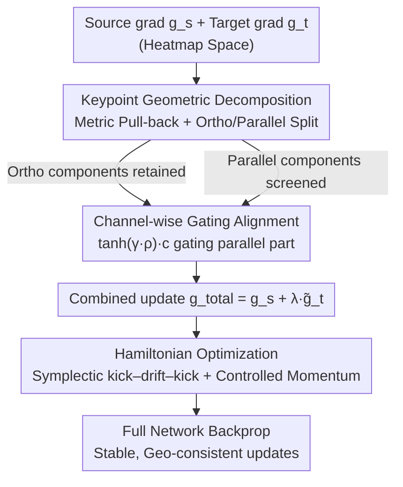

# HamiPose: Hamiltonian Optimization for Unsupervised Domain Adaptive Pose Estimation

**Conference**: CVPR 2026  
**Paper**: [CVF Open Access](https://openaccess.thecvf.com/content/CVPR2026/html/Li_HamiPose_Hamiltonian_Optimization_for_Unsupervised_Domain_Adaptive_Pose_Estimation_CVPR_2026_paper.html)  
**Code**: To be confirmed  
**Area**: Human Understanding / Pose Estimation / Unsupervised Domain Adaptation  
**Keywords**: Pose Estimation, Unsupervised Domain Adaptation, Gradient Conflict, Hamiltonian Optimization, Symplectic Integration

## TL;DR
Aiming at training oscillations caused by the "source supervision gradient vs. target consistency gradient" conflict in synthetic $\to$ real domain pose estimation, HamiPose performs orthogonal decomposition of target gradients by keypoints, uses confidence gating to allow only non-conflicting components, and applies a Hamiltonian optimizer with a symplectic integrator to add "controlled momentum" for suppressing high-frequency jitters, achieving SOTA on multiple UDA pose benchmarks.

## Background & Motivation

**Background**: Pose estimation relies on large amounts of accurately labeled data, which is expensive to collect in the real world. Thus, the community has turned to the "synthetic data training + Unsupervised Domain Adaptation (UDA) transfer to real domain" paradigm. Mainstream UDA pose methods have followed two paths: early work focused on feature/distribution alignment (adversarial training, moment matching), while later work shifted to the prediction space, using the Mean Teacher framework to maintain consistency between student networks and teacher pseudo-heatmaps.

**Limitations of Prior Work**: Whether aligning features or predictions, a more fundamental problem remains: **how multiple supervision signals interact during optimization in the training process**. Recent work finds that performance degradation under domain shift is often rooted in the **gradient conflict** between "source supervision objectives" and "target consistency objectives."

**Key Challenge**: Gradient conflict in pose estimation has a **unique form**. Pose uses heatmap supervision, where each joint is a narrow and sharp Gaussian peak. Effective gradients only exist in a small neighborhood near the peak, leading to two adverse effects: (1) **Sparse and Sharp**: Even a small prediction bias can flip the gradient direction, magnifying into violent oscillations near the peaks. (2) **Heterogeneity across Joints**: Pseudo-heatmap quality fluctuates with occlusion, truncation, and motion blur, causing conflicts to concentrate on a few "hard joints" while others remain consistent. Averaging all joints and signals together leads to destructive interference and oscillating parameter updates, making convergence difficult.

**Goal**: To find an optimization method that **maintains dynamical stability** under sparse and heterogeneous supervision—eliminating truly conflicting gradient components without harming useful signals, and suppressing high-frequency oscillations over long training durations.

**Key Insight**: The authors view optimization as "geometry-aware transport on an energy landscape"—loss acts as potential energy, a data-driven metric induces kinetic energy, and parameters evolve along a structure-preserving flow. In physics, **Hamiltonian dynamics + Symplectic integrators** are designed for "oscillatory + long-term evolution" systems: they conserve energy, suppress numerical overshoot, and maintain the qualitative stability of oscillatory motion over long integrations.

**Core Idea**: Model the entire optimization process as a Hamiltonian system—first perform **orthogonal decomposition + confidence gating** on gradients at the detection head for each keypoint to produce "decoupled and confidence-calibrated" gradients; then transport them into updates with controlled momentum using a symplectic integrator to resolve both "conflict" and "oscillation."

## Method

### Overall Architecture

HamiPose is built on the Mean Teacher framework: the student $f_\theta$ learns supervision loss on the labeled source domain and maintains consistency with the teacher $f_{\theta'}$ (updated via EMA $\theta'_t=\tau\theta'_{t-1}+(1-\tau)\theta_t$) on the unlabeled target domain. The total loss is $L(\theta)=L_s(\theta)+\lambda L_t(\theta,\theta')$, where $L_s$ is the source heatmap MSE and $L_t$ is the target student-teacher heatmap consistency MSE.

Crucially, instead of **simply summing $g_s^{out}=\nabla_H L_s$ and $g_t^{out}=\nabla_H L_t$** for backpropagation, it first detects and resolves conflicts in the output (heatmap) space, then backpropagates "clean" gradients. The pipeline consists of three serial steps:

1. **Keypoint Geometric Decomposition**: In a unified, normalized metric geometry, split the target gradient for each keypoint channel into "parallel to source" and "orthogonal to source" parts; the orthogonal part is inherently harmless and retained first.
2. **Channel-wise Gating Alignment**: Score the parallel part via "geometric consistency $\times$ teacher confidence" gating, allowing only reliable positive alignment components and suppressing unreliable pseudo-signals.
3. **Hamiltonian Optimization**: Pass the "decoupled + confidence-calibrated" gradient to a Hamiltonian optimizer with a symplectic integrator, using momentum inertia to smooth residual spike-like jitters.

### Key Designs

**1. Keypoint Geometric Decomposition: Splitting target gradients into "harmless orthogonal" and "pending parallel" parts under a unified metric**

Limitations of Prior Work: Under sparse heatmap supervision, gradient scales/curvatures differ greatly across joints; comparing source/target directions in the raw space is misled by scale, and conflicts in hard joints are averaged out. This design first equips the parameter space with a **block-diagonal metric** $D_k^{(t-1)}=(\alpha_{t-1}^{(k)}+\varepsilon)I$, where the second-moment accumulator $\alpha^{(k)}$ is updated via EMA of squared parameter increments ($\alpha_{t-1}^{(k)}=\mu\alpha_{t-2}^{(k)}+(1-\mu)\,\mathrm{mean}((\Delta\theta_{t-1}^{(k)})^2)$). This assigns an adaptive "mass" to each keypoint channel, making gradients comparable across joints.

Mechanism: Pull back the output gradients via the Jacobian $J_k=\partial H_k/\partial\theta^{(k)}$ to the parameter space: $\hat g_s^{(k)}=J_k^\top g_s^{(k)}$, $\hat g_t^{(k)}=J_k^\top g_t^{(k)}$. Calculate the normalized cosine $\rho_k$ and projection coefficient $a_k=\frac{(\hat g_s^{(k)})^\top (D_k^{(t-1)})^{-1}\hat g_t^{(k)}}{(\hat g_s^{(k)})^\top (D_k^{(t-1)})^{-1}\hat g_s^{(k)}}$ under the metric $(D_k^{(t-1)})^{-1}$. Decompose the target gradient in the output space:

$$g_{t,\parallel}^{(k)}=a_k\,g_s^{(k)},\qquad g_{t,\perp}^{(k)}=g_t^{(k)}-g_{t,\parallel}^{(k)}.$$

By construction, $(J_k^\top g_{t,\perp}^{(k)})^\top (D_k^{(t-1)})^{-1}(J_k^\top g_s^{(k)})=0$, meaning the orthogonal part is **harmless** to the source descent direction under this metric and can be retained; only the parallel part remains for screening. Evaluating keypoints individually ensures **local** conflicts from occlusion/noise are handled on-site rather than diluted by global averaging.

**2. Channel-wise Gating Alignment: Filtering reliable parallel components via "Geometric Consistency $\times$ Teacher Confidence"**

Even under normalized geometry, some target gradients may oppose the source due to occlusion or poor pseudo-labels. This design applies a **deterministic gate**: first, obtain per-channel confidence $c_k=\max_{u\in\Omega}(f_{\theta'}(x^T))_k(u)\in[0,1]$ from the teacher (higher peaks are more reliable), then use an annealing sharpness parameter $\gamma(t)=\gamma_{min}+(\gamma_{max}-\gamma_{min})\cdot\min(1,t/T_{warm})$ to compute the gating score:

$$\phi_k=\max\!\big(0,\ \tanh(\gamma(t)\,\rho_k)\big)\cdot c_k\in[0,1].$$

This gate has three meanings: $\phi_k=0$ blocks reverse gradients when alignment is non-positive ($\rho_k\le 0$); it gradually permits positive components as $\gamma$ increases; it suppresses unreliable channels via teacher confidence. The annealing avoids "hard filtering" early in training when estimates are poor. The final filtered target gradient is $\tilde g_{t,pc}^{(k)}=g_{t,\perp}^{(k)}+\phi_k\,g_{t,\parallel}^{(k)}$, and the total update is $g_{total}^{out}=g_s^{out}+\lambda\,\tilde g_{t,pc}$. The paper proves $\phi_k\ge 0$ and $\rho_k>0\Rightarrow a_k>0$, ensuring the update is **non-conflicting** with the source.

**3. Hamiltonian Optimization: Suppressing high-frequency oscillations via controlled momentum from a symplectic integrator**

After gating, target signals remain sparse and heterogeneous, producing high-frequency oscillations across batches. This design models optimization as a Hamiltonian system: pair parameter $\theta$ with momentum $p$, defining the Hamiltonian $H(\theta,p)=\tfrac12 p^\top (D^{(t-1)})^{-1}p+L_s(\theta)+\lambda L_t(\theta)$. The mass matrix $D^{(t-1)}=(\alpha_{t-1}+\varepsilon)I$ is adaptive. The equations are $\dot\theta=(D^{(t-1)})^{-1}p$ and $\dot p=-\nabla_\theta(L_s+\lambda L_t)$.

Mechanism: Implement using a **single-gradient symplectic Euler (kick–drift–kick)**. Pull the filtered gradient back to parameter space $g_H=J_\theta^\top g_{total}^{out}$ (preserving non-conflict properties across layers), then:

$$p\leftarrow p-\tfrac{\epsilon}{2}g_H,\quad \theta\leftarrow\theta+\epsilon (D^{(t-1)})^{-1}p,\quad p\leftarrow p-\tfrac{\epsilon}{2}g_H.$$

Each step computes the gradient once and reuses $g_H$ for two momentum kicks, making the cost roughly equal to standard backprop. The inertia from momentum coupled with adaptive geometry integrates and smooths the "kicks" caused by sparse supervision, maintaining stability over long ranges—something SGD/Adam struggles with under such supervision.

### Loss & Training
The total objective is $L=L_s+\lambda L_t$ ($\lambda=1.0$). Backbone: ResNet101 Simple Baseline; 70 epochs, batch 32, 500 iter/epoch. EMA decay $\tau=0.99$, $\mu=0.99$. Symplectic step $\epsilon=10^{-3}$ with linear warmup then cosine decay. Gating sharpness $\gamma_{min}=0, \gamma_{max}=2$, 10% warmup.

## Key Experimental Results

Benchmarks: Human pose (Synthetic SURREAL $\to$ Real LSP / Human3.6M); Hand pose (Synthetic RHD $\to$ Real H3D / FreiHand). Metric: PCK@0.05.

### Main Results (UDA Human Pose, PCK@0.05 All)

| Transfer Setting | Source Only | RegDA(CVPR21) | UniFrame(ECCV22) | PGDA(NeurIPS24) | **HamiPose** |
|----------|-------------|---------------|------------------|-----------------|--------------|
| SURREAL $\to$ LSP | 56.7 | 74.6 | 82.0 | 82.7 | **83.9** |
| SURREAL $\to$ Human3.6M | 55.3 | 75.6 | 79.0 | 79.2 | **79.8** |

On hand pose (RHD $\to$ H3D / FreiHand), HamiPose is also optimal: H3D 83.1 (Prev. SOTA DA-LLPose 82.6), FreiHand 59.9 (Prev. SOTA 59.2), with larger gains on hard DIP/Fin joints.

### Ablation Study (Stepwise Components, PCK All)

| Unified Metric | Channelwise Filtering | Hamiltonian Transport | SURREAL $\to$ Human3.6M | RHD $\to$ H3D |
|:---:|:---:|:---:|:---:|:---:|
| ✘ | ✘ | ✘ | 75.3 | 79.3 |
| ✔ | ✘ | ✘ | 77.2 | 80.9 |
| ✔ | ✔ | ✘ | 78.5 | 82.3 |
| ✔ | ✔ | ✔ | **79.8** | **83.1** |

Each of the three components contributes roughly +1.5~2 points. The unified metric levels gradient scales (Human3.6M 75.3 $\to$ 77.2); channel gating filters reverse components ($\to$ 78.5); Hamiltonian transport suppresses residual oscillations ($\to$ 79.8).

### Key Findings
- **Keypoint gating vs. Unified gating**: Keypoint-level gating converges to a ~6% conflict ratio (negative cosine) by epoch 30, while unified gating stays at 8~9%, as local conflicts are handled within their own geometric context.
- **Hamiltonian vs. SGD/Adam**: Hamiltonian optimization shows monotonic, low-variance descent with minimal step-to-step fluctuation, whereas SGD oscillates early and Adam hits noisy plateaus.
- **Hyperparameter Sensitivity**: Moderate gating sharpness ($\gamma_{max} \approx 2.0$) and a 10% warmup ratio are optimal—too strict filtering early on kills useful signals.
- **Domain Generalization (DG)**: HamiPose leads on unseen targets (e.g., Human3.6M All 77.5%), outperforming DG-specific baselines like Fishr and SAGM.

## Highlights & Insights
- **Concretizing "Gradient Conflict" for Pose**: Instead of broad claims, it identifies "sparse spikes + cross-joint heterogeneity" and designs a fine-grained solution (individual assessment, orthogonal retention, confidence-gating parallel parts).
- **Theoretical Conflict-free Guarantee**: $g_{t,\perp}$ is strictly orthogonal under the metric, and $\phi_k \ge 0$ ensures the composite update is non-conflicting by construction, more robust than standard projections like PCGrad.
- **Hamiltonian Symplectic Integrator as Optimizer**: Kick-drift-kick provides inertia smoothing with near-zero extra cost, a structure-preserving approach transferable to any sparse/spiky supervision task.
- The use of squared parameter increments for the adaptive metric $D$ (rather than gradient squares like Adam) ties geometry directly to the actual updates.

## Limitations & Future Work
- Only verified on heatmap-based 2D pose; transferability to 3D pose or regression-based (non-heatmap) outputs is unknown.
- The per-keypoint Jacobian pull-back and metric decomposition involve a loop over $K$ keypoints; actual wall-clock time overhead on large models was not detailed.
- While it improves stability, the baseline gain of the Hamiltonian optimizer over Adam depends heavily on the preceding gradient processing modules; the pure benefit of the optimizer alone is less distinct.
- Reliance on teacher peak confidence $c_k$ might be vulnerable when the teacher is "confidently wrong" under heavy occlusion.

## Related Work & Insights
- **vs. PCGrad / Projection Methods (CGDM, PGDA)**: While these also use projections, HamiPose operates in a **metric-normalized geometry** per keypoint, rather than globally, resolving conflicts more thoroughly.
- **vs. Mean Teacher Methods (UniFrame, SFHPE)**: These improve pseudo-labels at the prediction level; HamiPose intervenes in **optimization dynamics**, addressing signal interaction during updates.
- **vs. Sharpness-Aware (SAM) / DG Methods**: While others match gradient statistics, HamiPose uses symplectic integration to suppress oscillations, achieving better DG performance.

## Rating
- Novelty: ⭐⭐⭐⭐⭐ High. Integrates Hamiltonian dynamics with keypoint-level decomposition for UDA pose.
- Experimental Thoroughness: ⭐⭐⭐⭐ Solid across 6 datasets and multiple tasks, though wall-clock overhead is missing.
- Writing Quality: ⭐⭐⭐⭐ Clear motivation and formal derivations; logical flow is maintainted despite dense notation.
- Value: ⭐⭐⭐⭐ Structure-preserving integrators for sparse supervision training have high transferability.

<!-- RELATED:START -->

## Related Papers

- [\[CVPR 2026\] Through the Frequency Lens: Cross-Domain Generalisable Gaze Estimation with Adaptive Modulation](through_the_frequency_lens_cross-domain_generalisable_gaze_estimation_with_adapt.md)
- [\[CVPR 2026\] GazeShift: Unsupervised Gaze Estimation and Dataset for VR](gazeshift_unsupervised_gaze_estimation_and_dataset_for_vr.md)
- [\[CVPR 2026\] Render-to-Adapt: Unsupervised Personal Adaptation for Gaze Estimation](render-to-adapt_unsupervised_personal_adaptation_for_gaze_estimation.md)
- [\[ICLR 2026\] Cross-Domain Policy Optimization via Bellman Consistency and Hybrid Critics](../../ICLR2026/human_understanding/cross-domain_policy_optimization_via_bellman_consistency_and_hybrid_critics.md)
- [\[ICLR 2026\] Pose Prior Learner: Unsupervised Categorical Prior Learning for Pose Estimation](../../ICLR2026/human_understanding/pose_prior_learner_unsupervised_categorical_prior_learning_for_pose_estimation.md)

<!-- RELATED:END -->
