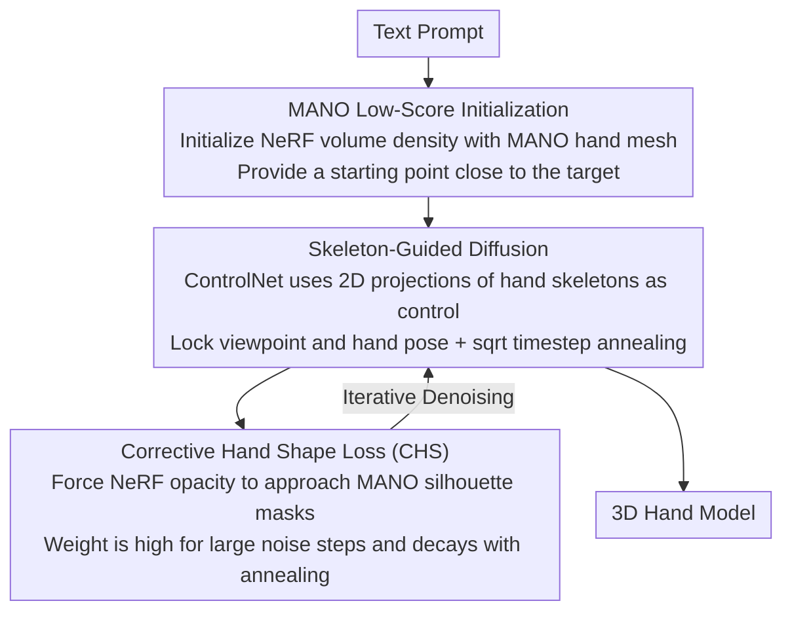

# HandDreamer: Zero-Shot Text to 3D Hand Model Generation

**Conference**: CVPR 2026  
**arXiv**: [2604.04425](https://arxiv.org/abs/2604.04425)  
**Code**: None  
**Area**: 3D Generation / Hand Modeling  
**Keywords**: text-to-3D, hand generation, SDS, MANO, view consistency

## TL;DR

Ours proposes HandDreamer, the first method for zero-shot 3D hand model generation from text prompts. It addresses view inconsistency and geometric distortion in Score Distillation Sampling (SDS) through MANO initialization, skeleton-guided diffusion, and corrective hand shape loss.

## Background & Motivation

The VR era requires high-quality, customizable 3D hand models, yet traditional methods rely on multi-view capture systems and graphic artists. While Score Distillation Sampling (SDS) enables 3D generation from text, it suffers from severe Janus artifacts (view inconsistency) in hand generation due to the extreme articulation of hands and the presence of numerous modes in the probability distribution.

The authors analyze the root cause of view inconsistency: the probability landscape defined by text prompts contains many possible modes, and SDS optimization cannot guarantee that every view converges to the "correct" mode. For highly articulated objects like hands, this problem is particularly severe because the vast range of hand poses leads to an enormous number of modes.

## Method

### Overall Architecture

HandDreamer aims to generate 3D hand models from text prompts in a zero-shot manner. The primary challenge is the Janus artifact caused by SDS on highly articulated objects. The method consists of two stages: first, initializing NeRF volume density using a MANO hand mesh to provide a semantically and geometrically close starting point; second, employing skeleton-guided SDS combined with Corrective Hand Shape (CHS) loss to generate the final 3D hand model.

### Key Designs

**1. MANO Low-Score Initialization: Converging to "Correct Modes" from the Start**

The root of Janus artifacts in SDS is that the probability landscape defined by text prompts contains many possible modes, and optimization cannot ensure all views converge to the correct one. Since hand poses vary significantly, the number of modes is particularly high. HandDreamer initializes NeRF volume density with a MANO hand model, ensuring the initial 3D representation is semantically and geometrically close to the target hand. The paper theoretically proves that this low-score initialization guides each view to converge toward the correct mode rather than incorrect ones, suppressing Janus artifacts at the source.

**2. Skeleton-Guided Diffusion: Locking Viewpoint and Pose to Eliminate Redundant Modes**

A good starting point alone is insufficient, as the probability landscape for each viewpoint remains too broad. Ours utilizes ControlNet with hand skeletons as control conditions. The 2D projection of a skeleton encodes both viewpoint and hand pose information, effectively reducing the number of possible modes for each view. This is paired with a square-root timestep annealing strategy to ensure stable convergence during generation.

**3. Corrective Hand Shape Loss (CHS): Regularizing Geometry During Optimization**

Even with the previous components, angles with severe self-occlusion (like side views) are prone to geometric distortion. CHS minimizes the $L_2$ distance between NeRF opacity and MANO silhouette masks during each SDS iteration to ensure geometric consistency. It carries higher weight at high-noise timesteps (where $t$ primarily updates geometry) and decreases as annealing progresses, concentrating constraint power in the stage where it is most needed.

### Loss & Training

Total loss: $L = \lambda_{sds} \cdot L_{sds} + \lambda_t^{chs} \cdot L_{chs}(t) + \lambda_{img} \cdot L_{img} + \lambda_{zvar} \cdot L_{zvar}$. The initialization stage takes 2000 iterations (~15 min), and the SDS stage takes 8000 iterations (~45 min). The backbone is Stable Diffusion 1.5 + ControlNet 1.1.

## Key Experimental Results

### Main Results

| Method | CLIP L14↑ | FID↓ | HPSv2↑ |
|------|---------|------|--------|
| DreamFusion | 25.12 | 344.19 | 0.187 |
| CFD | 26.62 | 262.83 | 0.223 |
| HandDreamer (Ours) | **28.63** | **254.62** | **0.241** |

### Ablation Study

| Configuration | CLIP L14↑ | Description |
|------|---------|------|
| w/o Skeleton CN + w/o MANO + w/o CHS | 26.40 | Severe Janus artifacts |
| + Skeleton CN | 26.67 | Hand shape emerges but geometry is inaccurate |
| + Skeleton CN + MANO | 28.48 | High fidelity but side-view distortion |
| + Full | **28.63** | Optimal |

### Key Findings

- MANO initialization is crucial for reducing Janus artifacts.
- CHS loss primarily addresses geometric distortion in side views (angles with heavy self-occlusion).
- User studies show the method is optimal across geometry, texture, and consistency dimensions.

## Highlights & Insights

- Provides a deep and theoretically supported root cause analysis of SDS view inconsistency (Theorem 1).
- The three components (MANO initialization, skeleton control, and CHS loss) have clear motivations and distinct roles.
- Generated hand models can be exported as meshes and rigged for animation and joint control.

## Limitations & Future Work

- May inherit biases from pre-trained diffusion models.
- Joint control requires additional mesh export and rigging steps.
- Generation speed is approximately 1 hour per model.

## Rating

- Novelty: ⭐⭐⭐⭐ — First zero-shot text-to-3D hand generation method.
- Technical Depth: ⭐⭐⭐⭐ — Solid theoretical analysis and three-stage design.
- Experimental Thoroughness: ⭐⭐⭐⭐ — Comprehensive quantitative, qualitative, ablation, and user studies.
- Value: ⭐⭐⭐⭐ — Strong prospects for VR and gaming applications.

<!-- RELATED:START -->

## Related Papers

- [\[CVPR 2026\] Text-Driven 3D Hand Motion Generation from Sign Language Data](text-driven_3d_hand_motion_generation_from_sign_language_data.md)
- [\[CVPR 2026\] Humanoid-GPT: Scaling Data and Structure for Zero-Shot Motion Tracking](humanoid-gpt_scaling_data_and_structure_for_zero-shot_motion_tracking.md)
- [\[CVPR 2026\] ProjFlow: Projection Sampling with Flow Matching for Zero-Shot Exact Spatial Motion Control](projflow_projection_sampling_with_flow_matching_for_zero-shot_exact_spatial_moti.md)
- [\[CVPR 2026\] A2P: From 2D Alignment to 3D Plausibility for Occlusion-Robust Two-Hand Reconstruction](from_2d_alignment_to_3d_plausibility_unifying_hete.md)
- [\[CVPR 2026\] MGDHand: Multi-Granularity Prior-to-Inertial Distillation Framework for Sequential 3D Hand Pose Estimation from Sparse IMUs](mgdhand_multi-granularity_prior-to-inertial_distillation_framework_for_sequentia.md)

<!-- RELATED:END -->
